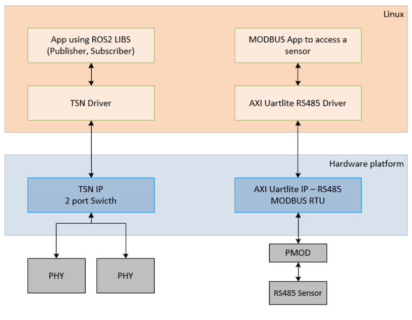
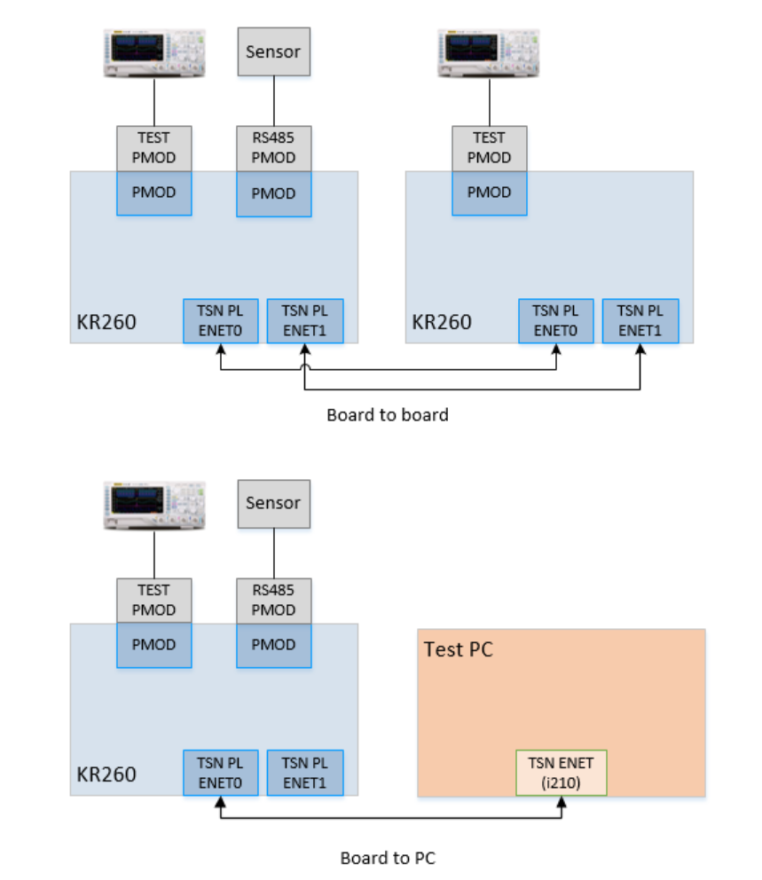

<table class="sphinxhide">
 <tr>
   <td align="center"><h1>Kria&trade; KR260 Robotics Starter Kit  ROS 2 Multi-Node Communications via TSN Tutorial</h1>
   </td>
   </td>
 </tr>
 <tr>
 <td align="center"><h1> Introduction </h1>

 </td>
 </tr>
</table>

# Introduction

## Design Overview

ROS 2 Multi-Node Communications via Time-Sensitive Networking (TSN) application built on KR260 Robotics Start Kit provides a framework for building deterministic interaction between devices. The following figure shows the top-level overview of the design implemented on each KR260 board.

In this application, the transmitter/publisher and receiver/subscriber functions are on two separate boards and communicate over Ethernet PHY. The TSN IP in the hardware platform supports time synchronization between devices. It also allows traffic shaping based on traffic classes. The AXI Uartlite IP enables communication with RS485 devices over MODBUS RTU protocol.

The Robot Operating System (ROS) is a rich set of software libraries and tools for building robot applications. Along with various abstraction for commonly used algorithms, messaging formats, build framework, it also allows and provides selection for middleware. ROS 2 is built on top of DDS/RTPS as its middleware, which provides scalability due to Data-Centric Publisher-Subscriber approach. This application uses the default middleware DDS implementation for message passing between various nodes over TSN network.

Two topologies are supported with this application:

* KR260 to KR260
* KR260 to Intel I210 card

The oscilloscope can be used to check clock synchronization, measure latency, and check traffic patterns with the signals routed out to the 12-pin Test PMOD.

Some extensions of this application are:

* Robotic system with a sensor and an actuator.
* Industrial controller with multiple field devices.

## Next Steps

* [Application Deployment](app_deployment.md)
* Go back to the [KR260 SOM ROS 2 Multi-Node Communications via TSN start page](../ros2_multinode_communication_via_tsn_landing)

<!---

Licensed under the Apache License, Version 2.0 (the "License"); you may not use this file except in compliance with the License.

You may obtain a copy of the License at http://www.apache.org/licenses/LICENSE-2.0.

Unless required by applicable law or agreed to in writing, software distributed under the License is distributed on an "AS IS" BASIS, WITHOUT WARRANTIES OR CONDITIONS OF ANY KIND, either express or implied. See the License for the specific language governing permissions and limitations under the License.

-->

Copyright&copy; 2023 Advanced Micro Devices, Inc. 

