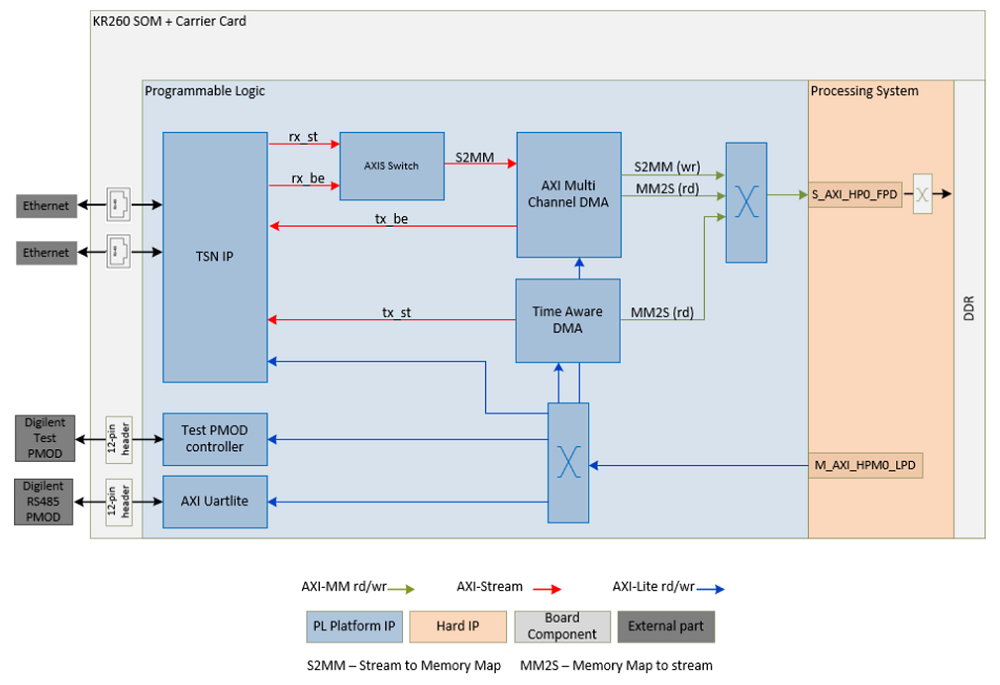
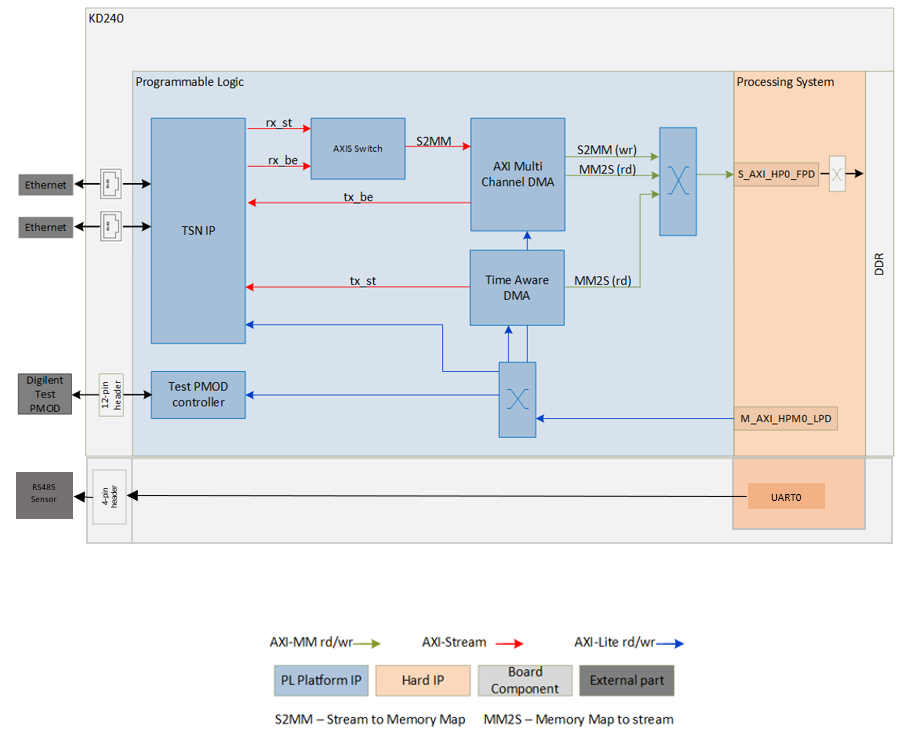
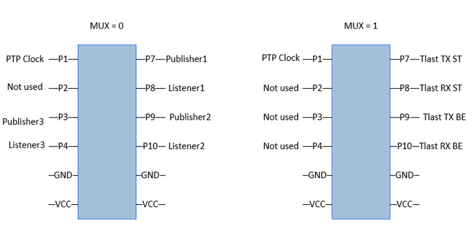

# Hardware Architecture of the Platform

## Introduction

 This section describes the design implemented in the Programmable Logic (PL).

 The PL design provides a platform to support transmission of Ethernet traffic based on traffic shaping protocols. The traffic can be control information to be passed between different nodes in a Robotics system or between various Industrial Field devices. The requirement in these systems would be that the traffic is deterministic.

 It also has an RS485 interface, which can be used to connect to RS485 peripherals such as actuators, sensors, and so on. These could be components in a Robotics system or  part of a Field device.

 The following figures show the top-level hardware architecture of the reference design:

 * KR260

    

* KD240

    

## TSN IP

The main block in the PL design is the AMD LogiCORE™100M/1G TSN Subsystem IP,
which implements IEEE 802.1 Time Sensitive Networking (TSN) Standards and
provides a low latency Bridged Endpoint. The bridged endpoint solution consists of a 3-port switch, two ports connects to the network and one port connects to an internal Endpoint. In this design, RGMII interfaces connect to a Marvel physical-side interface (PHY) supporting a maximum bandwidth of 1 Gbps. The TSN IP is configured to support:

* Network Time Synchronization- 1588 Precision Time Protocol (PTP)
* Scheduled and Best Effort traffic types.
* Time aware scheduling (IEEE 802.1 Qbv)
* Frame replication and elimination (IEEE 802.1 CB)
* Per Stream Filtering and Policing (IEEE 802.1 Qci)

For more information on the IP, refer to [PG275](https://www.xilinx.com/content/dam/xilinx/member/1gtsn_doc/2020_1/pg275-tsn-endpoint-ethernet-mac.pdf).

***Note***: You will need access to [1GTSN Documentation Lounge](https://www.xilinx.com/member/1gtsn_doc.html) to view the above document.


## Time Aware DMA (TADMA)

TADMA is aware of the QBV schedule cycles and stream time slots. By using PTP
generated time, it is capable of fetching frames for different streams/traffic classes from system memory (DDR) at precisely required time, providing excellent time precision for TSN traffic. In this design, TADMA fetches scheduled traffic from memory, based on the Qbv programming and passed it to the TSN IP for transmission.

For more information on the IP, refer to [PG316](https://www.xilinx.com/content/dam/xilinx/member/1gtsn/2018_2/pg316-tadma.pdf).

***Note***: You will need access to [1GTSN Documentation Lounge](https://www.xilinx.com/member/1gtsn_doc.html) to view the above document.

## AXI Multichannel DMA (MCDMA)

The AXI MCDMA provides high-bandwidth direct memory access between memory (AXI Memory Mapped) and stream (AXI Stream) target peripherals. It supports both Memory Mapped to Stream (MM2S) and Stream to Memory Mapped (S2MM) transfers. The AXI MCDMA core provides Scatter Gather (SG) interface with multiple channel support with independent configuration. In this design, the MCDMA is responsible to fetch the Best Effort traffic for transmission by TSN IP. It reads frames from the DDR memory and passes data to the TSN IP on the AXI Stream interface. It is also responsible for writing the Schedule traffic and Best Effort traffic frames received from the TSN IP to the memory. The IP uses the S_AXI_HP0_FPD on the AMD Zynq&trade; UltraScale+&trade; MPSoC Processing System (PS) IP to read/write from/to the DDR memory.

For more information on the IP, refer to [PG288](https://docs.xilinx.com/v/u/en-US/pg288-axi-mcdma).

## AXI Stream Switch

The AXI4-Stream Switch provides configurable routing between masters and slaves. In this design, it is configured with two slaves and one master. The switch arbitrates when an end of a frame (tlast) is received, either on the received scheduled traffic (rx_st) stream or received best effort traffic (rx_be) stream.

For more information on the IP, refer to [PG085](https://docs.xilinx.com/v/u/en-US/pg085-axi4stream-infrastructure).

## Test PMOD controller

The Test PMOD controller is a user IP that drives the [Digilent Test PMOD](https://digilent.com/shop/pmod-tph2-12-pin-test-point-header/) pins. The IP implements registers are detailed below.

| Register Offset | Register Name | Platform    | Description                                                                                                     |
|-----------------|---------------|-------------|-----------------------------------------------------------------------------------------------------------------|
| 0x00            | slv_reg0      | KR260,KD240 | Bit0 is a MUX enable. If 1 then drive Qbv signals on PMOD. If 0 drive TSN publisher/subscriber 8-bit signatures |
| 0x04            | slv_reg1      | KR260,KD240 | 8-bit signature when publisher 1 transmits a TSN frame                                                          |
| 0x08            | slv_reg2      | KR260,KD240 | 8-bit signature when publisher 1 transmits a TSN frame                                                          |
| 0x0c            | slv_reg3      | KR260,KD240 | 8-bit signature when publisher 2 transmits a TSN frame                                                          |
| 0x10            | slv_reg4      | KR260,KD240 | 8-bit signature when subscriber 2 receives a TSN frame                                                          |
| 0x14            | slv_reg5      | KR260       | 8-bit signature when publisher 3 transmits a TSN frame                                                          |
| 0x18            | slv_reg6      | KR260       | 8-bit signature when subscriber 3 receives a TSN frame                                                          |


The TSN application can support multiple publishers and subscribers. When the publisher queues up a packet for transmission, it writes a unique 8-bit word to slv_reg*, which is then transmitted on the PMOD pins. Similarly, when the subscriber receives a packet, it writes a unique 8-bit word to slv_reg*, which is then transmitted on the PMOD pins. The PMOD pins of the publisher and the subscriber are hooked up to a scope and are used to measure an end-to-end application latency. The TSN pub sub application sets the MUX (slv_reg0) to 0 before writing the signature value. The figure below shows the mapping on the PMOD pins when MUX is set to 0 and 1.



To view scheduled and best effort traffic, the MUX value is set to 1. If Qbv schedule is set, for example, a time slot is programmed with 70% scheduled traffic and 30% best effort traffic, then viewing tlast signal of received scheduled traffic and tlast signal of received best effort traffic on a scope confirms that Qbv is working as expected. Tlast indicates the end of a packet. Transmit signals can also be monitored, but note these signals are on the outside of the TSN IP and the traffic is yet to be scheduled.

The other signal that is monitored to see if the Transmitter and Receiver clocks are in sync is the PTP clock.

For more information on how to use PMOD signals to check clock synchronization, to measure latency and confirm Qbv programming, refer to the [application deployment page](./app_deployment.md).

## RS485

* KR260:

    The LogiCORE IP AXI UART Lite core converts AXI4 Lite register transactions to RS232 signaling. To support RS485, signaling a patch needs to be applied to the IP core. The AXI Uartlite IP patch is located at the following location and adds a Drive Enable signal to the IP.

    ```$working_dir/platforms/vivado/kr260_tsn_rs485pmod/ip```, or [here](https://github.com/Xilinx/kria-vitis-platforms/tree/xlnx_rel_v2022.1/kr260/platforms/vivado/kr260_tsn_rs485pmod/ip), and the patch is also available at the support website [here](https://support.xilinx.com/s/question/0D52E00006hpaVU/feature-request-uartlite-with-rs485-driver-enable-output-signal?language=en_US).

    The Makefile copies the AXI Uartlite IP from the AMD Vivado&trade; install area and applies the patch.

    To test an RS485 interface, the signals are connected to a [Digilent PMOD R485](https://reference.digilentinc.com/pmod/pmodrs485/reference-manual) and a [temperature sensor](https://www.aliexpress.com/item/33054683552.html). The application running on the PS reads and writes to the AXI Uartlite registers and communicates with the temperature sensor using the MODBUS protocol.

    For an overview on RS485 and MODBUS, refer to this [article](https://www.yoctopuce.com/EN/article/a-quick-tutorial-on-rs485-and-modbus).

* KD240:

    UART-RS485 enablement is through the PS Uart Since it is present in the kernel by default, it is installed and enabled at boot-time

    To test an RS485 interface, the signals are connected on the J22 connector on the KD240. The application running on the PS reads and writes to the controlling dev terminal and communicates
    with the temperature sensor using MODBUS protocol.

For information on how to test the RS485 interface, refer to the [application deployment page](./app_deployment.md).

## Clocks, Resets and Interrupts

### Clocks

The following table identifies the main clocks of the PL design, their source, clock frequency, and function.

| Clock      | Clock Source  | Clock Frequency     | Funtion |
| :---       |    :----:     |         :---:       | :-----  |
| CLK_IN_gem | External | 25 MHz | Clock source for clocking wizard (clk_wiz_0) generating clocks |
| clk_out1* |Clocking wizard |200 MHz| TSN IP fifo clock, TADMA IP and MCDMA IP data transactions clock |
| clk_out2* |Clocking wizard| 125 MHz | TSN IP and TADMA IP Real Time clock (RTC) for internal timers for time sensitivity |
| clk_out3* |Clocking wizard |300 MHz | reference clock for IDELAY control block for PHY operation on TSN IP|
| clk_out4* |Clocking wizard |100 MHz | AXI-Lite clock to configure TSN IP, MCDMA IP, AXI Uartlite IP, Register interface IP |

\*Clocks exposed as a Platform interface and can be used by an accelerator.

### Resets

The following table summarizes the resets used in this design.

| Reset Source           | Function                                              |
|------------------------|-------------------------------------------------------|
| pl_resetn0             | PL reset for proc_sys_reset modules and TSN Subsystem |
| proc_sys_reset_0       | Synchronous resets for clk_out_100M clock domain      |
| proc_sys_reset_1       | Synchronous resets for clk_out_48M clock domain       |
| TSN Phy_reset_n        | Reset for External Phy (tied high)                    |
| TSN rst_clk_wiz_0_100M | Synchronous Reset for clk_out100M clock domain        |
| TSN rst_clk_wiz_0_125M | Synchronous Reset for clk_out125M clock domain        |
| TSN rst_clk_wiz_0_200M | Synchronous Reset for clk_out200M clock domain        |
| TSN rst_clk_wiz_0_300M | Synchronous Reset for clk_out300M clock domain        |

### Interrupts

The following table lists the PL-to-PS interrupts used in this design. The [AXI Interrupt controller IP](https://docs.xilinx.com/v/u/en-US/pg099-axi-intc) connects the PL interrupts to the pl_ps_irq0 signal on the PS.

| Interrupt ID | Platform    | Instance                                                          |
|--------------|-------------|-------------------------------------------------------------------|
| intr[0-7]    | KR260,KD240 | TSN IP                                                            |
| intr[8]      | KR260,KD240 | TADMA IP                                                          |
| intr[9-14]   | KR260,KD240 | MCDMA IP                                                          |
| intr[15]     | KR260       | AXI Uartlite IP                                                   |
| pl_ps_irq1   | KR260       | Exposed as a Platform interface and can be used by an accelerator |


## Resource Utilization

The resource utilization numbers on this platform post implementation is reported in the following table.

* KR260:

    | Resource | Utilization | Available | Utilization % |
    |----------|-------------|-----------|---------------|
    | LUT      | 47061       | 117120    | 40.18         |
    | LUTRAM   | 3769        | 57600     | 6.54          |
    | FF       | 70328       | 234240    | 30.02         |
    | BRAM     | 79.5        | 144       | 55.21         |
    | URAM     | 13          | 64        | 20.31         |
    | DSP      | 35          | 1248      | 2.80          |
    | IO       | 43          | 186       | 22.75         |
    | BUFG     | 17          | 352       | 4.83          |
    | MMCM     | 1           | 4         | 25.0          |

* KD240:

    | Resource | Utilization | Available | Utilization % |
    |----------|-------------|-----------|---------------|
    | LUT      | 57895       | 70560     | 82.05         |
    | LUTRAM   | 4098        | 28800     | 14.23         |
    | FF       | 84715       | 141120    | 60.03         |
    | BRAM     | 116         | 216       | 53.70         |
    | DSP      | 133         | 360       | 36.94         |
    | IO       | 63          | 81        | 77.78         |
    | BUFG     | 21          | 196       | 10.71         |
    | MMCM     | 2           | 3         | 66.67         |
    | PLL      | 0           | 6         | 0.00          |

## Next Steps

* Go back to the [SOM ROS 2 Multi-Node Communications via TSN start page](../ros2_multinode_communication_via_tsn_landing)

<!---

Licensed under the Apache License, Version 2.0 (the "License"); you may not use this file except in compliance with the License.

You may obtain a copy of the License at http://www.apache.org/licenses/LICENSE-2.0.

Unless required by applicable law or agreed to in writing, software distributed under the License is distributed on an "AS IS" BASIS, WITHOUT WARRANTIES OR CONDITIONS OF ANY KIND, either express or implied. See the License for the specific language governing permissions and limitations under the License.

-->

<p class="sphinxhide" align="center">Copyright&copy; 2023 Advanced Micro Devices, Inc.</p>
