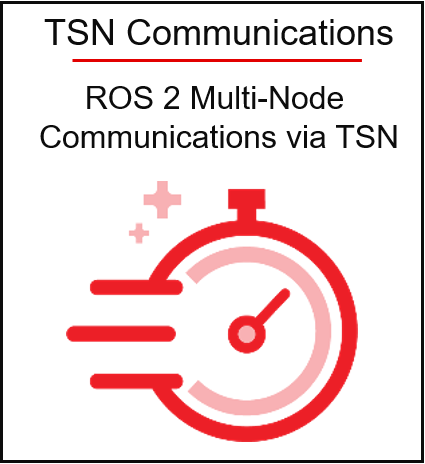
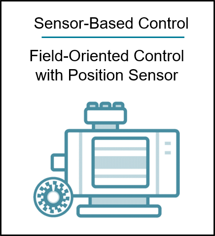
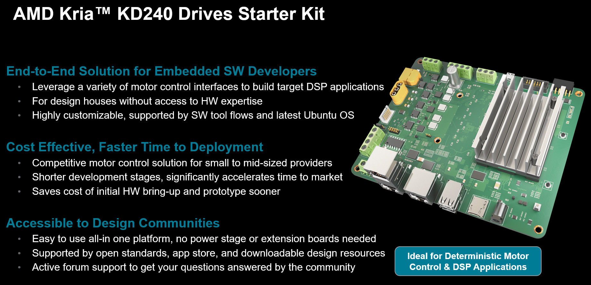

########################################################################################
Kria KD240 Drives Starter Kit
########################################################################################

.. include:: ../../shared/somtoctree.txt

.. image:: docs/media/bist.png
   :width: 200
   :alt: Built-In Self Test (BIST)
   :target: ./docs/bist/bist_landing.html

.. toctree::
   :maxdepth: 3
   :caption: KD240 Applications
   :hidden:

   docs/bist/bist_landing
   docs/ros2_multinode_communication_via_tsn/ros2_multinode_communication_via_tsn_landing
   docs/foc-motor-ctrl/foc_motor_control_landing

The AMD Kria™ KD240 Drives Starter Kit is the latest out-of-the box ready evaluation/development platform in the Kria portfolio. This starter kit is the platform of choice for development of electric drives and other size and cost-constrained applications. The kit consists of a non-production Kria K24 SOM plugged into a drives application carrier card and equipped with a passive heatsink. The K24 SOM included in the starter kit is based on the Zynq™ Ultra Scale+™ MPSoC and paired with 2 GB of LPDDR4 memory. The starter kit is also Drives application ready because it features a three-phase inverter, quadrature encoder interface, brake control, and torque sensor interface. Beyond the drives-specific interfaces, there are a host of other interfaces for general purpose developers including connectivity through Ethernet and USB ports, and flexible I/O expandability via a Pmod connector.

Enabled by a growing ecosystem of accelerated applications from the Kria App Store, all types of developers can get applications up and running quickly, with no FPGA experience needed. From initial design, add customization and differentiation via preferred design environments at any level of abstraction—from application software to custom hardware accelerator design within the available programmable logic (PL).

With both hardware and software development requirements simplified, the KD240 Drives Starter Kit is the fastest and easiest platform for application development with the goal of production volume deployment using Kria K24 SOMs. The KD240 Drives Starter Kit is a very accessible vehicle to leverage during the development phase of your Drives applications while further accelerating your time to market.

.. sidebar:: KD240 Drives Starter Kit eCommerce
   
   For the latest pricing and availability of the KD240 Drives Starter Kit, check the `eCommerce site <https://www.amd.com/kd240>`_.

