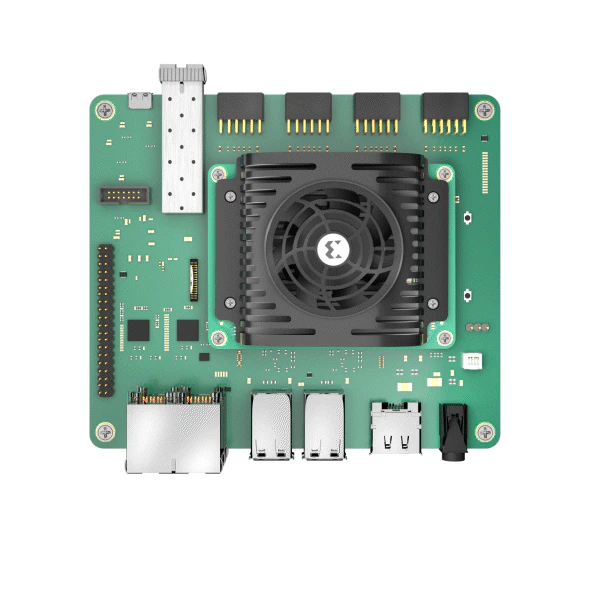

# Step 2: Connect Everything

The following are the key connections for the AMD Kria™ KR260 Robotics Starter Kit:

1. Insert the microSD card containing the boot image in the microSD card slot (J11) on the Starter Kit.
2. Get your USB-A to micro-B cable (a.k.a. micro-USB cable), which supports data transfer.* Do not connect the USB-A end to your computer yet. Connect the micro-B end to J4 on the Starter Kit.
3. Connect your USB keyboard/mouse to the USB ports (U44 and U46).
4. Connect to a monitor/display with the help of a DisplayPort™ cable.
5. Connect the Ethernet cable to one of the PS ETH ports (J10D which is the top right port) for required internet access with factory loaded firmware.
6. Grab the Power Supply and connect it to the DC Jack (J12) on the Starter Kit. Do not insert the other end to the AC plug yet.

At this point, a supported USB camera/webcam can be connected to the Starter Kit. For DisplayPort video output, you must have a DisplayPort cable and supported DisplayPort monitor. Connecting to a USB keyboard and mouse is optional but is recommended for optimal experience.

>**Note:** Not all micro-USB cables support data transfer. Some micro-USB cables are for charging only and will not work with your Starter Kit.

## Next Step

Jump to [Step 3: Connect to UART Serial Port](./uart.md).

Copyright&copy; 2023 Advanced Micro Devices, Inc

