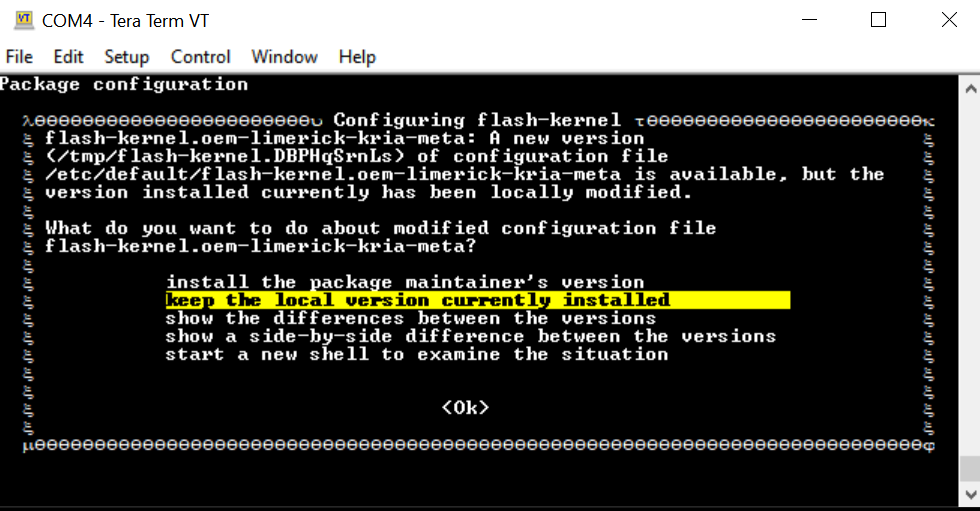

# Known Issues

1. Sometimes, Ubuntu has a background process ongoing by the time it boots to command prompt and does not yet ask you to change the password. In such cases, doing a snap install might result in a message similar to the following:

   ```error: too early for operation, device not yet seeded or device model not acknowledged```

   Try again in a minute or two, and you should be prompted to update the password and above error should disappear.

2. If a prompt similar to the following appears:

   

   Choose **keep the local version currently installed**. For more details, refer to [this wiki page](https://xilinx-wiki.atlassian.net/wiki/spaces/A/pages/2116354051/Tips+Tricks+for+Certified+Ubuntu+AMD-Xilinx+Devices#Understanding-the-Configuring-flash-kernel-Prompts-When-Updating-the-Linux-Kernel).

3. During the ```sudo xlnx-config.sysinit``` or ```sudo apt upgrade``` commands, you might see the following errors and exit installation. Rerun the commands, and the installation should continue and complete.

   ``` text
   flash-kernel: deferring update (trigger activated)
   /etc/kernel/postinst.d/zz-flash-kernel:
   flash-kernel: deferring update (trigger activated)
   Errors were encountered while processing:
   flash-kernel
   need restart is being skipped since dpkg has failed
   E: Sub-process /usr/bin/dpkg returned an error code (1)
   ```

4. As of Ubuntu 22.04 and Yocto 2023.2, the Linux image (Ubuntu or Yocto generated wic image) is shared between  KR260 and KV260. However, the SD card would be "locked in" to the started kit on which it first booted. E.g. once you have booted the common image on a KV260, you will not be able to re-use the same SD card with the shared common Linux image on a KR260. This is because on initial boot, the default bitstream will be locked in based on EEPROM reading on first boot, and this is not updated on subsequent boots.

## Miscellaneous Information

The *ubuntu* user does not have root privileges. Most commands used in the tutorials must be run using *sudo*, and you might be prompted to enter your password.

For security, by default, the root user is disabled. If you want to login as a root user, perform the following steps. Use the *ubuntu* user's password on the first password prompt, then set a new password for the root user. You can now login as a root user using the newly set root user password.

```bash
ubuntu@kria:\~\$ sudo -i
sudo\] password for ubuntu:
root@kria:\~#
```

If needed, the following commands are used to set the System Timezone and locale:

* Set timezone:

   ```bash
   sudo timedatectl set-ntp true
   sudo timedatectl set-timezone America/Los_Angeles
   timedatectl
   ```

* Set locale:

   ```bash
   sudo locale-gen en_US en_US.UTF-8
   sudo update-locale LC_ALL=en_US.UTF-8 LANG=en_US.UTF-8
   export LANG=en_US.UTF-8
   locale
   ```

The following example command sets the date and time:

`sudo date --set "11 January 2023 16:47:00"`

The storage volume on the SD card can be limited with multiple Dockers. If there are space issues, use the following command to remove the existing container.

```bash
sudo docker rmi --force $INSTALLED_DOCKER_IMAGE
```

<p class="sphinxhide" align="center">Copyright&copy; 2023 Advanced Micro Devices, Inc</p>
