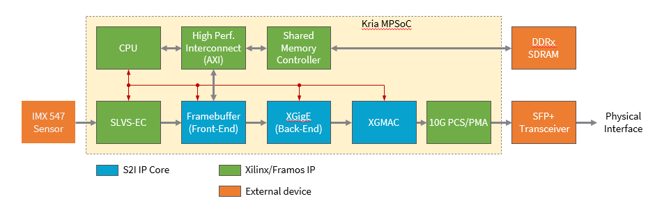
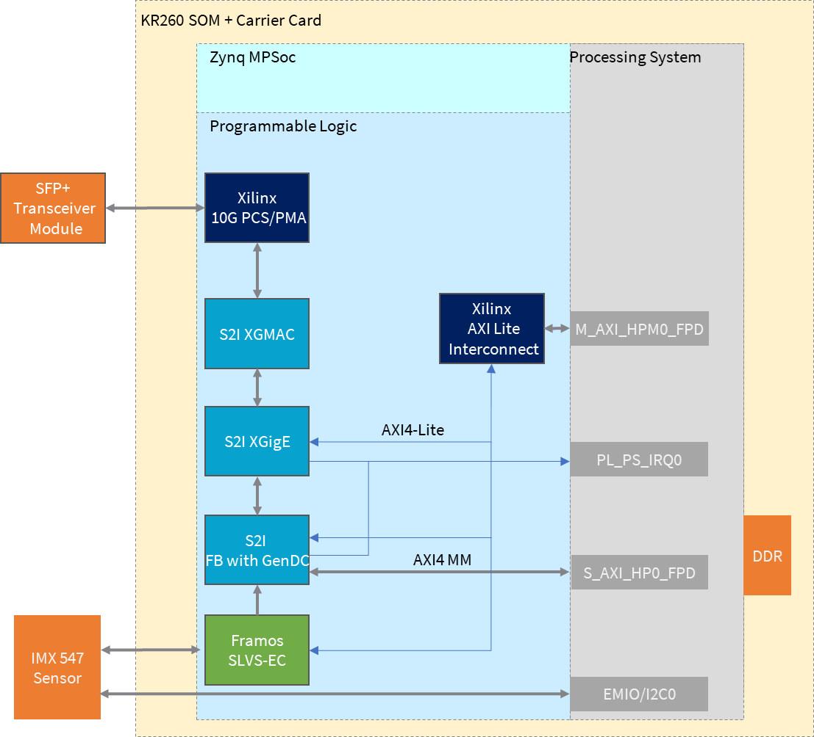

<table>
 <tr>
   <td align="center"><h1>Kria&trade; KR260 Robotics Starter Kit</h1>
   </td>
 </tr>
 <tr>
 <td align="center"><h1>Machine Vision Camera Tutorial</h1>
 
 </td>
 </tr>
</table>

# Sensor to Image 10GigE Vision Pipeline

## Overview of Sensor to Image 10GigE Vision Pipeline IPs

The SLVS-EC Machine Vision application on Kria KR260 board demonstrates the use of a Xilinx Zynq® Ultrascale+™ device together with Framos SLVS-EC IP and Sensor to Image GigE Vision IP to build a machine vision application according to the GigE Vision standard.

The design is developed using Xilinx Vivado version 2022.1 with ubuntu running on ZynqMPSoC ARM processor subsystem.

This is the block diagram of the SLVS-EC GigE Vision camera design:

The design is built as Block Design, instantiates all the modules required to form fully functional GigE Vision camera. The design consists of following modules:

* CPU Processor system. This is a block instantiates and configures the Zynq ARM CPU and AXI peripherals for interfacing the CPU to an external code memory and the rest of the design. It configures also the AXI Master Memory Controller, which provides access to external memory both from CPU and framebuffer core side. With a high performance port, other AXI masters like the framebuffer have access to the memory.

* SLVS-EC video input. This module and respective submodules instantiate the Framos SLVS-EC IP to interface the Sony IMX547 sensor, provide a sensor configuration interface and decode the sensor SLVS-EC signals. Output is an AXI stream, which is the input for the GigE Vision streaming chain with the framebuffer as first block.

* GigE framebuffer controller. This module operates as a special video framebuffer which forms data packets for the GigE core. In this application, image data are transferred in the GenICam GenDC format. It also handles the packet resend feature (serving resend packets) of the GigE Vision streaming protocol. It uses a Xilinx AXI interconnect to interface the AXI Master memory controller, which is part of the processor system. Note that physical memory is shared between ARM and framebuffer.

* XGigE core. This module handles all the low-level networking features to the rest of the system. It forms the GigE Vision stream channel and provides networking interface for the CPU system.

* 10Gigabit Ethernet MAC. This module is used in 10G systems for controlling access to the medium.

* PHY interface core. This module converts XGMII interface of XGMAC core to high speed serial interface needed by physical interface. The component is part of the Vivado IP catalog.

## Resource Utilization

| IP        | LUT           | FF  | BRAM | DSP | GT|
| :------------- |:-------------| :-----| :-------- | :------ | :------|
| Framebuffer    | 6573 | 10239  | 14.5 |1 |0|
| XGigE       | 3557      |   5601| 10.5 |0|0|
| 10G MAC | 3572     |   2632 | 0|0|0|
| PCS/PMA | 2752 | 5010 | 0|0|1|
| SLVS-EC | 1192 |  1706 | 0| 0|2|

## 10GigE Vision Pipeline HW Architecture

### Introduction

This section describes the design implemented in Programmable Logic (PL). The following figure shows the top-level hardware architecture of the reference design.

At a high level, the design implements the following pipelines:

### Single Sensor SLVS-EC Capture

A capture pipeline receives video frames from an external IMX547 Monochrome image sensor. This is done with the Framos SLVS-EC IP.

### GigE Vision protocol pipeline

The output of the Framos SLVS-EC IP is an AXI4 stream, which is forwarded to a special framebuffer IP from S2I. This IP buffers the data in external memory and forwards them in packets corresponding to the Ethernet packets size to the GigE packet composer(XGigE). The framebuffer also prepares the data to be sent in GenICam GenDC format, what allows to send a data container with different part e.g raw image, preprocessed image, metadata.

The XGigE IP forms the network card of the system with offloading the generation of GigE Vision streaming packets to hardware. It also receives network traffic and forwards that interrupt driven to the PS.

XGMAC and PCS/PMA IP implement the low-level medium access and bit encoding layer.

All IP implement an AXI4-Lite interface for configuration.

To get the 10GigE IP license please [contact Euresys](https://www.euresys.com/en/About-us/Contact-us).

Euresys Release note [here](https://www.euresys.com/en/About-us/Blog-event/News/New-GigE-Vision-Viewer-for-AMD-Xilinx-Kria-KR260-R).

Download the packages from Euresys [here](https://www.euresys.com/en/Support/Download-area).

## 10GigE Vision pipeline SW Architecture

The image acquisition pipeline is completely offloaded to hardware, no software is involved in the streaming path. Software is only used for configuring the system, that means configuring the sensor and the GigE Vision IP. As Linux is running on the ARM system, a specific IMX547 driver is used, programming the sensor via PS I2C. A second driver (s2imac) integrates the XGigE core as ethX to the Linux system and binds standard Linux network services to that interface. A software application (gvrd) initializes the hardware and runs the GigE Vision control channel.

According to the GigE vision specification, the device registers are described in the xml file. The host application requests this xml file from the device and creates a register tree. The registers on the device can then be read and written via the control channel. Hardware register accesses are implemented through calls to the s2imac network driver. Furthermore, the device software is responsible for configuring the GenICam GenDC descriptor.

## Next Steps

* [Application Deployment](app_deployment.md)
* Go back to the [MV Camera Sensor](sensor.md)
<!---

Licensed under the Apache License, Version 2.0 (the "License"); you may not use this file except in compliance with the License.

You may obtain a copy of the License at http://www.apache.org/licenses/LICENSE-2.0.

Unless required by applicable law or agreed to in writing, software distributed under the License is distributed on an "AS IS" BASIS, WITHOUT WARRANTIES OR CONDITIONS OF ANY KIND, either express or implied. See the License for the specific language governing permissions and limitations under the License.

-->

Copyright&copy; 2022 Xilinx
