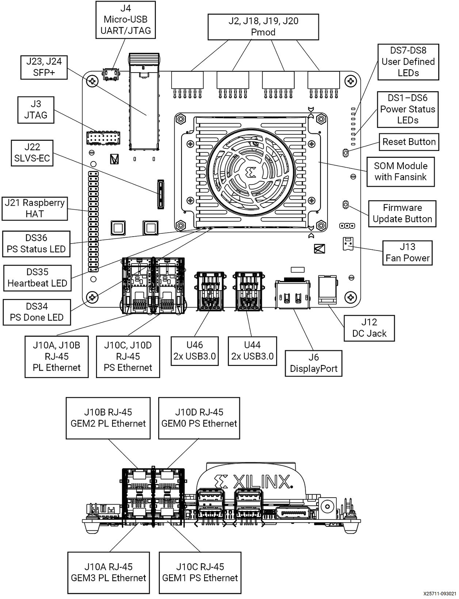

<table>
 <tr>
   <td align="center"><h1>Kria&trade; KR260 Robotics Starter Kit</h1>
   </td>
 </tr>
 <tr>
 <td align="center"><h1>Machine Vision Camera Tutorial</h1>

 </td>
 </tr>
</table>

# Machine Vision Application Deployment

## Setting Up the Test Environment

This document shows how to set up the board and run the **10GigE** application.

### Hardware Requirements

    a.  KR260 Robotics Starter Kit

    b.  KR260 Power Supply & Adapter (Included with KR260 Robotics Starter Kit)

    c.  Cat 5e Ethernet Cable (Included with KR260 Robotics Starter Kit)

    d.  USB-A to micro-B Cable (Included with KR260 Robotics Starter Kit)

    e.  16GB MicroSD Cards (Included with KR260 Robotics Starter Kit)

    f.  2 Windows/Ubuntu PC, one for capture the UART/console logs from KR260 board and one as host PC

        i.  Windows-10 or latest
        ii. Ubuntu-16.04 or latest

    g.  Fiber Optic cable

    h.  IMX547 sensor Module

    i.  10G NIC Card

    j.  10G SFP+ Transceiver

Some reference for 10G NIC Card, fiber optic cable, 10G SFP+ Transceiver are listed below:

10G Network cards:

- [X520-10G-1S](https://www.amazon.com/dp/B01LZRSQM9?pd_rd_i=B01LZRSQM9&pd_rd_w=TcxxK&pf_rd_p=3465d0d7-4e28-4692-b633-326c458deaa4&pd_rd_wg=KlLZ9&pf_rd_r=DW3Z81ZGWVXPFSR0KAFN&pd_rd_r=68b63a0c-1d6b-4770-80e0-79ad47e1a511) (not tested yet at S2I)

- [E10G42BTDA X520-da2](https://www.amazon.de/E10G42BTDA-10Gbps-Ethernet-Adapter-X520-da2/dp/B002I9L7PS/ref=sr_1_16?crid=3VYPG8MA3C5PL&dchild=1&keywords=intel+sfp%2B10g&qid=1621936558&sprefix=intel+sfp%2B%2Caps%2C195&sr=8-16) (might
    need Intel coded SFP+ modules)

Fiber Cable:

- [OM3 LC-LC Fiber Optic Patch Cable Multimode 10Gb](https://www.amazon.com/dp/B089K3VYZ1/ref=sspa_dk_detail_1?pd_rd_i=B0897B8SW7&pd_rd_w=OvoqM&pf_rd_p=5d846283-ed3e-4512-a744-a30f97c5d738&pd_rd_wg=Jh1DR&pf_rd_r=GC2RTS0AHW0JF70BFD4B&pd_rd_r=4f75d78a-f377-4749-bdcd-ee4a7c207f09&spLa=ZW5jcnlwdGVkUXVhbGlmaWVyPUExRzJBWlQxUFRVS1NOJmVuY3J5cHRlZElkPUEwNzA3NTk0Mzc2UUFFNUpRRTkwQyZlbmNyeXB0ZWRBZElkPUEwNDYxMzA0MlRPNjY3UllTV1RJVCZ3aWRnZXROYW1lPXNwX2RldGFpbF90aGVtYXRpYyZhY3Rpb249Y2xpY2tSZWRpcmVjdCZkb05vdExvZ0NsaWNrPXRydWU&th=1)

Two SFP+ Modules:

- [10GBase-SR SFP+ Transceiver](https://www.amazon.com/10Gtek-SFP-10G-SR-Transceiver-10GBASE-SR-300-meter/dp/B08BP55663/ref=pd_bxgy_img_2/143-6278076-9705018?_encoding=UTF8&pd_rd_i=B00U8Q7946&pd_rd_r=5e4b9782-8061-4262-8bc7-c59b5e76d816&pd_rd_w=izpJI&pd_rd_wg=XpNSU&pf_rd_p=fd3ebcd0-c1a2-44cf-aba2-bbf4810b3732&pf_rd_r=Z768SJSGXZWNJXANGWVW&refRID=Z768SJSGXZWNJXANGWVW&th=1)

### SOM Board setup

Please refer to KR260 Board & Interface layout below for connector reference numbers:




> **Note**: Skip Step 1 (Flashing the SD Card), if you have already flashed the SD Card with the KR260 Robotics Starter Kit Image.

1. Flashing the SD Card

    Follow the instruction from the [Kria KR260 getting started page](https://www.xilinx.com/products/som/kria/kr260-robotics-starter-kit/kr260-getting-started/setting-up-the-sd-card-image.html) to obtain Ubuntu image and flash SD card.

2. Insert the SD card into slot at J11.

3. UART/JTAG interface:

    a. For interacting and seeing boot-time information, connect a USB debugger to the J4.

    b. Open a serial terminal program (teraterm, putty etc) on UART monitoring laptop and connect to COM port corresponding to the board.

    c. Com Parameters: Speed: 115200, Data bits: 8, Stop bits: 1, Parity: None, Flow control: Xon/Xoff

4. Ensure that the board is powered off. Connect IMX547 sensor module to J22 in KR260 using flex cable refer below figure:

    

    

5. Keep the KR260 board and sensor module firmly held in a static position.

6. Connect Ethernet cable from PS ethernet \'J10C\' to your local network with DHCP enabled to install packages.

7. Connect the fiber optic cable to SFP+ connector in KR260 board, other end to host machine (Windows/Ubuntu) NIC card.

8. Power supply: 12V 3A adapter to be plugged into the DC jack at J12.

The KR260 board connection should be as shown in the below figure:


### Host Machine Setup

Check the available network interfaces before inserting the 10G NIC card using 

- `ifconfig -a` for ubuntu host
- `ipconfig /all` for windows host

Install the 10Gb PCIe NIC Network Card in the PCIe slot as shown in figure below,


Connect the fiber optic cable one end to NIC card in host machine and the other end to KR260 board SFP+ connector.

The newly inserted NIC card will show the new interface in the host machine. User may run the same command to verify that:

- `ifconfig -a` for ubuntu host
- `ipconfig /all` for windows host

## Boot the Linux Image

Power on the board, and boot Linux image:

> **NOTE**: Only perform this step if you are booting the Starter kit for the first time. Otherwise, log in with the *ubuntu* username and the password that was previously set.

    The Linux image will boot into the following login prompt:

```bash
    kria login:
```

Use the *ubuntu* user for login. login password will expire and You will be prompted to set a new password when executing sudo commands.

 ```shell
    kria login: ubuntu
    Password: ubuntu
    ubuntu@kria:\~\$ sudo touch file.txt
    \[sudo\] password for ubuntu:
    sudo: Account or password is expired, reset your password and tryagain
    Changing password for ubuntu.
    Current password:
    New password:
    Retype new password:
```

The *ubuntu* user does not have root privileges. Most commands used in subsequent tutorials must be run using *sudo* and you may be prompted to enter your password.

> **Note:** For security, by default, the root user is disabled. If user want to login as root user, perform the following steps. Use the *ubuntu* user's password on the first password prompt, then set a new password for the root user. User can now login as root user using the newly set root user password.
>   ```
>   ubuntu@kria:\~\$ sudo -i
>   sudo\] password for ubuntu:
>   root@kria:\~#
>    ```

## Installing the 10GigE package

Install the latest application packages.

1. Add Xilinx apps repository to download the apps:

     `sudo add-apt-repository ppa:xilinx-apps`

2. Check the package feed for new updates.

    `sudo apt update`

    `sudo apt upgrade`

    Confirm with "Y" when prompted to install new or updated packages.

3. Get the list of available packages in the feed:

      `sudo xmutil getpkgs`

4. Install the application.

    `sudo apt install xlnx-app-kr260-mv-defect-detect`

    `sudo apt install gstreamer1.0-plugins-bad`

    `sudo systemctl restart dfx-mgr.service`

    > **Note :** Installing firmware binaries may cause dfx-mgr to crash and a restart is needed, which is listed in the known issues section. Once this is fixed an newer updates are available for dfx-manager, restart may not be needed.

## Firmware Loading

The 10GigE application firmware consists of bitstream(bit.bin) and device tree overlay (*dtbo*). The 10GigE firmware is loaded dynamically on user request once ubuntu system is fully booted. Use the *xmutil* utility to list and load the firmware.

To list the available accelerator applications, run:

`sudo xmutil listapps`

> **Note**: The Active_Slot column shows the application firmware that is currently loaded in the system. The value '-1' indicates that the firmware is not loaded, while the value of '0' indicates that the firmware is loaded. By default, only the *k26-starter-kits* firmware is loaded.

To load the 10GigE application firmware, unload the existing firmware and then load the 10GigE application firmware:

`sudo xmutil unloadapp`

`sudo xmutil loadapp kr260-mv-camera`

## Running the 10GigE Application on Target

There is only one way to invoke the application and that is by command line.

>**Note**: The application needs to be run with *sudo*. Only one instance of the application can run at a time. Only 2472 x 2128 \@122fps -- 10bpp configuration is validated.

To run the application, follow below steps:

1. Navigate to application binary path
    ``cd \<app installation path\>``

    *For example* ``cd /opt/xilinx/xlnx-app-kr260-mv-defect-detect/bin/``

    ``export LD_LIBRARY_PATH=${LD_LIBRARY_PATH}:/opt/xilinx/xlnx-app-kr260-mv-defect-detect/lib/``

2. Run the configure script to configure the media nodes & the IP's in capture path

    `sudo ./configure`

    `sudo ./update_eeprom_wrapper`

    It will ask user to give few inputs, user will get below logs:

    ```
    Update eeprom

    file: xgvrd-kr260.xml
    size: 113757
     ```

    > **Note**: Select always 1 in the Network configuration below
    >
    > ```
    > 1: 0xFEC00000 (MVDK + ZX5/XU1 / ZC702 / ZC706 / ZCU102)
    > 2: 0xFFA10000
    > ```

    Then, user can select the type of network:

    ```
      1: dhcp
      2: static ip
    ```

    > **Note**: Select 1 or 2 based on user network configuration (static or dynamic). If user opted for static option then user need to fill below details as well. We have given example values for user's reference.
    >
    > Input ip address (xxx.xxx.xxx.xxx): **192.168.174.10**
    >
    > Input netmask (xxx.xxx.xxx.xxx): **255.255.255.0**
    >
    > Input gateway (xxx.xxx.xxx.xxx):**192.168.174.11**

3. Run below command and get the interface name which has memory address like **memory 0xa0060000-a006ffff**

    a.  `ifconfig -a`

    ```
        eth2: flags=3\<UP,BROADCAST\>  mtu 1500
        ether 00:0a:35:00:22:02  txqueuelen 1000  (Ethernet)
        RX packets 0  bytes 0 (0.0 B)
        RX errors 0  dropped 0  overruns 0  frame 0
        TX packets 4  bytes 590 (590.0 B)
        TX errors 0  dropped 0 overruns 0  carrier 0  collisions 0
        device interrupt 66  memory 0xa0060000-a006ffff
    ```

      Keyword **memory 0xa0060000-a006ffff** belongs to eth2 port. this interface info is required to feed while running gvrd application on target.

4. Run the *gst-launch* command in background to trigger the pipeline,

    For 60 fps run below commands

    ```bash
    media-ctl -d /dev/media0 -V "\"imx547 7-001a\":0 [fmt:SRGGB10_1X10/1920x1080 field:none @1/60]"
    gst-launch-1.0 v4l2src device=/dev/video0 io-mode=4 ! video/x-raw, width=1920, height=1080, format=RGB, framerate=60/1 !  queue ! fakevideosink -v &
    ```

    For 120 fps run below commands

    ```bash
    media-ctl -d /dev/media0 -V "\"imx547 7-001a\":0 [fmt:SRGGB10_1X10/1920x1080 field:none @1/120]"
    gst-launch-1.0 v4l2src device=/dev/video0 io-mode=4 ! video/x-raw, width=1920, height=1080, format=RGB, framerate=120/1 !  queue ! fakevideosink -v &
    ```

   > **Note:** Make sure you kill the gst-launch process before unloading xlnx-app-kr260-mv-camera.

5. Run the following command to run the gvrd application

      ```bash
      gvrd \<10gige port detail\>
      ```

    For an example, `./gvrd eth2`

    > **Note:** Once you are done with the 10GigE application, to switch to another accelerator application, you can unload the currently loaded accelerator application firmware by running:
    >
    >```
    > sudo xmutil unloadapp xlnx-app-kr260-mv-camera
    >```

6. On Host PC to run the Sphinx application:

    Sphinx GEV Viewer can be downloaded from [here](https://www.euresys.com/en/About-us/Blog-event/News/New-GigE-Vision-Viewer-for-AMD-Xilinx-Kria-KR260-R) along with Sphinx GEV Viewer user guide link to run the Sphinx application.

     **Pre-Requisites:**

    a). If user is setting the IP statically make sure both KR260 and host machine should be on the same network class address

       - On ubuntu : sudo ifconfig <10G network interface> <IPv4 adress> up

        For Example: `sudo ifconfig enp23s0 192.168.174.80 up`

       - On Windows : Set from network settings – IPv4 IP

    b). To change the MTU Size follow the below procedure:

        - For ubuntu : sudo ifconfig <10G network interface> mtu 9014 up

        For Example: `sudo ifconfig enp23s0 mtu 9014 up`

        - For Windows :
            * Go to settings, navigate to control panel, and select **Network and Sharing Centre**,
            * Select **Change adapter settings**,
            * Right click on the NIC interface on which you want to enable Jumbo Frames and select **Properties**,
            * From the NIC properties, select **Configure**,
            * Click on **Advanced** tab,  
            * In Advanced section, select **Jumbo Frame**,
            * In the Value field **Value** – select 9KB MTU s

    c). Download [xgvrd-kr260.xml](https://github.com/Xilinx/mv-defect-detect/blob/xlnx_rel_v2022.1/10gige/application/xgvrd-kr260.xml) into host machine. In sphinx GEV viewer application, set the downloaded xml file path in the GUI.

### **Sensor Calibration for the Live Source**

User can use v4ls utilities to tune various sensor parameters, for example

`v4l2-ctl -d /dev/v4l-subdev0 -c exposure=10000`

`v4l2-ctl -d /dev/v4l-subdev0 -c black_level=150`

`v4l2-ctl -d /dev/v4l-subdev0 -c gain=250`

### **File Structure of the Application**

The application is comprised of the following files:

Below files are present in *app* directory:

     `/opt/xilinx/xlnx-app-kr260-mv-defect-detect/`

| File name          | Description                                          |
|-------------------|-----------------------------------------------|
| bin/       | contains the binaries for 10GigE application |
| lib/       | contains the shared libraries for 10GigE application |

Below files are present in bin directory:

     `/opt/xilinx/xlnx-app-kr260-mv-defect-detect/bin/`

| File name              | Description                                            |
|-----------------------|--------------------------------------------------------|
| update_atable         | Application to create config file atable               |
| update_eeprom         | Application to create config file eeprom               |
| alloc_table.bin       | Data file used by update_atable application            |
| zcip                  | Zero configure network interface to configure IPv4     |
| zcip.script           | Used for ZeroConf IPv4 link-local address (the "auto ip alisaing" feature) |
| xgvrd-kr260.xml       | xml containing the GenICam register description        |
| gvrd                  | Application executable                                 |
| eeprom.bin            | Data file used by update_eeprom application            |
| configure             | Script to configure media nodes & IP's in capture path |
| update_eeprom_wrapper | Wrapper file to configure 10GigE pipeline              |

Below files are present in *lib* directory:

     `/opt/xilinx/xlnx-app-kr260-mv-defect-detect/lib/`

| File name          | Description                                          |
|-------------------|-----------------------------------------------|
| libgigev.so.2.0.1 | contains the GigE Vision core firmware        |
| libgigev.so.2.0   | contains the symbolic link to libgigev.so.2.0.1 |
| libgigev.so       | contains the Symbolic link to libgigev.so.2.0 |

## Next Steps

- [Debug](debug.md)
- Go back to the [MV Camera 10GigE](10gige.md)

<!---

Licensed under the Apache License, Version 2.0 (the "License"); you may not use this file except in compliance with the License.

You may obtain a copy of the License at http://www.apache.org/licenses/LICENSE-2.0.

Unless required by applicable law or agreed to in writing, software distributed under the License is distributed on an "AS IS" BASIS, WITHOUT WARRANTIES OR CONDITIONS OF ANY KIND, either express or implied. See the License for the specific language governing permissions and limitations under the License.

-->
<p align="center"><sup>Copyright&copy; 2022 Xilinx</sup></p>