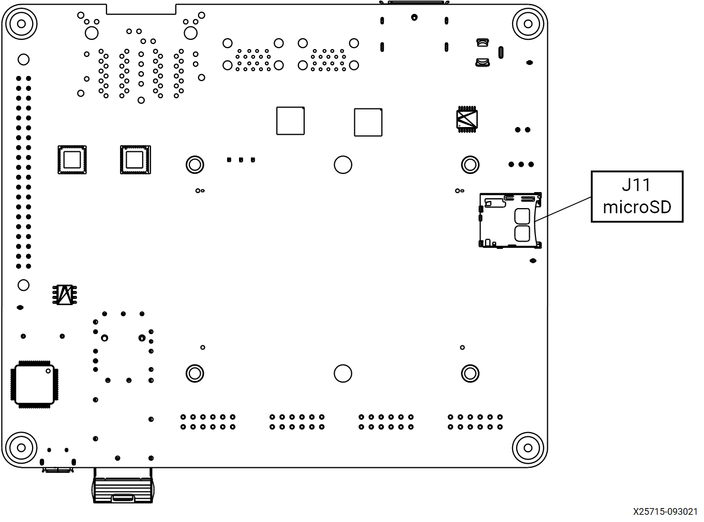

<table>
 <tr>
   <td align="center"><h1>Kria&trade; KR260 Robotics Starter Kit</h1>
   </td>
 </tr>
 <tr>
 <td align="center"><h1>Machine Vision Camera Tutorial</h1>

 </td>
 </tr>
</table>

# Machine Vision Application Deployment

## Introduction to the Test Environment

This document shows how to set up the board and run the **MV-Defect Detect** and **10GigE** applications.

### Hardware Requirements

1. KR260 Robotics Starter Kit

2. KR260 Power Supply & Adapter (Included with KR260 Robotics Starter Kit)

3. Cat 5e Ethernet Cable (Included with KR260 Robotics Starter Kit)

4. USB-A to micro-B Cable (Included with KR260 Robotics Starter Kit)

5. 16GB MicroSD Cards (Included with KR260 Robotics Starter Kit)

6. 2-Windows or Ubuntu PC, one for capture the UART/console logs from KR260 board, and one to act as host PC

      a.  Windows-10 or latest

      b. Ubuntu-16.04 or latest

7. Fiber Optic cable

8. Sony IMX547 Monochrome Camera sensor Module

9. 10G NIC Card

10. 10G SFP+ Transceiver

Some reference for 10G NIC Card, fiber optic cable, 10G SFP+ Transceiver are listed below:

10G Network cards:

- [X520-10G-1S](https://www.amazon.com/dp/B01LZRSQM9?pd_rd_i=B01LZRSQM9&pd_rd_w=TcxxK&pf_rd_p=3465d0d7-4e28-4692-b633-326c458deaa4&pd_rd_wg=KlLZ9&pf_rd_r=DW3Z81ZGWVXPFSR0KAFN&pd_rd_r=68b63a0c-1d6b-4770-80e0-79ad47e1a511) (not tested yet at S2I)

- [E10G42BTDA X520-da2](https://www.amazon.de/E10G42BTDA-10Gbps-Ethernet-Adapter-X520-da2/dp/B002I9L7PS/ref=sr_1_16?crid=3VYPG8MA3C5PL&dchild=1&keywords=intel+sfp%2B10g&qid=1621936558&sprefix=intel+sfp%2B%2Caps%2C195&sr=8-16) (might
    need Intel coded SFP+ modules)

Fiber Cable:

- [OM3 LC-LC Fiber Optic Patch Cable Multimode 10Gb](https://www.amazon.com/dp/B089K3VYZ1/ref=sspa_dk_detail_1?pd_rd_i=B0897B8SW7&pd_rd_w=OvoqM&pf_rd_p=5d846283-ed3e-4512-a744-a30f97c5d738&pd_rd_wg=Jh1DR&pf_rd_r=GC2RTS0AHW0JF70BFD4B&pd_rd_r=4f75d78a-f377-4749-bdcd-ee4a7c207f09&spLa=ZW5jcnlwdGVkUXVhbGlmaWVyPUExRzJBWlQxUFRVS1NOJmVuY3J5cHRlZElkPUEwNzA3NTk0Mzc2UUFFNUpRRTkwQyZlbmNyeXB0ZWRBZElkPUEwNDYxMzA0MlRPNjY3UllTV1RJVCZ3aWRnZXROYW1lPXNwX2RldGFpbF90aGVtYXRpYyZhY3Rpb249Y2xpY2tSZWRpcmVjdCZkb05vdExvZ0NsaWNrPXRydWU&th=1)

Two SFP+ Modules:

- [10GBase-SR SFP+ Transceiver](https://www.amazon.com/10Gtek-SFP-10G-SR-Transceiver-10GBASE-SR-300-meter/dp/B08BP55663/ref=pd_bxgy_img_2/143-6278076-9705018?_encoding=UTF8&pd_rd_i=B00U8Q7946&pd_rd_r=5e4b9782-8061-4262-8bc7-c59b5e76d816&pd_rd_w=izpJI&pd_rd_wg=XpNSU&pf_rd_p=fd3ebcd0-c1a2-44cf-aba2-bbf4810b3732&pf_rd_r=Z768SJSGXZWNJXANGWVW&refRID=Z768SJSGXZWNJXANGWVW&th=1)

### Setting Up the Live Source

When setting up the SOM Board for the live camera source capturing mango image displayed on a monitor, adhere to the following guidelines:

- Keep the IMX547 Camera module firmly held in a static position.
- IMX547 Camera module should be directly opposite to the monitor (180 deg).
- In the test environment, keep the IMX547 Camera Module at an appropriate distance (35 cm) from the monitor.
- According to the model of the monitor, set brightness and contrast to 45 and 17 respectively.
- Ensure that the room is closed. To get more clear preview image, add an artificial light source against to monitor.
- To avoid over exposure of light, do NOT place the monitor opposite to open door or window.
- Ensure that live source should be able to capture the mango completely.
- The camera should be focused ONLY on the mango image that was displayed.
- In the test environment, the light intensity is to be ~1280 LUX.

   **Note**: If the preview image is not satisfactory, adjust the above mentioned parameters.

### Setting Up the Test Environment

**Note:** Ensure that the [Gstreamer packages](https://gstreamer.freedesktop.org/documentation/installing/on-linux.html?gi-language=c) installed on Linux PC. If Linux distribution is on Ubuntu, make sure its version is at least **16.04**.

Download all the sample mango images from the [Cofilab site](http://www.cofilab.com/wp-content/downloads/DB_Mango.rar) to the Linux PC.

**Note:** If the file fails to download, copy the link and open in a new browser tab to download the file.

As the downloaded images are in JPG format, convert them to GRAY8 (Y8) format using the following steps.

1. Unzip the downloaded rar file.

2. In the Linux PC, go to `DB_mango`.

3. Copy and save the following script as **convert_jpeg_y8.sh**:

   ```shell
   for file in ./*; do       
   f=$(echo "${file##*/}");
     filename=$(echo $f| cut  -d'.' -f 1); #file has extension, it return only filename
       echo $filename
         gst-launch-1.0 filesrc location=$file ! jpegdec  ! videoconvert  ! videoscale ! video/x-raw, width=1920, height=1080, format=GRAY8 ! filesink location=$filename.y8
   done
   cat Mango_*.y8 > input_video.y8
   ```

4. Make the script executable: `chmod +x convert_jpeg_y8.sh`

5. Run the script `convert_jpeg_y8.sh` as follows:

   ```shell
   ./convert_jpeg_y8.sh >& file.txt
   ```

   Once the above command is completed, the script produces `input_video.y8` as input to the MV-Defect-Detect application.

6. Copy `input_video.y8` from the Linux PC to the SOM board. if copied to SD card, it can be found in `/boot/firmware/input_video.y8`. In order for containers to access the file, copy it to `/tmp/` and containers can then also access it from its /tmp/ folder. then copy it to `/home/` directory in container.

   > **NOTE**: Delete all files *except* `input_video.y8`.

The MV-Defect-Detect application's design- takes, processes, and displays images on to the monitor.

See [Known Issues and Limitations](known_issues.md) with the MV-Defect-Detect application.

### SOM Board setup

Refer to KR260 Board & Interface layout below for connector reference numbers:




1. Go through [Booting Kria Starter Kit Linux](../../kria_starterkit_linux_boot.md) to complete minimum setup required to boot Linux before continuing with instructions in this page.

2. Ensure that the board is powered off. Connect IMX547 Monochrome sensor module to J22 in KR260 using flex cable refer below figure:

    

    

3. Keep the KR260 board and sensor module firmly held in a static position.

4. Connect Ethernet cable from PS ethernet \'J10C\' to local network with DHCP enabled to install packages.

5. Connect the fiber optic cable to SFP+ connector in KR260 board, other end to host machine (Windows/Ubuntu) NIC card.

The KR260 board connection should be as shown in the below figure:


### Host Machine Setup

Check the available network interfaces before inserting the 10G NIC card using

- `ifconfig -a` for ubuntu host
- `ipconfig /all` for windows host

Install the 10Gb PCIe NIC Network Card in the PCIe slot as shown in figure below,


Connect the fiber optic cable one end to NIC card in host machine and the other end to KR260 board SFP+ connector.

The newly inserted NIC card shows the new interface in the host machine. User may run the same command to verify that:

- `ifconfig -a` for ubuntu host
- `ipconfig /all` for windows host

**Note:** On windows host, ensure that network related drivers are installed from the [link](https://www.euresys.com/en/Products/IP-Cores/Vision-Standard-IP-Cores-for-FPGA/GigE-Vision-IP-Core-(2)), before running Host Sphinx application.

**Note:** Ensure 10GigE interface is enabled on Host PC before loading MV-Camera application firmware.

## Installing the Application packages

Make sure that you had gone through  [Booting Kria Starter Kit Linux](../../kria_starterkit_linux_boot.md) as indicated in previous step to complete minimum setup required to boot Linux before continuing with instructions in this page.

Install the latest application packages.

1. Get the list of available packages in the feed:

      `sudo xmutil getpkgs`

2. Install the application.

    `sudo apt install xlnx-firmware-kr260-mv-camera`

    > **Note :** Installing firmware binaries may cause dfx-mgr to crash and a restart is needed, which is listed in the [Known issues and Limitations](known_issues.md) section. Once this is fixed an newer updates are available for dfx-manager, restart may not be needed.

## Docker based application preparation

Pull the latest docker image for mv-defect-detect using the below command.

```bash
    sudo docker pull xilinx/mv-defect-detect:2022.1
```

Find the images installed with the below command:

```bash
sudo docker images
```

## Firmware Loading

The MV-Camera application firmware consists of bitstream (bit.bin) and device tree overlay (*dtbo*). The MV-Camera firmware is loaded dynamically on user request once ubuntu system is fully booted. Use the *xmutil* utility to list and load the firmware.

**Note:** `xmutil` utility runs only in Ubuntu.

### Dynamically load the application firmware:

* Disable the desktop environment:

    ```bash
       sudo xmutil desktop_disable
    ```

    **Note:** Executing "xmutil desktop_disable" causes the desktop on the monitor to be disabled. Please use any serial terminal to continue issuing Linux commands via port J4 and not rely completely on the desktop environment.

    After running the application, the desktop environment can be enabled again with:

    ```bash
       sudo xmutil desktop_enable
    ```

* After installing the FW, execute xmutil listapps to verify that it is captured under the listapps function, and to have dfx-mgrd re-scan and register all accelerators in the FW directory tree.

    ```bash
      sudo xmutil listapps
    ```

To list the available accelerator applications, run:

`sudo xmutil listapps`

> **Note**: The Active_Slot column shows the application firmware that is currently loaded in the system. The value '-1' indicates that the firmware is not loaded, while the value of '0' indicates that the firmware is loaded. By default, only the *k26-starter-kits* firmware is loaded.

To load the MV-Camera application firmware, unload the existing firmware and then load the MV-Camera application firmware:

`sudo xmutil unloadapp`

`sudo xmutil loadapp kr260-mv-camera`

## Launching the Docker

Launch the docker using the below command. The firmware must be loaded before launching the docker container.

```bash
    sudo docker run \
    --env="DISPLAY" \
        --env="XDG_SESSION_TYPE" \
        --net=host \
        --privileged \
        --volume /tmp:/tmp \
        --volume="$HOME/.Xauthority:/root/.Xauthority:rw" \
        -v /dev:/dev \
        -v /sys:/sys \
        -v /etc/vart.conf:/etc/vart.conf \
        -v /lib/firmware/xilinx:/lib/firmware/xilinx \
        -v /run:/run \
        -h "xlnx-docker" \
        -it xilinx/mv-defect-detect:2022.1 bash
```

  It launches the mv-defect-detect docker image container

```bash
    root@xlnx-docker/#
```

## Running the 10GigE Application on Target

There is only one way to invoke the application and that is by command line.

>**Note**: Docker starts with the *root* user access. Only one instance of the application can run at a time. Only 2472 x 2128 \@122fps -- 10bpp configuration is validated.

To run the application, follow below steps:

1. Run the configure script to configure the media nodes & the IP's in capture path

    `configure`

    `update_eeprom_wrapper`

    It asks user to give few inputs, then it get below logs (below xml file size may vary):

    ```
    Update eeprom

    file: xgvrd-kr260.xml
    size: 113757
     ```

    > **Note**: Select always 1 in the Network configuration below
    >
    > ```
    > 1: 0xFEC00000 (MVDK + ZX5/XU1 / ZC702 / ZC706 / ZCU102)
    > 2: 0xFFA10000
    > ```

    Then, user can select the type of network:

    ```
      1: dhcp
      2: static ip
    ```

    > **Note**: Select 1 or 2 based on user network configuration (static or dynamic). If user opted for static option then user need to fill below details as well. We have given example values for user's reference.
    >
    > Input ip address (xxx.xxx.xxx.xxx): **192.168.174.10**
    >
    > Input netmask (xxx.xxx.xxx.xxx): **255.255.255.0**
    >
    > Input gateway (xxx.xxx.xxx.xxx):**192.168.174.11**

2. Run below command and get the interface name which has memory address like **memory 0xa0060000-a006ffff**

    a.  `ifconfig -a`

    ```
        eth2: flags=3\<UP,BROADCAST\>  mtu 1500
        ether 00:0a:35:00:22:02  txqueuelen 1000  (Ethernet)
        RX packets 0  bytes 0 (0.0 B)
        RX errors 0  dropped 0  overruns 0  frame 0
        TX packets 4  bytes 590 (590.0 B)
        TX errors 0  dropped 0 overruns 0  carrier 0  collisions 0
        device interrupt 66  memory 0xa0060000-a006ffff
    ```

      Keyword **memory 0xa0060000-a006ffff** belongs to eth2 port. This interface info is required to feed while running gvrd application on target.

3. Run the *gst-launch* command in background to trigger the pipeline,

    For 60 fps, run either below gst launch command or mv-defect-detect application.

    ```bash
    media-ctl -d /dev/media0 -V "\"imx547 7-001a\":0 [fmt:SRGGB10_1X10/1920x1080 field:none @1/60]"
    gst-launch-1.0 v4l2src device=/dev/video0 io-mode=4 ! video/x-raw, width=1920, height=1080, format=GRAY8, framerate=60/1 !  queue ! fakevideosink -v &
    ```
    
    For 120 fps run below commands

    **Note**: MV-Defect-Detect application does not support 120 fps.

    ```bash
    media-ctl -d /dev/media0 -V "\"imx547 7-001a\":0 [fmt:SRGGB10_1X10/1920x1080 field:none @1/120]"
    gst-launch-1.0 v4l2src device=/dev/video0 io-mode=4 ! video/x-raw, width=1920, height=1080, format=GRAY8, framerate=120/1 !  queue ! fakevideosink -v &
    ```

   > **Note:** Make sure to kill the gst-launch process before unloading xlnx-app-kr260-mv-camera.

4. Run the following command to run the gvrd application

      ```bash
      gvrd \<10gige port detail\>
      ```

    For an example, `gvrd eth2`

    > **Note:** Once done with the 10GigE application, to switch to another accelerator application, unload the currently loaded accelerator application firmware by running:
    >
    >```
    > sudo xmutil unloadapp
    >```

5. On Host PC to run the Sphinx application:

    Sphinx GEV Viewer can be downloaded from [here](https://www.euresys.com/en/About-us/Blog-event/News/New-GigE-Vision-Viewer-for-AMD-Xilinx-Kria-KR260-R) along with Sphinx GEV Viewer user guide link to run the Sphinx application.

     **Pre-Requisites:**

    a). If user is setting the IP statically make sure both KR260 and host machine should be on the same network class address

    - On ubuntu : sudo ifconfig <10G network interface> <IPv4 adress> up

        For Example: `sudo ifconfig enp23s0 192.168.174.80 up`

    - On Windows : Set from network settings – IPv4 IP

    b). To change the MTU Size follow the below procedure:

    - For ubuntu : sudo ifconfig <10G network interface> mtu 9014 up

        For Example: `sudo ifconfig enp23s0 mtu 9014 up`

    - For Windows :
        * Go to settings, navigate to control panel, and select **Network and Sharing Centre**,
        * Select **Change adapter settings**,
        * Right click on the NIC interface on which the place to enable Jumbo Frames and select **Properties**,
        * From the NIC properties, select **Configure**,
        * Click on **Advanced** tab,  
        * In Advanced section, select **Jumbo Frame**,
        * In the Value field **Value** – select 9KB MTU s.

    c). Download [xgvrd-kr260.xml](https://github.com/Xilinx/mv-defect-detect/blob/xlnx_rel_v2022.1/10gige/application/xgvrd-kr260.xml) into host machine. In sphinx GEV viewer application, set the downloaded xml file path in the GUI.

    d). In Sphinx host application, select *Use filter Driver* checkbox, and *Grab* checkbox to capture the frames from KR260 10GigE network.

## Running the MV-Defect-Detect Application

Follow the below mentioned procedure to invoke the MV-Defect-Detect application: command line.

To view the mv-defect-detect output on the display, disable the alpha plane using below command.

```bash
modetest -D fd4a0000.display -s 43@41:1920x1080-60@BG24 -w 40:"alpha":0
modetest -D fd4a0000.display -s 43@41:1920x1080-60@BG24 -w 40:"g_alpha_en":0
```

### Command Line

Use the command line to set the resolution, configuration file path and more, using the **mv-defect-detect** application.

More combinations could be made based on the options provided by the **mv-defect-detect** application.

**Note:** 'demomode' application option is not supported for File sink. It is only supported for live out.

MV-Defect-Detect Application Usage

```bash
mv-defect-detect --help
```

Usage:

```bash
mv-defect-detect [OPTION?] - Application to detect the defect of Mango on Xilinx board.
```

Help Options:

```bash
  -?, --help                        Show help options

  --help-all                        Show all help options

  --help-gst                        Show GStreamer Options
```

Application Options:

```bash
-i, --infile=file path                                       Location of input file
-f, --outfile=file path                                      Location of output file
-w, --width=1920                                             Resolution width of the input
-h, --height=1080                                            Resolution height of the input
-o, --output=0                                               Display/dump stage on DP/File
-r, --framerate=60                                           Framerate of the input source
-d, --demomode=0                                             For Demo mode value must be 1
-c, --cfgpath=/opt/xilinx/xlnx-app-kr260-mv-defect-detect/share/vvas/    JSON config file path
```

The application is targeted to run an input source that supports GRAY8 (Y8) format with a resolution of **1920x1080**.

Once done with the MV-Defect-Detect application, To switch to another accelerator application after mv-defect-detect application, first exit out of the docker container using ```exit```, then unload the firmware by running the below command:

```bash
sudo xmutil unloadapp
```

### Command Examples

**Examples:** Follow the below examples for different use cases of the above mentioned command options.

**Note**: Only one instance of the application can run at a time.

* For File-In and File-Out mode, run the following command

  Command  | Description
  ------------- | -------------
  `mv-defect-detect -i input.y8 -o 0 -f out_raw.y8`  | Raw output dumps into file.
  `mv-defect-detect -i input.y8 -o 1 -f out_preproc.y8`  | Pre-process output dumps into file.
  `mv-defect-detect -i input.y8 -o 2 -f out_final.y8`  | Final output dumps into file.

  **Note**: File-In and File-Out demo mode is not supported.

* For File-In and Display-Out mode, run the following command.

   Command  | Description
  ------------- | -------------
  `mv-defect-detect -i input.y8`  | Raw output displays on DP. Input file path should change as per the requirement.
  `mv-defect-detect -i input.y8 -o 0`  | This command is same as above command. Raw output displays on DP. Input file path should change as per the requirement.
  `mv-defect-detect -i input.y8 -o 1`  | Preprocess output displays on DP. Input file path should change as per the requirement.
  `mv-defect-detect -i input.y8 -o 2`  | Final output displays on DP. Input file path should change as per the requirement.

* For File-In and Display-Out demo mode, run the following command.

   Command  | Description
  ------------- | -------------
  `mv-defect-detect -i input.y8 -d 1`  | Raw output displays on DP. Input file path should change as per the requirement.
  `mv-defect-detect -i input.y8 -o 0 -d 1`  | This command is same as above command. Raw output displays on DP. Input file path should change as per the requirement.
  `mv-defect-detect -i input.y8 -o 1 -d 1`  | Preprocess output displays on DP. Input file path should change as per the requirement.
  `mv-defect-detect -i input.y8 -o 2 -d 1`  | Final output displays on DP. Input file path should change as per the requirement.

* For Live-In and File-Out mode, run the following command.

   Command  | Description
  ------------- | -------------
  `mv-defect-detect -o 0 -f out_raw.y8`  | Raw output dumps into file.
  `mv-defect-detect -o 1 -f out_preproc.y8`  | Preprocess output dumps into file.
  `mv-defect-detect -o 2 -f out_final.y8`  | Final output dumps into file.

  **Note**: Live-In and File-Out demo mode is not supported.

* For Live-In and Display-Out mode, run the following command.

   Command  | Description
  ------------- | -------------
  `mv-defect-detect -o 0`  | Raw output displays on DP.
  `mv-defect-detect -o 1`  | Preprocess output displays on DP.
  `mv-defect-detect -o 2`  | Final output displays on DP.

* For Live-In and Display-Out mode, run the following command.

   Command  | Description
  ------------- | -------------
  `mv-defect-detect -o 0 -d 1`  | Raw output displays on DP.
  `mv-defect-detect -o 1 -d 1`  | Preprocess output displays on DP.
  `mv-defect-detect -o 2 -d 1`  | Final output displays on DP.

### **Sensor Calibration for the Live Source**

User can use v4l2 utilities to tune various sensor parameters, for example

`v4l2-ctl -d /dev/v4l-subdev0 -c exposure=10000`

`v4l2-ctl -d /dev/v4l-subdev0 -c black_level=150`

`v4l2-ctl -d /dev/v4l-subdev0 -c gain=250`

### **File Structure of the MV-Defect-Detect Application**

The application is comprised of the following files:

Below files are present in *app* directory:

  `/opt/xilinx/xlnx-app-kr260-mv-defect-detect/`

| File name          | Description                                          |
|-------------------|-----------------------------------------------|
| bin/       | contains the binaries for MV-Defect-Detect application |
| lib/       | contains the shared libraries for MV-Defect-Detect application |
| share/vvas/       | contains the configuration files for vvas accelerators |
| README_MV_DEFECT_DETECT       | contains the application information |

Below files are present in bin directory:

   `/opt/xilinx/xlnx-app-kr260-mv-defect-detect/bin/`

| File name              | Description                                            |
|-----------------------|--------------------------------------------------------|
| update_atable         | Application to create config file atable               |
| update_eeprom         | Application to create config file eeprom               |
| alloc_table.bin       | Data file used by update_atable application            |
| zcip                  | Zero configure network interface to configure IPv4     |
| zcip.script           | Used for ZeroConf IPv4 link-local address (the "auto ip aliasing" feature) |
| xgvrd-kr260.xml       | xml containing the GenICam register description        |
| gvrd                  | Application executable                                 |
| eeprom.bin            | Data file used by update_eeprom application            |
| configure             | Script to configure media nodes & IP's in capture path |
| update_eeprom_wrapper | Wrapper file to configure 10GigE pipeline              |
| mv-defect-detect      | binary for mv-defect-detect application         |

Below files are present in *lib* directory:

  `/opt/xilinx/xlnx-app-kr260-mv-defect-detect/lib/`

| File name          | Description                                          |
|-------------------|-----------------------------------------------|
| libgigev.so.2.0.1 | contains the GigE Vision core firmware        |
| libgigev.so.2.0   | contains the symbolic link to libgigev.so.2.0.1 |
| libgigev.so       | contains the Symbolic link to libgigev.so.2.0 |
| libvvas_preprocess.so | vvas pre-process accelarator library|
| libvvas_otsu.so    | vvas OTSU accelerator library |
| libvvas_cca.so       | vvas CCA accelerator library |
| libvvas_text2overlay.so       | vvas text2overlay library |

Below files are present in *vvas* directory:

   `/opt/xilinx/xlnx-app-kr260-mv-defect-detect/share/vvas/`

| File name              | Description                                            |
|-----------------------|--------------------------------------------------------|
| cca-accelerator.json         | Configuration of CCA accelerator               |
| otsu-accelarator.json   | Configuration of OTSU accelerator              |
| preprocess-accelarator.json  | Configuration of pre-process accelarator           |
| preprocess-accelarator-stride.json          | Configuration of pre-process accelarator with stride |
| text2overlay.json       | Configuration of text2overlay      |

## Next Steps

- [System Architecture of the Platform](sw_arch_platform_dd.md)
- Go back to the [MV Camera 10GigE](10gige.md)

<!---

Licensed under the Apache License, Version 2.0 (the "License"); you may not use this file except in compliance with the License.

You may obtain a copy of the License at http://www.apache.org/licenses/LICENSE-2.0.

Unless required by applicable law or agreed to in writing, software distributed under the License is distributed on an "AS IS" BASIS, WITHOUT WARRANTIES OR CONDITIONS OF ANY KIND, either express or implied. See the License for the specific language governing permissions and limitations under the License.

-->
<p align="center"><sup>Copyright&copy; 2022 Xilinx</sup></p>