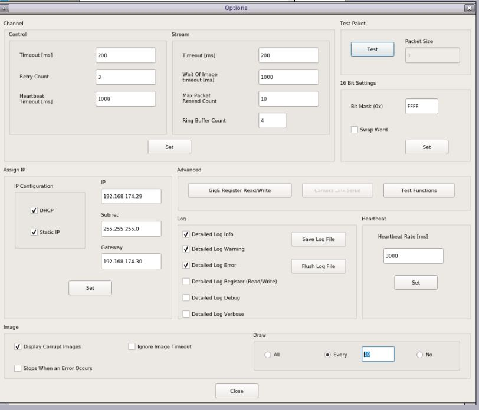

<table>
 <tr>
   <td align="center"><h1>Kria&trade; KR260 Robotics Starter Kit</h1>
   </td>
 </tr>
 <tr>
 <td align="center"><h1>Machine Vision Camera Tutorial</h1>
 
 </td>
 </tr>
</table>

# Debug

Please first review the [FAQ](https://xilinx.github.io/kria-apps-docs/faq.html) for commonly encountered issues across Kria SOM applications.

1. To get Max fps in sphinx GEV viewer user can change the draw value in sphinx --> options based on the host type (windows or ubuntu)

    - On ubuntu host,

         For 60 fps user must set the draw value to `10` 
         For 120 fps user must set the draw value to `50`

    - On windows host,

         For 60/120 fps user must set the draw value to `10`

         

2. To cross check the connection between KR260 target and host use ping functionality. For Example, ping -I `<10G_interface_name> <ip address>`

3. To identify whether NIC card is inserted properly or not in ubuntu host machine PCIe slot, run this command `lspci -vvv | grep -i "82599 10 Gigabit Network"`

4. After inserting the 10G NIC card in windows host machine PCIe slot check device manager for device detection and driver installation. If driver is not installed for this device install the driver from the given link: [NIC Card driver](https://www.intel.com/content/www/us/en/download/15084/intel-ethernet-adapter-complete-driver-pack.html).

5. If user get -1 for `xmutil loadapp <app name>`, try to unload the existing app firmware using `xmutil unloadapp` and then load the preferred app firmware.

6. To trigger the sensor stream-on, run the Gstreamer capture pipeline in background using gst-launch-1.0 utility before starting 10GigE application.

7. To install the mv-camera firmware manually, use below command.
    ```bash
   apt install xlnx-firmware-kr260-mv-camera
   ```

   **Note:** Ensure to run the apt update to get the latest firmware.

8. Make sure to use the below command

    ```bash
     sudo xmutil loadapp kr260-mv-camera
    ```
   to load the **mv-defect-detect** firmware properly. Otherwise necessary drivers won't be loaded, there might be some errors that popup when you run the **mv-defect-detect** application.

9. Always unload existing firmware before loading the mv-defect-detect firmware.

10. The Framerate displayed is only for Live Playback. To get the framerate on console, you need to prepend the keywords `GST_DEBUG="*defect*:4"` in the GStreamer application/pipeline.

   For Example: 

   `GST_DEBUG="*defect*:4" mv-defect-detect`

11. Following are some of the examples of Gstreamer pipelines

**Note**: Run the below command, before running any of the following pipelines, including the ones in the Demo mode.

   ```bash
   modetest -D fd4a0000.display -s 43@41:1920x1080-60@BG24 -w 40:"alpha":0
   modetest -D fd4a0000.display -s 43@41:1920x1080-60@BG24 -w 40:"g_alpha_en":0
   ```
**Note**: Navigate to `/opt/xilinx/xlnx-app-kr260-mv-defect-detect/share/vvas/` and then run the gst-launch commands.

#### For Live Input and Raw Output

* Live In - Live Out

  `gst-launch-1.0 v4l2src device=/dev/video0 io-mode=5 ! video/x-raw, width=1920, height=1080, format=GRAY8, framerate=60/1 ! perf ! kmssink bus-id=fd4a0000.display -v`

* Live In - File Out

  `gst-launch-1.0 v4l2src device=/dev/video0 ! video/x-raw, width=1920, height=1080, format=GRAY8, framerate=60/1 ! perf ! filesink location=out.y8 -v`

* Live In - Live Out Demo mode
  `gst-launch-1.0 v4l2src device=/dev/video0 io-mode=5 ! videorate ! video/x-raw, width=1920, height=1080, format=GRAY8, framerate=4/1 ! perf ! kmssink bus-id=fd4a0000.display -v`

#### For Live Input and Pre-process Output

* Live In - Live Out

  `gst-launch-1.0 v4l2src device=/dev/video0 io-mode=4 ! video/x-raw, width=1920, height=1080, format=GRAY8, framerate=60/1 !  vvas_xfilter kernels-config=otsu-accelarator.json ! queue  !  vvas_xfilter kernels-config=preprocess-accelarator-stride.json ! video/x-raw, width=1920, height=1080, format=GRAY8 ! perf !  kmssink bus-id=fd4a0000.display -v`

* Live In - File Out

  `gst-launch-1.0 v4l2src device=/dev/video0 io-mode=4 ! video/x-raw, width=1920, height=1080, format=GRAY8, framerate=60/1 !  vvas_xfilter kernels-config=otsu-accelarator.json ! queue  ! video/x-raw, width=1920, height=1080, format=GRAY8 !  vvas_xfilter kernels-config=preprocess-accelarator.json ! video/x-raw, width=1920, height=1080, format=GRAY8 ! perf !  filesink location=out.y8 -v`

* Live In - Live Out Demo mode

  `gst-launch-1.0 v4l2src device=/dev/video0 io-mode=4 ! video/x-raw, width=1920, height=1080, format=GRAY8, framerate=60/1 !  vvas_xfilter kernels-config=otsu-accelarator.json ! queue  !  vvas_xfilter kernels-config=preprocess-accelarator-stride.json ! videorate ! video/x-raw, width=1920, height=1080, format=GRAY8, framerate=4/1 ! perf !  kmssink bus-id=fd4a0000.display -v`

#### For Live Input and Final Output

* Live In - Live Out

   `gst-launch-1.0 v4l2src device=/dev/video0 io-mode=4 ! video/x-raw, width=1920, height=1080, format=GRAY8, framerate=60/1 !  vvas_xfilter kernels-config=otsu-accelarator.json ! queue  !  vvas_xfilter kernels-config=preprocess-accelarator-stride.json ! queue  ! vvas_xfilter kernels-config=cca-accelarator.json ! queue ! vvas_xfilter kernels-config=text2overlay.json ! video/x-raw, width=1920, height=1080, format=GRAY8, framerate=60/1 ! perf !  kmssink bus-id=fd4a0000.display -v`

* Live In - File Out

  `gst-launch-1.0 v4l2src device=/dev/video0 io-mode=4 ! video/x-raw, width=1920, height=1080, format=GRAY8, framerate=60/1 !  vvas_xfilter kernels-config=otsu-accelarator.json ! queue  !  vvas_xfilter kernels-config=preprocess-accelarator.json ! queue  ! vvas_xfilter kernels-config=cca-accelarator.json ! queue ! vvas_xfilter kernels-config=text2overlay.json ! video/x-raw, width=1920, height=1080, format=GRAY8, framerate=60/1 ! perf !  filesink location=t.y8 -v`

* Live In - Live Out Demo mode

  `gst-launch-1.0 v4l2src device=/dev/video0 io-mode=4 ! video/x-raw, width=1920, height=1080, format=GRAY8, framerate=60/1 !  vvas_xfilter kernels-config=otsu-accelarator.json ! queue  !  vvas_xfilter kernels-config=preprocess-accelarator-stride.json ! queue  ! vvas_xfilter kernels-config=cca-accelarator.json ! queue ! vvas_xfilter kernels-config=text2overlay.json ! videorate ! video/x-raw, width=1920, height=1080, format=GRAY8, framerate=4/1 ! perf !  kmssink bus-id=fd4a0000.display -v`

#### For File Input and Raw Output

* File In - Live Out

  `gst-launch-1.0 filesrc location=./input.y8 blocksize=2073600  ! rawvideoparse use-sink-caps=false width=1920 height=1080 format=gray8 framerate=60/1 !  perf !  kmssink bus-id=fd4a0000.display -v`

* File In - File Out

  `gst-launch-1.0 filesrc location=./input.y8 blocksize=2073600  ! rawvideoparse use-sink-caps=false width=1920 height=1080 format=gray8 framerate=60/1 ! perf !   filesink location=out.y8 -v`

* File In - Live Out Demo mode

  `gst-launch-1.0 filesrc location=./input.y8 blocksize=2073600  ! rawvideoparse use-sink-caps=false width=1920 height=1080 format=gray8 framerate=4/1 ! perf !  kmssink bus-id=fd4a0000.display -v`

#### For File Input and Pre-process Output

* File In - Live Out

   `gst-launch-1.0 filesrc location=./input.y8 blocksize=2073600  ! rawvideoparse use-sink-caps=false width=1920 height=1080 format=gray8 framerate=60/1 !  vvas_xfilter kernels-config=otsu-accelarator.json ! queue  !  vvas_xfilter kernels-config=preprocess-accelarator-stride.json ! queue  ! video/x-raw, width=1920, height=1080, format=GRAY8, framerate=60/1 ! perf !  kmssink bus-id=fd4a0000.display -v`

* File In - File Out

   `gst-launch-1.0 filesrc location=./input.y8 blocksize=2073600  ! rawvideoparse use-sink-caps=false width=1920 height=1080 format=gray8 framerate=60/1 !  vvas_xfilter kernels-config=otsu-accelarator.json ! queue  !  vvas_xfilter kernels-config=preprocess-accelarator.json ! video/x-raw, width=1920, height=1080, format=GRAY8, framerate=60/1 ! perf !   filesink location=out.y8 -v`

* File In - Live Out Demo mode

   `gst-launch-1.0 filesrc location=./input.y8 blocksize=2073600  ! rawvideoparse use-sink-caps=false width=1920 height=1080 format=gray8 framerate=4/1 !  vvas_xfilter kernels-config=otsu-accelarator.json ! queue  !  vvas_xfilter kernels-config=preprocess-accelarator-stride.json ! video/x-raw, width=1920, height=1080, format=GRAY8, framerate=4/1 ! perf !  kmssink bus-id=fd4a0000.display -v`

#### For File Input and Final Output

* File In - Live Out

  `gst-launch-1.0 filesrc location=./input.y8 blocksize=2073600  ! rawvideoparse use-sink-caps=false width=1920 height=1080 format=gray8 framerate=60/1 !  vvas_xfilter kernels-config=otsu-accelarator.json ! queue  !  vvas_xfilter kernels-config=preprocess-accelarator-stride.json ! queue  ! vvas_xfilter kernels-config=cca-accelarator.json ! queue ! vvas_xfilter kernels-config=text2overlay.json ! video/x-raw, width=1920, height=1080, format=GRAY8, framerate=60/1 ! perf !  kmssink bus-id=fd4a0000.display -v`

* File In - File Out

  `gst-launch-1.0 filesrc location=./input.y8 blocksize=2073600  ! rawvideoparse use-sink-caps=false width=1920 height=1080 format=gray8 framerate=60/1 !  vvas_xfilter kernels-config=otsu-accelarator.json ! queue  !  vvas_xfilter kernels-config=preprocess-accelarator.json ! queue  ! vvas_xfilter kernels-config=cca-accelarator.json ! queue ! vvas_xfilter kernels-config=text2overlay.json ! video/x-raw, width=1920, height=1080, format=GRAY8, framerate=60/1 ! perf !   filesink location=out.y8 -v`

* File In - Live Out Demo mode

   `gst-launch-1.0 filesrc location=./input.y8 blocksize=2073600  ! rawvideoparse use-sink-caps=false width=1920 height=1080 format=gray8 framerate=4/1 !  vvas_xfilter kernels-config=otsu-accelarator.json ! queue  !  vvas_xfilter kernels-config=preprocess-accelarator-stride.json ! queue  ! vvas_xfilter kernels-config=cca-accelarator.json ! queue ! vvas_xfilter kernels-config=text2overlay.json ! video/x-raw, width=1920, height=1080, format=GRAY8, framerate=4/1 ! perf !  kmssink bus-id=fd4a0000.display -v`


## Next Steps

* [Known Issues and Limitations](known_issues.md)
* Go back to the [MV Camera Application Deployment](app_deployment.md)

<!---

Licensed under the Apache License, Version 2.0 (the "License"); you may not use this file except in compliance with the License.

You may obtain a copy of the License at http://www.apache.org/licenses/LICENSE-2.0.


Unless required by applicable law or agreed to in writing, software distributed under the License is distributed on an "AS IS" BASIS, WITHOUT WARRANTIES OR CONDITIONS OF ANY KIND, either express or implied. See the License for the specific language governing permissions and limitations under the License.

-->

<p align="center"><sup>Copyright&copy; 2022 Xilinx</sup></p>