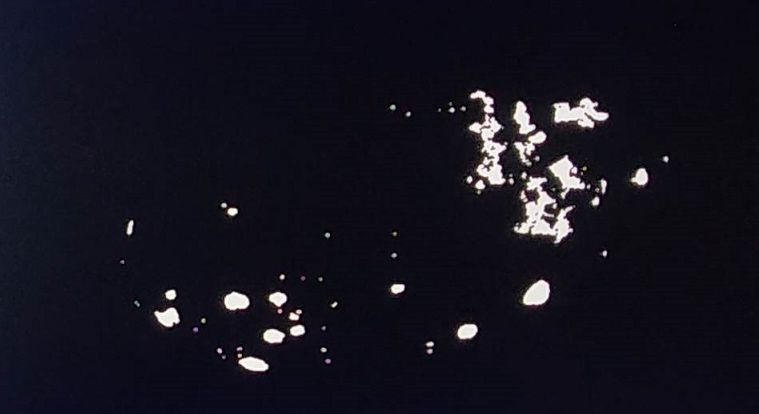

<table>
 <tr>
   <td align="center"><h1>Kria&trade; KR260 Robotics Starter Kit</h1>
   </td>
 </tr>
 <tr>
 <td align="center"><h1>Machine Vision Camera Tutorial</h1>
 
 </td>
 </tr>
</table>

# Hardware Architecture of the Accelerator

The Vitis overlay includes the Pre-Process block and the MV-Defect-Detect blocks.

## Pre-Process

The Pre-Process pipeline reads a video frame from memory, processes it as required for the MV-Defect Detect function, and writes it back to memory. The Pre-Process pipeline consists of the Gaussian + OTSU accelerator
and the Threshold + Median accelerator.

The Gaussian + OTSU accelerator is as follows:

The Gaussian + OTSU accelerator consists of two Vitis Vision kernel functions whose parameters can be configured using AXI-Lite based register interface.  

* The grey scale image from the capture pipeline is fed to the Gaussian_OTSU accelerator. Gaussian filter smoothens the image and affects the edges of the image. 

* OTSU threshold is used to automatically perform clustering-based image thresholding or the reduction of a gray-level image to a binary image.

The Threshold and Median functions are as follows:

This Threshold + Median accelerator also consists of two Vitis Vision kernel functions whose parameters can be configured using AXI-Lite based register interface. 

* The grey-scale image from the Gaussian/OTSU pipeline should be converted to a binary image with a specific threshold value. The Threshold function in the Vitis Vision library is used to perform this operation and yields an image that has a black background and a mango area that is white.

* The Median filter acts as a non-linear digital filter that improves noise reduction. A filter size of N would output the median value of the NxN neighborhood pixel values, for each pixel. In this design, N is set to 3.

An example output image after passing through the Pre-Process pipeline is as follows:

> ***Note***: This proprietary image is from [Cofilab site](http://www.cofilab.com/wp-content/downloads/DB_Mango.rar).

## Defect Detection

The block in the MV-Defect-Detect pipeline reads a video frame from memory, processes it, and writes it back to memory. The MV-Defect-Detect pipeline is as follows:

In hardware, the processing is done in two passes. In pass 1, the forward and reverse passes are computed in parallel. 
Two input pointers are used, which point to the same data in the DDR, one for forward and other for reverse (two parallel ports are required because the forward and reverse computations are done in parallel). 

The output from the forward and the reverse passes are written to the DDR buffers, using two 8-bit ports. 

Pass 2 reads the data from the same ports once the write into the DDR buffer is complete.  The output defect pixels are then written to the DDR.

An example output image after CCA Acceleration is done, is as follows:

> ***Note***: This proprietary image is from [Cofilab site](http://www.cofilab.com/wp-content/downloads/DB_Mango.rar).

## Resource Utilization

Vitis integrates the pre-processing function and mv-defect-detection function into the platform. The following table shows utilization numbers post implementation.

|K26|CLB LUTs|BRAM|DSP|URAM|
|----|----|---|----|--|
|Available|117120|144|1248|64|
|Platform|45863|96.5|209|12|
|Gaussian_OTSU|10928|4.5|72|0|
|Pre-processing|7126|3.5|8|0|
|CCA|5775|5|2|0|
|Other*|9212|18.5|0|0|
|Total|78904|128|291|12|
|Total %|67.37%|88.89%|23.32%|18.75%|  

Other* : AXI interconnects and Interrupt concat block added by Vitis
 

## Next Steps

* [Debug](debug.md)
* Go back to the [Software Accelerator](sw_arch_accel_dd.md)

## References

* https://github.com/Xilinx/Vitis_Libraries/tree/master/vision
* https://xilinx.github.io/Vitis_Libraries/vision/2020.2/index.html

<!---

Licensed under the Apache License, Version 2.0 (the "License"); you may not use this file except in compliance with the License.

You may obtain a copy of the License at
[http://www.apache.org/licenses/LICENSE-2.0](http://www.apache.org/licenses/LICENSE-2.0)

Unless required by applicable law or agreed to in writing, software distributed under the License is distributed on an "AS IS" BASIS, WITHOUT WARRANTIES OR CONDITIONS OF ANY KIND, either express or implied. See the License for the specific language governing permissions and limitations under the License.

-->

Copyright&copy; 2022 Xilinx
