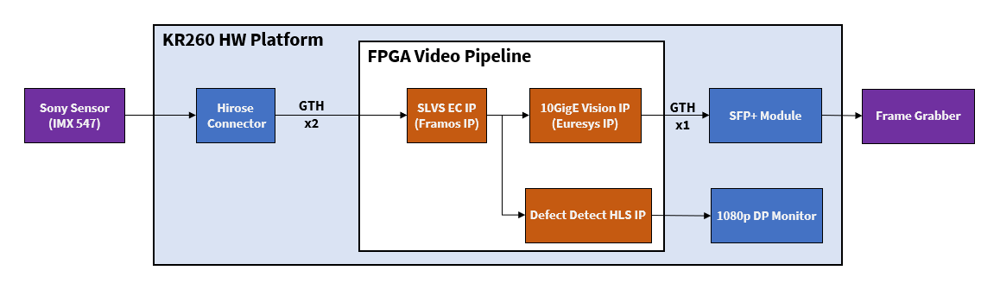

<table>
 <tr>
   <td align="center"><h1>Kria&trade; KR260 Robotics Starter Kit</h1>
   </td>
 </tr>
 <tr>
 <td align="center"><h1>Machine Vision Camera Tutorial</h1>
 
 </td>
 </tr>
</table>

# Overview

The Machine Vision (MV) Camera Application uses a Sony IMX547 sensor module which interfaces to the KR260 with the widely adopted SLVS-EC interface standard.

The FPGA implements a SLVS-EC receiver IP core that is provided by third-party IP company [Framos](https://www.framos.com/framos-slvs-ec-rx-ip-core) and a 10GigE Vision pipeline using a series of IP cores from third-party IP company [Sensor-to-Image](https://www.euresys.com/en/Products/IP-Cores/Vision-Standard-IP-Cores-for-FPGA/GigE-Vision-IP-Core-(2)). As these third-party IPs are not open-source, users must contact the third-party contacts via [Product Inquiry](https://www.xilinx.com/products/app-store/kria/10gige-vision-camera/product-inquiry.html) to create custom and product designs.

The KR260 carrier card has the interface for Euresys 10GigE. 10GigE pipeline consist of multiple IP's like GenDC, Framebuffer, 10GigE MAC etc. GenDC Front-End IP core implements GenICam protocol GenDC layer to be used together with additional machine vision interfacing IP cores provided by Sensor to Image(S2I). Frame Buffer companion IP implements a video frame buffering functionality, packetization, and optional packet resending. The data divided into packets is transmitted to the back-end IP cores implementing particular machine vision interfaces like GigE Vision. Using SFP+ packets will be sent to host machine and displayed in Sphinx GEV Viewer software.

From the capture pipeline, AXI broadcaster gives two outputs to 10gige pipeline and mv-defect detect pipeline respectively.
MV-Defect-Detect application uses Vitis Vision libraries to examine each mango and mark its defects. This helps customers sell their best mangoes to bring in enhanced revenue, and results in a win-win situation for both the customers and the consumers.

The MV-Camera high level pipeline is depicted in below figure,

## Features

1) IMX547 Camera Sensor with 5.1 Mega Pixel/2472 x 2128 pixel with max framerate of 122 fps.

2) Sphinx GEV Viewer to display the live streaming data through 10 GigE pipeline.

3) MV-Defect-Detect acceleration pipelines are to detect defects in the input mango images.

## Next Steps

* [Introduction](introduction.md)
* Go back to the [MV Camera Landing Page](../10gige_vision_camera_landing)

<!---

Licensed under the Apache License, Version 2.0 (the "License"); you may not use this file except in compliance with the License.

You may obtain a copy of the License at http://www.apache.org/licenses/LICENSE-2.0.

Unless required by applicable law or agreed to in writing, software distributed under the License is distributed on an "AS IS" BASIS, WITHOUT WARRANTIES OR CONDITIONS OF ANY KIND, either express or implied. See the License for the specific language governing permissions and limitations under the License.

-->

Copyright&copy; 2022 Xilinx
