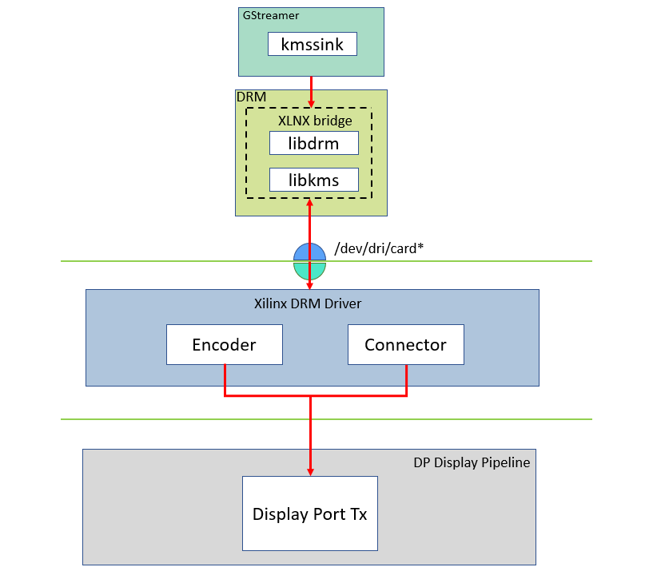

<table>
 <tr>
   <td align="center"><h1>Kria&trade; KR260 Robotics Starter Kit</h1>
   </td>
 </tr>
 <tr>
 <td align="center"><h1>Machine Vision Camera Tutorial</h1>
 
 </td>
 </tr>
</table>

# System Architecture of the Platform

## Architecture Diagram


The following figure illustrates the system architecture of the SOM MV-Defect-Detect application.


## GStreamer Pipeline Changes

Gstreamer provides a simple and effective method to construct media pipelines. Since this example design leverages Gstreamer, the designer can easily modify the provided pipeline to tailor it to the needs of their specific application.

## Deployment

This reference design includes a pre-packaged SD card image to provide user-friendly out-of-box experience for the Vision MV-Defect-Detect Starter Kit. This image should be used first to verify hardware setup and also to demonstrate the capabilities of the SOM. Each of the application examples provided with the kit are delivered as an RPM package group for ease of installation and deployment.

In addition to pre-build SD card image, the design source files are also provided to allow customization. The [Building the Design components](../../building_the_design.md) page documents in detail all the different design sources and steps to re-build the SD card image from scratch, including the Vivado block design and Vitis platform.

The end applications leverage custom Gstreamer plugins for Vitis Vision libraries built using the VVAS framework. These plugins leverage the following libraries:

| Deliveries| Type|Definition|
| ----------- | ----------- |------ |
|libvvas_otsu.so | Kernel Library| Vitis Vision library for the Gaussian + OTSU detector. Preserves edges while smoothening and calculates the optimum threshold between foreground and background pixels. |
| libvvas_preprocess.so |Kernel Library |Vitis Vision library to filter and remove the salt and pepper noise for defect detection. |
|libvvas_cca.so | Kernel Library | Vitis Vision library to determine the defective pixels in the image.|
|libvvas_text2overlay.so|Kernel Library|*OpenCV* software library to calculate the defect density, determine the quality of the mango, and embed text as result into output images.|
|mv-defect-detect | Application Executable | Executable to invoke the whole application with options to choose a source, width, height, framerate, configuration file path, and other parameters.|
____

## Display Pipeline

To support multiple video streams to be displayed on a 1080p monitor, the following solution is explored. The three images from various stages are of size 1920 x 1080. The following figure shows an example background and layout. This is the sample output display for defect detection on a monitor.

The 1080p Monitor displays one of the following outputs:

1. Input Image (output belongs to input GRAY8 data that comes from the file/live source)
2. Binary Image (output belongs to pre-processed pipeline where Vitis Vision library threshold function can perform the thresholding operation on the input image and the Median blur filter acts as a non-linear digital filter that improves noise reduction)
3. text2overlay Image (output belongs to the defected portions along with the defect results)

The text2overlay image along with its embedded text contains:

1. Defect Density (amount of defected portion)
2. Defect Decision (Is Defected: Yes/No)
3. Accumulated Defects - Results by default will be disabled but can be enabled by setting the *is_acc_result* to **1** in the *text2overlay.json* file. To enable, see [Software Accelerator](sw_arch_accel_dd.md).


For a given set of test images, manually calculate accuracy as follows:

1. Each image in the test is pre-labeled by a human. The label indicates if the mango in the image is defected or not.
2. The pre-labeled result of the human is compared with the result given by the Vision SOM MV-Defect Detect system. The number of images that are not detected correctly is found.
3. The ratio of the number of images that are detected correctly to the total number of images in the test, is the accuracy of the MV-Defect-Detect system.

Accumulated defects are the number of defects detected in a certain period of time.

The input raw image of the mango is as shown in the below figure.


The Pre-processed image of the mango is as shown in the below figure.


The Final output of the mango is as shown in the below figure.


> ***Note***: The test mango image is taken from [Cofilab site](http://www.cofilab.com/wp-content/downloads/DB_Mango.rar).

In the PL, the video mixer IP reads the video streams (three images + base layer) from memory and streams it into the DP/HDMI port. AXI-Stream conversion to native video is done using AXI4-Stream to Video IP and Video Timing controller IP.

## Platform

### Media Source Bin GStreamer Plugin

<details>
 <summary><b>Click here to view details</b></summary>


The *mediasrcbin* plugin is designed to simplify the usage of live video capture devices in this design, otherwise the user must take care of initialization and configuration. The plugin is a bin element that includes the standard *v4l2src* GStreamer element. It configures the media pipelines of the supported video sources in this design. The *v4l2src* element inside the *mediasrcbin* element interfaces with the V4L2 Linux framework and the Xilinx VIPP driver through the video device node. The *mediasrcbin* element interfaces with the Media Controller Linux framework through the *v412-subdev* and media device nodes that allows to configure the media pipeline and its sub-devices. It uses the *libmediactl* and *libv4l2subdev* libraries, which provide the following functionality:

* Enumerate entities, pads and links
* Configure sub-devices

  * Set media bus format
  * Set dimensions (width/height)
  * Set frame rate
  * Export sub-device controls

The *mediasrcbin* plugin sets the media bus format and resolution on each sub-device source and sink pad for the entire media pipeline. The formats between pads that are connected through links need to match. Refer to the Media Framework section for more information on entities, pads and links.

</details>

### Kernel Subsystems

To model and control video capture pipelines such as the ones used in this TRD on Linux systems, multiple kernel frameworks and APIs are required to work in concert. For simplicity, we refer to the overall solution as Video4Linux (V4L2) although the framework only provides part of the required functionality. The individual components are discussed in the following sections.

### Driver Architecture

The Video Capture Software Stack figure in the Capture section shows how the generic V4L2 driver model of a video pipeline is mapped to the single-sensor capture pipelines. The video pipeline driver loads the necessary sub-device drivers and registers the device nodes it needs, based on the video pipeline configuration specified in the device tree. The framework exposes the following device node types to user space to control certain aspects of the pipeline:

* Media device node: ```/dev/media*```
* Video device node: ```/dev/video*```
* V4L2 sub-device node: ```/dev/v4l-subdev*```

### Media Framework

<details>
 <summary><b>Click here to view details</b></summary>

The main goal of the media framework is to discover the device topology of a video pipeline and to configure it at run-time. To achieve this, pipelines are modeled as an oriented graph of building blocks called entities connected through pads. An entity is a basic media hardware building block. It can correspond to a large variety of blocks such as physical hardware devices (e.g. image sensors), logical hardware devices (e.g. soft IP cores inside the PL), DMA channels or physical connectors. Physical or logical devices are modeled as sub-device nodes and DMA channels as video nodes. A pad is a connection endpoint through which an entity can interact with other entities. Data produced by an entity flows from the entity's output to one or more entity inputs. A link is a point-to-point-oriented connection between two pads, either on the same entity or on different entities. Data flows from a source pad to a sink pad. A media device node is created that allows the user space application to configure the video pipeline and its sub-devices through the *libmediactl* and *libv4l2subdev* libraries. The media controller API provides the following functionality:

  * Enumerate entities, pads and links
  * Configure pads

    * Set media bus format
    * Set dimensions (width/height)

  * Configure links
  * Enable/disable
  * Validate formats

  The following figure shows the media graphs for video capture pipeline as generated by the *media-ctl* utility. The sub devices are shown in green with their corresponding control interface base address and sub device node in the center. The numbers on the edges are pads and the solid arrows represent active links. The yellow boxes are video nodes that correspond to DMA channels, in this case write channels (outputs).

 

</details>

 ### Video IP Drivers

 <details>
 <summary><b>Click here to view details</b></summary>


 Xilinx adopted the V4L2 framework for most of its video IP portfolio. The currently supported video IPs and corresponding drivers are listed under V4L2. Each V4L driver has a sub-page that lists driver-specific details and provides pointers to additional documentation. The following table provides a quick overview of the drivers used in this design.

 | Linux Driver| Function|
| ----------- | ----------- |
| Xilinx Video Pipeline (XVIPP)    |   * Configures video pipeline and register media, video and sub-device nodes |
| |* Configures all entities in the pipeline and validate links|
| | * Configures and controls DMA engines (Xilinx Video Framebuffer Write)|
|AP1302 Video Image Signal Processing (ISP)| * Sets the media bus format and resolution for the sensor output pad|
|| * Set the media bus format and resolution for ISP input and output pads|
|| * Provides ISP control parameters for setting: gamma, gain, contrast, etc.|

____

</details>

### DP Tx Display

<details>
 <summary><b>Click here to view details</b></summary>

Linux kernel and user-space frameworks for display and graphics are intertwined and the software stack can be quite complex with many layers and different standards / APIs. On the
kernel side, the display and graphics portions are split with each having their own APIs. However, both are commonly referred to as a single framework, namely DRM/KMS. This split is advantageous, especially for SoCs that often have dedicated hardware blocks for display and graphics. The display pipeline driver responsible for interfacing with the display uses the kernel mode setting (KMS) API and the GPU responsible for drawing objects into memory uses the direct rendering manager (DRM) API. Both APIs are accessed from user-space through a single device node.



</details>

### Direct Rendering Manager

The Direct Rendering Manager (DRM) is a subsystem of the Linux kernel responsible for interfacing with a GPU. DRM exposes an API that user space programs can use to send
commands and data to the GPU. The ARM Mali driver uses a proprietary driver stack that is discussed in the next section. Therefore, this section focuses on the common infrastructure portion around memory allocation and management that is shared with the KMS API.

### Driver Features

The Xilinx DRM driver uses the GEM memory manager and implements DRM PRIME buffer sharing. PRIME is the cross-device buffer sharing framework in DRM. To user-space, PRIME buffers are DMABUF-based file descriptors. The DRM GEM/CMA helpers use the CMA allocator as a means to provide buffer objects that are physically contiguous in memory. This is useful for display drivers that are unable to map scattered buffers via an IOMMU. Frame buffers are abstract memory objects that provide a source of pixels to scan out to a CRTC. Applications explicitly request the creation of frame buffers through the DRM_IOCTL_MODE_ADDFB(2) ioctls and receive an opaque handle that can be passed to the KMS CRTC control, plane configuration and page flip functions.

### Kernel Mode Setting

Mode setting is an operation that sets the display mode including video resolution and refresh rate. It was traditionally done in user-space by the X-server that caused several issues due to accessing low-level hardware from user-space, which if done wrong, can lead to system instabilities. The mode setting API was added to the kernel DRM framework, hence the name Kernel Mode Setting. The KMS API is responsible for handling the frame buffer and planes, setting the mode, and performing page-flips (switching between buffers). The KMS device is modeled as a set of planes, CRTCs, encoders, and connectors as shown in the top half of the DP Tx display. The bottom half of that figure shows how the driver model maps to the physical hardware components inside the PS DP Tx display pipeline.

### Encoder

An encoder takes pixel data from a CRTC and converts it to a format suitable for any attached connectors. There are many different display protocols defined, such as HDMI or DisplayPort. The PS display pipeline has a DisplayPort transmitter built in. The encoded video data is then sent to the serial I/O unit (SIOU) which serializes the data using the gigabit transceivers (PS GTRs) before it goes out via the physical DP connector to the display. The PL display pipeline uses a HDMI transmitter which sends the encoded video data to the Video PHY. The Video PHY serializes the data using the GTH transceivers in the PL before it goes out via the HDMI Tx connector.

### Connector

The connector models the physical interface to the display. Both DisplayPort and HDMI protocols use a query mechanism to receive data about the monitor resolution, and refresh rate by reading the extended display identification data (EDID) (see VESA Standard) stored inside the monitor. This data can then be used to correctly set the CRTC mode. The DisplayPort supports hot-plug events to detect if a cable has been connected or disconnected as well as handling display power management signaling (DPMS) power modes.

### Libdrm

The framework exposes two device nodes per display pipeline to user space: the ```/dev/dri/card*``` device node and an emulated ```/dev/fb*``` device node for backward compatibility with the legacy *fbdev* Linux framework. The latter is not used in this design. *libdrm* was created to facilitate the interface of user space programs with the DRM subsystem. This library is merely a wrapper that provides a function written in C for every ioctl of the DRM API, as well as constants, structures and other helper elements. The use of *libdrm* not only avoids exposing the kernel interface directly to user space but presents the usual advantages of reusing and sharing code between programs.

## Next Steps

* [Software Accelerator](sw_arch_accel_dd.md)
* Go back to the [Application Deployment](app_deployment.md)

<!---

Licensed under the Apache License, Version 2.0 (the "License"); you may not use this file except in compliance with the License.

You may obtain a copy of the License at
[http://www.apache.org/licenses/LICENSE-2.0](http://www.apache.org/licenses/LICENSE-2.0)


Unless required by applicable law or agreed to in writing, software distributed under the License is distributed on an "AS IS" BASIS, WITHOUT WARRANTIES OR CONDITIONS OF ANY KIND, either express or implied. See the License for the specific language governing permissions and limitations under the License.

-->

<p align="center"><sup>Copyright&copy; 2022 Xilinx</sup></p>