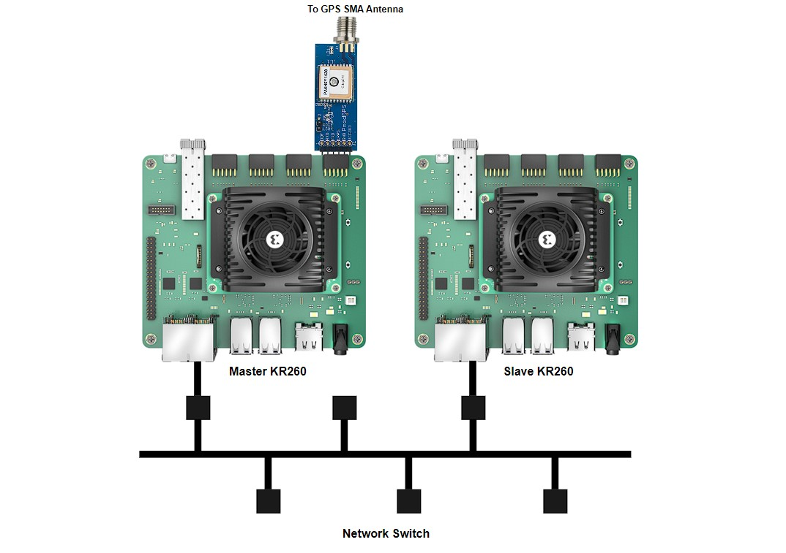
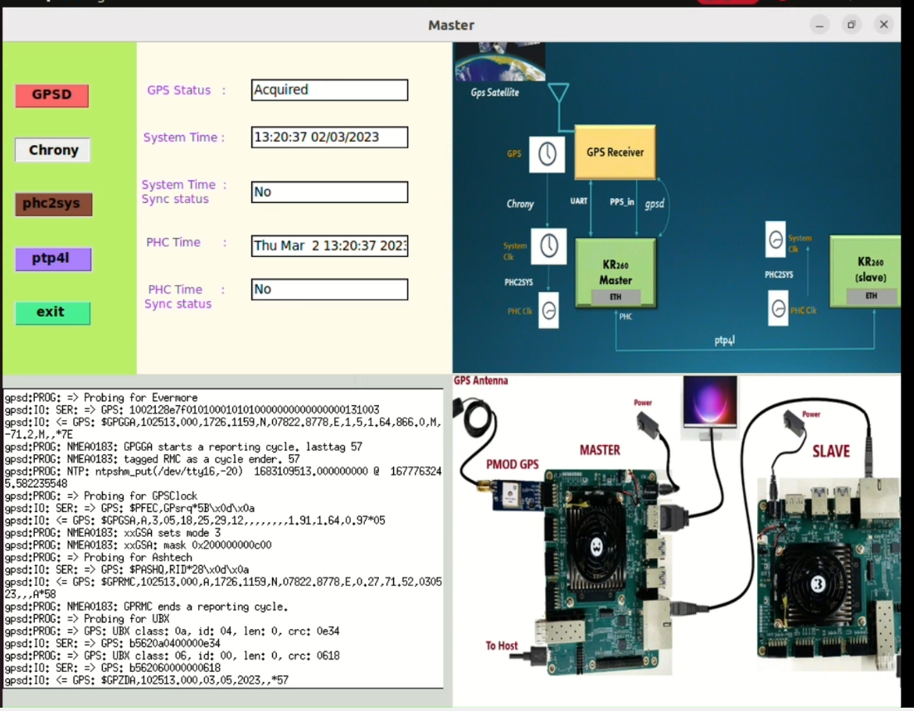
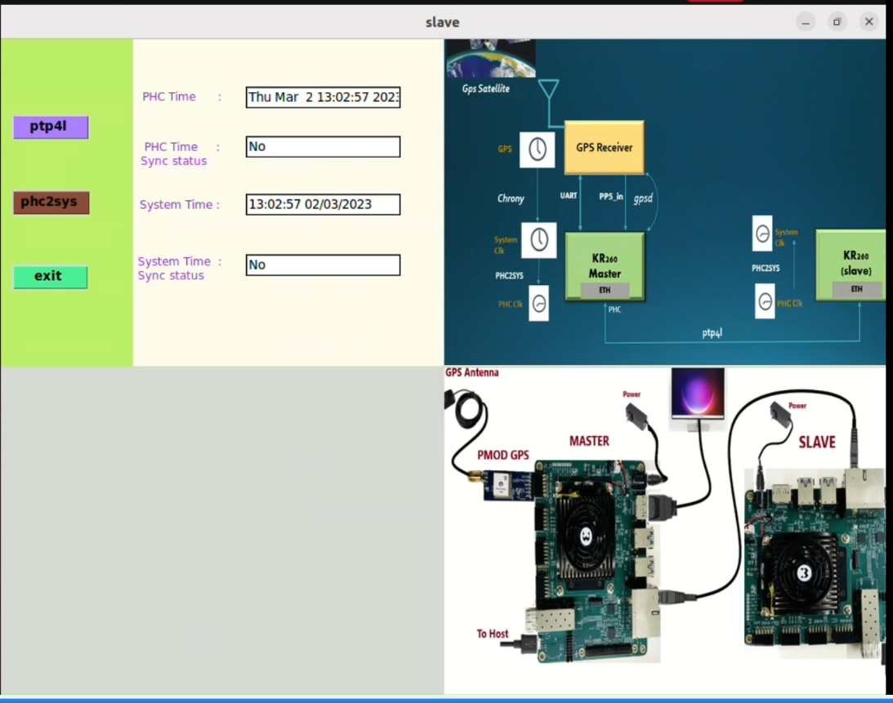

<table class="sphinxhide">
 <tr>
   <td align="center"><h1> Kria&trade; KR260 Precision time management <br> Precision time management using Digilent GPS PMOD Receiver</h1>
   </td>
 </tr>
 <tr>
 <td align="center"><h1>Setting up the Board and Application Deployment</h1>

 </td>
 </tr>
</table>

# Board Setup and Application Deployment

## Introduction

This document shows the steps to setup the board and run the GPS_1588_PTP application.

## Pre-requisite

### Hardware Requirements

* KR260 Robotics Starter Kit -2 Nos
* KR260 Power Supply & Adapter (Included with KR260 Robotics Starter Kit)
* Cat-5e Ethernet Cables - 3 Nos(Included with KR260 Robotics Starter Kit)
* USB-A to micro-B Cable (Included with KR260 Robotics Starter Kit)
* 16GB MicroSD Cards (Included with KR260 Robotics Starter Kit)
* Digilent Pmod - GPS Receiver (Sold Separately [here](https://digilent.com/shop/pmod-gps-gps-receiver/))
* GPS SMA Antenna (Sold Separately [here](https://www.amazon.com/Bingfu-Waterproof-Navigation-Connector-Tracking/dp/B07R7RC96G/ref=sr_1_2?keywords=gps%2Bsma%2Bantenna&qid=1683483410&sprefix=GPS%2BSMA%2B%2Caps%2C348&sr=8-2&th=1))
* SMA Connector Receptacle (Sold Separately [here](https://www.digikey.ca/en/products/detail/linx-technologies-inc/CONSMA003-062/1577208))
* 3V 12.5 mm coin cell battery (Optional, Sold Separately [here](https://www.amazon.com/Energizer-CR2032-Batteries-Lithium-Battery/dp/B0002RID4G/ref=sr_1_1?crid=16OVOB5DI97YX&keywords=3v+1.2+mm+coin+battery&qid=1683866588&sprefix=3v+1.2+mmcoin+battery%2Caps%2C289&sr=8-1))
* Monitor with DP port, keyboard and mouse (Optional - for running application using GUI)

## Hardware setup with 2 KR260 boards

The setup used for deploying the application is shown below:

1. Connect the two boards to the same ethernet network via J10C RJ45 PS GEM1 port. Assume one of the KR260 as Master and other as Slave. 
1. Connect JTAG ports of both boards to the host PC
1. Solder the SMA Connector Receptacle on the header J4 of the Digilent PMOD GPS Receiver
1. Attach the SMA GPS antenna to SMA connector Receptacle
1. Optionally add coin cell to GPS module to reduce the amount of time that it takes to acquire the first positional fix
1. On the Master KR260 board, connect the Digilent PMOD GPS Receiver into the PMOD1 connector, bottom row (J2, 2)
1. Connect Display port of the both Master and Slave to Monitors to utilize GNOME Desktop
1. Power on both the boards and follow the next steps in "Booting up Linux"



## Booting up Linux

Go through [Booting Kria Starter Kit Linux](../../kria_starterkit_linux_boot.md) to complete minimum setup required to boot Linux on both Master and Slave KR260 boards before continuing with instructions in this page.
> **Note:** Make sure you are using the latest KR260 Starter Kit Boot firmware (2022.2_update 1 or later), otherwise this application may not work.

## Downloading and Loading Application Firmware on Master

Get the latest GPS_1588_PTP firmware package:

1. Search package feed for packages compatible with KR260

    ```bash
    sudo apt search xlnx-firmware-kr260
    ```

    An example output is show below

    ```bash
    ubuntu@kria:~$ sudo apt search xlnx-firmware-kr260
    [sudo] password for ubuntu:
    Sorting... Done
    Full Text Search... Done
    xlnx-firmware-kr260-bist/jammy 0.9~beta1-0xlnx1 arm64
      FPGA firmware for Xilinx boards - kr260 bist application

    xlnx-firmware-kr260-gps-1588-ptp/jammy,now 0.9~beta1-0xlnx1 arm64 
      FPGA firmware for Xilinx boards - kr260 gps-1588-ptp application

    xlnx-firmware-kr260-mv-camera/jammy 0.9~beta1-0xlnx1 arm64
      FPGA firmware for Xilinx boards - kr260 mv-camera application

    xlnx-firmware-kr260-perception/jammy 0.9~beta1-0xlnx1 arm64
      FPGA firmware for Xilinx boards - kr260 perception application

    xlnx-firmware-kr260-tsn-rs485pmod/jammy 0.9~beta1-0xlnx1 arm64
      FPGA firmware for Xilinx boards - kr260 tsn-rs485pmod application
    ```

1. Install firmware binaries

    ```bash
    sudo apt install xlnx-firmware-kr260-gps-1588-ptp
    ```
1. Dynamically load the application firmware:

    The firmware consist of bitstream, device tree overlay (dtbo) file. The firmware is loaded dynamically on user request once Linux is fully booted. The xmutil utility can be used for that purpose.

    * Show the list and status of available acceleration platforms :

        ```bash
        sudo xmutil listapps
        ```

    * load `kr260-gps-1588-ptp` firmware

        ```bash
        sudo xmutil unloadapp   ## Unload existing firmware
        sudo xmutil loadapp kr260-gps-1588-ptp  ## load kr260-gps-1588-ptp
        ```
	
## Installing application

* On Master
    ```bash
     # Remove incompatible packages
     sudo apt remove systemd-timesyncd
     # Install gps-1588-ptp applications below
     # Confirm with "Y" when prompted to install new or updated packages.
     sudo apt install gps-1588-ptp-master
    ```
* On Slave
    ```bash
     # Install gps-1588-ptp applications below
     # Confirm with "Y" when prompted to install new or updated packages.
     sudo apt install gps-1588-ptp-slave
    ```
> Note: `linuxptp`, `gpsd-tools`,`gpsd-clients`,`linuxptp`,`chrony`,`python3-tk`, `ppstools` are dependencies to GPS_1588_PTP applications that are installed automatically with above commands.

#### Set PATH to application bin

* Add following path in environment variable for Xilinx demo application on both Mater and Slave. This application using linux utilities which are only accessible from sudo user. Its recommended to switch to root user with `sudo -i` before proceeding to below commands
    ```bash
     sudo -i
     export PATH=${PATH}:/opt/xilinx/kr260-gps-1588-ptp/bin/
    ```
> **Note:** consider adding the above commands to ~/.bashrc to avoid executing on every new shell created.

## Verify GPS pulse on Master

1. Run the below command to get the pps node corresponding to the GPS module
    ```bash
    sudo dmesg | grep axi:pps_axi_gpio_0 | tail -1
    ```
    The command output is as follows. From this output, we have the pps2 as the PPS source for GPS module

    ```bash
    ubuntu@kria:~$ sudo dmesg |  grep axi:pps_axi_gpio_0 | tail -1
    [67280.282986] pps pps2: new PPS source axi:pps_axi_gpio_0.-1
    ```
2. Run the below command to verify if the GPS receiver is locked
    ```bash
    sudo ppstest /dev/pps2
    ```

    when the GPS Signal is acquired, you receive one PPS pulse every second and the terminal is as shown below
    ```bash
	ubuntu@kria:~$ sudo ppstest /dev/pps2
	trying PPS source "/dev/pps2"
	found PPS source "/dev/pps2"
	ok, found 1 source(s), now start fetching data...
	source 0 - assert 1683625047.055531540, sequence: 115 - clear 0.000000000, sequence: 0
	source 0 - assert 1683625048.055512261, sequence: 116 - clear 0.000000000, sequence: 0
	source 0 - assert 1683625049.055506572, sequence: 117 - clear 0.000000000, sequence: 0
	source 0 - assert 1683625050.055499274, sequence: 118 - clear 0.000000000, sequence: 0
    ```
    > **Note:**: Replace pps2 with the corresponding output from step1

    > **Note:**: Make sure the LED on the GPS Module is off while running the application. If its blinking, it means the GPS is not locked and you will not get any PPS signal. 


## Steps to configure linux utilities to use GPS device as clock source on Master

1. Update the gpsd configuration files with the below content 
    ```bash
    sudo cp /etc/default/gpsd /etc/default/gpsd.bak
    sudo sh /opt/xilinx/kr260-gps-1588-ptp/configs/gpsd.sh 
    ```

1. Update the configuration for gpsd services
    ```bash
    sudo cp /lib/systemd/system/gpsd.service /lib/systemd/system/gpsd.service.bak
    sudo cp /opt/xilinx/kr260-gps-1588-ptp/configs/gpsd.service /lib/systemd/system/gpsd.service
    ```

1. Update the gpsd.socket file
    ```bash
    sudo cp /lib/systemd/system/gpsd.socket /lib/systemd/system/gpsd.socket.bak
    sudo cp /opt/xilinx/kr260-gps-1588-ptp/configs/gpsd.socket /lib/systemd/system/gpsd.socket
    ```

1. Update the chrony configuration 
    ```bash
    sudo cp /etc/chrony/chrony.conf /etc/chrony/chrony.conf.bak
    sudo sh /opt/xilinx/kr260-gps-1588-ptp/configs/chrony.sh
    ```
    > **Note:**: There configuration steps can be skipped if they are done previously and there is no change in the PPS node.


## Run Out Of Box Applications

The GPS_1588_PTP application will Synchronize the linux platform System Time with GPS Time and distribute the system time to an another KR260 board using linux PTP tools. The application uses gpsd, chrony daemons and linux ptp utilities.


The application provides 3 ways to interact.
1. Self-explained Jupyter Notebooks
1. Automated shell scripts
1. Simple python GUI on Gnome-Desktop

> **Note**: Ensure to load the GPS_1588_PTP firmware on Master (refer to [step-3](#downloading-and-loading-application-firmware-on-master) from 'Downloading and Loading Application Firmware on Master') using `xmutil loadapp kr260-gps-1588-ptp` before testing example application. If the firmware is already loaded, ignore this step and proceed. 

###  Via Jupyter Notebook

* User need to run following command to install the package shipped notebooks which reside in `/opt/xilinx/kr260-gps-1588-ptp/share/notebooks` to the folder `/home/<user>/notebooks`.

  ``` gps-1588-ptp-install.py ```

  This script also provides more options to install the notebook of current application to specified location.

```
usage: gps-1588-ptp-install [-h] [-d DIR] [-f]

Script to copy gps-1588-ptp Jupyter notebook to user directory

options:
  -h, --help         show this help message and exit
  -d DIR, --dir DIR  Install the Jupyter notebook to the specified directory.
  -f, --force        Force to install the Jupyter notebook even if the destination directory exists.

```


* On Master, run the below command to launch the notebook. Open the URL in the browser and open master.ipynb file. Follow the steps in the notebook to sync the master with GPS time

    ```bash
    sudo jupyter notebook --allow-root --ip=<eth0-ip-address> &
    ```

* On Slave, run the below command to launch the notebook. Open the URL in the browser and open slave.ipynb file. Follow the steps in the notebook to sync the slave with master

    ```bash
    sudo jupyter notebook --allow-root --ip=<eth0-ip-address> &
    ```

### Via Terminal

* On Master, run the below command to sync the master with GPS time
    ```bash
    sudo gps-1588-ptp-master
    ``` 
  * Initially the Application prints the current system time on terminal using `timedatectl` as shown below. It shows the sync status as no. 
    ```bash
                       Local time: Mon 2023-03-20 14:36:08 UTC
                   Universal time: Mon 2023-03-20 14:36:08 UTC
                         RTC time: Thu 1970-01-01 00:04:17
                        Time zone: Etc/UTC (UTC, +0000)
        System clock synchronized: no
                      NTP service: inactive
                  RTC in local TZ: no
    ```
  * Later it triggers the GPSD and chrony services to synchronize the system time with the GPS time. The application prints the updated chrony sources which can be verified from the output. 
  
    ```bash
                                  MS Name/IP address         Stratum Poll Reach LastRx Last sample
                    ===============================================================================
                    #* GPS                           0   4   177    17  +1922ns[  +15us] +/- 5484ns
                    #- NMEA                          0   4   177    19    -26ms[  -26ms] +/-  101ms
                    ^? prod-ntp-4.ntp1.ps5.cano>     0   7     0     -     +0ns[   +0ns] +/-    0ns
                    ^? prod-ntp-5.ntp4.ps5.cano>     0   7     0     -     +0ns[   +0ns] +/-    0ns
                    ^? prod-ntp-3.ntp1.ps5.cano>     0   7     0     -     +0ns[   +0ns] +/-    0ns
                    ^? pugot.canonical.com           0   7     0     -     +0ns[   +0ns] +/-    0ns
                    ^? alphyn.canonical.com          0   7     0     -     +0ns[   +0ns] +/-    0ns
                    ^? 157.245.102.2                 0   7     0     -     +0ns[   +0ns] +/-    0ns
                    ^? ntp-mumbai.gombadi.com        0   7     0     -     +0ns[   +0ns] +/-    0ns
                    ^? 139.59.55.93                  0   7     0     -     +0ns[   +0ns] +/-    0ns
                    ^? 144.24.146.96                 0   7     0     -     +0ns[   +0ns] +/-    0ns
                    ^? ntp6.mum-in.hosts.301-mo>     0   7     0     -     +0ns[   +0ns] +/-    0ns
                    ^? ntp5.mum-in.hosts.301-mo>     0   7     0     -     +0ns[   +0ns] +/-    0ns
                    ^? 165.22.211.200                0   7     0     -     +0ns[   +0ns] +/-    0ns
                    ^? ec2-13-126-27-131.ap-sou>     0   7     0     -     +0ns[   +0ns] +/-    0ns

                    Reference ID    : 47505300 (GPS)
                    Stratum         : 1
                    Ref time (UTC)  : Mon Jun 05 06:58:55 2023
                    System time     : 0.000000001 seconds slow of NTP time
                    Last offset     : +0.000013462 seconds
                    RMS offset      : 0.001221735 seconds
                    Frequency       : 8.821 ppm slow
                    Residual freq   : +0.126 ppm
                    Skew            : 0.101 ppm
                    Root delay      : 0.000000001 seconds
                    Root dispersion : 0.000031861 seconds
                    Update interval : 16.0 seconds
    ```
    > **Note**: The above output shows that, Chrony is using GPS as its Reference ID.
           
  * The sync status can be verified from the output of `timedatectl`, printed on the terminal.

    ```bash
                        Local time: Mon 2023-06-05 06:59:14 UTC
                    Universal time: Mon 2023-06-05 06:59:14 UTC
                          RTC time: Mon 2023-06-05 06:59:14
                         Time zone: Etc/UTC (UTC, +0000)
         System clock synchronized: yes
                       NTP service: active
                   RTC in local TZ: no
    ```
  * The application then triggers phc2sys to update the PHC time with system time.
    
    ```bash
    ***** Before triggering phc2sys ******
    phc_ctl[1116.247]: clock time is 1679323830.780230286 or Mon Mar 20 14:50:30 2023

    ***** After triggering phc2sys the PHC time is updated with system time ******
    phc_ctl[1121.254]: clock time is 1685948359.063594014 or Mon Jun  5 06:59:19 2023

    ```

   * start ptp4l utility as Master, to synchronize the slave(s) (PHC time) 


* On Second KR260 Board acting as slave, run the below command to sync the slave PHC time with Master PHC time.
    ```bash
    sudo gps-1588-ptp-slave
    ```
    * Initially the Application prints the current system time and PHC time on terminal using `timedatectl && phc_ctl /dev/ptp1 --get` as shown below. It shows the sync status as no. 
    ```bash
                       Local time: Mon 2023-03-20 14:36:08 UTC
                   Universal time: Mon 2023-03-20 14:36:08 UTC
                         RTC time: Thu 1970-01-01 00:04:17
                        Time zone: Etc/UTC (UTC, +0000)
        System clock synchronized: no
                      NTP service: inactive
                  RTC in local TZ: no

                  phc_ctl[2241.152]: clock time is 1679324955.989310878 or Mon Mar 20 15:09:15 2023
    ```
    * Then it starts the ptp4l running as slave to align the PHC time from the best master on network.
        
        ```bash
            ********************** Ptp4l Application is Running ***************************
            *************** PHC clock Synchronized with Master node PHC clock***************
            phc_ctl[2261.160]: clock time is 1685949488.747679092 or Mon Jun  5 07:18:08 2023
        ```
    * Next it triggers the phc2sys, to synchronize the slave system time with its PHC time. The application prints the output of `timedatectl` before and after running phc2sys to show the sync status
        ```bash
                            Local time: Mon 2023-03-20 15:09:36 UTC
                        Universal time: Mon 2023-03-20 15:09:36 UTC
                              RTC time: Thu 1970-01-01 00:37:44
                             Time zone: Etc/UTC (UTC, +0000)
             System clock synchronized: no
                           NTP service: active
                       RTC in local TZ: no     
        ```
        After phc2sys application starts ,updated system time showing below:
        ```bash
                            Local time: Mon 2023-06-05 07:18:13 UTC
                        Universal time: Mon 2023-06-05 07:18:13 UTC
                              RTC time: Mon 2023-06-05 07:18:13
                             Time zone: Etc/UTC (UTC, +0000)
             System clock synchronized: yes
                           NTP service: active
                       RTC in local TZ: no
        ```
### Via Ubuntu GUI

* On Master, open the terminal in Ubuntu GUI and run the below command to the open GUI

    ```bash
    sudo gps-1588-ptp-master -gui
    ``` 
	Run the application by clicking on the buttons one after other. 
	

>**Note** Chrony will take 2-3 mins to sync its sources and when this process is going on, the button turns white, user needs to wait until this process is done. 
		
* On Slave, open the terminal in Ubuntu GUI and run the below command to the open GUI
        
    ```bash
    sudo gps-1588-ptp-slave -gui
    ```      
	Run the application by clicking on the buttons one after other. 

	
		

>**Note:**  Make sure to run the slave Application, after running the Application on the master side   

## Next Steps

* [Known Issues](known-issues.md)
* [Software Architecture of the Platform](sw_arch_platform.md)
* Go back to the [KR260 SOM GPS-1588-PTP App Start Page](../gps_1588_ptp_precision_time_mgmt)

<!---

Licensed under the Apache License, Version 2.0 (the "License"); you may not use this file except in compliance with the License.

You may obtain a copy of the License at http://www.apache.org/licenses/LICENSE-2.0.


Unless required by applicable law or agreed to in writing, software distributed under the License is distributed on an "AS IS" BASIS, WITHOUT WARRANTIES OR CONDITIONS OF ANY KIND, either express or implied. See the License for the specific language governing permissions and limitations under the License.

-->

<p class="sphinxhide" align="center">Copyright (C) 2023 Advanced Micro Devices, Inc.</p>
