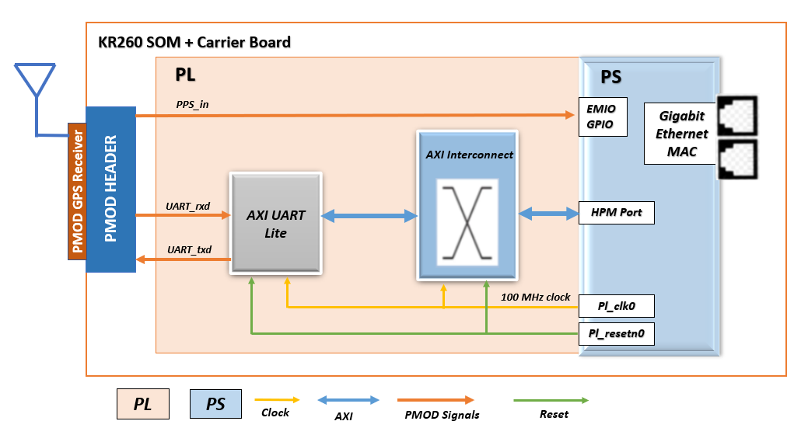

# Hardware Architecture of the Platform

## Introduction

 This section describes the hardware block design components implemented in Programmable Logic (PL).

 The PL design read data from the PMOD GPS Receiver to get the GPS time from Global Navigation Satellite System (GNSS). The platform uses AXI UART Lite IP to interface with the PMOD Receiver's UART interface for getting the GPS data in NMEA format. The 1PPS signal from the PMOD receiver is connected to PS GPIO via EMIO pins. Gigabit Ethernet MAC (GEM) Controller (GEM0,GEM1) is enabled in the PS to transmit, receive PTP packets or ethernet traffic. 
 
 The following figure shows the top-level hardware architecture of the reference design.

### PMOD GPS Receiver

The following figure shows the PMOD GPS receiver

GPS receiver has 
1. UART interface : Provides GPS time and GPS Coordinate data in NMEA format. 
2. 1PPS output    : A pulse is sent out at every one second . 

For more information on the Digilent PMOD Receiver <a href="https://digilent.com/reference/_media/pmod:pmod:PmodGPS_rm.pdf"> PMOD GPS Receiver Reference Manual</a>

## AXI UART LITE

The LogiCORE™ IP AXI UART Lite core converts AXI4 Lite register transactions to RS232 signaling. PMOD GPS receiver provides GPS time and GPS Coordinate data in NMEA format using the embedded UART interface. AXI UART LITE IP has UART controller to read data from PMOD receiver and convert it into AXI4 Lite register transactions to be read by the PS.

For more information on the IP refer to <a href="https://docs.xilinx.com/v/u/en-US/pg142-axi-uartlite">PG 142</a>

## Clocks and Resets

### Clocks

The following table identifies the main clocks of the PL design, the source, clock frequency, and the function.

| Clock      | Clock Source  | Clock Frequency     | Function |
| :---       |    :----:     |         :---:       | :-----  |
| pl_clk_0 | PL Fabric Clock | 100 MHz | Clock source for AXI Interconnect, AXI UART lite and AXI GPIO  |

### Resets

The following table summarizes the resets used in this design.

| Reset Source | Function  |
| :---         |    :----  |
|pl_resetn0|PL reset for proc_sys_reset modules |
|rst_clk_wiz_100M|Synchronous resets w.r.t 100M clock domain for AXI interconnect, AXI UART lite and AXI GPIO.     |

## Resource Utilization

The resource utilization numbers of the platform post implementation is reported in the table below.

| Resource  | Utilization  | Available  | Utilization %  |
| :---      |    :----     | :---       |    :----       |
|LUT|410|117120|0.35|
|LUTRAM|62|57600|0.11|
|FF|558|234240|0.24|
|IO|5|189|2.65|
|BUFG|3|352|0.85|
|MMCM|1|4|25|

## Next Steps

* [Application Deployment](app_deployment.md)
* [Software Architecture of the Platform](sw_arch_platform.md)
* Go back to the [KR260 SOM GPS-1588-PTP App Start Page](../gps_1588_ptp_precision_time_mgmt)

<!---

Licensed under the Apache License, Version 2.0 (the "License"); you may not use this file except in compliance with the License.

You may obtain a copy of the License at http://www.apache.org/licenses/LICENSE-2.0.

Unless required by applicable law or agreed to in writing, software distributed under the License is distributed on an "AS IS" BASIS, WITHOUT WARRANTIES OR CONDITIONS OF ANY KIND, either express or implied. See the License for the specific language governing permissions and limitations under the License.

-->

Copyright (C) 2023 Advanced Micro Devices, Inc.

