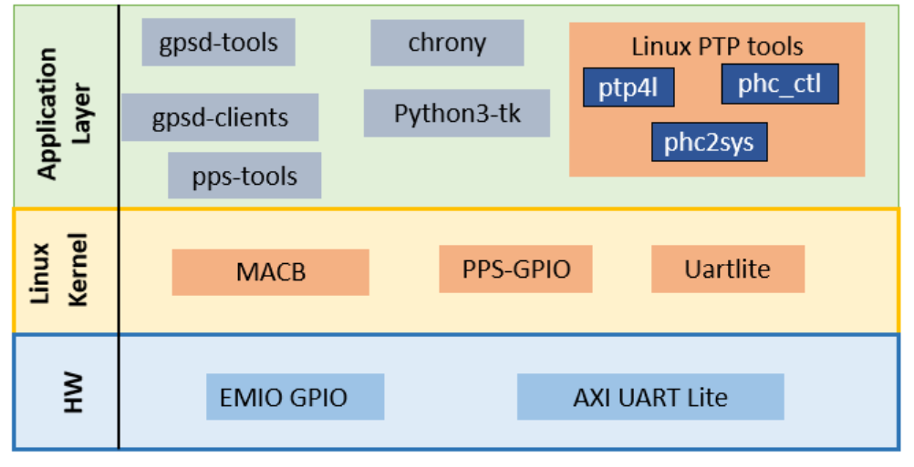

# Software Architecture of the Platform

## Introduction

This section describes software components involved in the design and their relation with each other. The application requires hw platform as described in [Hardware Architecture of the Platform](./hw_arch_platform.md) for the stack explained in this section to work.

Following diagram illustrate top level architecture and arrangement of various software components




- Operating System: Xilinx Linux kernel + Ubuntu env
  - Drivers:
    - Uart lite
    - PPS-GPIO 
- Applications
  - gpsd 
  - chrony
  - Linux ptp utilities for clock sync
  - pps-tools
  
  The details of each individual component can be obtained though the reference at the end of this section. The scope of this document is with respect to what is being demonstrated through the example application.

### Gpsd 
  Gpsd is a service Daemon for establishing the connection to the external GPS Receiver,This Daemon is configured to read and process UBX protocol messages through the Uart interface on the master node.The results are provided via an IPC shared memory buffer.

### Chrony
  Chrony is a daemon for synchronization of the system clock. It can synchronize the clock with NTP servers, reference clocks (e.g. a GPS receiver),it is configured to work with shared memory segment and also process the PPS (/dev/ppsX) interface.

### Linux ptp utilities:
#### Phc2sys
  phc2sys establishes the synchronization between the PHC and system clocks ,the actual synchronization direction depends on the role of the node.
### ptp4l
  ptp4l implements the PTP network protocol and aligns the PHC clocks on the both master and slave.

### pps-tools
  It is a tool to monitor PPS timestamps from pps device.


## GPS-1588-PTP Application
  By using this application,system time of the embedded platform is synchronized with gps time using ubuntu daemons and linux-ptp utilities. The system time of the master side is distributed to the connected slaves in the network.

### How Synchronization works
  The synchronization starts by synchronizing the system time of the Master KR260 board w.r.t GPS time using the Network Time Protocol (NTP) daemon chrony. In our case, we have configured two sources from GPS receiver.

  1. GPS receiver UART interface as a source of GPS time via AXI Uart lite driver.
  1. GPS Receiver PPS input as PPS source registered as pps-gpio driver to correct the system time 
  w. r.t the high precision PPS pulse.


  Using the Linux PTP tools phc2sys the Master side GEM TSU timer is aligned w.r.t the system time.
  In the slave side, ptp4l first synchronize the GEM PHC with the mater side PHC using PTP packets via the GEM PS ethernet interface. followed by that, the slave board system clock is synchronized to PHC clock using the phc2sys tool. Now the synchronization direction is from PHC clock to system clock.


### Linux driver
#### Uart lite
  This component contains the implementation of the Uart Lite component which is the driver for the Xilinx UART Lite device. This UART is a minimal hardware implementation with minimal features. Most of the features, including baud rate, parity, and number of data bits are only configurable when the hardware device is built, rather than at run time by software.
  This driver requires different compatibility string and hence the original device tree node's compatible string needs to be overwritten as below
  ```text
  &axi_uartlite_0 {
        compatible = "xlnx,axi-uartlite-2.0","xlnx,xps-uartlite-1.00.a";
  };
```
#### PPS-GPIO
  This driver is derived from the current parallel port PPS generator and provides a PPS signal through a GPIO pin specified in the device tree. PPS means "pulse per second" and a PPS source is just a device which provides a high precision signal each second so that an application can use it to adjust system clock time.  
  For details of the device tree for the driver can be found in the kernel documentation at [linux-xlnx](https://github.com/Xilinx/linux-xlnx/blob/master/Documentation/devicetree/bindings/pps/pps-gpio.txt)

  ```text
		pps_axi_gpio_0 {
                pinctrl-names = "default";
                gpios = <&gpio 78 0 0 >;
                compatible = "pps-gpio";
                };
  ```


## References

- [Xilinx Uart lite Driver](https://xilinx-wiki.atlassian.net/wiki/spaces/A/pages/18842249/Uartlite+Driver)
- [macb driver](https://xilinx-wiki.atlassian.net/wiki/spaces/A/pages/18841740/Macb+Driver)
- [gpsd](https://gpsd.io/)
- [chrony](https://chrony.tuxfamily.org/index.html)
- [linuxptp](https://linuxptp.nwtime.org/documentation/)

### Next Steps

- [Application Deployment](app_deployment.md)
- [Hardware Architecture of the Platform](hw_arch_platform.md)
- Go back to the [KR260 SOM GPS-1588-PTP App Start Page](../gps_1588_ptp_precision_time_mgmt)

<!---

Licensed under the Apache License, Version 2.0 (the "License"); you may not use this file except in compliance with the License.

You may obtain a copy of the License at http://www.apache.org/licenses/LICENSE-2.0.

Unless required by applicable law or agreed to in writing, software distributed under the License is distributed on an "AS IS" BASIS, WITHOUT WARRANTIES OR CONDITIONS OF ANY KIND, either express or implied. See the License for the specific language governing permissions and limitations under the License.

-->

<p class="sphinxhide" align="center">Copyright (C) 2023 Advanced Micro Devices, Inc.</p>
