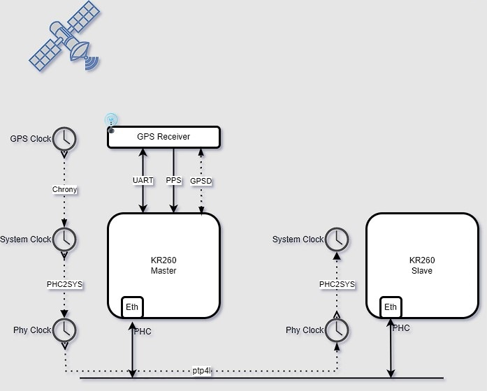

##################################################
Precision time Management
##################################################

*******************************
Overview
*******************************

GPS-1588-PTP Application is built on KR260 Robotics starter kit, to Synchronize the linux platform System Time with GPS Time and distribute the system time to another KR260 board using linux PTP tools. The application uses ubuntu daemons gpsd, chrony and linux ptp utilities.

The below figure shows the architecture of the Application.

  
This Application uses two KR260 Robotics starter kits for master and slave communication. Digilent pmod-gps receiver is connected to the master board. The master board captures the gps data which is in NMEA format through uart lite interface and one pps input through GPIO for system time correction .

Features
================================

* GPS-1588-PTP application Synchronizes the SOM embedded platform system time with GPS time.
* Demonstrate 1588 Precision time protocol(ptp) time synchronization between master and multiple slaves .
* Demonstrate time synchronization using ubuntu daemons (gpsd ,chrony) and linuxptp utilities(phc2sys,ptp4l).
* Precision time Management uses 1 PPS output from pmod-gps receiver.
 

*******************************
Quick Start
*******************************

.. toctree::
   :maxdepth: 1
  
   KR260 Starter Kit Linux Boot <../kria_starterkit_linux_boot>
   Setting up the Board and Application deployment <docs/app_deployment>

***************************
Tutorials
***************************

.. toctree::
   :maxdepth: 1
  
   KR260 Starter Kit Linux Boot <../kria_starterkit_linux_boot>
   Building the Design components <../building_the_design>
   Building the Hardware design using Vivado <../build_vivado_design>
   Generate Custom Firmware <../generating_custom_firmware>

* Please first review the `FAQ <https://xilinx.github.io/kria-apps-docs/faq.html>`_ for commonly encountered issues across Kria SOM applications.

******************
Architecture
******************

.. toctree::
   :maxdepth: 1
  
   Software Architecture - Platform <docs/sw_arch_platform>
   Hardware Architecture - Platform <docs/hw_arch_platform>

Xilinx Support
====================================

GitHub issues will be used for tracking requests and bugs. For questions, go to `forums.xilinx.com <http://forums.xilinx.com/>`_.

                  Copyright (C) 2023 Advanced Micro Devices,Inc.

.. 
   License
   Licensed under the Apache License, Version 2.0 (the "License"); you may not use this file except in compliance with the License.

   You may obtain a copy of the License at http://www.apache.org/licenses/LICENSE-2.0.

   Unless required by applicable law or agreed to in writing, software distributed under the License is distributed on an "AS IS" BASIS, WITHOUT WARRANTIES OR CONDITIONS OF ANY KIND, either express or implied. See the License for the specific language governing permissions and limitations under the License.

