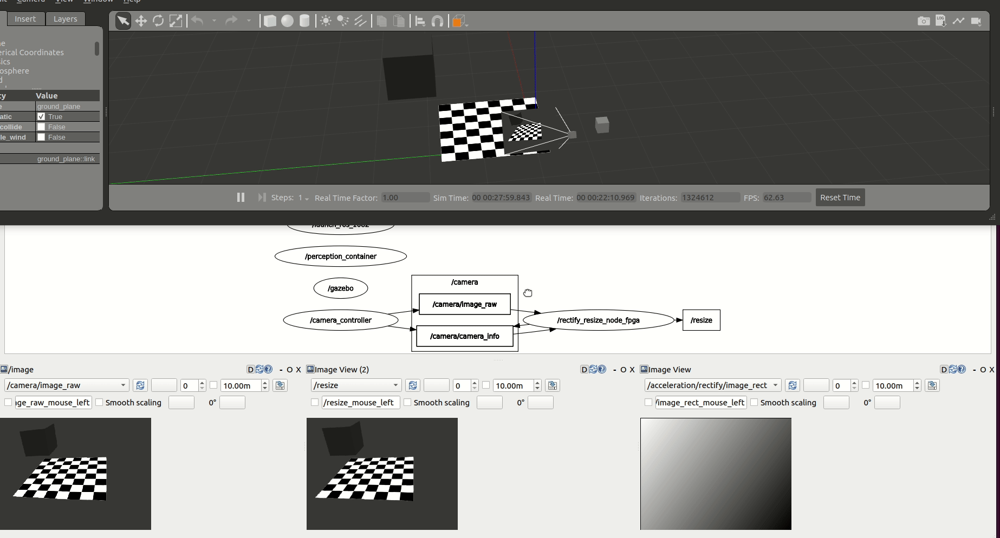

<table class="sphinxhide">
 <tr>
   <td align="center"><h1>Kria&trade; KR260 Robotics Starter Kit <br>TSN ROS Pub Sub Tutorial</h1>
   </td>
 </tr>
 <tr>
 <td align="center"><h1>Setting up the Board and Application Deployment</h1>

 </td>
 </tr>
</table>

### Introduction

This document shows, how to setup the board and environment to execute Perception stack application.


<br>

### Hardware Requirement
* KR260 Robotics starter kit
* Power supply and adaptor
* Ethernet cable
* Micro-USB to USB-A cable
* A 16 GB MicroSD card
* Ubuntu 20.04 workstation with ethernet port

<br>

### Environment Setup On Host Machine

1. Install ROS2 using debian package, see install guide [here](https://docs.ros.org/en/rolling/Installation/Ubuntu-Install-Debians.html).
2. Install KRS 1.0, see installation steps [here](https://xilinx.github.io/KRS/sphinx/build/html/docs/install.html#).

<br>

### Setting Up The Board
*TBD*

<br>

### Run The Application
This application has four flavours, which are developed in way that user can understand how he can tweek the application to achieve a desired performance during development. Below are versions and its details:

1) **CPU Baseline**
This is a very simplistic version, where nodes are not accelerated and are executed on CPU. This version should allow users get familier with working environment and understand easiness in working with KRS based applications. Use below steups to execute:

```bash
# Launch Gazebo simulator in your workstation
#  requires Gazebo installed and GUI-capabilities
$ cd ~/krs_ws  # head to your KRS workspace
$ source /opt/ros/rolling/setup.bash  # Sources system ROS 2 installation
$ colcon build --merge-install  # build the workspace to deploy KRS components
$ source install/setup.bash  # source the workspace as an overlay
$ ros2 launch perception_2nodes simulation.launch.py

# Launch the graph in the KV260 CPU (should be connected to the same local network)
$ source /opt/ros/rolling/setup.bash
$ ros2 launch perception_2nodes trace_rectify_resize.launch.py
```


2) FPGA Accelerated: Here we introduce a custom compute architecture where hardware acceleration is achieved using FPGA. We first accelerate the computations at each one of the graph nodes. `/rectify_node_fpga` and `/resize/resize_node_fpga` *Components* of the use case above are accelerated using Xilinx's HLS, XRT and OpenCL targeting the Kria KR260. The changes in the ROS 2 *Components* of `image_pipeline` to leverage hardware acceleration in the FPGA are available in [`rectify_fpga`](https://github.com/ros-acceleration/image_pipeline/blob/ros2/image_proc/src/rectify_fpga.cpp) and [`resize_fpga`](https://github.com/ros-acceleration/image_pipeline/blob/ros2/image_proc/src/resize_fpga.cpp) respectively. Each one of the ROS 2 *Components* has an associated acceleration kernel that leverages the Vitis Vision Library, a computer vision library optimized for Xilinx silicon solutions and based on OpenCV APIs. Source code of the acceleration kernels is available [here](https://github.com/ros-acceleration/image_pipeline/tree/ros2/image_proc/src/image_proc). To launch the perception graph with FPGA offloading using the Vitis Vision Library:

```bash
# Launch the graph in the KV260 CPU (should be connected to the same local network as the workstation)
$ source /opt/ros/rolling/setup.bash  # enable ROS 2 overlays
$ ros2 acceleration select image_proc  # select and load the accelerator
$ ros2 launch perception_2nodes trace_rectify_resize_fpga.launch.py  # launch Nodes
```


<br>

3) FPGA integrated acceleration: It is observed that during tracing and benchmarking (see how-to here *TBD*), there is scope of perforamance improvement by achieving efficient inter-process communication. It required to rearchitect the application and both ROS components (rectify and resize) were integrated to one. The benefits achieved are, first, it avoids ROS2 message passing between rectify and resize and second, it avoids compute cycles which were wasted in memory mapping back and forth data between CPU and FPGA. It achieved gain for over 26.96% (see benchmarking for more details). Steps to execute integrated application are:

```bash
# integrated
$ source /opt/ros/rolling/setup.bash  # enable ROS 2 overlays
$ ros2 acceleration select image_proc_integrated  # select and load the accelerator
$ ros2 launch perception_2nodes trace_rectify_resize_fpga_integrated.launch.py  # launch Nodes
```



<br>

4) FPGA streamline accelerated: In this application ROS *Components* `RectifyNodeFPGAStreamlined` and `ResizeNodeFPGAStreamlined` are redesigned to leverage hardware acceleration, however, besides offloading perception tasks to the FPGA, each <ins>leverages an AXI4-Stream interface to **create an intra-FPGA ROS 2 communication queue** which is then used to pass data across nodes through the FPGA</ins>. This allows to avoid completely the ROS 2 message-passing system and optimizes dataflow achieving a **24.42% total speedup**. Steps to launch streamlined accelerated version are:

```bash
# integrated
$ source /opt/ros/rolling/setup.bash  # enable ROS 2 overlays
$ ros2 acceleration select image_proc_integrated  # select and load the accelerator
$ ros2 launch perception_2nodes trace_rectify_resize_fpga_integrated.launch.py  # launch Nodes
```


<br>

### License

Licensed under the Apache License, Version 2.0 (the "License"); you may not use this file except in compliance with the License.

You may obtain a copy of the License at
[http://www.apache.org/licenses/LICENSE-2.0](http://www.apache.org/licenses/LICENSE-2.0)

Unless required by applicable law or agreed to in writing, software distributed under the License is distributed on an "AS IS" BASIS, WITHOUT WARRANTIES OR CONDITIONS OF ANY KIND, either express or implied. See the License for the specific language governing permissions and limitations under the License.

<p align="center">Copyright&copy; 2021 Xilinx</p>
