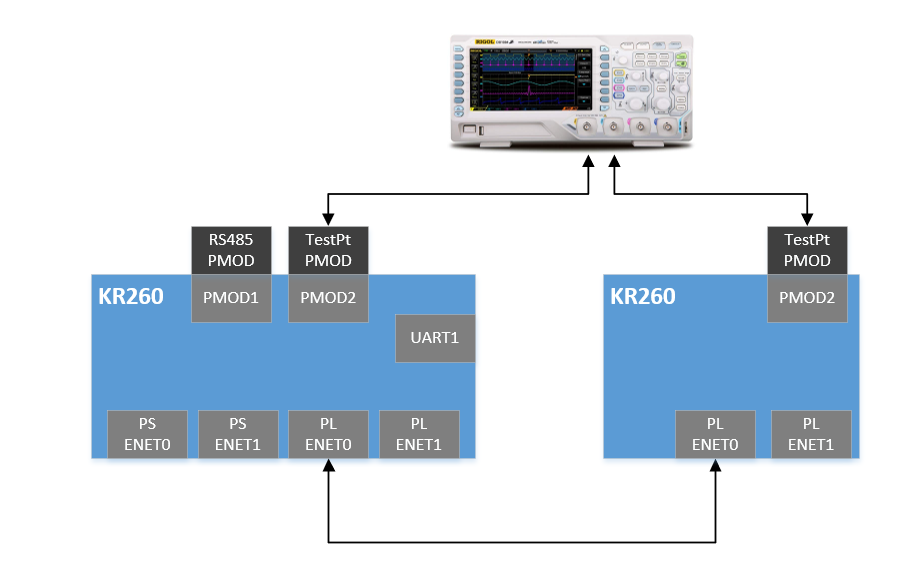
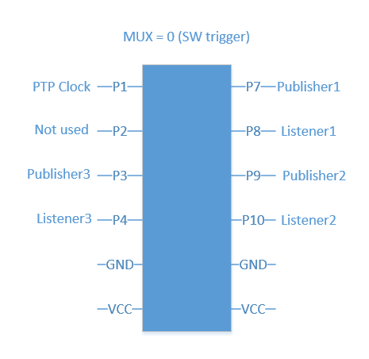
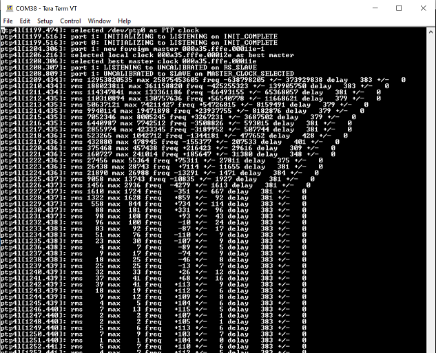
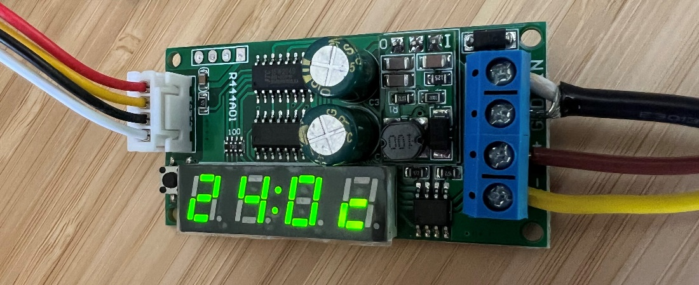

<table class="sphinxhide">
 <tr>
   <td align="center"><h1> Kria&trade; KR260 Robotics Starter Kit <br>ROS 2 Multi-Node Communications via TSN Tutorial</h1>
   </td>
 </tr>
 <tr>
 <td align="center"><h1>Setting up the Board and Application Deployment</h1>

 </td>
 </tr>
</table>

# Board Setup and Application Deployment

## Introduction

This document shows how to set up the board and run TSN ROS application.

## Pre-requisite

### Hardware Requirements

* KR260 Robotics Starter Kit

* KR260 Power Supply & Adapter (Included with KR260 Robotics Starter Kit)

* Cat 5e Ethernet Cable (Included with KR260 Robotics Starter Kit)

* USB-A to micro-B Cable (Included with KR260 Robotics Starter Kit)

* 16GB MicroSD Cards (Included with KR260 Robotics Starter Kit)

* [Digilent TPH2 Pmod - 12-pin Test Point Header](https://digilent.com/shop/pmod-tph2-12-pin-test-point-header/) - Optional (Sold Separately)

* [I210-T1 Network Adapter](https://www.amazon.com/gp/product/B00ESFF2JC/) installed on a PC host machine - Optional (Sold Separately)

* [Oscilloscope or Analog Discovery 2](https://digilent.com/reference/test-and-measurement/analog-discovery-2/start) – Minimum 100MS/s USB Oscilloscope - Optional (Sold Separately)

* RS485 Modbus Temperature Humidity Sensor - Optional (Sold Separately [here](https://www.aliexpress.com/item/33054683552.html) or [here](https://www.amazon.com/Temperature-Humidity-Sensor-Display-Modbus/dp/B078NRYBVZ))

* [12VDC Power Supply](https://digilent.com/shop/12v-3a-power-supply/) with Prototyping or Bare Terminals – Optional (Sold Separately)

* Wireshark tools installed on host machine (Ubuntu 20.04 Linux used for documentation)

### Initial Setup

1. Go through  [Booting Kria Starter Kit Linux](../../kria_starterkit_linux_boot.md) to complete minimum setup required to boot Linux before continuing with instructions in this page.

2. Get the latest TSN-ROS application & firmware package:

    * Search package feed for packages compatible with KR260

       ```bash
       sudo xmutil getpkgs
       ```

       An example output is show below

       ```bash
        Searching package feed for packages compatible with: kr260

        xlnx-app-kr260-mv-defect-detect/jammy 0.0.20220621.4729324-0xlnx3 arm64 demo application for Xilinx boards - kr260 mv-defect-detect application
        xlnx-app-kr260-pmod-rs485-test/jammy 0.1-0xlnx1 arm64  demo application for Xilinx boards - kr260 pmod-rs485-test application
        xlnx-app-kr260-tsn-examples/jammy 0.1-0xlnx1 arm64
       ```

    * Install Xilinx demo application packages and dependencies for ROS-TSN

        * Install firmware binaries and restart dfx-mgr

        ```bash
        sudo apt install xlnx-firmware-kr260-tsn-rs485pmod
        sudo systemctl restart dfx-mgr.service
        ```

        > Note : Installing firmware binaries (xlnx-firmware-kr260-tsn-pmod) causes dfx-mgr to crash and a restart is needed, which is listed in the known issues section. Once this is fixed an newer updates are available for dfx-manager, restart may not be needed.

        * Install dependencies and apps

        ```bash
        # Install TSN applications below
        sudo apt install xlnx-app-kr260-pmod-rs485-test
        sudo apt install xlnx-app-kr260-tsn-examples
        ```

       Confirm with "Y" when prompted to install new or updated packages.

       > Note: `linuxptp`, `xlnx-tsn-utils`, `libmodbus5` are dependencies to TSN applications that are installed automatically with above commands.

    * Add following path in environment variable for Xilinx demo application

        ```bash
        export PATH=${PATH}:/opt/xilinx/pmod-rs485-test/bin/
        export PATH=${PATH}:/opt/xilinx/tsn-examples/bin/
        ```

        > **Note:** consider adding the above commands to ~/.bashrc to avoid executing on every new shell created.

    * Install ROS 2 humble

        Refer [ROS 2 Documentation](https://docs.ros.org/en/humble/Installation/Ubuntu-Install-Debians.html) for the installation steps. Here is the snippet of what is needed for this application:

        ```bash
        sudo curl -sSL https://raw.githubusercontent.com/ros/rosdistro/master/ros.key -o /usr/share/keyrings/ros-archive-keyring.gpg
        echo "deb [arch=arm64 signed-by=/usr/share/keyrings/ros-archive-keyring.gpg] http://packages.ros.org/ros2-testing/ubuntu jammy main" | sudo tee /etc/apt/sources.list.d/ros2.list > /dev/null
        sudo apt update
        sudo apt upgrade
        sudo apt install ros-humble-ros-base
        ```

        Confirm with "Y" when prompted to install new or updated packages.

    * Install ROS 2 application

       ```bash
        mkdir -p ~/Downloads
        wget https://github.com/Xilinx/ros-tsn-pubsub/releases/download/v0.1/ros-humble-xlnx-pubsub_0.1.0-0jammy_arm64.deb -P ~/Downloads/
        sudo apt install ~/Downloads/ros-humble-xlnx-pubsub_0.1.0-0jammy_arm64.deb
       ```

3. Dynamically load the application package:

    The firmware consist of bitstream, device tree overlay (dtbo) file. The firmware is loaded dynamically on user request once Linux is fully booted. The xmutil utility can be used for that purpose.

    * Show the list and status of available acceleration platforms :

       ```bash
        $ sudo xmutil listapps
        ```

    * Switch to a different platform for different Application:

       When there's already another accelerator/firmware being activated apart from xlnx-app-kr260-pmod-rs485-test, unload it first, then switch to xlnx-app-kr260-pmod-rs485-test.

       ```bash
        $ sudo xmutil unloadapp
        $ sudo xmutil loadapp kr260-tsn-rs485pmod
        ```

## Run Out Of Box Applications

The TSN example applications will demonstrate Network Time Synchronization & Network Time Shaper Function that can be achieved through TSN based network infrastructure across a distributed system, which are two key features of the FPGA based TSN capabilities.

Two different configurations are shown below for deterministic communication. After completing the initial setup from above, users can navigate to the following subsectins to evaluate desired features

* Master - Slave deterministic communication with 2 KR260 boards : Network Configuration 1
* KRS based DDS implementation on ROS 2 pub/sub definition : Network Configuration 1
* Master - Slave deterministic communication with I210 card 	 : Network Configuration 2
* RS485 Temperature/humidity sensor demo 						 : Communicating using RS485

### Network Configuration 1 : Two KR260 boards

This configuration requires two KR260 units, TSN subsystem are connected to form a network where one of the units is configured to be master, while the other as slave. Image below represent this configuration:



#### Board setup

* Connect Ethernet cable from PL ETH1 of Board1 (J10 top) to PL ETH1 of  Board2 (J10 top)
* Connect JTAG/UART ports of both boards to your PC
* Connect Digilent TPH2 Pmod into the PMOD2 connector on the KR260 board
* The Analog Discovery 2  or Oscilloscope can be connected to Board1 and Board2 for observing the PTP clock synchronization, Qbv scheduling and measuring latency.
* power on both the boards with the prebuilt wic image in the sd_card that was prepared in prerequisite section


#### Run TSN-ROS Out of Box Applications

* Ensure to load the TSN accelerator/firmware (refer to step-7 'dynamically load the application package' from initial setup) using `xmutil loadapp kr260-tsn-rs485pmod` before testing example application. If the firmware is already loaded, ignore this step and proceed.

* Setup Ethernet ports by running the following commands on the serial terminal. This sets the MAC/IP/VLAN on the EP and ETH ports of the TSN switch IP

    * _KR260 Board1 interface setup_

        `source /usr/bin/net_setup.sh -b1`

    * _KR260 Board2 interface setup_

        `source /usr/bin/net_setup.sh -b2`

	* _Setup ros env on both KR260 Board 1 & Board2_

		`source /opt/ros/humble/setup.sh`

    > **Note:** Set MAC filters when using both TSN ethernet ports in loopback mode, refer to net_setup.sh script for setting MAC filters.

##### Network Time Synchronization KR260-KR260 (PTP Demo)

In this demo Board1 will set its clock as master. Board2 will be the slave. Board2 clock will sync with Board1 clock after a brief synchronization period.
Oscilloscope or Analog Discovery 2 Setup (optional)

* Connect P1 on the Test Pmod of Board1 to Channel1 of the oscilloscope - Monitors PTP clock on Board1
* Connect P1 on the Test Pmod of Board2 to Channel2 of the oscilloscope - Monitors PTP clock on Board2
* There are also additional signals exposed to the test Pmod if you wish to observe them with additional oscilloscope channels:

    

    * _Start ptp on Board1 in master mode_

        `$ source /usr/bin/start_ptp.sh -m`

    * _Start ptp on Board2 in slave mode_

        `$ source /usr/bin/start_ptp.sh -s`

    > **Note:**  Ensure to run ptp master before starting ptp slave as slave will fail to sync when grandmaster clock is not set. The sync takes about 30 seconds to complete.

   **Observe Results:**

   * The file ptplog saves the ptp4l output on Board2. The rms value starts out high and goes down to a single digit value showing the clocks are now in sync.

    

   *    To see the current status of PTP run the following command

        `tail -f .local/log/ptplog`

   * Using an Oscilloscope, or the Analog Discovery 2 and the WaveForms application, the clocks will start out not in sync and will begin to sync to each other and this can be observed by the phase alignment between Channel1 and Channel2.

        

        

##### ROS Publisher and Subscriber Demo

* Start Subscriber (listener) first on Board2 so that it is ready to receive messages from the Publisher once it has begun sending messages.

     `$ source /opt/xilinx/ros-tsn-example/bin/start_ros_test.sh -l`
* Start Publisher (talker) next on Board1 to begin sending messages to boards that are Subscribed to the topic.

    `$ source  /opt/xilinx/ros-tsn-example/bin/start_ros_test.sh -t`

**Observe Results**

* The xlnx-pubsub talker generates a packet of schedule traffic type every second.
* The xlnx-pubsub listener prints a message when it receives a packet.

    

##### Latency measurement Demo

To measure latency you will need an oscilloscope or Analog Discovery 2 device. This demo will measure the latency between packet transmitted from Board1 and received on Board2. It will include the latency of the software stack as well.

#### Oscilloscope or Analog Discovery 2 Setup

* Connect P7 on the Test PMOD of Board1 to Channel1 of the oscilloscope - Monitors TX packet from Publisher1. Publisher1 can transmit a Scheduled Traffic (ST) packet or a Best effort (BE) packet.

* Connect P8 on the Test PMOD of Board2 to Channel2 of the oscilloscope - Monitors RX packet from Listener1. Listener 1 will receive a ST packet or BE packet.

* Set up triggers on Channel1 and Channel2 with an OR condition and set the time scale interval to 50us.

    

    Figure: Test PMOD pins when MUX is set to SW trigger

   The talker application will generate a packet which will trigger the Publisher1 pin in the figure above. When the packet is received on Board2 the listener application will trigger the Listner1 pin. Measure the time difference between Channel1 and Channel2 of the scope to find out the latency. It is ideally found to be between 80us to 160us.

    * _Start listener on Board2_

        `$ source /opt/xilinx/tsn-examples/bin/start_latency_test.sh -l`

    * _Start talker on Board1 with best effort traffic class_

        `$ source /opt/xilinx/tsn-examples/bin/start_latency_test.sh -b`

    * _Start talker on Board1 with scheduled traffic class_

        `$ source /opt/xilinx/tsn-examples/bin/start_latency_test.sh -s`

    * Press Enter key on Board2 to exit out of Listener mode.

    **Observe Results**

    * The next steps will measure the time difference between Channel1 and Channel2 of the scope to find out the latency. It is ideally found to be between 80us to 160us. The latency numbers will be the similar between Best Effort and Scheduled Traffic. If you set Qbv priority, the latency may increase depending on the order of the slot (BE first or ST first) and Time allotted for each slot.

        

    > **Note:** The latency  measurement on the oscilloscope is from a software trigger, this includes the processing time of the processor to read the packet received over the network stack and initiate a trigger signal to the PMOD. When work load on the processor is high, latency measurements could reflect a higher value.

##### Network Time Shaper Function (802.1Qbv Demo)

This demo allots a time slot for scheduled traffic and best effort and it can be visualized on a oscilloscope. For a cycle time period of 1ms, ST traffic will be sent for 700us and BE traffic for 300us.

**Oscilloscope or Analog Discovery 2 Setup**

* Connect P8 on the Test PMOD of **Board2** to Channel1 of the oscilloscope - ST packet Rx
* Connect P10 on the Test PMOD of **Board2** to Channel2 of the oscilloscope - BE packet Rx
* Set up triggers on Channel1 and Channel2 with an OR condition and set the time scale interval to 1 millisecond.


**Board2** will listen for packets. On Board1, the application will set up time slots for the traffic classes.  It  will generate packets in continuous mode for both traffic types. The oscilloscope will monitor the tlast signal of scheduled packets and best effort packets exposed by the TSN IP.

* _Start Receive on Board2_

    `$ source /opt/xilinx/tsn-examples/bin/start_qbv_test.sh -rx`
* _Start Transmit on Board1_

    `$ source /opt/xilinx/tsn-examples/bin/start_qbv_test.sh -tx`

    The talker on Board1 will run for 30sec and exit.

**Observe Results**

The scope shot will show a 70% Scheduled traffic 30 % Best Effort traffic distribution.


> **Note:** You can also monitor Tlast TX ST (P7) and  Tlast TX BE (P9) on Board1, but the distribution is not as clean as the RX, because we are monitoring the data going into the TSN IP before it is scheduled to go out on the Ethernet MAC.

**No Oscilloscope Setup**

* No connections to the Pmods are required in this case since the oscilloscope will not be used, instead the Wireshark application will be used to analyze traffic types.

* _Start Receive mode on Board2 and use tcpdump to begin capturing received packets_

    `$ source /opt/xilinx/tsn-examples/bin/start_qbv_test.sh -rx`

    `$ sudo tcpdump -i ep -w qbv.pcap`

* _Start Transmit mode on Board1_

    `$ source /opt/xilinx/tsn-examples/bin/start_qbv_test.sh -tx`

    The talker on Board1 will run for 30sec and exit automatically

* Exit out of tcpdump using CTRL-c key combination to end capture on Board2
* Move the qbv.pcap capture file to the SD card located under the /boot directory
* Move the qbv.pcap file from the SD card to the host PC to analyze the packet distribution within Wireshark

**Observe Results**

Wireshark trace will show a 70% Scheduled traffic 30 % Best Effort traffic distribution.

* Start Wireshark on the host PC, here we will use the one available under Ubuntu

    `$ wireshark &`

* In the Wireshark GUI, select File → Open → Browse and select the qbv.pcap file

* Observe there are two sets of packets within the capture, one set with packet length=900, another set with packet length=800 which when ploted against time will form a 70:30 distribution. The packet length is based on the setting from the talker script, below is an example for lengths 900 and 800 for Scheduled and best effort traffic respectively.

    

* Click on a packet with length=900 bytes and observe the vlan ID=10, Priority (PCP/PRI=4) where a packet with PCP=4 indicates it is Scheduled traffic

    

* Click on a packet with length=800 bytes and observe the vlan ID=20, Priority (PCP/PRI=1) where a packet with PCP=1 indicates it is Best Effort traffic

    


### Network Configuration 2 : KR260 and PC Workstation

A single KR260 board communicating with a PC workstation capable of TSN networking.  The PC workstation is using an I210 Ethernet Controller interface card to demonstrate functionality and features of TSN.

#### Board Setup

* Insert the microSD card containing the boot image into the microSD card slot (J11) on the Starter Kit
* Connect JTAG/UART port (J4) of the KR260 carrier board to the development PC
* Connect the TPH2 Pmod to the PMOD2 expansion connector (J18) of the KR260 carrier board
* Connect Ethernet cable from PL ETH1 of KR260 Carrier Board (J10 top port) to Intel I210 NIC Ethernet port of the Linux host machine
* Connect Power Supply to the 12V PWR DC barrel jack (J12) on the KR260 carrier board.

    

* Ensure to load the TSN accelerator/firmware (refer to step-7 'dynamically load the application package' from initial setup) using `xmutil loadapp kr260-tsn-rs485pmod` before testing example application. If the firmware is already loaded, ignore this step and proceed.

* Setup Ethernet port on the target KR260 board by running the following commands within the USB-UART connected serial terminal, this sets the MAC/IP/VLAN on the EP and ETH port of the TSN switch IP

    `$ source /usr/bin/net_setup.sh -b2 `

 **Workstation Configuration**

* The TSN networking interface (I210 interface) on the Linux host workstation  must be brought up and linuxptp needs to be installed to demonstrate PTP. To do this, On the Linux workstation use `sudo ifconfig <i210 interface> up` command as shown in this example usage:

    `$ sudo ifconfig enp2s0 up `

* _Install ptpt4l on Workstation_

    `$ sudo apt install linuxptp`

#### Network Time Synchronization Workstation-KR260 (PTP Demo)

In this demo KR260 will set its clock as slave and the Linux host workstation will serve as the clock master. The KR260 clock will sync with the Linux host workstation clock after a brief synchronization period.

Using a text editor on the Linux TSN host workstation, create a new ptp4l configuration file with the following settings needed to launch ptp4l as the network clock master

```text
    [global]

    transportSpecific       1
    priority1               248
    priority2               249
    ptp_dst_mac             01:80:C2:00:00:0E
    p2p_dst_mac             01:80:C2:00:00:0E
    logAnnounceInterval     1
    logSyncInterval         -3
    follow_up_info          1
    announceReceiptTimeout  3
    syncReceiptTimeout      3
    neighborPropDelayThresh 800
    min_neighbor_prop_delay -20000000
    network_transport       L2
    delay_mechanism         P2P
    tx_timestamp_timeout    10
```

* _Start ptp4l on the Linux TSN host workstation and specify_

    `$ sudo ptp4l -P -2 -H -i <i210 interface> -m -f ptp4l_master.conf >& ptplog & `

    `$ sudo ptp4l -P -2 -H -i enp2s0 -p /dev/ptp1 -m -f ptp4l_master.conf >& ptplog & `

> **Note:** In the case where there is more than one ptp device available, specify which one is to be used with the -p argument as shown in the following example usage:

* _Start ptp on KR260 in slave clock mode_
    `$ source /usr/bin/start_ptp.sh -s `

> **Note:** Ensure to run ptp master before starting ptp slave as slave will fail to sync when grandmaster clock is not set. The sync takes about 30 seconds to complete.

**Observe Results**

* The file ptplog contains the saved ptp4l output to the file system on KR260. The rms value will start out high and trend downward to a single digit value showing that the clocks are now in sync.

    

* To see the current status of PTP run the following command, to exit log view when finished

    `tail -f .local/log/ptplog`

#### Network Time Shaper Function (802.1Qbv Demo)

This demo allots a time slot for Scheduled Traffic (ST) and Best Effort (BE) traffic and it can be visualized on an oscilloscope.  For a cycle time period of 1ms, ST traffic will be sent for 700us and BE traffic for 300us.  Wireshark on the Linux host workstation will listen for packets.  On the KR260 board, the application will set up time slots for the traffic classes.  Packets are generated in continuous mode for both traffic types.  Wireshark will monitor the incoming packets for scheduled and best-effort traffic exposed by the TSN IP.

An oscilloscope or Analog Discovery 2 device can also be used to monitor Tlast Tx ST (P7) and Tlast Tx EP (P9) on KR260 board to view the distribution.
Oscilloscope Setup (optional)

* Connect P7 on the Test Pmod of KR260 to Channel1 of the oscilloscope - Tlast Tx ST
* Connect P9 on the Test Pmod of KR260 to Channel2 of the oscilloscope - Tlast Tx EP
* Set up triggers on Channel1 and Channel2 with an OR condition and set the time scale interval to 1 millisecond:

    
* The Analog Discovery 2 can be connected to KR260 using these connections for observing the scheduled traffic:

    

* Start Wireshark on the Linux host machine and select I210 interface to see traffic data

    `$ wireshark &`

* Start transmitting packets from the KR260 board

    `$ source /opt/xilinx/tsn-examples/bin/start_qbv_test.sh -tx`

* The talker on KR260 will run for 30 seconds and exit automatically

**Observe Results**

* The scope shot will show an approximate Scheduled traffic (Channel 1 yellow) and Best Effort traffic (Channel 2 green) distribution.

    

> **Note:**  The distribution will not be clean, because this is monitoring the data going into the TSN IP before it is scheduled to go out on the Ethernet MAC.

* Observe there are two sets of packets within the capture, one set with packet length=900, another set with packet length=800

    

* Click on a packet with length=900 bytes and observe the vlan ID=10, Priority (PCP/PRI=4) where a packet with PCP=4 indicates it is Scheduled traffic

    

* Click on a packet with length=800 bytes and observe the vlan ID=20, Priority (PCP/PRI=1) where a packet with PCP=1 indicates it is Best Effort traffic

    

    Wireshark trace shows a traffic distribution of 70% Scheduled traffic and 30% Best Effort traffic

### Communication using RS485

The K26 SOM has capability to perform as an advanced and highly integrated gateway for legacy industrial networking protocols (those using RS485/Modbus) to more modern industrial networking infrastructure (such as TSN) and this application serves as an example of how to interface to a remote temperature sensor for capturing data.  This is analogous to integrating in legacy, but still functional, capital equipment in order to reduce total replacement costs within factory retrofits and technology upgrades.

#### Board Setup

* Connect the Pmod RS485 to the PMOD1 expansion connector (J2) of the KR260 carrier board, be sure to connect this to the bottom row of pins (ones labeled 2,4,6,8,10, and 12) since the module is a 1x6 header connecting to a 2x6 connector on KR260


* Connect the Temperature sensor and PMOD RS485 using prototyping wire (18 AWG works well) as shown in the figure below:


* Connect a 12 VDC supply to power the RS485 temperature sensor using GND and VIN terminals.



* Connect Power Supply to the 12V PWR DC barrel jack (J12) on the KR260 carrier board.

### RS485 Temperature/Humidity Sensor Demo

In this demo the pmod-test application probes the temperature sensor connected to Pmod RS485 and displays the captured values on the serial terminal.

* Ensure to load the TSN accelerator/firmware (refer to step-7 'Dynamically load the application package' from Initial setup) using `xmutil loadapp kr260-tsn-rs485pmod` before testing example application. If the firmware is already loaded, ignore this step and proceed.
* Probe sensor via RS485 interface

Execute binary

```bash
pmod-rs485-test
```

**Observe Results**

The output on the serial terminal should match the value displayed on the seven-segment LED display of the sensor.


> **Note:**  Occasionally, erroneous values (for example 3276.8) are reported for temperature/humidity sensor data and this is due to error in the sensor itself which can be ignored and the test rerun to clear the error.
>
> ```
> reg[0]=32768 (0x8000)
> reg[1]=32768 (0x8000)
> Temperature: 3276.8 Deg C
> Humidity: 3276.8 %
> ```
> For reference, here is the register map of the sensor:
> 

## Known issues

Following known issues and their remedies that can be encountered and implemented while testing the above application.

* Repeated broadcast on ping

* PTP timeouts with heavy traffic

For the above two issues refer to the documentation provided under the section "Known issues and troubleshooting" from the Xilinx TSN solution wiki page [here](https://xilinx-wiki.atlassian.net/wiki/spaces/A/pages/25034864/Xilinx+TSN+Solution)

* DFX-Manager-Daemon crash

dfx-manager daemon fails to load app after a fresh install or an upgrade of any accelerator/firmware package (xlnx-app-kr260-pmod-rs485-test) .If you see the below failure by xmutil after intall or upgrade of any package, make sure to restart the dfx-manger daemon and try again.

`$ sudo systemctl restart dfx-mgr.service`

 ```bash
ubuntu@kria:$ sudo xmutil loadapp kr260-tsn-rs485pmod
DFX-MGRD> ERROR: initSocket:connect failed

error sending message from client
 ```

* kernel crash when unloading `kr260-tsn-rs485pmod` firmware binaries using kernel version 5.15.0-1010-xilinx-zynqmp

The default kernel patch version for the Ubuntu image is `5.15.0-1010-xilinx-zynqmp`,to avoid a kernel crash when unloading the TSN firmware upgrade the kernel to patch version `5.15.0-1011-xilinx-zynqmp`.

## Next Steps

* [Software Architecture of the Platform](sw_arch_platform.md)
* Go back to the [KR260 design start page](../ros2_multinode_communication_via_tsn_landing)

<!---

Licensed under the Apache License, Version 2.0 (the "License"); you may not use this file except in compliance with the License.

You may obtain a copy of the License at http://www.apache.org/licenses/LICENSE-2.0.


Unless required by applicable law or agreed to in writing, software distributed under the License is distributed on an "AS IS" BASIS, WITHOUT WARRANTIES OR CONDITIONS OF ANY KIND, either express or implied. See the License for the specific language governing permissions and limitations under the License.

-->

<p class="sphinxhide" align="center">Copyright&copy; 2022 Xilinx</p>
