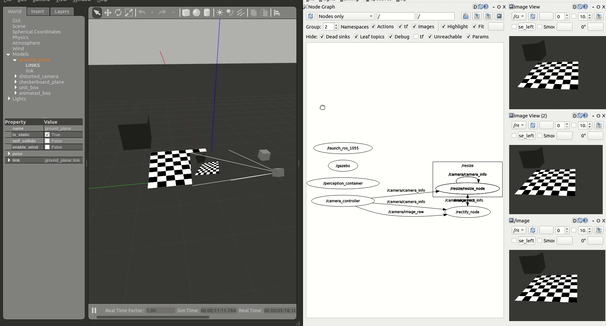

<table class="sphinxhide">
 <tr>
   <td align="center"><h1>Kria&trade; KR260 Robotics Starter Kit <br>ROS Perception Tutorial</h1>
   </td>
 </tr>
 <tr>
 <td align="center"><h1>Setting up the Board and Application Deployment</h1>

 </td>
 </tr>
</table>

# Board Setup and Application Deployment

### Introduction

This document shows, how to setup the board and environment to execute Perception stack application.

## Pre-requisite

### Hardware Requirement

* KR260 Robotics Starter Kit
* KR260 Power Supply & Adapter (Included with KR260 Robotics Starter Kit)
* Cat 5e Ethernet Cable (Included with KR260 Robotics Starter Kit)
* USB-A to micro-B Cable (Included with KR260 Robotics Starter Kit)
* 16GB MicroSD Cards (Included with KR260 Robotics Starter Kit)
* Ubuntu 22.04 workstation with ethernet port

<br>

### Initial Setup, Setting Up The Board

1. Setting up the SD Card Image (Ubuntu)

   * Follow the instruction from the page below to obtain Ubuntu image and flash SD card
   https://www.xilinx.com/products/som/kria/kr260-robotics-starter-kit/kr260-getting-started/setting-up-the-sd-card-image.html

2. KR260 Board and Interface:

    

    

   * Connecting Everything: Follow the instruction from the page below for initial Board setup

	https://www.xilinx.com/products/som/kria/kr260-robotics-starter-kit/kr260-getting-started/connecting-everything.html

3. Booting your Starter Kit (Ubuntu):

   * Follow the instruction from the page below to boot linux

	https://www.xilinx.com/products/som/kria/kr260-robotics-starter-kit/kr260-getting-started/booting-your-starter-kit.html

> **Note:** Steps under the section "Set up the Xilinx Development & Demonstration Environment for Ubuntu 22.04 LTS" may not be needed for TSN-ROS demo.

4. Set System Timezone and locale:

    * Set timezone

       ```bash
		$ sudo timedatectl set-ntp true
		$ sudo timedatectl set-timezone America/Los_Angeles
		$ timedatectl
       ```

	* Set locale

       ```bash
		$ sudo locale-gen en_US en_US.UTF-8
		$ sudo update-locale LC_ALL=en_US.UTF-8 LANG=en_US.UTF-8
		$ export LANG=en_US.UTF-8
		$ locale
       ```
5. Update Bootfirmware

	The SOM Starter Kits have factory pre-programmed boot firmware that is installed and maintained in the SOM QSPI device. Update the Boot firmware in the SOM QSPI device to '2022.1 Boot FW' Image.
	follow the link below to obtain Boot firmware binary and instructions to update QSPI image using xmutil, after linux boot.

	https://xilinx-wiki.atlassian.net/wiki/spaces/A/pages/1641152513/Kria+K26+SOM#Boot-Firmware-Updates

6. Get the latest ROS perception application & firmware package:

	* Add archive for the Xilinx Apps demo

       ```bash
	   $ sudo add-apt-repository ppa:xilinx-apps
	   $ sudo apt update
	   $ sudo apt upgrade
       ```

    * Search package feed for packages compatible with KR260

       ```bash
      ubuntu@kria:~$ sudo apt search xlnx-firmware-kv260
      Sorting... Done
      Full Text Search... Done
      xlnx-firmware-kr260-ros-perception/jammy,now 0.1-0xlnx1 arm64
        FPGA firmware for Xilinx boards - kr260 ros-perception application
       ```

    * Install firmware binaries

      ```bash
      sudo apt install xlnx-firmware-kr260-ros-perception
      ```

  	* Install ROS 2  humble

        Refer [ROS 2 Documentation](https://docs.ros.org/en/humble/Installation/Ubuntu-Install-Debians.html) for the installation steps. Here is the snippet of what is needed for this application:

        ```bash
		$ sudo curl -sSL https://raw.githubusercontent.com/ros/rosdistro/master/ros.key -o /usr/share/keyrings/ros-archive-keyring.gpg
		$ echo "deb [arch=arm64 signed-by=/usr/share/keyrings/ros-archive-keyring.gpg] http://packages.ros.org/ros2-testing/ubuntu jammy main" | sudo tee /etc/apt/sources.list.d/ros2.list > /dev/null
		$ sudo apt update
		$ sudo apt upgrade
		$ sudo apt install ros-humble-ros-base
        ```
        Confirm with "Y" when prompted to install new or updated packages.
    
    * Install ROS 2 application

       ```bash
      $ # Required dependencies ocl-icd-* opencl-headers python3-lttng ros-humble-tracetools ros-humble-tracetools-launch  ros-humble-tracetools-trace lttng-tools lttng-modules-dkms
		$ mkdir -p ~/Downloads
		$ wget <> -P ~/Downloads/
		$ sudo apt install ~/Downloads/ros-humble-xlnx-ros-perception_0.1.0-0jammy_arm64.deb
       ```
<br>

### Environment Setup On Host Machine(Ubuntu 22.04)

1. Install ROS2 using debian package, see install guide [here](https://docs.ros.org/en/rolling/Installation/Ubuntu-Install-Debians.html).
2. Install few more dependencies from ros-humble using the below command
```bash
$ sudo apt install ros-humble-gazebo-ros ros-humble-gazebo-plugins ros-humble-gazebo-msgs
```
3. Install Gazebo Classic 11.0, see install guide [here](https://classic.gazebosim.org/tutorials?tut=install_ubuntu)
4. Get files to setup and run simulation
```bash
$ git clone --recursive https://gitenterprise.xilinx.com/SOM/kria_ros_perception
$ cd kria_ros_perception
$ rm -rf src/image_proc src/tracetools_image_pipeline src/vitis_common
```
3. Install Simulation from the below steps
```bash
$ source /opt/ros/humble/setup.bash
$ colcon build
```
4. Run simulation on workstation
```bash
# Launch Gazebo simulator in your workstation
#  requires Gazebo installed and GUI-capabilities
$ source /opt/ros/humble/setup.bash  # Sources system ROS 2 installation
$ colcon build --merge-install  # build the workspace to deploy KRS components
$ source install/setup.bash  # source the workspace as an overlay
$ ros2 launch perception_2nodes simulation.launch.py
```

<br>

### Run The Application
This application has two flavours, which are developed in way that user can understand how he can tweek the application to achieve a desired performance during development. Below are versions and its details:

1) **CPU Baseline**
This is a very simplistic version, where nodes are not accelerated and are executed on CPU. This version should allow users get familier with working environment and understand easiness in working with KRS based applications. Use below steups to execute:

```bash
# Launch the graph in the KV260 CPU (should be connected to the same local network)
$ source /opt/ros/rolling/setup.bash
$ ros2 launch perception_2nodes trace_rectify_resize.launch.py
```



2) **FPGA streamline accelerated**: In this application ROS *Components* `RectifyNodeFPGAStreamlined` and `ResizeNodeFPGAStreamlined` are redesigned to leverage hardware acceleration, however, besides offloading perception tasks to the FPGA, each <ins>leverages an AXI4-Stream interface to **create an intra-FPGA ROS 2 communication queue** which is then used to pass data across nodes through the FPGA</ins>. This allows to avoid completely the ROS 2 message-passing system and optimizes dataflow achieving a **24.42% total speedup**. Steps to launch streamlined accelerated version are:

```bash
# integrated
$ xmutil unloadapp
$ xmutil loadapp image_proc_integrated  # load the accelerator
$ source /opt/ros/rolling/setup.bash  # enable ROS 2 overlays
$ ros2 launch perception_2nodes trace_rectify_resize_fpga_integrated.launch.py  # launch Nodes
```


<br>


<!---

Licensed under the Apache License, Version 2.0 (the "License"); you may not use this file except in compliance with the License.

You may obtain a copy of the License at http://www.apache.org/licenses/LICENSE-2.0.


Unless required by applicable law or agreed to in writing, software distributed under the License is distributed on an "AS IS" BASIS, WITHOUT WARRANTIES OR CONDITIONS OF ANY KIND, either express or implied. See the License for the specific language governing permissions and limitations under the License.

-->

<p class="sphinxhide" align="center">Copyright&copy; 2022 Xilinx</p>
