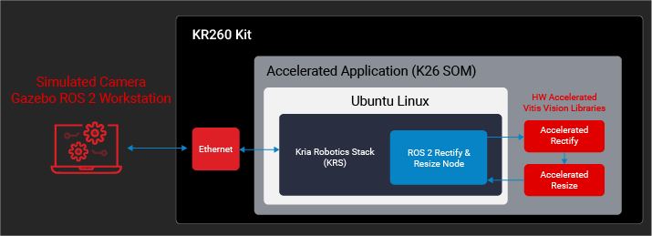

# Perception Stack Application

## Design Overview

### Introduction

The ROS 2 Perception Node accelerated application implements a subset of image_pipeline, which is one of the most popular packages in the ROS 2 ecosystem and a core piece of the ROS perception stack. It creates a simple computational graph consisting of two hardware accelerated nodes, resize & rectify as shown in figure 1.

This application is based on KRS(Kria Robotics Framework) and it demonstrates the capabilities of KRS on how a roboticits can leverage programmable logic to accelerate their applications efficiently without having deeper hardware knowledge. This simple application is implemented to give users a quick hands on with KRS framework and get roboticists started to write their hardware accelerated applications on Kria Robotics starter kit easily.

Here, we have used Gazebo, which is industry's leading Simulator with a pre selected camera module to feed image data in to the computational graph. Though the application supports ros2 capable cameras also but it is completely optional. The image is first rectified and then resized. The output "/resize" topic data can be seen using "rqt". KRS also provides tracing feature using LTTNG framework, which is an industry standard and can be used to trace and analyze the performance of Linux systems and applications.

### Features

* Allows appreciation of accelerate image_pipeline ROS metapackage image_proc (package)

  * Accelerates ROS 2 ResizeNode (part of image_proc)
  * Accelerates ROS 2 RectifyNode (part of image_proc)

* Comes with one pre-selected camera module in Gazebo

* Allows use of any camera system capable of publishing ROS topics with raw data on Ethernet

* Shows how instrument ROS 2 with LTTNG to measure performance before and after acceleration

* Shows how the Accelerated Vitis Vision Library functions in actions

* Complete application with hardware design

### Next Steps

* Setting up the board and application deployment

### References

* [KRS Documentation](https://xilinx.github.io/KRS/sphinx/build/html/index.html)

<!---

Licensed under the Apache License, Version 2.0 (the "License"); you may not use this file except in compliance with the License.

You may obtain a copy of the License at http://www.apache.org/licenses/LICENSE-2.0.

Unless required by applicable law or agreed to in writing, software distributed under the License is distributed on an "AS IS" BASIS, WITHOUT WARRANTIES OR CONDITIONS OF ANY KIND, either express or implied. See the License for the specific language governing permissions and limitations under the License.

-->

Copyright&copy; 2022 Xilinx

