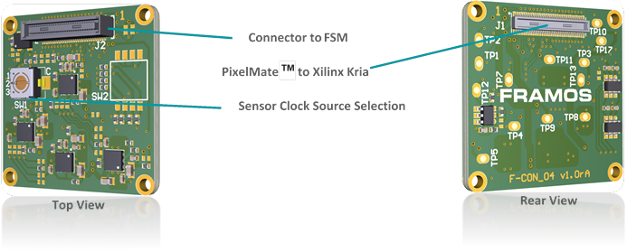
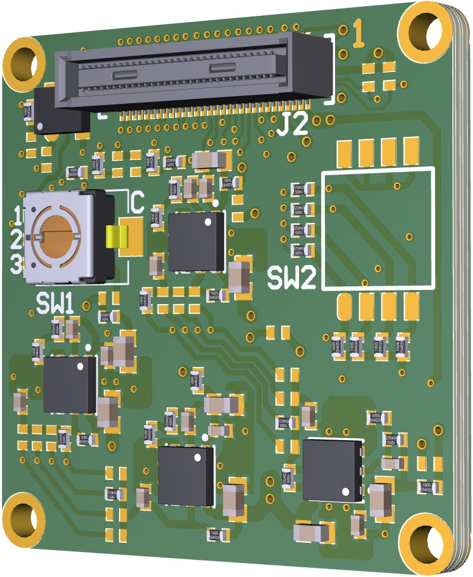
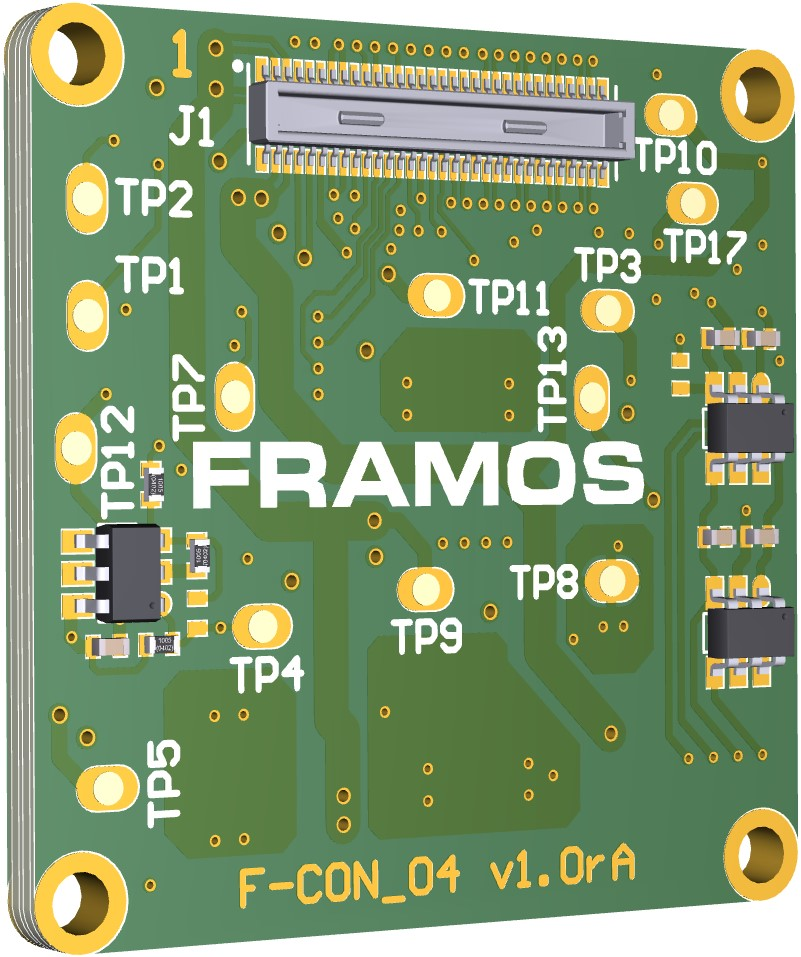
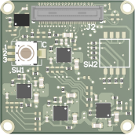
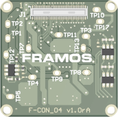
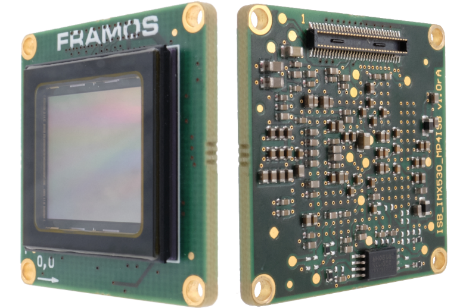
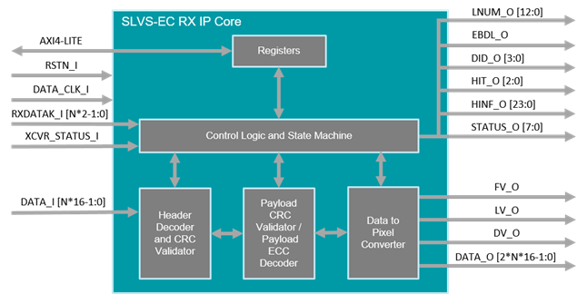

# FRAMOS KRIA Documentation

## Kria KR260

For Xilinx

## Accelerated Applications

For Xilinx

## (SLVS-EC Machine Vision application)

For Xilinx

## Overview

For Xilinx

### Introduction of Accelerated Application

For Xilinx

### Application Features

For Xilinx

### Overview of Sony IMX547 Sensor

### IMX547 Sensor

The Sony IMX547 is a diagonal 8.8 mm (Type 1/1.8) CMOS active pixel, solid-state image sensor with a square pixel array and 5.10 M effective pixels. This image sensor contains a global shutter with variable charge-integration time and is part of the Pregius S active pixel-type CMOS image sensors. By stacking the signal processing on the back illuminated type CMOS Image Sensor it realizes small chip size and high sensitivity, whilst using the high picture quality global shutter pixel technology of Pregius.

### Overview of FSA Module

The FSA (Framos Sensor Adapter) Connects to the FSM (Framos Sensor Module) allowing with Sub-LVDS, SLVS or SLVS-EC devices.

Functional Blocks:

- Signal routing

- Voltage generation for image sensor

- Power up sequence for image sensor

 

| Position | Description                       |
|----------|-----------------------------------|
| 1        | Clock Provided from FSA (Default) |
| 2        | External Clock 1 (MCLK0)          |
| 3        | External Clock 2 (MCLK1)          |

> *Table 3*: *Selection of Sensor Clock Source on FSA-FTx/A-V1*

**PixelMate™ - Sub-LVDS, SLVS and SLVS-EC Pinout**

This pinout scheme applies to all sensors that natively output image data using signals according to Sub-LVDS, SLVS or SLVS-EC specification. This layout provides eight data lanes on the connector. Devices with SLVS and SLVS-EC share the same sensor package pins therefore share the same connector pins.

> **NOTE**: Lane number assignment is applied according to SLVS numbering, which differs in most cases from the SLVS-EC lane numbering. Please refer to image sensor datasheet for correct SLVS-EC numbering.

| Pin #      | Type                                       | Signal             | Pin #      | Type                                       | Signal             |
|------------|--------------------------------------------|--------------------|------------|--------------------------------------------|--------------------|
|     1      | Common Voltages (from FPA to FSA)          |     3V8            |     2      | Common Voltages (from FPA to FSA)          |     1V8            |
|     3      | Common Voltages (from FPA to FSA)          |     3V8            |     4      | Common Voltages (from FPA to FSA)          |     1V8            |
|     5      | Sensor Specific Voltages (from FSA to FSM) |     V_ANA          |     6      | Sensor Specific Voltages (from FSA to FSM) |     V_DIG          |
|     7      | Sensor Specific Voltages (from FSA to FSM) |     V_ANA          |     8      | Sensor Specific Voltages (from FSA to FSM) |     V_DIG          |
|     9      | Sensor Specific Voltages (from FSA to FSM) |     V_IF           |     10     | Sensor Specific Voltages (from FSA to FSM) |     V_AUX          |
|     11     |                                            |     GND            |     12     |                                            |     GND            |
|     13     |                                            |     GND            |     14     |                                            |     GND            |
|     15     | Sensor Signals                             |     SDA            |     16     | Sensor Signals                             |     SCL            |
|     17     | Sensor Signals                             |     SDO            |     18     | Sensor Signals                             |     XCE            |
|     19     | Sensor Signals                             |     TOUT0          |     20     | Sensor Signals                             |     SLAMODE        |
|     21     | Sensor Signals                             |     TOUT1          |     22     | Sensor Signals                             |     XMASTER        |
|     23     | Sensor Signals                             |     TOUT2          |     24     | Sensor Signals                             |     NC             |
|     25     | Sensor Signals                             |     NC             |     26     | Sensor Signals                             |     XTRIG          |
|     27     | Sensor Signals                             |     NC             |     28     | Sensor Signals                             |     XHS            |
|     29     | Sensor Signals                             |     NC             |     30     | Sensor Signals                             |     XVS            |
|     31     | Sensor Signals                             |     GND            |     32     | Sensor Signals                             |     GND            |
|     33     | Sensor Signals                             |     RST            |     34     | Data Lines                                 |     D_DATA_7_P     |
|     35     | Driving Clock                              |     MCLK           |     36     | Data Lines                                 |     D_DATA_7_N     |
|     37     |                                            |     GND            |     38     |                                            |     GND            |
|     39     | Data Lines                                 |     D_DATA_6_P     |     40     | Data Lines                                 |     D_DATA_5_P     |
|     41     | Data Lines                                 |     D_DATA_6_N     |     42     | Data Lines                                 |     D_DATA_5_N     |
|     43     |                                            |     GND            |     44     |                                            |     GND            |
|     45     | Data Lines                                 |     D_DATA_4_P     |     46     | Data Lines                                 |     D_DATA_3_P     |
|     47     | Data Lines                                 |     D_DATA_4_N     |     48     | Data Lines                                 |     D_DATA_3_N     |
|     49     |                                            |     GND            |     50     |                                            |     GND            |
|     51     | Data Lines                                 |     D_DATA_2_P     |     52     | Data Lines                                 |     D_DATA_1_P     |
|     53     | Data Lines                                 |     D_DATA_2_N     |     54     | Data Lines                                 |     D_DATA_1_N     |
|     55     |                                            |     GND            |     56     |                                            |     GND            |
|     57     | Data Lines                                 |     D_DATA_0_P     |     58     | Data Lines                                 |     D_CLK_0_P      |
|     59     | Data Lines                                 |     D_DATA_0_N     |     60     | Data Lines                                 |     D_CLK_0_N      |

*The table above shows the position of each signal on the 60-pin connector in case the image sensor provides it. For further details, please refer to the image sensor Datasheet.*

> **NOTE**: The table shows the general signal assignment that applies to all connections using PixelMate™.

### Overview of FSM Module

#### FSM-IMX547

##### Specification

|               |                |
|---------------|----------------|
| Model Name    | FSM-IMX547 c/m |

##### Image Sensor

|                        |                                      |
|------------------------|--------------------------------------|
| Vendor / Name          | Sony IMX547-AAMJ / IMX547-AAQJ       |
| Shutter Type           | CMOS Global Shutter                  |
| Technology / Grade     | Pregius S (Gen4) / Industrial        |
| Chromaticity           | Color / Mono                         |
| Optical Format         | 1/1.8"                               |
| Pixel Size             | 2.74 x 2.74 µm                       |
| Max. Resolution        | 5.1 Mpx / 2448 x 2048   px           |
| Framerate (max.)       | 122 FPS (2-Lane) 65 FPS (1-Lane)     |
| Bit Depth(s)           | 8 / 10 / 12 bit                      |

|                        |                                       |
|------------------------|---------------------------------------|
| Vendor / Name          | Sony  IMX547-AAMJ / IMX547-AAQJ       |
| Shutter Type           | CMOS Global Shutter                   |
| Technology / Grade     | Pregius S (Gen4) / Industrial         |
| Chromaticity           | Color / Mono                          |
| Optical Format         | 1/1.8"                                |
| Pixel Size             | 2.74 x 2.74 µm                        |
| Max. Resolution        | 5.1 Mpx / 2448 x 2048   px            |
| Framerate (max.)       | 122 FPS (2-Lane)  65 FPS (1-Lane)     |
| Bit Depth(s)           | 8 / 10 / 12 bit                       |

##### Interface

| Data Interface          | SLVS-EC (1 / 2 Lane)       |
|-------------------------|----------------------------|
| Data Interface          | SLVS-EC (1 / 2 Lane)       |
| Communication Interface | I²C (4-wire serial)        |
| Drive Frequency(s)      | 37.125 / 54 / 74.25 MHz    |
| Input Voltages          | 1.1V, 1.8V, 2.9V, 3.3V     |
| Interface Connector     | Hirose DF40C-60DP-0.4V(51) |
| EEPROM (Sensor ID)      | Yes                        |

##### Mechanical

| Dimensions (HxWxD) | 28 x 28 |
|--------------------|---------|

##### Environmental

|                       |                                                        |
|-----------------------|--------------------------------------------------------|
| Operating Temperature | -30°C to +75°C (function) -10°C to +60°C (performance) |
| Storage Temperature   | -40°C to +85°C                                         |
| Ambient Humidity      | 20% to 95% RH, non-condensing                          |

### Overview of Framos SLVS-EC IP Core

The SLVS-EC interface standard has emerged as the high-speed interface for image sensors from Sony. It increases throughput to up to 5 Gbit/s per lane at great signal integrity. Engineers developing solutions using Xilinx FPGAs and SoCs can take advantage of FRAMOS's SLVS-EC RX IP Core, Development Kit, and tested source code examples. Device builders and camera vendors can de-risk the design while reaping the benefits of Sony's latest high-speed interface.

#### Key Benefits & Features

- Byte-to-pixel conversion for SLVS-EC v1.2 / v2.0

- De-risk integration, reduce time to market

- Reference implementation for evaluation and guidance

- Flexible Lane Support in one IP CoreSupport for all supported RAW
    bit-depths

- Error correction and ROI overlap support

- AXI4 communication and control

#### Package

IP Core

- Encrypted RTL (VHDL)

- Source VHDL available

- Simulation Environment (ModelSim)

#### Documentation

- User Manual

- Reference Design Example

Internal Structure of the SLVS-EC RX IP Core

The SLVS-EC RX IP Core processes the incoming deserialized SLVS-EC packets and outputs the reconstructed pixels on the Output Data Interface. In addition, depending on the core variant, IP Core performs error detection (CRC core variant) or error correction (ECC core variant) on payload data.

#### Port Descriptions

The SLVS-EC RX IP Core ports are listed in the following table, where `LANE_NUM` represents the number of lanes.

| Signal        | Direction | Width            | Description                          |
|---------------|-----------|------------------|--------------------------------------|
| data_clk_i    | Input     | 1                | Data clock input                     |
| rstn_i        | Input     | 1                | Active low reset                     |
| AXI4-Lite     | InOut     | -                | AXI4-Lite slave interface            |
| data_i        | Input     | 16*`LANE_NUM`    | Input parallel data from transceiver |
| rxdatak_i     | Input     | 2*`LANE_NUM`     | Special character detection input    |
| XCVR_status_i | Input     | 1                | Transceiver status                   |
| fv_o          | Output    | 1                | Frame valid output                   |
| lv_o          | Output    | 1                | Line valid output                    |
| dv_o          | Output    | 1                | Data valid output                    |
| data_o        | Output    | 2*16*`LANE_NUM`  | Parallel pixel data output           |
| lnum_o        | Output    | 13               | Line number output                   |
| ebdl_o        | Output    | 1                | Embedded valid output                |
|  did_o        | Output    | 4                | Data ID output                       |
| hit_o         | Output    | 3                | Header info type output              |
| hinf_o        | Output    | 24               | Header information output            |
| status_o      | Output    | 8                | Core status output                   |

### Overview of Euresys 10GE Pipeline IPs

For Euresys

### Performance and Resource Utilization

For ?

## Quick Start

### Test Environment for 10GE

### Application Installation and Execution

### Installation & Sphinx application Usage

### GE application Execution Steps

## Application Architecture

## Software

### 10GE pipeline SW Architecture

## Hardware

### Capture Pipeline HW Architecture

### 10GE Pipeline HW Architecture

## Tutorials

### How to integrate Framos and Euresys Ips

IP Core and reference design guide available from Framos on request.

### How to tune SLVS-EC camera sensor

To be updated by Framos when ready.

## Others

### Debugging steps

### Known issues

## Licensing

### Details on how to get Framos and Euresys IPs license

For more information about how the Framos SLVS-EC RX IP-Core would benefit your next project or want to request the full SLVS-EC IP-Core integration support, please contact the Framos imaging experts at: support\@framos.com
