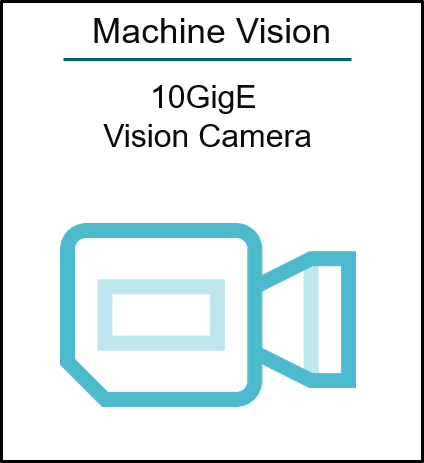
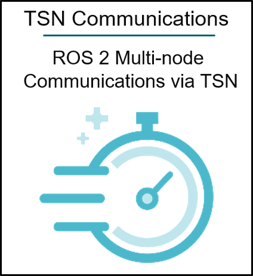
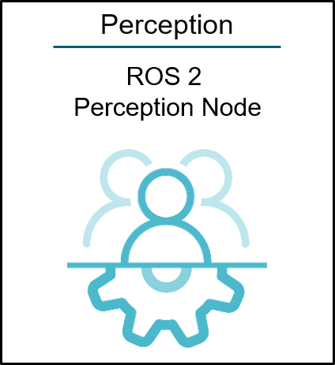
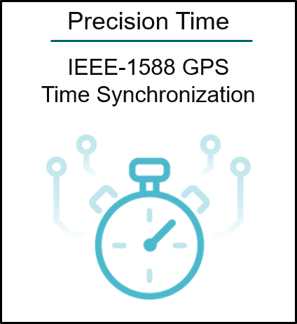
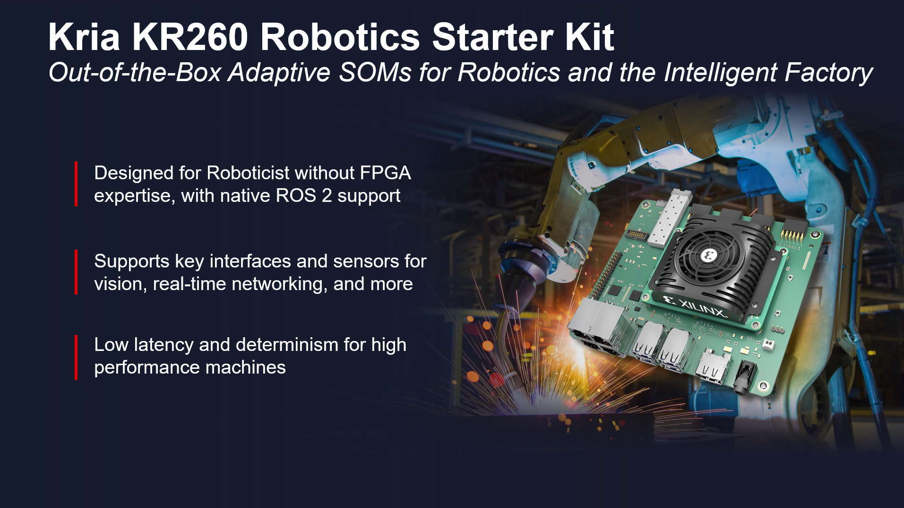

#######################################################################################
Kria KR260 Robotics Starter Kit Applications
#######################################################################################

.. include:: ../../shared/somtoctree.txt

.. image:: docs/media/bist.png
   :width: 200
   :alt: Built-In Self Test (BIST)
   :target: https://pages.gitenterprise.xilinx.com/techdocs/SOM/kr260/bist.html

.. sidebar:: Getting Started
   
   For more information, see :doc:`Getting Started with Kria KR260 Robotics Starter Kit <./docs/linux_boot>`.

.. toctree::
   :maxdepth: 3
   :caption: KR260 Applications
   :hidden:

   10GigE Vision Camera <docs/10gige_vision_camera/10gige_vision_camera_landing>
   ROS 2 Multi-Node Communications via TSN <https://pages.gitenterprise.xilinx.com/techdocs/SOM/kr260/ros2_multinode_communication_via_tsn.html>
   ROS 2 Perception Node <docs/ros2_perception_node/ros2_perception_node_landing>
   Precision Time Management <docs/gps_1588_ptp/gps_1588_ptp_precision_time_mgmt>
   Built-In Self Test (BIST) <https://pages.gitenterprise.xilinx.com/techdocs/SOM/kr260/bist.html>

.. toctree::
   :caption: KR260 Tutorials
   :maxdepth: 1
   :hidden:

   ./docs/linux_boot
   Build the Design Components <./docs/building_the_design>
   Building the Hardware Design Using Vivado <./docs/build_vivado_design>
   Create a Vitis Platform <./docs/build_vitis_platform>
   Generate Custom Firmware <./docs/generating_custom_firmware>

The AMD Kria™ KR260 Robotics Starter Kit is the latest out-of-the box ready evaluation/development platform in the `Kria <https://www.xilinx.com/products/som/kria.html>`_ portfolio of products. The Starter Kit is the platform of choice for development of robotics, machine vision, industrial communication, and control target applications. It consists of a non-production K26 SOM plugged into a robotics carrier card and equipped with an active thermal solution of fan and heatsink. The SOM on the Starter Kit is based on `Zynq UltraScale+ MPSoC <https://www.xilinx.com/products/silicon-devices/soc/zynq-ultrascale-mpsoc.html>`_ EV architecture that is paired with 4 GB of DDR4 memory.

The KR260 Starter Kit is an instant-on robotics platform. It enables hardware-accelerated applications and ROS 2 hardware accelerated packages for robotics with its Open Source Kria Robotics Stack (KRS), which make it easier for ROS 2 developers to build high-performance robots.

For a full-fledged robot, KR260 Starter Kit provides all the interfaces commonly used in robotics for vision, sensing, networking, and I/O expansions.

Networking is paramount in robotics. KR260 provides multiple Ethernet interfaces for enabling traditional DDS-UDP based communication as well as ready-to-use IP in programmable logic for accurate time synchronization over Ethernet (IEEE 802.1AS) and state of the art Time Sensitive Networking (TSN) protocol by default (even for the most demanding robotics applications).

Robotics and Machine Vision within a factory setting often demand high performance vision sensors. Standard MIPI CSI-2/D-PHY interfaces might pose limitations, with respect to bandwidth and distance. Kria KR260 Starter Kit provides the SLVS-EC standard connector for high-resolution and high-performance vision sensors.

Processing machine vision application with no loss of fidelity requires high-speed communication. A high-speed transceiver interface with an SFP+ cage enables up to 10GigE vision protocol, making the kit an ideal choice for high-performance machine vision application development. The 10G Ethernet interface can be used to support even high-performance communication for robotics, as well like digital twins or cloud-based connectivity.

Multiple I/O expansion connectors on the KR260 Starter Kit, such as four Pmod 12-pin interfaces and one Raspberry Pi HAT with 26 I/Os, enable users to plug-in their choice of peripherals, like Inertial Measurement Units (IMU), GPS sensor, brushless motor drivers, serial communication, actuators, ultrasound sensors, and many others, with no limit on developer ingenuity.

If the KR260 Starter Kit is used with actuators, manipulators or grippers, developers can plug-in one or many Pmod RS485 adapters and drive such peripherals via built-in Modbus protocol.

Equipped with four USB3.0/2.0 interfaces, KR260 enables easy connectivity to any USB peripheral, such as USB stereo camera, Lidar, Radar (or any other USB device that is required by the user).

The DisplayPort 1.2a connector helps output video data on a supported DisplayPort compatible monitor and can be used to drive real-time video feed from cameras/sensors or to interface with human operators.

For any robot, security is a priority. The KR260 Starter Kit sets a higher standard for security through the MPSoC hardware root of trust (RoT) and Infineon TPM2.0, making it one of the most secured platforms for robotics.

Enabled by a growing ecosystem of accelerated applications from the Xilinx App Store, developers of all types can get applications up and running in under one hour, with no FPGA experience needed. From there, customization and differentiation can be added via preferred design environments, at any level of abstraction—from hardware accelerated software applications to AI inference models to traditional FPGA design flows.

.. sidebar:: Kria KR260 Robotics Starter Kit eCommerce
   
   For the latest pricing and availability of the KR260 Robotics Starter Kit, check the `eCommerce site <https://www.amd.com/kr260>`_.

********************************************************
ROS 2 Support
********************************************************

Robotics developers benefit from greater flexibility that comes with native ROS 2 (Humble Hawksbill release with Ubuntu) support and increased development productivity through the Kria Robotics Stack also referred to as KRS for short.  KRS is an Open Source ROS 2 superset for industry, an integrated set of robot libraries and utilities to accelerate the development, maintenance and commercialization of industrial-grade robotic solutions while using adaptive computing. KRS provides ROS 2 users an easy and robust path to implement hardware acceleration for computationally intensive robotics functions. It allows ROS 2 roboticists to create custom secure compute architectures with higher productivity. KRS leverages Xilinx technology targeting the Kria SOM portfolio to deliver low latency (real-fast), determinism (predictable), real-time (on-time), security and high throughput to robotics applications.

With both hardware and software development requirements simplified, the KR260 Robotics Starter Kit, coupled with KRS, is the fastest and easiest platform for application development with the goal of heading towards production volume deployment with the Kria K26 SOMs. The KR260 Robotics Starter Kit is very accessible and competitively priced, it is the perfect vehicle to leverage during the development phase of your innovative robotics applications and further accelerates your time to market.

