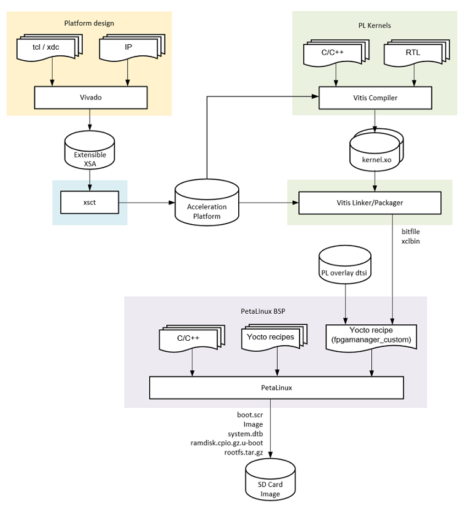

<table class="sphinxhide">
 <tr>
   <td align="center"><h1> Kria&trade; KV260 Vision AI Starter Kit Tutorial</h1>
   </td>
 </tr>
 <tr>
 <td align="center"><h1>Tool Flow Overview</h1>

 </td>
 </tr>
</table>

# Tool Flow Overview

## Introduction
 
This document provides an overview of how the hardware and software components are built for an application.

## Tool Flow

The overall tool flow is outlined in the figure below. Each step in the tool flow is explained in detail in subsequent build tutorials.



At a high level, the builds steps are as follows:

1. Vivado platform design: The Vivado design is augmented with platform parameters that describe the meta data and physical interfaces available to the Vitis compiler for stitching in PL kernels.

2. Platform creation: The XSCT utility is used to create an extensible platform whose main component is the XSA created by Vivado in step 1.

3. PL kernels: The Vitis compiler is used to compile PL accelerator kernels from C/C++ using high-level synthesis (HLS) or to package RTL kernels. The kernels are compiled into xo files and consumed by the Vitis linker in the next step.
Vitis linker and packager: The Vitis linker integrates the PL kernels into the platform and implements the design. It generates a new device image (bitfile) as well as xclbin file containing meta data information about the PL kernels. 

4. PetaLinux BSP: The PetaLinux BSP is a collection of yocto meta layers, recipes, source and config files that are used to generate a bootable SD card image. 

### Accessing the Tutorial Reference Files

1. To access the reference files, type the following into a terminal: 

  ```
  git clone --branch release-2020.2.2_k26 --recursive https://github.com/Xilinx/kv260-vitis.git
  ```

## Directory Structure

The directory structure of the repository is shown below
<pre>
kv260-vitis
+-- Makefile
+-- overlays 
¦   +-- dpu_ip 
¦   +-- examples 
¦   ¦   +-- aibox-reid
¦   ¦   +-- defect-detect
¦   ¦   +-- nlp-smartvision
¦   ¦   +-- smartcam
¦   +-- README
¦   +-- Vitis_Libraries
+-- platforms
¦   +-- Makefile
¦   +-- README
¦   +-- scripts
¦   +-- vivado
¦   ¦   +-- kv260_ispMipiRx_DP
¦   ¦   +-- kv260_ispMipiRx_vcu_DP
¦   ¦   +-- kv260_ispMipiRx_vmixDP
¦   ¦   +-- kv260_vcuDecode_vmixDP
+-- README
+-- sdcard
</pre>

## Next Steps

  * [Building the Hardware design using Vivado](build_vivado_design.md)
  * Go back to the [KV260 SOM designs start page](../index)


### License

Licensed under the Apache License, Version 2.0 (the "License"); you may not use this file except in compliance with the License.

You may obtain a copy of the License at
[http://www.apache.org/licenses/LICENSE-2.0](http://www.apache.org/licenses/LICENSE-2.0)

Unless required by applicable law or agreed to in writing, software distributed under the License is distributed on an "AS IS" BASIS, WITHOUT WARRANTIES OR CONDITIONS OF ANY KIND, either express or implied. See the License for the specific language governing permissions and limitations under the License.

<p align="center">Copyright&copy; 2021 Xilinx</p>
