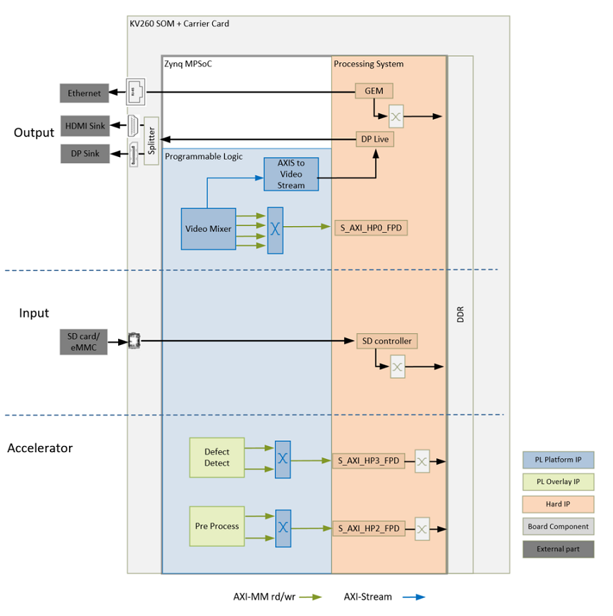

<table class="sphinxhide">
 <tr>
   <td align="center"><h1>Kria&trade; KV260 Vision AI Starter Kit Defect Detection Tutorial</h1>
   </td>
 </tr>
 <tr>
 <td align="center"><h1>Hardware Architecture of the Platform</h1>

 </td>
 </tr>
</table>

# Hardware Architecture of the Platform

## Introduction

This section describes the design implemented in Programmable Logic (PL). The following figure shows the top-level hardware architecture of the reference design.

At a high level, the design comprises of three pipelines:

* Capture/Input pipeline: This comprises of pipelines through which video data is captured.

    * Capture images from a file source (PS)

* Display/Output pipeline: This comprises of pipelines through which video data is output.

    * DisplayPort pipeline (PL + PS)
    * Ethernet pipeline (PS)

* Accelerator pipeline: This comprises of overlay accelerator functions integrated into the platform using Vitis.

    * The Pre-Process block modifies the input data as required by the Defect Detection function (PL).
    * The Defect Detection block identifies defects in a mango (PL + PS).
    * Both Pre-Process and Defect Detection use Vitis Vision Library functions.

> **Note**: The PS interconnects in the figure are conceptual.

## Capture

The captured image from a file is provided to the accelerator. For more information how images on the SD card are accessible from the PS refer to the SD controller section of the Zynq UltraScale+ Device Technical Reference Manual [UG1085](https://www.xilinx.com/support/documentation/user_guides/ug1085-zynq-ultrascale-trm.pdf).

> Note: The vivado platform design includes PL components which enable capture from a MIPI sensor, but this feature will only be supported in the next release.  

## Display

An output pipeline reads video frames from memory and sends the frames to a sink. In this case, the sink is a display port in the PS. The display pipeline is shown in the following figure.

This PL pipeline consists of four components, two of which are controlled by the APU via an AXI Lite base register interface and the other two are statically configured.

  * The Video Mixer IP core is configured to support blending of up to four overlay layers into one single output video stream. The four layers are configured to be memory-mapped AXI4 interfaces connected to the PS via interconnects. The primary AXI-MM layer has the resolution set to match the display. The other layers, whatever their resolution, is blended with this layer. In this design, the overlay layers are configured to be Y8, while the AXI4-Stream  output from the mixer is set to YUV 422 format. A GPIO is used to reset the subsystem between resolution changes. For more information, refer to  Video Mixer LogiCORE IP Product Guide  [PG243](https://www.xilinx.com/support/documentation/ip_documentation/v_mix/v1_0/pg243-v-mix.pdf).

  * The AXIS subset converter passes the LSBs to the Video Out converter and drops the MSB.

  * All video systems require management of video timing signals, which are used to synchronize processes. The Video Timing Controller (VTC) serves the function of both detecting and generating these timing signals. In this design, it generates timing control signals which are used by the  AXI4-Stream to Video Out converter to produce native video output signals.For more information refer to Video Timing Controller Product Guide [PG016](https://www.xilinx.com/support/documentation/ip_documentation/v_tc/v6_2/pg016_v_tc.pdf).

  * AXI4-Stream to Video Out core provides a bridge between video processing cores with AXI4-Stream interfaces and native video output (parallel video data, video syncs, and blanks). The core works with the Xilinx Video Timing Controller (VTC) core. The synchronizer section of the core synchronizes timing from the VTC to the video data from the AXI4-Stream Bus. For more information, refer to AXI4-Stream to Video Out LogiCORE IP Product Guide [PG044](https://www.xilinx.com/support/documentation/ip_documentation/v_axi4s_vid_out/v4_0/pg044_v_axis_vid_out.pdf).

  * The output from the AXI4-Stream to Video Out Converter goes through SOM slices and concat blocks to drive the DisplayPort Live signals on the PS. The slices and concat are required to the adhere to the Live Video data format.  For more information on DisplayPort Controller in Live mode, refer to the Zynq UltraScale+ Device Technical Reference Manual [UG1085](https://www.xilinx.com/support/documentation/user_guides/ug1085-zynq-ultrascale-trm.pdf).

## Clocks, Resets and Interrupts

### Clocks

The following table identifies the main clocks of the PL design, their source, their clock frequency, and their function.

| Clock      | Clock Source  | Clock Frequency     | Function |
| :---       |    :----:     |         :---:       | :-----  |
| pl_clk0 | PS | 100 MHz | Clock source for clocking wizard (clk_wiz_0) generating clocks |
| clk_100M* |	Clocking wizard	| 100 MHz	 | AXI-Lite clock to configure the different video IPs in the design.|
| clk_275M* |	Clocking wizard |	275 MHz |	AXI MM clock and AXI Stream clock used in the capture pipeline, display pipeline, and processing pipeline|
| clk_50M |	Clocking wizard |	50 MHz |	PLL reference clock for the VCU IP |
| clk_550M* |	Clocking wizard |	550 MHz	| Generated to be used by the accelerator |
| clk_out1 |	Clocking wizard |	Variable |A clocking wizard with an AXI control interface is used in the display path. Based on the video resolution, the software can configure the required clock frequency through the AXI control interface. The output clock is used to drive the Video Timing Controller, AXI Stream to Native Video converter, and the DP Live clock port on the PS.  |

> \*Clocks that are exposed as a Platform interface and can be used by an accelerator.
____

### Resets

The following table summarizes the resets used in this design.

| Reset Source | Function  |
| :---         |    :----  |
|pl_resetn0		|PL reset for proc_sys_reset modules and the clock_wizard generating clocks for the video domain |
|rst_processor_100MHz	|Synchronous resets for clk_out100M clock domain						 |
|rst_processor_275MHz	|Synchronous resets for clk_out275M clock domain						 |
|rst_processor_550MHz	|Synchronous resets for clk_out550M clock domain						 |
|pros_sys_reset_0|Synchronous resets for clk_out1 clock domain|
|GPIOs			|												 |
|emio_gpio_o[0]		|Video Mixer Reset								 |
|emio_gpio_o[1]		|Frame Buffer Write Reset										 |
|emio_gpio_o[2]		|AP1302 ISP Reset										 |
____

### Interrupts

The following table lists the PL-to-PS interrupts used in this design.

| Interrupt ID | Instance  |
| :---        |    :----  |
|pl_ps_irq1[0]	| Video Mixer IP						    |
|pl_ps_irq1[1]	| Video Timing Controller IP 					    |
|pl_ps_irq1[2]	| AXI I2C IP 							    |
|pl_ps_irq1[4]	| Frame Buffer Write IP						    |
|pl_ps_irq0	| Exposed as a Platform interface and can be used by an Accelerator |

____

## Resource Utilization
The resource utilization numbers on this platform post implementation is reported in the table below.

| Resource  | Utilization  | Avaialble  | Utilization %  |
| :---      |    :----     | :---       |    :----       |
|LUT	|17412	|117120	|14.87	 |
|LUTRAM	|1057	|57600	|1.84	 |
|FF	|32592	|234240	|13.91	 |
|BRAM	|19.5	|144	|13.54	 |
|URAM	|8	|64	|12.50	 |
|DSP	|1	|1248	|0.08	 |
|IO	|23	|186	|12.37	 |
|BUFG	|11	|352	|3.13	 |
|MMCM	|2	|4	|50.00	 |
|PLL	|1	|8	|12.50	 |
 

## Next Steps

*  [Hardware Accelerator Architecture](hw_arch_accel_dd.md)
* Go back to the [KV260 Defect detect design start page](../defectdetect_landing)

### License

Licensed under the Apache License, Version 2.0 (the "License"); you may not use this file except in compliance with the License.

You may obtain a copy of the License at
[http://www.apache.org/licenses/LICENSE-2.0](http://www.apache.org/licenses/LICENSE-2.0)

Unless required by applicable law or agreed to in writing, software distributed under the License is distributed on an "AS IS" BASIS, WITHOUT WARRANTIES OR CONDITIONS OF ANY KIND, either express or implied. See the License for the specific language governing permissions and limitations under the License.

Copyright&copy; 2021 Xilinx

