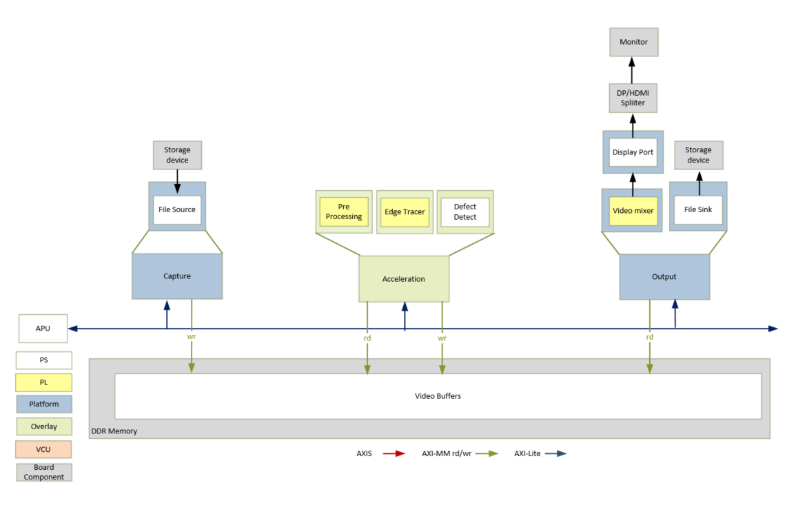
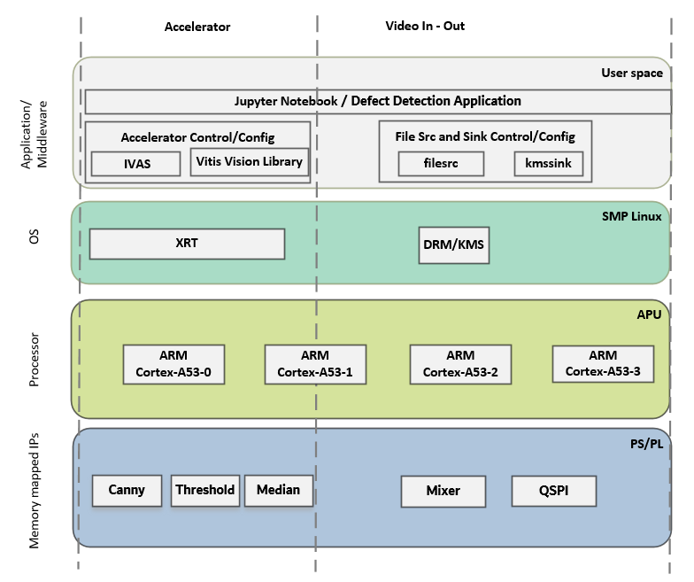

<table class="sphinxhide">
 <tr>
   <td align="center"><h1>Kria&trade; KV260 Vision AI Starter Kit Defect Detection Tutorial</h1>
   </td>
 </tr>
 <tr>
 <td align="center"><h1>Design Overview</h1>

 </td>
 </tr>
</table>

# Design Overview

## Introduction

Mango, known as the king of fruits, is an essential product that graces many a kitchen. This juicy delicacy is processed into many forms such as pulp, drinks, jams, pickles, and many more tasty products. The [Statistia website](https://www.statista.com/statistics/577951/world-mango-production/) estimates that about 52 million metric tons of mangoes are produced each year globally, and that production rises each year. A large percentage of mangoes are exported, bringing in a considerable influx of foreign exchange.

Given the importance of the mango in both household and export contexts, it is vital that each mango be without a single blemish of any kind. Due to the large volumes of mangoes produced, it is practically impossible to manually examine each mango for defects. An automated way of marking defects is the need of the hour.

The Defect Detection application uses Vitis Vision libraries to examine each mango and mark its defects. This helps farmers sell their best mangoes to bring in enhanced revenue, and results in a win-win situation for both the farmers and the consumers.

Get on with the times! Use the Xilinx automated Defect Detection application to select the best for those demanding, discerning customers.

## Defect Detection Application 

This is a getting started document for Defect Detection Accelerated Application developed on Xilinx SOM embedded platform. This document covers various components such as Hardware, Software, Design, Test Environment and more.

The SOM platform is a computer vision application platform that is capable of sourcing input data from a file, accelerating the core application algorithm in hardware, and then sending the output to DP/HDMI-Tx/File.

The following table lists the specific hardware (SOM + Carrier card) and the associated peripherals used in the Defect Detection accelerated application.

| HW Component| Definition|
| ----------- | ----------- |
| SOM-K26     | K26 SOM with Zynq® UltraScale+™ MPSoC |
|Carrier Card (CC)-KV260 | The board that the SOM is plugged into is called the Carrier Card| 
____

The Defect Detection reference design has the following pipelines:

* Capture Pipeline – Capture images of mangoes from the file.
* Acceleration Pipeline:
   * Pre-Process Pipeline – Pre-Process received images as required for the processing function
   * Edge Tracer Pipeline – Detect and draw the edges
   * Defect Calculation Pipeline - Draw contour and embed defect results on image.
* Display Pipelines – Display detection results and images of the mango at various stages

The following figure shows the various pipelines supported by the design.

The application processing unit (APU) in the Processing System (PS) consists of four ARM Cortex-A53 cores and is configured to run in symmetric multi-processing (SMP) Linux mode in the  design. The application running on Linux is responsible for configuring and controlling the video pipeline and accelerators using Jupyter notebooks or the application. The following figure shows the software state after the boot process has completed and the individual applications have been started on the APU. Details are described in the [Software Architecture document](sw_arch_platform_dd.md).

The APU application controls the following video data paths implemented in a combination of the PS and PL:

* Capture pipeline capturing video frames into DDR memory from
   * A file on a storage device such as an SD card

* An output pipeline reads video frames from memory and sends the frames to a sink.
   * The sink is a display/file storage.
   * The DP controller subsystem in the PS is coupled to the STDP4320 De-multiplexer on the carrier card. STDP4320 consists of dual mode output ports configured as DP/HDMI.

## Key Features of the Defect Detection Application

The Defect Detection application detects defects in a mango. The application supports file-based use cases.

File-based usage accepts the input GRAY8 file (Y8 format) and returns three outputs in GRAY8 format.

Note: The Y8 file is playable using a YUV player. As the Y8 file is a raw file, you may need to drag and drop the file to the player of your choice, and set the proper size (width=1280, height=800) and use Y color format.

The output can come from any of the following stages of processing:

* Stage 1 of the output belongs to input GRAY8 data
* Stage 2 of the output belongs to pre-processed pipeline
* Stage 3 of the output belongs to the final stage defect detection pipeline

## Various Components Used in this Application

 
<b>Tools</b>

* Xilinx Tools
  * Vitis&trade;: 2021.1 (Early development is 2020.2.2)
  * PetaLinux&trade;: 2021.1 (Early development is 2020.2.2)
  * SOM Vitis platform which will be provided by Xilinx.
  * Vivado&trade; tool: 2021.1(Early development is 2020.2.2)

  

 
<b>Hardware</b>

* Hardware Components

  * Target platforms and extensions

    * Kria&trade; KV260 Vision AI Starter Kit including:

        * DP splitter on the carrier card
  

  * Hardware interfaces and IP
    * Video Inputs
      * File
   
    * Video Outputs
      * File
      * DisplayPort/HDMI

    * Auxiliary Peripherals
      * QSPI
      * SD
      * I2C
      * UART
      * Ethernet
      * General-purpose I/O (GPIO)

 
<b>Software</b>

* Software Components

  * Video Processing: Vitis Vision library accelerator functions

  * Operating System
    * APU: SMP Linux
  * Linux Kernel Subsystems
    * Display: Direct Rendering Manager (DRM)/Kernel Mode Setting (KMS)

  * Linux User Space Frameworks
    * Jupyter Notebook
    * GStreamer / Xilinx IVAS
    * Xilinx runtime (XRT)

## Next Steps

*  [Setting up the Board and Application deployment](app_deployment_dd.md)
* * Go back to the [KV260 Defect detect design start page](../defectdetect_landing)

## References

* Kria KV260 Vision AI Starter Kit User Guide ([UG1089](https://www.xilinx.com/docs/cgi-bin/rdoc?t=som-doc;v=latest;d=ug1089-kv260-starter-kit.pdf))
* Kria SOM Carrier Card Design Guide ([UG1091](https://www.xilinx.com/cgi-bin/docs/rdoc?t=som-doc;d=ug1091-carrier-card-design.pdf))
* Kria KV260 Vision AI Starter Kit Data Sheet([DS986](https://www.xilinx.com/cgi-bin/docs/ndoc?t=data_sheets;d=ds986-kv260-starter-kit.pdf))
* Kria K26 SOM Data Sheet([DS987]( https://www.xilinx.com/cgi-bin/docs/ndoc?t=data_sheets;d=ds987-k26-som.pdf))

### License

Licensed under the Apache License, Version 2.0 (the "License"); you may not use this file except in compliance with the License.

You may obtain a copy of the License at
[http://www.apache.org/licenses/LICENSE-2.0](http://www.apache.org/licenses/LICENSE-2.0)

Unless required by applicable law or agreed to in writing, software distributed under the License is distributed on an "AS IS" BASIS, WITHOUT WARRANTIES OR CONDITIONS OF ANY KIND, either express or implied. See the License for the specific language governing permissions and limitations under the License.

Copyright&copy; 2021 Xilinx

