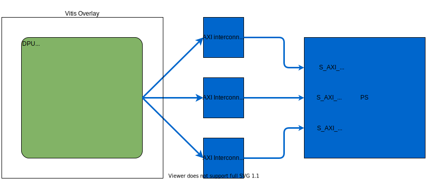

<table class="sphinxhide">
 <tr>
   <td align="center"><h1> Kria&trade; K260 SOM Starter Kit NLP SmartVision Tutorial</h1>
   </td>
 </tr>
 <tr>
 <td align="center"><h1> Hardware Architecture of the Accelerator </h1>

 </td>
 </tr>
</table>

# Hardware Architecture of the Accelerator

## Preprocessing IPs and DPU

The Vitis&trade; software platform overlay includes DPU, as shown in the following figure.

The DPU IP can be configured, and for this design, the following features should be enabled:

* Channel augmentation
* Depth-wise convolution
* Average pooling
* Relu, LeakyRelu and Relu6
* URAM enable

To learn more about the DPU, please refer the [PG338](https://www.xilinx.com/support/documentation/ip_documentation/dpu/v3_2/pg338-dpu.pdf)

As shown in the following table, we integrate the DPU in the nlp_smartvision platform. We analysis the utilization and do some optimizations of the whole hardware design.

|Resource usage of current design (estimated)|
|-|

||LUTs|BRAM|DSP|URAM|
|----|----|---|----|--|
|K26 Resource|117120|144|1248|64|
|Platform(4K)|24425|43.5|46|1|
|DPU B3136|45517|67|548|44|
|Total used|50%|76.7%|47.6%|70.3%|

As shown in the following table, we estimated DPU performance and overall power on K26 chip (including all the other IPs). The DPU is assumed to run at 300MHz.

|DPU performance and power (estimated)|
|-|

||TOPS (Peak)|TOPS (DenseBox)1|Power (Overall)2
|-|-|-|-|
|B3136|0.92|0.25|7.9W

**Note:**

1. We use DenseBox_640x360 model to estimate the real performance of DPU, and this model has 1.1GOPs;
2. We can only estimate the overall power of K26 (including DPU and other IPs)

As shown in Table 3, DPU B3136 bandwidth requirements.

|Table 3 – DPU B3136 bandwidth requirements|
|-|

|Operation|Peak|Average|
|-|-|-|
|Write (MB/s)|1300|440
|Read (MB/s)|6200|2600

## Next Steps

* [Software Architecture of the Platform](sw_arch_platform_nlp.md)
* Go back to the [KV260 NLP Smartvision design start page](../nlp_smartvision_landing)

## References

DPU

* [https://github.com/Xilinx/Vitis-AI/tree/master/dsa/DPU-TRD](https://github.com/Xilinx/Vitis-AI/tree/master/dsa/DPU-TRD)
* [https://www.xilinx.com/support/documentation/ip_documentation/dpu/v3_2/pg338-dpu.pdf](https://www.xilinx.com/support/documentation/ip_documentation/dpu/v3_2/pg338-dpu.pdf)

### License

Licensed under the Apache License, Version 2.0 (the "License"); you may not use this file except in compliance with the License.

You may obtain a copy of the License at
[http://www.apache.org/licenses/LICENSE-2.0](http://www.apache.org/licenses/LICENSE-2.0)

Unless required by applicable law or agreed to in writing, software distributed under the License is distributed on an "AS IS" BASIS, WITHOUT WARRANTIES OR CONDITIONS OF ANY KIND, either express or implied. See the License for the specific language governing permissions and limitations under the License.

Copyright&copy; 2021 Xilinx

