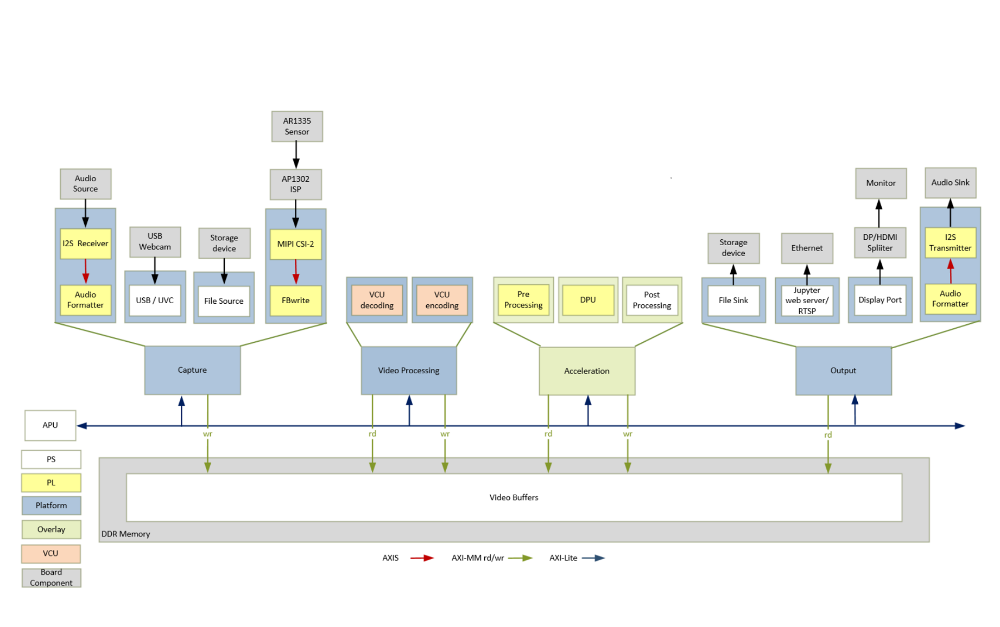

<table class="sphinxhide">
 <tr>
   <td align="center"><h1> Kria&trade; KV260 Vision AI Starter Kit Smart Camera Tutorial</h1>
   </td>
 </tr>
 <tr>
 <td align="center"><h1> Design Overview </h1>

 </td>
 </tr>
</table>

# Design Overview

## Introduction

The Smart Camera application design built on KV260 Vision AI Starter Kit provides a framework for building and customizing video platforms that consist of four pipeline stages:

* Capture pipeline
* Video processing pipeline
* Acceleration pipeline
* Output pipeline

The design has a platform and integrated accelerator functions. The platform consists of Capture pipeline, Output pipeline and some video processing functions. This approach makes the design leaner and provides maximum programmable logic (PL) for the accelerator development. The platform supports capture from MIPI single sensor device, a USB webcam and a file source. The output can be stored as files, passed forward via ethernet using the Real Time transport protocol (RTP) or displayed on DisplayPort/HDMI monitor. Along with video the platform also supports audio capture and playback.

Some video processing functions are performed on hard blocks like the Video Codec Unit (VCU) since it is most performant to do so. Video decoding/decompression and encoding/compression is done using the VCU.

The following example acceleration functions can be run on this platform using programmable deep learning processor units (DPU)

* Face Detection  - Network model: Densebox_640_360
* Cars, Bicycles, and Person Detection for ADAS -  Network model: ssd_adas_pruned_0_95
* Pedestrian Detection - Network model: refinedet_pruned_0_96

An example usecase for this design is as an endpoint security camera.

The following figure shows the various pipelines supported by the design.

The application processing unit (APU) in the Processing Sytem (PS) consists of four Arm&reg; Cortex&reg;-A53 cores and is configured to run in symmetric multi-processing (SMP) Linux mode in the  design. The application running on Linux is responsible for configuring and controlling the audio/video pipelines and accelerators using Jupyter notebooks or the smartcam application.

The APU application controls the following video data paths implemented in a combination of the PS and PL:

* Capture pipeline capturing video frames into DDR memory from
  * A file on a storage device such as an SD card
  * A USB webcam using the USB interface inside the PS
  * An image sensor connected via MIPI CSI-2 RX through the PL

* I2S Rx subsystem via Digilent PMOD I2S2 captures audio along with video.

* Memory-to-memory (M2M) pipeline implementing a neural net Inference Application. In this design the neural net is implemented in DPU, preprocessed video frames are read from DDR memory, processed by the DPU, and then written back to memory.

* An output pipeline reads video frames from memory and sends the frames to a sink.
  * In this case the sink is a display or VCU encoded stream through Ethernet.
  * In the display pipeline sink is a monitor, DP controller subsystem in the PS is coupled to STDP4320 De-multiplexer on the carrier card. STDP4320 consists of dual mode output ports configured as DP and HDMI.

* Along with video, the I2S TX subsystem via Digilent PMOD I2S2 forwards audio data to a speaker.

The following figure shows an example end-to-end pipeline which could be a single image sensor as the video source, Pre-process and DPU IPs for application NN Inference. The inferred frames are either VCU encoded and streamed via RTP network protocol for delivering audio and video over IP networks or the video frames are displayed via DP splitter onto a DP and HDMI port for display, as the video sink. The figure also shows the image processing blocks used in the capture path. The video format in the figure is the output format on each block. Details are described in the [Hardware Architecture document](hw_arch_platform.md).

## Design Components

 
<b>Hardware components</b>

  * KV260 Vision AI Starter Kit including
    * On Semi AP1302 Image Signal Processor (https://www.onsemi.com/products/sensors/image-sensors-processors/image-processors/ap1302) on the carrier card
    * HDMI-DP splitter on the carrier card
    * On Semi AR1335 CMOS Image sensor (https://www.onsemi.com/products/sensors/image-sensors-processors/image-sensors/ar1335)
    * Digilent's Pmod™ I2S2 Stereo Audio Input and Output (https://store.digilentinc.com/pmod-i2s2-stereo-audio-input-and-output/)

 
<b>Interfaces and IP</b>

* Video inputs
   * File
   * USB webcam
   * MIPI CSI-2 Rx
* Video outputs
   * DisplayPort/ HDMI
   * File
   * Ethernet - Jupyter notebook/RTSP
* Audio inputs
   * I2S receiver
* Audio outputs
   * I2S transmitter
* Video processing
   * VCU decoding and encoding
   * Accelerator functions on DPU
   * PL and PS based pre and post processing specific to a accelerator function
* Auxiliary Peripherals
   * QSPI
   * SD
   * I2C
   * UART
   * Ethernet
   * General purpose I/O (GPIO)

 
<b>Software components</b>

* Operating system
   * APU: SMP Linux
* Linux kernel subsystems
   * Video source: Video4 Linux (V4L2)
   * Display: Direct Rendering Manager (DRM)/Kernel Mode Setting (KMS)
* Linux user space frameworks
   * Jupyter
   * GStreamer / Xilinx IVAS
   * Vitis AI
   * Xilinx run-time (XRT)

 

 

 
<b>Resolution and Format Supported</b>

* Resolutions
   * 1080p30
   * 2160p30
   * Lower resolution and lower frame rates for USB and file I/O
* Pixel format
   * YUV 4:2:0 (NV12)
 

&nbsp;

## Next Steps

* [Setting up the Board and Application Deployment](app_deployment.md)
* Go back to the [KV260 SOM Smart camera design start page](../smartcamera_landing)

## References

* Kria KV260 Vision AI Starter Kit User Guide ([UG1089](https://www.xilinx.com/cgi-bin/docs/rdoc?t=som-doc;v=latest;d=ug1089-kv260-starter-kit.pdf))
* Kria SOM Carrier Card Design Guide ([UG1091](https://www.xilinx.com/cgi-bin/docs/rdoc?t=som-doc;d=ug1091-carrier-card-design.pdf))
* Kria KV260 Vision AI Starter Kit Data Sheet([DS986](https://www.xilinx.com/cgi-bin/docs/ndoc?t=data_sheets;d=ds986-kv260-starter-kit.pdf))
* Kria K26 SOM Data Sheet([DS987]( https://www.xilinx.com/cgi-bin/docs/ndoc?t=data_sheets;d=ds987-k26-som.pdf))

### License

Licensed under the Apache License, Version 2.0 (the "License"); you may not use this file except in compliance with the License.

You may obtain a copy of the License at
[http://www.apache.org/licenses/LICENSE-2.0](http://www.apache.org/licenses/LICENSE-2.0)

Unless required by applicable law or agreed to in writing, software distributed under the License is distributed on an "AS IS" BASIS, WITHOUT WARRANTIES OR CONDITIONS OF ANY KIND, either express or implied. See the License for the specific language governing permissions and limitations under the License.

Copyright&copy; 2021 Xilinx

