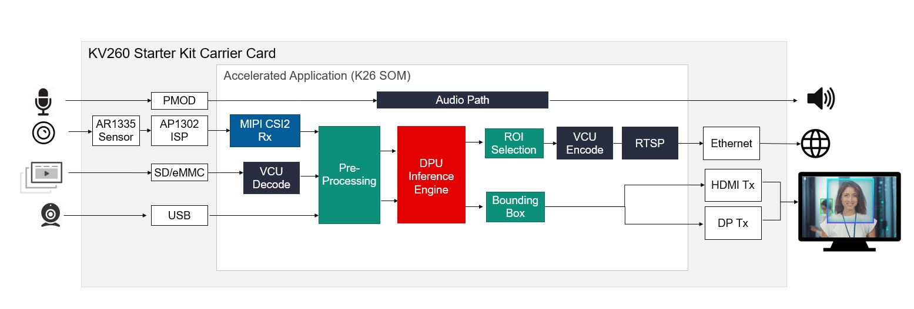

##################################################
Smart Camera
##################################################

The Smart camera implements face detection with network and display functionality. It comes with built-in machine learning for applications such as pedestrian detection, face detection, and people counting with local display and RTSP streaming.

*******************************
Overview
*******************************

.. toctree::
  :maxdepth: 1
  
  Introduction <docs/introduction>

Features
================================

* 4k resolution images from a sensor
* H.264/H.265 encode/decode
* HDMI or DisplayPort or RTSP out
* User programmable Deep Learning models

*******************************
Quick Start
*******************************

.. toctree::
  :maxdepth: 1
  
  Setting up the Board and Application deployment <docs/app_deployment>

***************************
Tutorials
***************************

.. toctree::
  :maxdepth: 1
  
  Customizing AI Models used in the Application <docs/customize_ai_models>
  Building the Design components <../building_the_design>
  Building the Hardware design using Vivado <../build_vivado_design>
  Creating a Vitis Platform <../build_vitis_platform>
  Integrating an overlay into the platform <../build_accel>
  Building a Petalinux Image <../build_petalinux>

******************
Architecture
******************

.. toctree::
  :maxdepth: 1
  
  Software Architecture - Platform <docs/sw_arch_platform>
  Software Architecture - Accelerator <docs/sw_arch_accel>
  Hardware Architecture - Platform <docs/hw_arch_platform>
  Hardware Architecture - Accelerator <docs/hw_arch_accel>

******
Other
******

.. toctree::
  :maxdepth: 1
  
  Debugging <docs/debug-sc>
  Known Issues <docs/issue-sc>

Xilinx Support
====================================

GitHub issues will be used for tracking requests and bugs. For questions, go to `forums.xilinx.com <http://forums.xilinx.com/>`_.

License
------------------------------

Licensed under the Apache License, Version 2.0 (the "License"); you may not use this file except in compliance with the License.

You may obtain a copy of the License at `apache.org/licenses/LICENSE-2.0 <http://www.apache.org/licenses/LICENSE-2.0>`_.

Unless required by applicable law or agreed to in writing, software distributed under the License is distributed on an "AS IS" BASIS, WITHOUT WARRANTIES OR CONDITIONS OF ANY KIND, either express or implied. See the License for the specific language governing permissions and limitations under the License.
