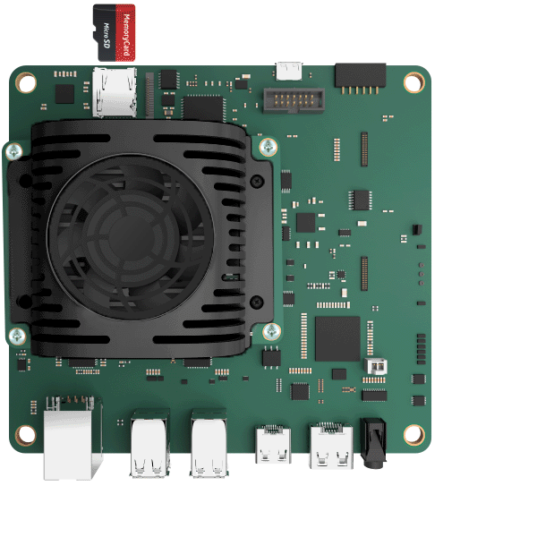

# Step 2: Connect Everything

The following are the key connections for the AMD Kria™ KV260 Vision AI Starter Kit:

1. Insert the microSD card containing the boot image in the microSD card slot (J11) on the Starter Kit.
2. Get your USB-A to micro-B cable (a.k.a. micro-USB cable), which supports data transfer.* Do not connect the USB-A end to your computer yet. Connect the micro-B end to J4 on the Starter Kit.
3. Connect your USB keyboard/mouse to the USB ports (U44 and U46).
4. Connect the IAS Camera Module to J7 (or USB camera module to U44 or U46).
5. Connect to a monitor/display with the help of a DisplayPort/HDMI cable.
6. Connect the Ethernet cable for required internet access.
7. Grab the Power Supply and connect it to the DC jack (J12) on the Starter Kit. Do not insert the other end to the AC plug yet.

At this point, a supported USB camera/webcam can be connected to the Starter Kit instead of the IAS Camera module. There is also an option to connect to DisplayPort instead of HDMI but for this you must have a DisplayPort cable and supported DisplayPort monitor. Connecting to a USB keyboard and mouse is optional but is recommended for optimal experience.

* Note that not all micro-USB cables support data transfer—some micro-USB cables are for charging only and will not work with the starter kit.

## Next Step

Jump to [Step 3: Connect to UART Serial Port](./uart.md).

Copyright&copy; 2023 Advanced Micro Devices, Inc

