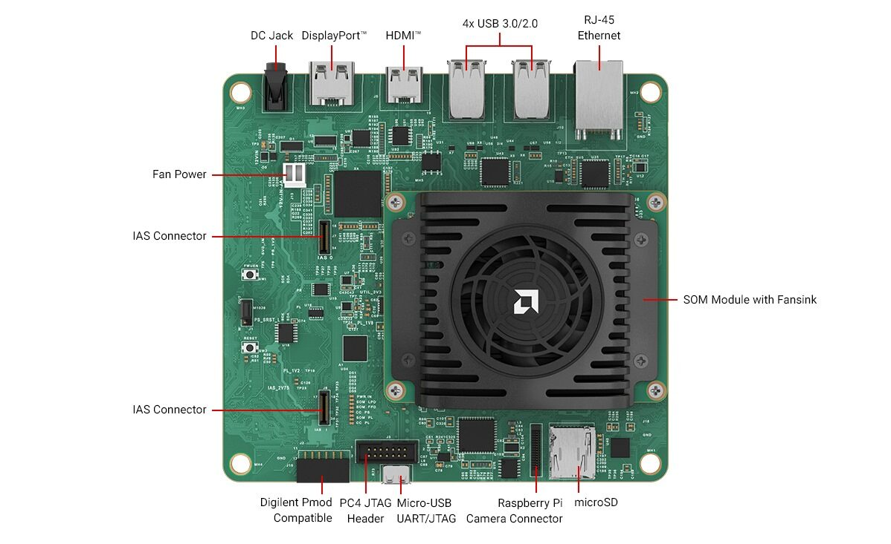

# Booting Kria Starter Kit Linux on KV260 - Embedded Linux

## Introduction

The AMD Kria™ KV260 Vision AI Starter Kit is the premier platform to evaluate your Vision AI based applications. Try all our accelerated applications and get started within minutes by following all the steps. Have fun!



## What's Inside the Box

* [Kria KV260 Drives Starter Kit](https://www.amd.com/en/products/system-on-modules/kria/k26/kv260-vision-starter-kit.html) (Kria K26 SOM + vision carrier card + thermal solution)
* Getting Started doc
* Developer stickers

## What You’ll Need to Provide

Our [Basic Accessory Pack](https://www.amd.com/en/products/system-on-modules/kria/k26/kv260-vision-starter-kit/basic-accessory-pack.html) has all the items listed below, or you can choose to use your own:

* Barrel Jack Power supply (12V, 3A)
* MicroSD card [16GB UHS-1]
* Micro-USB to USB-A cable
* AR1335 IAS camera module
* Ethernet cable
* HDMI cable or a display port cable to connect to a monitor
* a monitor

Use of a USB keyboard is optional. Instead of an AR1335 camera module, you can use a USB camera/webcam. The Starter Kit also has a DisplayPort™ interface if you want to use it instead of HDMI.

You will also need the following to interact with the KV260 starterkit:

* Host PC running Windows, MacOS, or Linux
* Ability to write a microSD card image (through integrated PC slot or USB card reader)
* Local area network with internet connection used for software and application updates

## Important:  Perform Shutdown Command Before Removing Power

Running the shutdown command enables Linux to bring the system down in a secure manner, ensuring that disk writes complete before storage devices are unmounted.
For best practice, this should be performed each time before removing power

```sudo shutdown -h now```

## PetaLinux/embedded Linux vs Ubuntu

Ubuntu is the best choice for getting started with the KV260. This tutorial is for booting PetaLinux 2021.1 on KV260 - 2021.1 is the last version of PetaLinux that officially supports example applications. The same steps can be used to boot other PetaLinux or embedded Linux versions, but example applications may not be supported on those versions. 


[Access Booting Kria Starter Kit Linux on KV260 tutorial HERE](./sdcard.md)

### Additional Embedded Developer Assets and Resources

For embedded developers looking to directly use PetaLinux BSPs for application development and deployment, the latest PetaLinux BSPs are available on the [Kria SOM Wiki](https://xilinx-wiki.atlassian.net/wiki/spaces/A/pages/1641152513/Kria+SOMs+Starter+Kits#K26-Embedded-Linux-(Yocto))

## Next Step

Jump to [Step 1: Set up the SD Card Image](./sdcard.md).


<p class="sphinxhide" align="center">Copyright&copy; 2023 Advanced Micro Devices, Inc</p>
