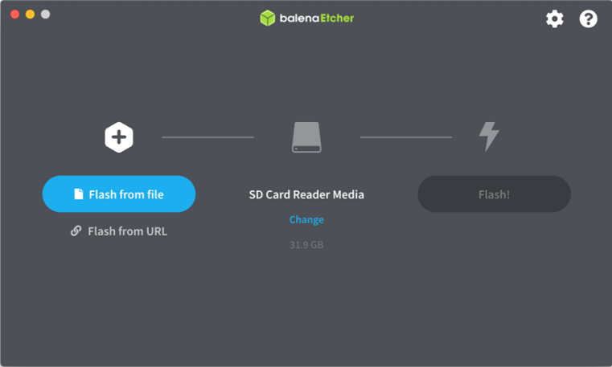
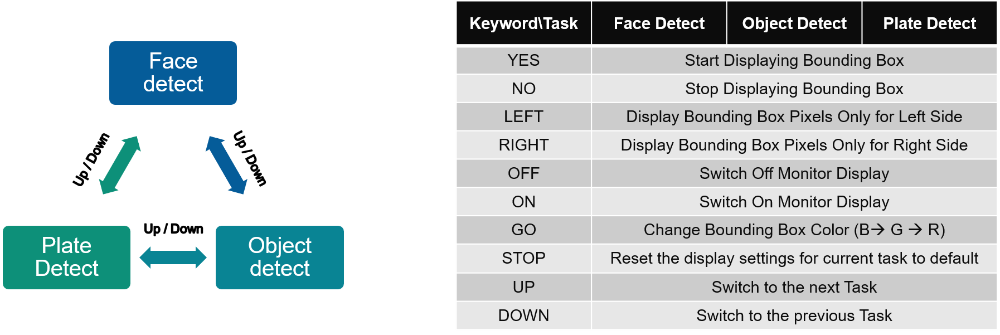

<table class="sphinxhide">
 <tr>
   <td align="center"><h1> Kria&trade; KV260 Vision AI Starter Kit NLP SmartVision Tutorial</h1>
   </td>
 </tr>
 <tr>
 <td align="center"><h1>Setting up the Board and Application Deployment</h1>

 </td>
 </tr>
</table>

# Setting up the Board and Application Deployment

## Introduction

This document shows how to set up the board and run the nlp-smartvision application.

## Setting up the Board

1. Flash the SD Card

   * Download  the [SD Card Image](https://www.xilinx.com/member/forms/download/xef.html?filename=petalinux-sdimage-2021.1-update1.wic.xz) and save it on your computer.
   
   * Connect the microSD to your computer.

   * Download the [Balena Etcher tool](https://www.balena.io/etcher/) (recommended; available for Window, Linux, and
    macOS) required to flash the SD card.

   * Follow the instructions in the tool and select the downloaded image to flash onto your microSD card.

    

   * Eject the SD card from your computer.

    If you are looking for other OS specific tools to write the image to the SD card refer to [KV260 Getting Started Page](https://www.xilinx.com/products/som/kria/kv260-vision-starter-kit/kv260-getting-started/setting-up-the-sd-card-image.html)

2. Hardware Setup:

    

    * Monitor:

      Before booting, connect the monitor which supports 1024x768 resolution to the board via DP/HDMI port.
    * IAS sensor:

      Before power on, install an AR1335 sensor module in J7. Make sure there is no other camera interface connected to the setup.

    * UART/JTAG interface:

      For interacting and seeing boot-time information, connect a USB debugger to the J4.

    * USB Microphone:

      Connect the microphone to any of the USB ports.

    * Network connection:

      Connect the Ethernet cable to your local network with DHCP enabled.

3. Power on the board, and boot the Linux image.

    The Linux image will boot into the following login prompt:

    `xilinx-k26-starterkit-2020_2 login:`

    Use the `petalinux` user for login. You will be prompted to set a new password
    on the first login.

    ```bash
    xilinx-k26-starterkit-2020_2 login: petalinux
    You are required to change your password immediately (administrator enforced)
    New password:
    Retype new password:
    ```

    The `petalinux` user does not have root privileges. Most commands used in subsequent tutorials have to be run using `sudo` and you may be prompted to enter your password.

    **Note:** The root user is disabled by default due to security reasons. If you want to login as root user, follow the below steps. Use the petalinux user's password on the first password prompt, then set a new password for the root user. You can now login as root user using the newly set root user password.

    ```bash
    xilinx-k26-starterkit-2020_2:~$ sudo su -l root

    We trust you have received the usual lecture from the local System
    Administrator. It usually boils down to these three things:

        #1) Respect the privacy of others.
        #2) Think before you type.
        #3) With great power comes great responsibility.

    Password:
    root@xilinx-k26-starterkit-2020_2:~# passwd
    New password:
    Retype new password:
    passwd: password updated successfully
    ```

4. Get the latest application package.

    1. Check the package feed for new updates.

       ```bash
       sudo dnf update
       ````

       Confirm with "Y" when prompted to install new or updated packages.

       Sometimes it is needed to clean the local dnf cache first. To do so, run:

       ```bash
       sudo dnf clean all
       ````

    2. Get the list of available packages in the feed.

        `sudo xmutil getpkgs`

    3. Install the package with dnf install:

        `sudo dnf install packagegroup-kv260-nlp-smartvision.noarch`

    Note: For setups without access to the internet, it is possible to download and use the package locally. Please refer to the [Install from a local package feed](../../local_package_feed.md) for instructions.

5. Dynamically load the application package.

    1. Show the list and status of available acceleration platforms and AI Applications:

        `sudo xmutil listapps`

    2. Switch to a different platform for different AI Application:

        * When there is no active accelerator by inspecting with xmutil listapps, just activate the one you want to switch.

            `sudo xmutil loadapp kv260-nlp-smartvision`

        * When there's already an accelerator being activated, unload it first, then switch to the one you want.

            `sudo xmutil unloadapp`

            `sudo xmutil loadapp kv260-nlp-smartvision`

## Run the Application

There are two ways to interact with application, via Jupyter notebook or Command line

### Jupyter notebook

* The system will auto start a Jupyter server at `/home/petalinux/notebooks`, with user `petalinux`.

* User need to run following command to install the package shipped notebooks which reside in `/opt/xilinx/share/notebooks/nlp-smartvision` to the folder `/home/petalinux/notebooks/nlp-smartvision`.

  ``` $ nlp-smartvision-install.py ```

  This script also provides more options to install the notebook of current application to specified location.

```
    usage: nlp-smartvision-install [-h] [-d DIR] [-f]

    Script to copy nlp-smartvision Jupyter notebook to user directory

    optional arguments:
      -h, --help         show this help message and exit
      -d DIR, --dir DIR  Install the Jupyter notebook to the specified directory.
      -f, --force        Force to install the Jupyter notebook even if the destination directory exists.
```

* Please get the list of running Jupyter servers with command:

  ```$ jupyter-server list ```

  Output example:

  > Currently running servers:
  >
  > `http://ip:port/?token=xxxxxxxxxxxxxxxxxx`  :: /home/petalinux/notebooks

* Stop the currently running server with command:

  ```$ jupyter-server stop 8888 ```

* Launch the Jupyter notebook with `root` privilege using the following command:


``` bash
   sudo jupyter lab --allow-root --notebook-dir=/home/petalinux/notebooks/nlp-smartvision --ip=<ip address> &

    // fill in ip-address from ifconfig 
```

Output example:

``` bash
[I 2021-08-02 15:54:31.141 LabApp] JupyterLab extension loaded from /usr/lib/python3.8/site-packages/jupyterlab
[I 2021-08-02 15:54:31.141 LabApp] JupyterLab application directory is /usr/share/jupyter/lab
[I 2021-08-02 15:54:31.164 ServerApp] jupyterlab | extension was successfully loaded.
[I 2021-08-02 15:54:31.166 ServerApp] Serving notebooks from local directory: /home/petalinux/notebooks
[I 2021-08-02 15:54:31.166 ServerApp] Jupyter Server 1.2.1 is running at:
[I 2021-08-02 15:54:31.166 ServerApp] http://192.168.3.123:8888/lab?token=9f7a9cd1477e8f8226d62bc026c85df23868a1d9860eb5d5
[I 2021-08-02 15:54:31.166 ServerApp]  or http://127.0.0.1:8888/lab?token=9f7a9cd1477e8f8226d62bc026c85df23868a1d9860eb5d5
[I 2021-08-02 15:54:31.167 ServerApp] Use Control-C to stop this server and shut down all kernels (twice to skip confirmation).
[C 2021-08-02 15:54:31.186 ServerApp]

    To access the server, open this file in a browser:
        file:///home/petalinux/.local/share/jupyter/runtime/jpserver-1119-open.html
    Or copy and paste one of these URLs:
        http://192.168.3.123:8888/lab?token=9f7a9cd1477e8f8226d62bc026c85df23868a1d9860eb5d5
     or http://127.0.0.1:8888/lab?token=9f7a9cd1477e8f8226d62bc026c85df23868a1d9860eb5d5
```

* User can access the server by opening the server URL from previous steps with the Chrome browser.

  In the notebook, we will explain the usage of app and the commands needed to run live usecase

### Command line

This allow the user to run "nlp-smartvision" application on CLI. These are to be executed using the UART/debug interface.

---

**NOTE**

Before running any of the commandline applications, we need to initialize the board to set media nodes and library path. Current application supports frames at 1024x768 resolution and RGB format

* Set media nodes configurations by running the below command. It will intialize the MIPI capture and DP/HDMI display pipeline. It will exit automatically after 10 sec.

```bash
init-nlp-smartvision.sh
```

---

Run the following command to launch the application for live audio input via USB microphone. 
The user needs to be silent for the first few seconds (2.5s apx.) for the application to dynamically decide the noise threshold value as per user's input device and enviornment. Once you see the following message "*Noise Threshold is set. You can start speaking the keywords now..*" you are ready to start pronouncing any of the ten keywords (Yes, No, Off, On, Up, Down, Left, Right, Stop, Go).

```bash
sudo LD_LIBRARY_PATH=/opt/xilinx/lib nlp-smartvision -l
```

<p align="center"> (or) </p>

```bash
sudo LD_LIBRARY_PATH=/opt/xilinx/lib nlp-smartvision --live-audio
```

The detected keyword will be displayed on the terminal and the corresponding action on the input video stream will be displayed on the monitor, which is connected to the board through DP/HDMI cable.

To print FPS along with the above application use -v or --verbose flag shown in the below command. The FPS is measured as average over 90 consecutive frames. Also the latency of keywords spotting + action is printed while the keyword is detected.

```bash
sudo LD_LIBRARY_PATH=/opt/xilinx/lib nlp-smartvision -l -v
```

> You should be able to see the video the camera is capturing on the monitor connected to the board
>
> * The application starts with facedetect. When there is a face captured by the camera, there should be a blue bounding box drawn around the face, and the box should follow the movement of the face.
> * Speak the desired keyword into the microphone, application will perform the following assigned tasks as mentioned below.



> Note: Google Command dataset has audio clips of 1 second duration. Thus, the expectation by KWS task is that one keyword is spoken within a duration of 1 second.
> Note: Stop command resets display setting, but does not change monitor on/off mode.

## File based Testing and Accuracy Measurement of KWS Only

NLP SmartVision provides a mode which is dedicated for testing the accuracy of keyword spotting (no vision task is running during this mode) on pre-recorded audio files. User needs to provide audio files along with a text file that consists of paths to the audio files which are to be tested. The application expects the audio files to be grouped under folders with keyword as the folder name. Thus, the text file will consist of lines with keyword/*.wav paths corresponding to each audio file (example: yes/audio1.wav). For more details please refer [Testing Accuracy on Google Command Dataset](#testing-accuracy-on-google-command-dataset) and [Testing Custom Input Audio Files](#testing-custom-input-audio-files).

The following command tests the audio files listed in the testing_list.txt file.

```bash
## Change your dircetory to the dircetory where you have the testing_list.txt file having proper paths to the audio files.
sudo LD_LIBRARY_PATH=/opt/xilinx/lib nlp-smartvision -f testing_list.txt
```

<p align="center"> (or) </p>

```bash
sudo LD_LIBRARY_PATH=/opt/xilinx/lib nlp-smartvision --file-audio testing_list.txt
```

### Testing Accuracy on Google Command Dataset

Users can download the open source Google’s speech command dataset for testing the application in file input mode. This dataset consists of pre-recorded audio files for 30 keywords and the audio files that are separated for testing are listed in the testing_list.txt file. Use the following commands on a linux local host machine to download and extract this dataset. These commands also create the datafiles that are required for testing the application with 10 keywords for which the model has been trained.

**Tip :** You can copy the below commands and create a single script. Then directly execute that script to do all the required steps one after the other.

```bash
mkdir Google_dataset
cd Google_dataset
wget http://download.tensorflow.org/data/speech_commands_v0.01.tar.gz
tar -xf speech_commands_v0.01.tar.gz
mkdir keywords
mv -t ./keywords/ on off up down left right yes no stop go
sed -n -e '/down\//p; /go\//p; /left\//p; /no\//p; /off\//p; /on\//p; /right\//p; /stop\//p; /yes\//p; /up\//p ' testing_list.txt > ./keywords/testing_list.txt
find . -maxdepth 1 ! -name keywords -print0|xargs -0 rm -r --
```

These commands will create a directory with the name ``Google_dataset/keywords`` inside the current working directory on your local machine. Now, all the contents inside this keywords directory needs to copied onto to the microSD card which can be done without removing the microSD from board by using scp or via a USB stick. Otherwise remove and connect the microSD card to your local machine and copy the contents and place the microSD card back and boot the board again.

**Note :** The commands may take few minutes (depending on the internet speed) to download and process the dataset.

Output after running the command for file based testing will also report the accuracy. Sample output on Google Command Dataset is shown below:

```bash
Ground truth : yes            Predicted : yes
Ground truth : yes            Predicted : yes
Ground truth : yes            Predicted : yes
=========================================
Number of keywords tested = 2552
Number of keywords detected correctly = 2383
Accuracy = 93.3777%
```

### Testing Custom Input Audio Files

The application expects audio file names to be stored as ``keyword/audio_filename.wav`` format into the audio files list file. For example, a pre-recorded audio file of keyword ‘yes’ needs to be listed as ``yes/file_001.wav``. The application uses main directory name (‘yes’ in this example) as ground truth to compare against the detected keyword. New line character must be placed after every audio file name to differentiate multiple audio files (even after the last file name).  Moreover, audio file needs to be copied to the SD card into the directory from which the application will be invoked. For example, ``/home/petalinux/keywords/yes/file_001.wav``.

The test audio files should have the following specifications:

* Sampling rate: 16 kHz
* Sample width: 16 bits per sample
* Sample encoding: Little endian
* Number of channels: 1 (mono)
* Supported format: S16_LE (PCM signed 16-bit little-endian)
* Audio Length: 1 second

## Image based Testing of DPU Only

NLP SmartVision provides a mode which is dedicated for testing the Vision models on DPU (no KWS task is running during this mode) on image files. User needs to provide image files along with the AI model thats under test

The following command tests the image files.

```bash
sudo LD_LIBRARY_PATH=/opt/xilinx/lib nlp-smartvision -t <image.jpg/image.png> <model>
```

The command returns the metadata along with a jpg fine containing bounding box on the input image

## Files structure of the application

The application is installed as:

* Binary File: => /opt/xilinx/bin

  | filename | description |
  |----------|-------------|
  | nlp-smartvision | Main application |

* Script File: => /opt/xilinx/bin/

  | filename | description |
  |----------|-------------|
  | init-nlp-smartvision.sh | Configures media nodes to run RGB - MIPI DP/HDMI Pipeline |

* Jupyter notebook file: => /opt/xilinx/share/notebooks/nlp-smartvision

  | filename | description |
  |----------|-------------|
  | nlp-smartvision.ipynb | Jupyter notebook file for nlp-smartvision demo.|

## Next Steps

* Go back to the [KV260 SOM NLP Smartvision design start page](../nlp_smartvision_landing)
* [Building the Design Tutorial](../../building_the_design.md)

### License

Licensed under the Apache License, Version 2.0 (the "License"); you may not use this file except in compliance with the License.

You may obtain a copy of the License at
[http://www.apache.org/licenses/LICENSE-2.0](http://www.apache.org/licenses/LICENSE-2.0)

Unless required by applicable law or agreed to in writing, software distributed under the License is distributed on an "AS IS" BASIS, WITHOUT WARRANTIES OR CONDITIONS OF ANY KIND, either express or implied. See the License for the specific language governing permissions and limitations under the License.

<p align="center">Copyright&copy; 2021 Xilinx</p>
