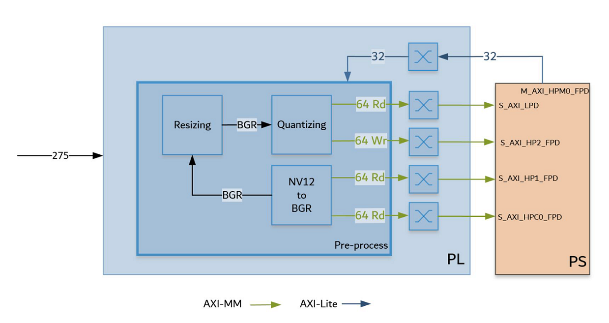
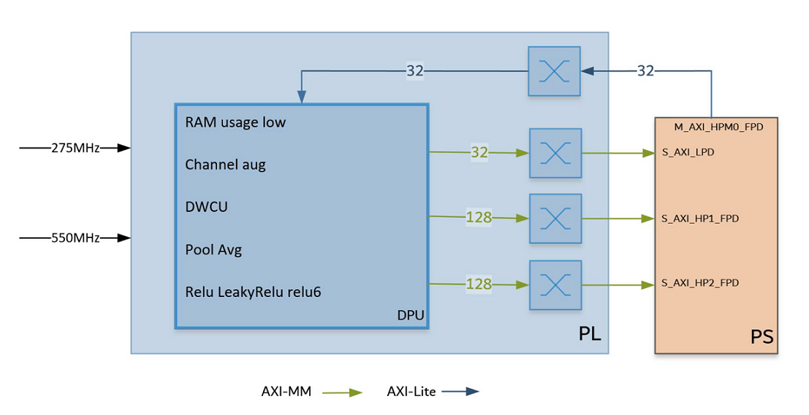

<table class="sphinxhide">
 <tr>
   <td align="center"><h1>Kria&trade; KV260 Vision AI Starter Kit AIBox-ReID Tutorial</h1>
   </td>
 </tr>
 <tr>
 <td align="center"><h1> Hardware Architecture of the Accelerator </h1>

 </td>
 </tr>
</table>

# Hardware Architecture of the Accelerator

## Preprocessing IPs and DPU

The AMD Vitis&trade; software platform overlay includes the pre-processing IPs and DPU.

The preprocessing block as shown in the following figure includes the following functions:

* Cvtcolor: Reads an NV12 video frame, and converts the color format to BGR
* Resizing: Scales down the original 4K/1080p frame to at most 720x720
* Quantizing: Performs linear transformation (scaling and shifting) to each pixel of BGR frame to satisfy DPU input requirement

The desgin uses the Vitis Vision Library functions to build the pre-processing block. The Vitis functions used are cvtcolor, resize, and blobfromimage.

The DPU IP as shown in the following figure can be configured.

For this design, the following features should be enabled:

* Channel augmentation
* Depth-wise convolution
* Average pooling
* Relu, LeakyRelu and Relu6
* UltraRAM enable

To learn more about the DPU, refer the *DPUCZDX8G for Zynq UltraScale+ MPSoCs Product Guide* ([PG338](https://docs.xilinx.com/access/sources/dita/map?url=pg338-dpu&ft:locale=en-US)).

Vitis integrates the pre-processing IP and DPU IP in the platform. The following table shows the utilization numbers after optimization of the hardware design.

**Resource Usage of Current Design**

K26|CLB LUTs|BRAM|DSP|UltraRAM|
|----|----|---|----|--|
|Available|117120|144|1248|64|
|Platform|21815|38|34|0|
|Pre-processing|11013|15|37|0|
|DPU B3136|43319|67|548|44|
|Other*|2721|0|0|0|
|Total|78848|120|619|44|
|Total %|67.32%|83.33%|49.60%|68.75%|

Other*: AXI interconnects and Interrupt concat block added by Vitis

The following table shows the estimated DPU performance and overall power on the K26 chip (including 4K based preprocessing and other IPs). The DPU runs at 275 MHz/550 MHz.

**DPU Performance and Power (Estimated)**

||TOPS (Peak)|TOPS (DenseBox)1|Power (Overall)
|-|-|-|-|
|B3136|0.92|0.25|7.9W

>**NOTE:**
>
>1. The DenseBox_640x360 model is used to estimate the real performance of DPU, and this model has 1.1GOPs.
>2. The overall power of K26 chip (including DPU and other IPs) can only be estimated.

The DPU B3136 bandwidth estimates are shown in the following table.

**DPU B3136 Bandwidth Estimates**

|Operation||Refinedet_pruned_0.96|Densebox_640*360|reid
|-|-|-|-|-|
|Write MB/S|Peak|2772|1313|3099
||Average|668|447|110
|Read MB/S|Peak|2479|6279|5255
||Average|1155|2643|3211

## Next Steps

* [Software Architecture of the Platform](sw_arch_platform_aib.md)
* Go back to the [KV260 AI Box design Start Page](../aibox_landing).

## References

Vitis Vision functions:

* <https://github.com/Xilinx/Vitis_Libraries/tree/master/vision/L2/examples/cvtcolor>
* <https://github.com/Xilinx/Vitis_Libraries/tree/master/vision/L2/examples/resize>
* <https://github.com/Xilinx/Vitis_Libraries/tree/master/vision/L3/benchmarks/blobfromimage>

DPU:

* <https://github.com/Xilinx/Vitis-AI/tree/master/dsa/DPU-TRD>
* *DPUCZDX8G for Zynq UltraScale+ MPSoCs Product Guide* ([PG338](https://docs.xilinx.com/access/sources/dita/map?url=pg338-dpu&ft:locale=en-US))

### License

Licensed under the Apache License, Version 2.0 (the "License"); you may not use this file except in compliance with the License.

You may obtain a copy of the License at
[http://www.apache.org/licenses/LICENSE-2.0](http://www.apache.org/licenses/LICENSE-2.0).

Unless required by applicable law or agreed to in writing, software distributed under the License is distributed on an "AS IS" BASIS, WITHOUT WARRANTIES OR CONDITIONS OF ANY KIND, either express or implied. See the License for the specific language governing permissions and limitations under the License.

Copyright&copy; 2021-2023 Advanced Micro Devices, Inc

