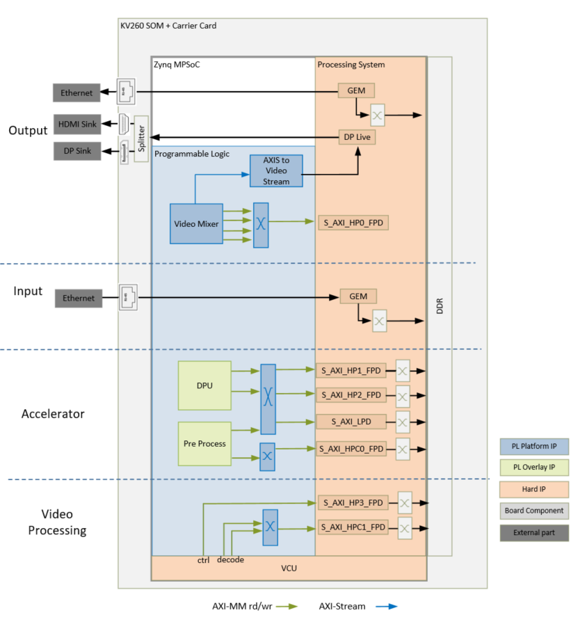
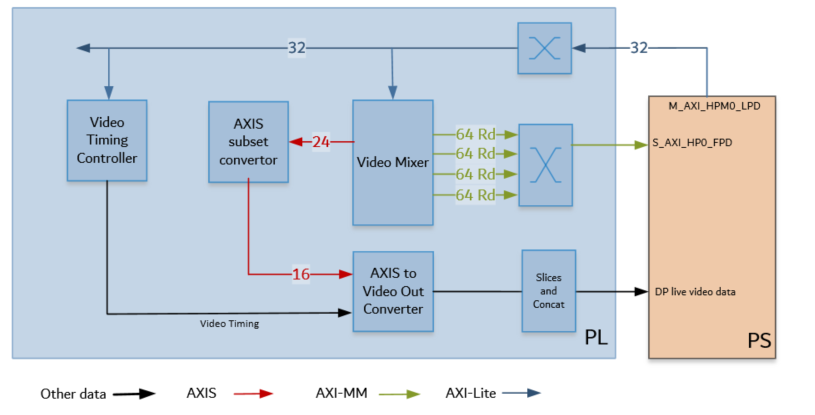

<table class="sphinxhide">
 <tr>
   <td align="center"><h1> Kria&trade; KV260 Vision AI Starter Kit AIBox-ReID Tutorial</h1>
   </td>
 </tr>
 <tr>
 <td align="center"><h1> Hardware Architecture of the Platform </h1>

 </td>
 </tr>
</table>

# Hardware Architecture of the Platform

## Introduction

 This section describes the design implemented in the programmable logic (PL). The following figure shows the top-level hardware architecture of the reference design.

 At a high-level, the design comprises of four pipelines.

* Capture/Input pipeline: This comprises of pipelines through which video data is captured.

  * Ethernet pipeline receiving encoded streams from mutiple cameras via RTSP (PS)

* Video processing pipeline: This comprises of VCU decoder for decompressing four encoded streams of data.

* Display/Output pipeline: This comprises of pipelines through which video data are outputted.

  * DisplayPort pipeline (PL + PS)

* Accelerator pipeline: This comprises of overlay accelerator functions integrated into the platform using AMD Vitis&trade;.

  * The Deep Learning Processing Unit (DPU) IP runs different neural network models (PL).
  * The Pre-Processing block modifies the input data as required by the network (PL).

>**NOTE:** The PS interconnects in the figure are conceptual.

## Capture

The Video inout pipelines and Video Processing pipelines are not covered in this section as they are not PL components. For more information, refer to the GEM Ethernet chapters in the *Zynq UltraScale+ Device Technical Reference Manual* ([UG1085](https://docs.xilinx.com/access/sources/framemaker/map?isLatest=true&ft:locale=en-US&url=ug1085-zynq-ultrascale-trm)). For more information on Video Processing pipelines, refer to the *Video Codec Unit LogiCORE IP Product Guide* ([PG252](https://docs.xilinx.com/access/sources/dita/map?url=pg252-vcu&ft:locale=en-US)).

## Display

An output pipeline reads video frames from memory and sends the frames to a sink. In this case, the sink is a display port in the PS. The display pipeline is shown in the following figure.

This PL pipeline consists of four components, two of which are controlled by the application prcoessing unit (APU) via an AXI4-Lite base register interface, and the other two are statically configured.

* The Video Mixer IP core is configured to support the blending of up to four overlay layers into one single output video stream. The four layers are configured to be memory-mapped AXI4 interfaces connected to the PS via interconnects. The primary AXI4-MM layer has the resolution set to match the display. The other layers, whatever their resolution, is blended with this layer. In this design, the overlay layers are configured to be Y8, and the AXI4-Stream output from the mixer is set to YUV 422 format. A general purpose I/O (GPIO) is used to reset the subsystem between resolution changes. For more information, refer to the *Video Mixer LogiCORE IP Product Guide* ([PG243](https://docs.xilinx.com/access/sources/framemaker/map?url=pg243-v-mix&ft:locale=en-US )).

* The AXIS subset converter passes the least significant bits (LSBs) to the Video Out converter and drops the most significant bit (MSB).

* All video systems require management of video timing signals, which are used to synchronize processes. The Video Timing Controller (VTC) serves the function of both detecting and generating these timing signals. In this design, it generates timing control signals which are used by the AXI4-Stream to Video Out converter to produce native video output signals. For more information, refer to the *Video Timing Controller Product Guide* ([PG016](https://docs.xilinx.com/access/sources/framemaker/map?url=pg016_v_tc&ft:locale=en-US)).

* AXI4-Stream to Video Out core provides a bridge between video processing cores with AXI4-Stream interfaces and native video output (parallel video data, video syncs, and blanks). The core works with the Video Timing Controller (VTC) core. The synchronizer section of the core synchronizes timing from the VTC to the video data from the AXI4-Stream Bus. For more information, refer to the *AXI4-Stream to Video Out LogiCORE IP Product Guide* ([PG044](https://www.xilinxhttps://docs.xilinx.com/access/sources/ud/document?url=pg044_v_axis_vid_out&ft:locale=en-US)).

* The output from the AXI4-Stream to Video Out Converter goes through some slices and concat blocks to drive the DisplayPort Live signals on the PS. The slices and concat are required to the adhere to the Live Video data format. For more information on the DisplayPort Controller in Live mode, refer to the *Zynq UltraScale+ Device Technical Reference Manual* ([UG1085](https://docs.xilinx.com/access/sources/framemaker/map?isLatest=true&ft:locale=en-US&url=ug1085-zynq-ultrascale-trm)).

## Clocks, Resets, and Interrupts

### Clocks

The following table identifies the main clocks of the PL design, their source, their clock frequency, and their function.

| Clock      | Clock Source  | Clock Frequency     | Function |
| :---       |    :----:     |         :---:       | :-----  |
| pl_clk0 | PS | 100 MHz | Clock source for clocking wizard (clk_wiz_0) generating clocks |
| clk_100M* |Clocking wizard| 100 MHz | AXI4-Lite clock to configure the different video IPs in the design|
| clk_275M* |Clocking wizard |300 MHz |AXI4 MM clock and AXI4-Stream clock used in the display pipeline, and processing pipeline|
| clk_50M |Clocking wizard |50 MHz |Phase-locked loop (PLL) reference clock for the VCU IP |
| clk_550M* |Clocking wizard |600 MHz| Generated to be used by the accelerator |

\*Clocks exposed as a Platform interface and can be used by an accelerator.

### Resets

The following table summarizes the resets used in this design:

| Reset Source | Function  |
| :---         |    :----  |
|pl_resetn0|PL reset for proc_sys_reset modules and the clock_wizard generating clocks for the video domain |
|rst_processor_100MHz|Synchronous resets for clk_out100M clock domain|
|rst_processor_275MHz|Synchronous resets for clk_out275M clock domain|
|rst_processor_550MHz|Synchronous resets for clk_out550M clock domain
|GPIOs||
|emio_gpio_o[0]|Video Mixer IP|
|emio_gpio_o[1]|VCU reset|

### Interrupts

The following table lists the PL-to-PS interrupts used in this design:

| Interrupt ID | Instance  |
| :---        |    :----  |
|pl_ps_irq1[0]| Video Mixer IP   |
|pl_ps_irq1[1]| Video Timing Controller IP |
|pl_ps_irq1[2]| VCU IP   |
|pl_ps_irq0| Exposed as a platform interface and can be used by an accelerator |

## Resource Utilization

The resource utilization numbers on this platform post implementation is reported in the following table:

| Resource  | Utilization  | Available  | Utilization %  |
| :---      |    :----     | :---       |    :----       |
|LUT|20437|117120|17.45 |
|LUTRAM|1387|57600|2.41 |
|FF|29467|234240|12.58|
|BRAM|38|144|26.39|
|DSP|33|1248|2.64 |
|IO|1|186|0.54 |
|BUFG|7|352|1.99|
|MMCM|2|4|50.0|  

## Next Steps

You can choose any of the following next steps:

* Read [Hardware Architecture of the Accelerator](hw_arch_accel_aib.md).
* Go back to the [KV260 AI Box Design Start Page](../aibox_landing).

Copyright © 2021-2024 Advanced Micro Devices, Inc

<a href="https://www.amd.com/en/corporate/copyright">Terms and Conditions</a>
