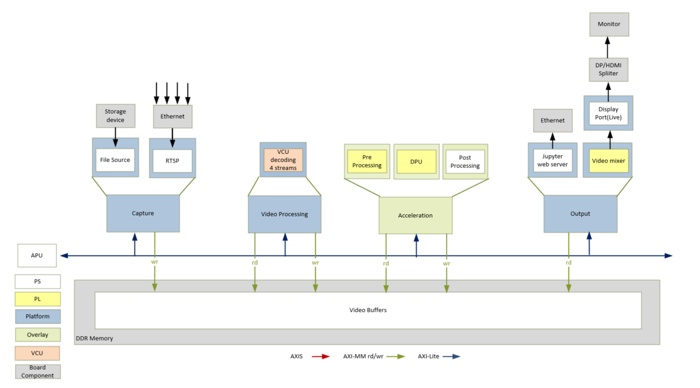
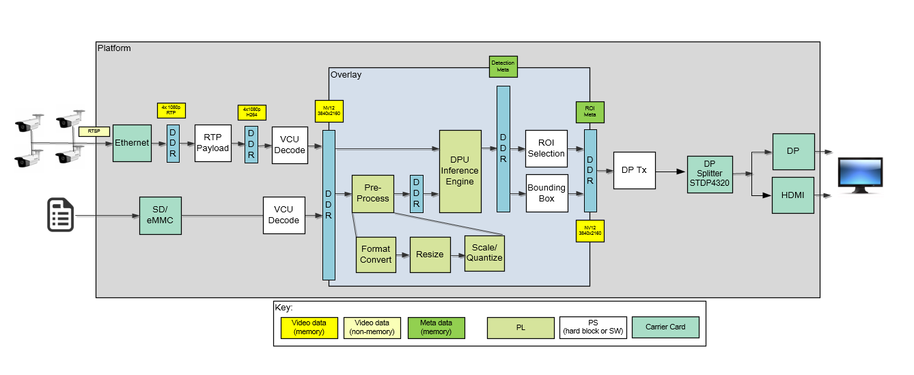

<table class="sphinxhide">
 <tr>
   <td align="center"><h1> Kria&trade; KV260 Vision AI Starter Kit AIBox-ReID Tutorial</h1>
   </td>
 </tr>
 <tr>
 <td align="center"><h1> Design Overview </h1>

 </td>
 </tr>
</table>

# Design Overview

## Introduction

The AI Box application design built on the KV260 Vision AI Starter Kit provides a framework for building and customizing video platforms that consist of four pipeline stages:

* Capture pipeline
* Video processing pipeline
* Acceleration pipeline
* Output pipeline

The design has a platform and integrated accelerator functions. The platform consists of Capture pipeline, Output pipeline and some video processing functions. This approach makes the design leaner and provides a use,r maximum programmable logic (PL) for the accelerator development. The platform supports input streams from IP camera as well as file sources. The output can be displayed on a DisplayPort/HDMI monitor.

Some video processing functions are performed on hard blocks like the Video Codec Unit (VCU) because it is most performant to do so. Video decoding/decompression and encoding/compression is done using the VCU.

The following example acceleration functions can be run on this platform using programmable Deep Learning Processor Units (DPU).

* Pedestrian Detection - Network model: refinedet_pruned_0_96
* Re-identification (ReID) - Network model: personreid-res18_pt

An example usecase for this design is as an edge device with multiple cameras as endpoints for Smart cities or Retail Analytics.

The following figure shows the various pipelines supported by the design.

The application processing unit (APU) in the processing system (PS) consists of four Arm&trade; Cortex-A53 cores and is configured to run in symmetric multi-processing (SMP) Linux mode in the design. The application running on Linux is responsible for configuring and controlling the video pipelines and accelerators using Jupyter notebooks or the aibox-reid application.

The APU application controls the following video data paths implemented in a combination of the PS and PL:

* Capture pipeline capturing video frames into double-data rate (DDR) memory from
  * A file on a storage device such as an SD card
  * An IP camera using the Ethernet interface inside the PS

* Memory-to-memory (M2M) pipeline implementing a neural network inference application. In this design, the Neural Net is implemented in DPU, preprocessed video frames are read from DDR memory, processed by the DPU, and then written back to memory.

* An output pipeline reads video frames from the memory, and sends the frames to a sink.
  * In the display pipeline sink is a monitor, the DP live port in the PS is coupled to Sthe TDP4320 Demultiplexer on the carrier card. STDP4320 consists of dual mode output ports configured as DP and HDMI.

The following figure shows an example end-to-end pipeline which could be an IP camera as the video source and pre-process and DPU IPs for application NN Inference. The video frames are displayed via DP splitter onto a DP and HDMI port for display, as the video sink. The video format in the figure is the output format on each block. Details are described in the [Hardware Architecture document](hw_arch_platform_aib.md).

## Design Components

 
<b>Hardware Components</b>

* KV260 Vision AI Starter Kit including:
   * HDMI-DP splitter on the carrier card

 
<b>Interfaces and IP</b>

* Video inputs
  * File
  * IP camera
* Video outputs
  * DisplayPort/HDMI
* Video processing
  * VCU decoding on four streams
  * Accelerator functions on DPU
  * PL and PS based pre and post processing specific to a accelerator function
* Auxiliary Peripherals
  * QSPI
  * SD
  * Inter IC (I2C)
  * Universal asynchronous receiver-transmitter (UART)
  * Ethernet
  * General purpose I/O (GPIO)

 
<b>Software components</b>

* Operating system (OS)
  * APU: SMP Linux
* Linux kernel subsystems
  * Video source: Video4 Linux (V4L2)
  * Display: Direct Rendering Manager (DRM)/Kernel Mode Setting (KMS)
* Linux user space frameworks
  * Jupyter
  * GStreamer/VVAS
  * Vitis AI
  * Xilinx runtime (XRT)

 
<b>Resolution and format supported</b>

* Resolutions
  * 1080p30 per stream
  * Lower resolution and lower frame rates for file I/O
* Pixel format
  * YUV 4:2:0 (NV12)

## Next Steps

* [Setting Up the Board and Application Deployment Tutorial](app_deployment_aib.md)
* Go back to the [KV260 AI Box Design Start Page](../aibox_landing).

## References

* *Kria KV260 Vision AI Starter Kit User Guide* ([UG1089](https://docs.xilinx.com/access/sources/dita/map?url=ug1089-kv260-starter-kit&ft:locale=en-US))
* *Kria SOM Carrier Card Design Guide* ([UG1091](https://docs.xilinx.com/access/sources/dita/map?url=ug1091-carrier-card-design&ft:locale=en-US))
* *Kria KV260 Vision AI Starter Kit Data Sheet* ([DS986](https://docs.xilinx.com/access/sources/dita/map?url=ds986-kv260-starter-kit&ft:locale=en-US))
* *Kria K26 SOM Data Sheet* ([DS987](https://docs.xilinx.com/access/sources/dita/map?url=ds987-k26-som&ft:locale=en-US))

Copyright © 2021-2024 Advanced Micro Devices, Inc

<a href="https://www.amd.com/en/corporate/copyright">Terms and Conditions</a>
