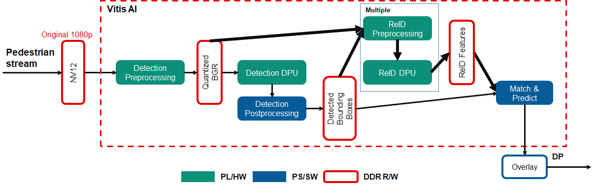
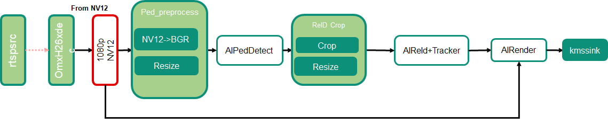

<table class="sphinxhide">
 <tr>
   <td align="center"><h1>Kria&trade; KV260 Vision AI Starter Kit AIBox-ReID Tutorial</h1>
   </td>
 </tr>
 <tr>
 <td align="center"><h1> Software Architecture of the Accelerator </h1>

 </td>
 </tr>
</table>

# Software Architecture of the Accelerator

## Introduction

 This document describes the software architecture of the AiBox-ReID application.

## Software Platform and Dependencies

The GStreamer multi-media orchestration platform for application software development is leveraged. As described in following sections about the GStreamer pipeline, all the processing units in the stream pipeline are presented to you as easily pluggable and changeable plugins, enabling a “low touch” customer adaptation of the reference design pipeline within the context of an open-source and non-vendor specific implementation.

**AMD Vitis&trade; AI 2.5.0** is the core underlying component to access the AI inference capability provided by the AMD DPU.

To access DPU and other programmabel logic (PL) hardware accelerator functions from GStreamer, AMD developed Vitis Video Analysis SDK (VVAS) to provide convenient and customizable GStreamer plugins for it.

## GStreamer Pipeline



The AIBox-ReID application accepts up to four channels of RTSP streams (**1080p, H264/H265**), decodes them to NV12 frame buffers, then performs pedestrian detection on all four streams using the AI inference accelerator (DPU). Next, ReID and tracking are performed to give the detected pedestrians a unique ID. Finally, bounding boxes and ID text are rendered over the original video frames and displayed on a **4K** monitor in a 2x2 grid.

Following the datapath in the figure above, the decoded NV12 buffers are first preprocessed to prepare the buffer for ingestion by the pedestrian detection model in the DPU. This includes color space conversion and resize operations. The DPU then performs the inferencing whose results are post-processed to determine the size and location of the bounding box around each pedestrian. The bounding box information is then used to crop the region of interest for the detected person and again pre-processed for use by the ReID model in the DPU. The DPU then outputs the ReID features and coordinates for each detected person. Matching and tracking are performed to give each person the final ID.

The following figure shows the GStreamer pipeline used in this application. There are five main components described: Pedestrian Pre-processing, Pedestrian Detection, ReID Pre-Processing, ReID and Tracking, and Rendering.



* Pedestrian Preprocess

    The pedestrian detection model requires downscaled BGR frames, so the received decoded NV12 frames need to be preprocessed to do color space conversion and resizing. For best performance, these steps are performed using a dedicated preprocessing hardware accelerator IP, as described in the [Hardware Accelerator Architecture](hw_arch_accel_aib.md).

    NV12 to BGR conversion and image resizing are to meet the requirement of the DPU AI inference engine. These steps are done in one dedicated preprocessing IP, which is detailed in the Accelerator IP Modules, to achieve the optimal framerate and latency.

    The vvas_xmultisrc GStreamer plugin from VVAS with the customized kernel `/opt/xilinx/kv260-aibox-reid/lib/libvvas_pedpp.so` are used to integrate the accelerator IP functionality into the pipeline.

    The configuration file, `/opt/xilinx/kv260-aibox-reid/share/vvas/ped_pp.json`, contains the PL kernel and software kernel library info, which will do the color conversion and resize.

    ```json
        {
        "kernel-name": "pp_pipeline_accel:pp_pipeline_accel_1",
        "library-name": "libvvas_pedpp.so",
        "config": {
            "debug_level" : 0,
            "mean_r": 0,
            "mean_g": 0,
            "mean_b": 0,
            "scale_r": 1,
            "scale_g": 1,
            "scale_b": 1
        }
        }
    ```

* Pedestrian Detection

    The vvas_xfilter GStreamer plugin with kernel library `/usr/lib/libvvas_dpuinfer.so` works as middleware between the application which interfaces with the user and underlying Vitis AI library. The Vitis AI library then interfaces with the DPU to feed the actual AI inference tasks.

    The configuration file, `/opt/xilinx/kv260-aibox-reid/share/vvas/refinedet.json`,contains the actual model info you will run in this plugin.

    ```json
        "config": {
            "model-name" : "refinedet_pruned_0_96",
            "model-class" : "REFINEDET",
            "model-path" : "/opt/xilinx/kv260-aibox-reid/share/vitis_ai_library/models/",
            "run_time_model" : false,
            "need_preprocess" : true,
            "performance_test" : false,
            "debug_level" : 0
        }
    ```

* ReID Preprocess

    The vvas_xfilter GStreamer plugin with kernel library `/opt/xilinx/kv260-aibox-reid/lib/libvvas_crop.so` will do the crop and resize on the input BGR image from the previous pedestrian detection, based on the bbox information contained in the inference metadata, and attach the preprocessed images to the incoming inference metadata which will be passed down.

    Configuration file: /`opt/xilinx/kv260-aibox-reid/share/vvas/crop.json`

* ReID + Tracking

    The vvas_xfilter GStreamer plugin with kernel library `/opt/xilinx/lib/libvvas_reid.so` will run ReID on the incoming pedestrian images, get the ReID features, and together with the coordinates of each person, the tracking algorithm will give each person an unique ID. Also this info will be attached to the inference metadata to be consumed later.

    Configuration file: `/opt/xilinx/kv260-aibox-reid/share/vvas/reid.json`

* AI Rendering

    The vvas_xfilter GStreamer plugin with kernel library `/opt/xilinx/lib/libvvas_drawreid.so` will just draw the bounding box and ID for each detected person.

    Configuration file: `/opt/xilinx/kv260-aibox-reid/share/vvas/draw_reid.json`

## Additional GStreamer Component Used

The rtspsrc and omxh264dec are the standard GStreamer plugin which accept the RTSP stream and decode to NV12.

## Next Step

You can choose any of the following next steps:

* Read [Hardware Architecture of the Platform](hw_arch_platform_aib.md).
* Go back to the [KV260 AI Box Design Start Page](../aibox_landing).


<p class="sphinxhide" align="center"><sub>Copyright © 2021-2024 Advanced Micro Devices, Inc</sub></p>

<p class="sphinxhide" align="center"><sup><a href="https://www.amd.com/en/corporate/copyright">Terms and Conditions</a></sup></p>