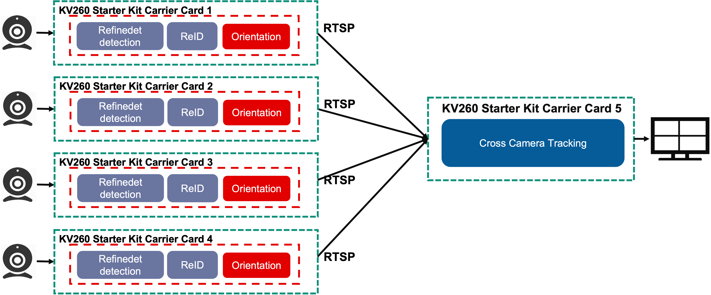

##################################################
AI Box Distributed ReID
##################################################

The AIBox Distribution accelerated application performs distributed, scalable, multi-stream cross tracking and Re-Identification. The application leverages machine learning for pedestrian tracking and decoding multiple camera streams and performs pedestrian detection and tracking across camera feeds. Common applications include smart cities, retail analytics, and video analytics.

*******************************
Overview
*******************************

.. toctree::
   :maxdepth: 1

   Introduction <docs/introduction_aib>

Features
===============================

* Up to 4 input streams from IP cameras
* H.264/H.265 decoding capability at 1080p resolution
* Pedestrian detection and tracking on individual streams
* HDMI or DisplayPort out
* User programmable Deep Learning Models

*******************************
Quick Start
*******************************

.. toctree::
   :maxdepth: 1

   Setting Up the Board and Application Deployment <docs/app_deployment_aib>

***************************
Tutorials
***************************

.. toctree::
   :maxdepth: 1

   Customizing AI Models Used in the Application <docs/customize_ai_models-aib>
   Building the Design Components <../building_the_design>
   Building the Hardware Design Using Vivado <../build_vivado_design>
   Creating a Vitis Platform <../build_vitis_platform>
   Integrating an Overlay into the Platform <../build_accel>
   Generating Custom Firmware <../generating_custom_firmware>
   Kria Starter Kit Linux Boot <../kria_starterkit_linux_boot>
   Rebuilding Application Docker Containers <../build_application_docker_container>

********************
Architecture
********************

.. toctree::
   :maxdepth: 1

   Software Architecture - Platform <docs/sw_arch_platform_aib>
   Software Architecture - Accelerator <docs/sw_arch_accel_aib>
   Hardware Architecture - Platform <docs/hw_arch_platform_aib>
   Hardware Architecture - Accelerator <docs/hw_arch_accel_aib>

*******************************
Repository
*******************************

.. toctree::
   :maxdepth: 1
  
   Software Repository for aibox-reid <https://github.com/Xilinx/aibox-reid>
   Software Repository for aibox-dist <https://github.com/Xilinx/aibox-dist>

******
Other
******

.. toctree::
   :maxdepth: 1

   Debugging <docs/debug-aib>
   Known Issues <docs/issue-aib>

Xilinx Support
====================================

GitHub issues will be used for tracking requests and bugs. For questions, go to `forums.xilinx.com <http://forums.xilinx.com/>`_.

