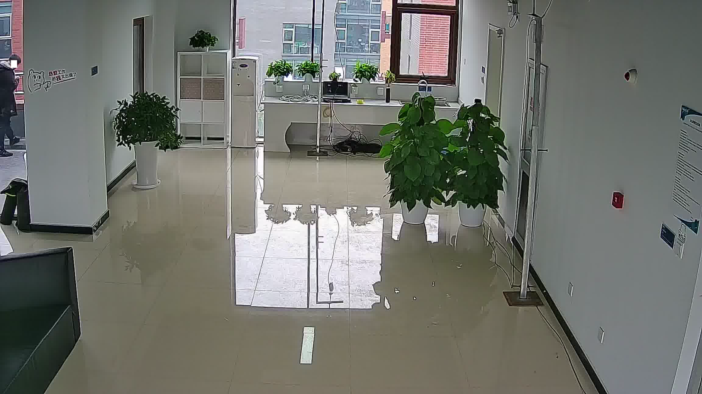
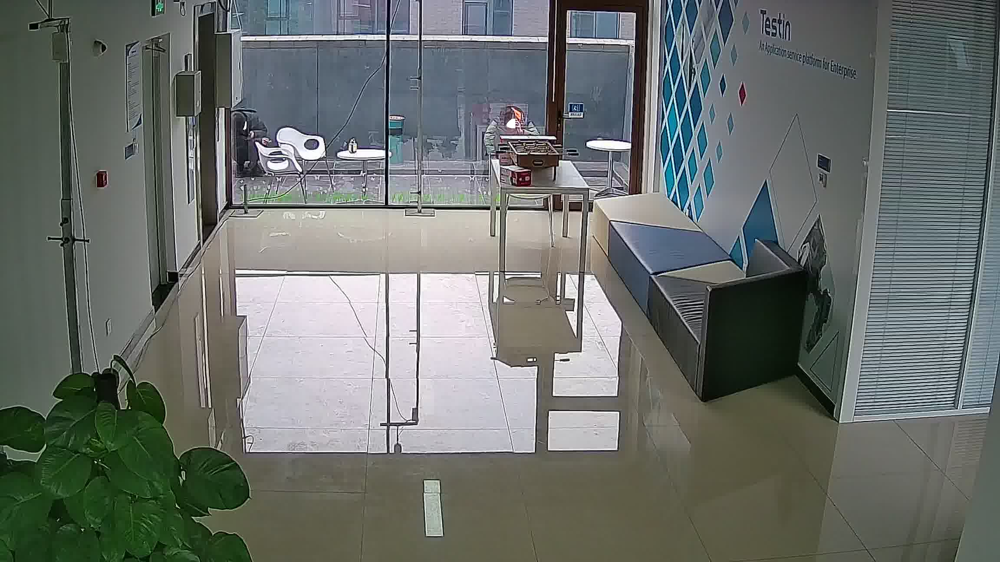
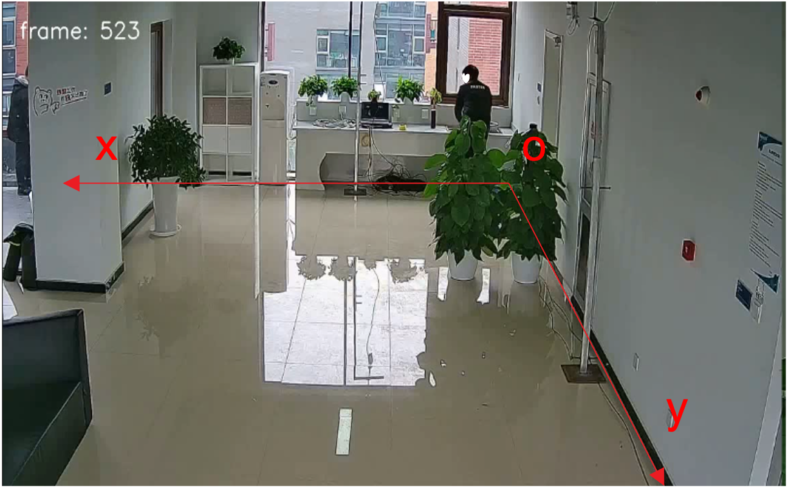
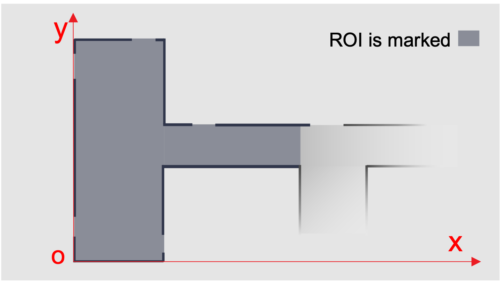

<table class="sphinxhide">
 <tr>
   <td align="center"><h1>Kria&trade; KV260 Vision AI Starter Kit Aibox-Dist Tutorial</h1>
   </td>
 </tr>
 <tr>
 <td align="center"><h1>Setting 
 Up the Board and Application Deployment</h1>

 </td>
 </tr>
</table>

# Setting Up the Board and Application Deployment

## Introduction

This document describes how to set up the board and run the aibox-dist application.

This guide and its prebuilt are targeted for Ubuntu&reg; 22.04 and AMD 22.1 toolchain.

## Setting Up the Board

The aibox-dist application requires one KV260 starter kit as the surveillance center (the client) and one to four KV260 starter kits as the distributed camera (the server).

### Setting Up the Board for Distributed Camera

  Refer to [Setting up the Board for Kria™ KV260 Vision AI Starter Kit Smart Camera](../../smartcamera/docs/app_deployment.md#Setting-up-the-Board), and follow the instructions until the kv260-smartcam firmware has been loaded.

### Setting Up the Board for Surveillance Center Cross Tracking and Monitoring

  Refer to [Setting up the Board for Kria™ KV260 Vision AI Starter Kit Smart Camera AIBox-ReID Tutorial](../../aibox-reid/docs/app_deployment_aib.md#Setting-up-the-Board), and follow the instructions until the kv260-aibox-reid firmware has been loaded.

## Docker-based Application Preparation

  The two kinds of boards both need the same application package docker.

* Pull the latest docker image for aibox-dist using the following command:

    ```bash
    docker pull xilinx/aibox-dist:latest
    ```

* Launch the docker using the following command:

    ```bash
    docker run \
    --env="DISPLAY" \
    -h "xlnx-docker" \
    --env="XDG_SESSION_TYPE" \
    --net=host \
    --privileged \
    --volume="$HOME/.Xauthority:/root/.Xauthority:rw" \
    -v /tmp:/tmp \
    -v /dev:/dev \
    -v /sys:/sys \
    -v /etc/vart.conf:/etc/vart.conf \
    -v /lib/firmware/xilinx:/lib/firmware/xilinx \
    -v /run:/run \
    -it xilinx/aibox-dist:latest bash
    ```

    It will launch the aibox-dist image in a new container.

    ```bash
    root@xlnx-docker/#
    ```

* The storage volume on the SD card is limited with multiple dockers. You can use following command to remove the existing container:

    ```shell
    docker rmi --force <installed container>
    #Example: docker rmi --force xilinx/aibox-dist:latest
    ```

## Camera Setup and Calibration for The Tracking Algorithm

The cross camera tracking algorithm needs some information of the monitoring region and the relation to the position/view of the capturing cameras. This section will guide you to set it up.

1. The config file and demo videos

    The config file, shipped with the application, `config/cam_setup.json` is calibrated for the three demo video files at following location.

    [Camera 1 Video](https://www.xilinx.com/bin/public/openDownload?filename=cros.1.1080p.h264)

    [Camera 2 Video](https://www.xilinx.com/bin/public/openDownload?filename=cros.2.1080p.h264)

    [Camera 3 Video](https://www.xilinx.com/bin/public/openDownload?filename=cros.3.1080p.h264)

    ```json
    {
      "floorplan": [
        {"x": 0,"y": 0},
        {"x": 0,"y": 1250},
        {"x": 460,"y": 1250},
        {"x": 460,"y": 680},
        {"x": 1167,"y": 680},
        {"x": 1167,"y": 440},
        {"x": 460,"y": 440},
        {"x": 460,"y": 0}
      ],
      "camsres": {"w": 2304, "h":1296},
      "cams": [
          [
              {
                  "image": {"x": 1573, "y":323},
                  "plan":  {"x": 0, "y":125 }
              },
              {
                  "image": {"x": 504, "y":475},
                  "plan":  {"x": 460, "y":70 }
              },
              {
                  "image": {"x": 358, "y":707 },
                  "plan":  {"x": 430, "y":418}
              },
              {
                  "image": {"x": 1689, "y":810},
                  "plan":  {"x": 0, "y":480}
              }
          ],
          [
              {
                  "image": {"x": 524, "y":476},
                  "plan":  {"x": 0, "y":1250 }
              },
              {
                  "image": {"x": 352, "y":727},
                  "plan":  {"x": 0, "y":890}
              },
              {
                  "image": {"x": 1274, "y":480},
                  "plan":  {"x": 343, "y":1250}
              },
              {
                  "image": {"x": 1931, "y":973},
                  "plan":  {"x": 460, "y":680}
              }
          ],
          [
              {
                  "image": {"x": 651, "y":1091},
                  "plan":  {"x": 718, "y":680}
              },
              {
                  "image": {"x": 1472, "y":1092},
                  "plan":  {"x": 718, "y":440}
              },
              {
                  "image": {"x": 1293, "y":727},
                  "plan":  {"x": 1167, "y":440}
              },
              {
                  "image": {"x": 775, "y":722},
                  "plan":  {"x": 1167, "y":680}
              }
          ]
      ]
    }
    ```

* floorplan

  Array of vertices of the floorplan polygon.

  In the following example, there are eight points.

  

* camsres

  Define the resolution of the camera view which is used in camera setup and calibration. >**NOTE:** This resolution need not to be 1080p which is configured for actual application running. For example, in above json example, "2304x1296" is used.

* Cams

  camview1
  

  camview2
  

  camview3
  

  This is an array of camera mapping.

  Each element defines the mapping relation of one camera view to the floorplan. It consists of **four pairs** of corresponding floorplan points and camera view points.

1. Define The Floorplan Region of Interest

    Based on the Region of Interest of the monitoring camera system, define the floorplan in whatever unit.
  
    

    

    * Choose a point as origin o, and set the coordinate axis (x, y).

    * Define the Region of Interest in the plan and only pedestrian in the Region of Interest will be tracked. For example, in camera 3, part of the corridor is very dark, so it is not included in the Region of Interest.

    * The Region of Interest is a polygon; give the coordinates of angular points of the polygon in a clockwise direction or anti-clockwise direction so that the contour of plan map can be defined.

2. Mapping of the Camera View and Floorplan

    * For each camera, give **four points** coordinates in both plan and camera view (the reference points should be on the ground, and any three points are not collinear).

    * Take camera 1 as an example:

      ```
        # coordinates in camera view (unit: pixel)

        Image_coords = [[1573,323],  [504,475], [358,707], [1689,810]]

        # coordinates in plan map (unit: cm)

        Plan_coords = [[0,125], [460,70], [430,418], [0,480]]
      ```

      ``` json
            [
                {
                    "image": {"x": 1573, "y":323},
                    "plan":  {"x": 0, "y":125 }
                },
                {
                    "image": {"x": 504, "y":475},
                    "plan":  {"x": 460, "y":70 }
                },
                {
                    "image": {"x": 358, "y":707 },
                    "plan":  {"x": 430, "y":418}
                },
                {
                    "image": {"x": 1689, "y":810},
                    "plan":  {"x": 0, "y":480}
                }
            ]
      ```

### Jupyter Notebook to Help Interactively Mark the Points on the Captured Images and Get the json Section

* You need to run the following command to install the package shipped notebooks which reside in `/opt/xilinx/kv260-aibox-dist/share/notebooks` to the folder `/root/notebooks/aibox-dist`.

  ``` $ aibox-dist-install.py ```

  This script also provides more options to install the notebook of the current application to specified location.

    ``` text
    usage: aibox-dist-install [-h] [-d DIR] [-f]

    Script to copy aibox-dist Jupyter notebook to user directory

    optional arguments:
      -h, --help         show this help message and exit
      -d DIR, --dir DIR  Install the Jupyter notebook to the specified directory.
      -f, --force        Force to install the Jupyter notebook even if the destination directory exists.
    ```

* Get the list of running Jupyter servers with the following command:

    ```$ jupyter-server list```

  Output example:

  > Currently running servers:
  >
  > `http://ip:port/?token=xxxxxxxxxxxxxxxxxx`  :: /root/notebooks/aibox-dist

* Stop the currently running server with the following command:

    ```$ jupyter-server stop 8888```

* To launch Jupyter notebook on the target, run the following command:

  ``` bash
  jupyter-lab --notebook-dir=/root/notebooks/aibox-dist --allow-root --ip=ip-address &

  // fill in ip-address from ifconfig, eth0
  ```

  Output example:

  ``` bash
  [I 2022-09-05 10:26:26.644 LabApp] JupyterLab extension loaded from /usr/local/lib/python3.10/dist-packages/jupyterlab
  [I 2022-09-05 10:26:26.644 LabApp] JupyterLab application directory is /usr/local/share/jupyter/lab
  [I 2022-09-05 10:26:26.664 ServerApp] jupyterlab | extension was successfully loaded.
  [I 2022-09-05 10:26:26.683 ServerApp] nbclassic | extension was successfully loaded.
  [I 2022-09-05 10:26:26.685 ServerApp] Serving notebooks from local directory: /root/notebooks/aibox-dist
  [I 2022-09-05 10:26:26.685 ServerApp] Jupyter Server 1.18.1 is running at:
  [I 2022-09-05 10:26:26.685 ServerApp] http://192.168.1.233:8888/lab?token=385858bbf1e5541dbba08d811bcac67d805b051ef37c6211
  [I 2022-09-05 10:26:26.686 ServerApp]  or http://127.0.0.1:8888/lab?token=385858bbf1e5541dbba08d811bcac67d805b051ef37c6211
  [I 2022-09-05 10:26:26.686 ServerApp] Use Control-C to stop this server and shut down all kernels (twice to skip confirmation).
  [W 2022-09-05 10:26:26.702 ServerApp] No web browser found: could not locate runnable browser.
  [C 2022-09-05 10:26:26.703 ServerApp]

      To access the server, open this file in a browser:
          file:///root/.local/share/jupyter/runtime/jpserver-40-open.html
      Or copy and paste one of these URLs:
          http://192.168.1.233:8888/lab?token=385858bbf1e5541dbba08d811bcac67d805b051ef37c6211
      or http://127.0.0.1:8888/lab?token=385858bbf1e5541dbba08d811bcac67d805b051ef37c6211
  ```

* You can access the server by opening the server URL from the previous steps with a Chrome browser.

* After opening the notebook, you can define the RTSP server IP and follow the steps described in the notebook. First you can get a interactive window with the captured image from RTSP server. You can click the image to mark the point you would like to used for "image" to "plan" mapping. Finally, you can run the cell to get a json snippet with the "image" fields filed with real coordinates you marked on the image and "plan" field filled with "todo" which you need to update yourself.

Example output of the notebook:

  ```json
      [
          {
              "image": {"x": 1573, "y":323},
              "plan":  {"x": todo, "y":todo }
          },
          {
              "image": {"x": 504, "y":475},
              "plan":  {"x": todo, "y":todo }
          },
          {
              "image": {"x": 358, "y":707 },
              "plan":  {"x": todo, "y":todo }
          },
          {
              "image": {"x": 1689, "y":810},
              "plan":  {"x": todo, "y":todo }
          }
      ]
```

## How to Run The Application

As described in [Software Architecture of the Application](./sw_arch_accel_aib.md), this application consists of up to four server side image capturing boards with a camera and one client side monitoring board. Accordingly, there are different binary executable to be run on **server** or **client**.

### Start The Server Application

#### Examples

  This example starts capturing by using the MIPI camera as an input source.

  ```bash
  aibox-dist-cam -m 
  ```

  You can also start the streaming by using video files as the input source; this is the recommended mode to start with.

  ```bash
  aibox-dist-cam -f cros.1.1080.h264
  ```

>**NOTE:** Only one instance of the aibox-dist-cam application can run at a time because it requires exclusive access to a DPU engine, and there is only one instance of the DPU that exists in the aibox-cam platform.

##### Command Options

The example shows a simple way to invoke the server application.

You can get more and detailed application options as following by invoking:

`aibox-dist-cam --help`

```text
Usage:
  aibox-dist-cam [OPTION?] - Application for facedetion detction on SoM board of Xilinx.

Help Options:
  -h, --help                        Show help options
  --help-all                        Show all help options
  --help-gst                        Show GStreamer Options

Application Options:
  -m, --mipi=                       use MIPI camera as input source, auto detect, fail if no mipi connected
  -u, --usb=media ID                usb camera media device id, e.g. 0 for /dev/media0
  -f, --file=file path              location of h26x file as input
  -i, --infile-type=h264            input file type: [h264 | h265]
  -W, --width=1920                  resolution w of the input
  -H, --height=1080                 resolution h of the input
  -r, --framerate=30                framerate of the input
  -c, --camid=0                     cam ID
  -l, --fileloop=loop file source   loop file source 
  -o, --outmedia-type=h264          output file type: [h264 | h265]
  -p, --port=554                    Port to listen on (default: 554)
  -R, --report                      report fps
  --ROI-off                         turn off ROI
  --control-rate=low-latency        Encoder parameter control-rate
  --target-bitrate=3000             Encoder parameter target-bitrate
  --gop-length=60                   Encoder parameter gop-length
  --profile                         Encoder parameter profile.
  --level                           Encoder parameter level
  --tier                            Encoder parameter tier
  --encodeEnhancedParam             String for fully customizing the encoder in the form "param1=val1, param2=val2,...", where paramn is the name of the encoder parameter
```

### Start The Client Application

#### Command Line

#### Examples

  ```bash
  aibox-dist-monitor -s rtsp://address-of-cam-1 -s rtsp://address-of-cam-2 -S 1
  ```

>**NOTE:** The example above is for live steam capturing from camera; if you are starting with the video file streaming way, which is recommended as a start point, **remove the option "-S 1"** as:

  ```bash
  aibox-dist-monitor -s rtsp://address-of-cam-1 -s rtsp://address-of-cam-2
  ```

>**NOTE:** Only one instance of the aibox-dist-monitor application can run at a time because it requires exclusive access to a DPU engine, and there is only one instance of DPU that exists in the aibox-monitor platform.

##### Command Options

You can get more and detailed application options as following by invoking the following:

`aibox-dist-monitor --help`

```
Usage:
  aibox-dist-monitor [OPTION?] - AI Application of pedestrian + reid + tracking for multi RTSP streams, on SoM board of Xilinx.

Help Options:
  -h, --help                                                        Show help options
  --help-all                                                        Show all help options
  --help-gst                                                        Show GStreamer Options

Application Options:
  -s, --src=[rtsp://server:port/id |file path]                      URI of rtsp src, or location of h264|h265 video file. Must set. Can set up to 4 times
  -S, --syncType                                                    Sync Type: 0: Sync for file based stream; 1: Sync for live stream
  -I, --indTol                                                      Tolerance value used by syncType 0: number of frame
  -T, --timeTol                                                     Tolerance value used by syncType 1: microsecond
  -e, --srcenc=[h264|h265]                                          Encoding type of the input source. Optional. Can set up to 4 times.
  -p, --pos=[0|1|2|3]                                               Location of the display in the 4 grids of 4k monitor. Optional. 0: top left, 1: top right, 2: bottom left, 3: bottom right. Optional. Can set up to 4 times.
  -r, --framerate=auto                                              Framerate of the input. Optional. Can set up to 4 times.
  -R, --report                                                      Report fps
  -c, --config=/opt/xilinx/kv260-aibox-dist/share/vvas/cam_setup.json     System calibration json file path

```

## Files Structure

The application is installed as:

* Binary File Directory: `/opt/xilinx/kv260-aibox-dist/bin`

  | Filename | Description |
  |----------|-------------|
  |aibox-dist-cam | App for camera board|
  |aibox-dist-monitor | App for monitor board|

* Configuration file directory: `/opt/xilinx/kv260-aibox-dist/share/vvas`

  | Filename | Description |
  |-|-|
  |cam_setup.json       |           Config of camera set up and calibration.
  |ped_pp.json       |           Config of refinedet preprocess.
  | refinedet.json   |           Config of refinedet.
  | crop.json        |           Config of cropping for reid.
  | reid.json        |           Config of reid.

## Next Steps

* Go back to the [KV260 SOM AIBox-Dist Design Start Page](../aibox-dist_landing).

### License

Licensed under the Apache License, Version 2.0 (the "License"); you may not use this file except in compliance with the License.

You may obtain a copy of the License at
[http://www.apache.org/licenses/LICENSE-2.0](http://www.apache.org/licenses/LICENSE-2.0)

Unless required by applicable law or agreed to in writing, software distributed under the License is distributed on an "AS IS" BASIS, WITHOUT WARRANTIES OR CONDITIONS OF ANY KIND, either express or implied. See the License for the specific language governing permissions and limitations under the License.

<p class="sphinxhide" align="center">Copyright&copy; 2021-2023 Advanced Micro Devices, Inc</p>
