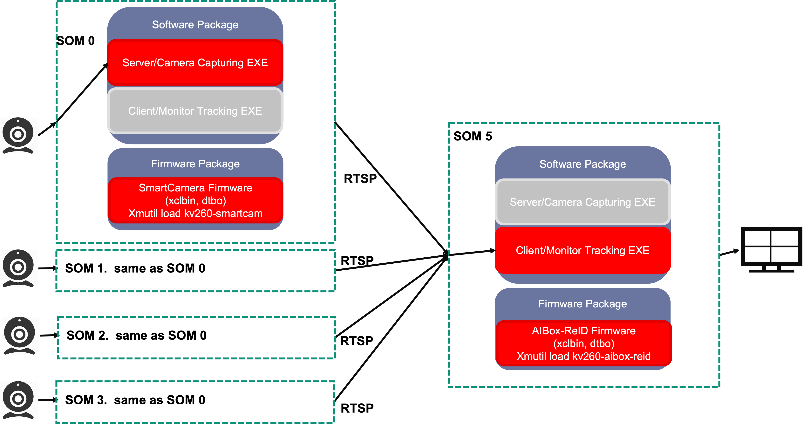
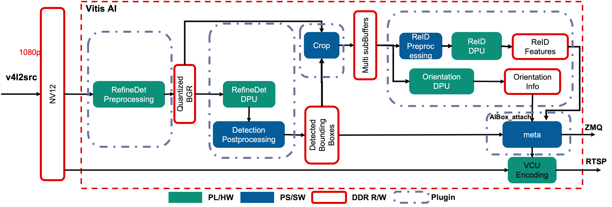
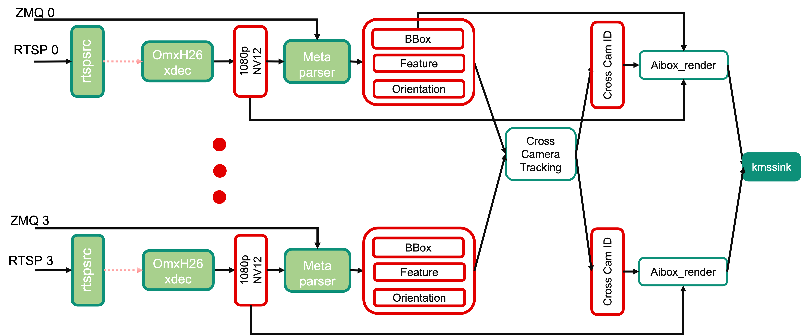

<table class="sphinxhide">
 <tr>
   <td align="center"><h1>Kria&trade; KV260 Vision AI Starter Kit AI Box Distributed Tutorial</h1>
   </td>
 </tr>
 <tr>
 <td align="center"><h1> Software Architecture of the Application</h1>

 </td>
 </tr>
</table>

# Software Architecture of the Application

## Introduction

 This document describes the software architecture of the AI Box Distributed application.

## Software Platform and Dependencies

The GStreamer multimedia orchestration platform is leveraged for application software development. As described in following sections about the GStreamer pipeline, all the processing units in the stream pipeline are presented to you as easily pluggable and changeable plugins, enabling a “low touch” developer adaptation of the reference design pipeline within the context of an open-source and non-vendor specific implementation.

**AMD Vitis&trade; AI 2.5.0** is the core underlying component to access the AI inference capability provided by the DPU.

To access the DPU and other programmable (PL) hardware accelerator functions from GStreamer, AMD developed Vitis Video Analysis SDK (VVAS) to provide convenient and customizable GStreamer plugins for it.

## Overview of the Distributed Application



The AI Box Distributed application supports up to four distributed SOM with Camera to capture, inference and stream (**1080p, H264/H265**), and one dedicated monitoring center SOM with an application which accepts up to four channels of RTSP streams from the remote IP cameras.

## Server Application: Image Capturing and Streaming

The distributed camera application supports capturing images (**1080p, NV12**) from MIPI/USB camera or decoding from on-disk video files, then performs pedestrian detection and pedestrian feature extraction on the stream using the AI inference accelerator (DPU). Next, orientation detection is performed on each detect pedestrian. Finally, the three kinds of information, bounding boxes, feature, and orientation are sent together with the encoded H264/H265 as a RTSP stream.

As shown in following figures, the decoded NV12 buffers are first pre-processed to prepare the buffer for ingestion by the pedestrian detection model in the DPU. This includes color space conversion and resize operations.

The DPU then performs the inference with **RefineDet** on the incoming buffer, whose results are post-processed to get a bounding box around and feature of each pedestrian. The bounding box information is then used to crop the region of interest for the detected person, and DPU will run the **Orientation** model on it to get orientation information of the pedestrian.



The figure above shows the GStreamer pipeline used in this application. There are five main components described: Pedestrian Preprocess, Pedestrian Detection, Crop, ReID and Orientation, and Meta Data Attaching.

* Pedestrian Preprocess

    The pedestrian detection model requires downscaled BGR frames, so the received decoded NV12 frames need to be preprocessed to do color space conversion and resizing. For best performance, these steps are performed using a dedicated preprocessing hardware accelerator IP, as described in the [Hardware Accelerator Architecture](hw_arch_accel_aib.md).

    NV12 to BGR conversion and image resizing are to meet the requirement of the DPU AI inference engine. These steps are done in one dedicated preprocessing IP, which is detailed in the [Accelerator IP Modules](../../smartcamera/docs/hw_arch_accel.md#pre-processing-ips-and-dpu), to achieve the optimal framerate and latency.

    The vvas_xmultisrc GStreamer plugin from VVAS with the customized kernel `/opt/xilinx/kv260-aibox-dist/lib/libvvas_pedpp.so` are used to integrate the accelerator IP functionality into the pipeline.

    The configuration file, `/opt/xilinx/kv260-aibox-dist/share/vvas/ped_pp.json`, contains the PL kernel and software kernel library info, which will do the color conversion and resize.

    ```json
        {
        "kernel-name": "pp_pipeline_accel:{pp_pipeline_accel_1}",
        "library-name": "libvvas_pedpp.so",
        "config": {
            "debug_level" : 0,
            "mean_r": 0,
            "mean_g": 0,
            "mean_b": 0,
            "scale_r": 1,
            "scale_g": 1,
            "scale_b": 1
        }
        }
    ```

* Pedestrian Detection

    The vvas_xfilter GStreamer plugin with the `/usr/lib/libvvas_dpuinfer.so` kernel library works as middleware between the application which interfaces with the user and underlying Vitis AI library. The Vits AI library then interfaces with DPU to feed the actual AI inference tasks.

    The configuration file, `/opt/xilinx/kv260-aibox-dist/share/vvas/refinedet.json`, contains the actual model info you will run in this plugin.

    ```json
        "config": {
            "model-name" : "refinedet_pruned_0_96",
            "model-class" : "REFINEDET",
            "model-path" : "/opt/xilinx/kv260-aibox-dist/share/vitis_ai_library/models/",
            "run_time_model" : false,
            "need_preprocess" : true,
            "performance_test" : false,
            "debug_level" : 0
        }
    ```

* Crop Plugin

    The Ivas_xfilter GStreamer plugin with the kernel library `/opt/xilinx/kv260-aibox-dist/lib/libvvas_crop.so` will do the crop and resize on the input BGR image from the previous pedestrian detection, based on the bbox info contained in the inference meta data, and attach the preprocessed images to the incoming inference meta data which will be passed down.

    Configuration file: `/opt/xilinx/kv260-aibox-dist/share/vvas/crop.json`

* ReID and Orientation

    The vvas_xfilter GStreamer plugin with the kernel library `/opt/xilinx/kv260-aibox-dist/lib/libvvas_reid.so` will run ReID on the incoming pedestrian images, and get the ReID features together with the coordinates of each person.

    Configuration file: `/opt/xilinx/kv260-aibox-dist/share/vvas/reid.json`

* Meta Data Attaching

    This plugin will send the AI inference results including the bounding boxes, pedestrian features, and pedestrian orientation through ZMQ to the monitoring client board. This information will be used to do cross camera tracking.

### Additional GStreamer Component Used in the Server App

The Gst-Rtsp-Server lib is utilized to build up the RTSP server video stream with AI detection results.

## Client Application: Monitor Center Tracking and Rendering

At the monitor center, the application accepts the RTSP streams together with the AI inference metadata (bounding box, pedestrian feature and orientation) from remote camera, then decode the image stream, and perform the tracking algorithm on the meta data to obtain the cross camera ID for each pedestrian. Finally, bounding boxes and ID text are rendered over the original video frames and displayed on a **4K** monitor in a 2x2 grid.



### AMD GStreamer Plugins

* MetaParser

    The MetaParser plugin receives the AI inference results and frame index info from server side and embeds it to the decoded buffers as metadata.

* Cross Cameras Tracking

    Accepts incominig buffers from the N (N<=4) streams, and syncs them according to either timestamp or frame index, then feeds to the cross camera tracking algorithm to get the final ID information, and pass this information down to the next stage.

* AI Rendering

    The vvas_xfilter GStreamer plugin with the kernel library `/opt/xilinx/kv260-aibox-dist/lib/libvvas_drawreid.so` will just draw the bounding box and ID for each detected person.

    Configuration file: `/opt/xilinx/kv260-aibox-dist/share/vvas/draw_reid.json`

### Additional GStreamer component used in Client App

The rtspsrc and omxh264dec are the standard GStreamer plugins which accept the RTSP stream and decode to NV12.

## Next Step

You can choose any of the following next steps:

* Read [Hardware Architecture of the Platform](hw_arch_platform_aib.md).

* Go back to the [KV260 AI Box Design Start Page](../aibox-dist_landing).


<p class="sphinxhide" align="center"><sub>Copyright © 2021-2024 Advanced Micro Devices, Inc</sub></p>

<p class="sphinxhide" align="center"><sup><a href="https://www.amd.com/en/corporate/copyright">Terms and Conditions</a></sup></p>