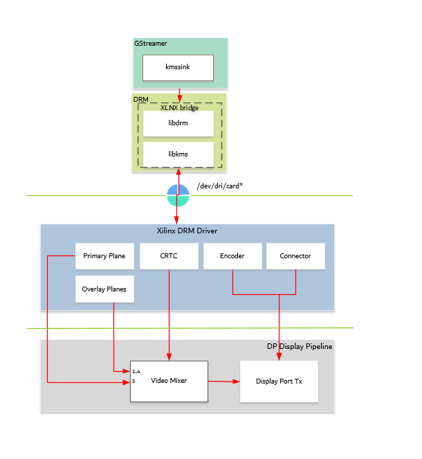

<table class="sphinxhide">
 <tr>
   <td align="center"><h1> Kria&trade; KV260 Vision AI Starter Kit AIBox-ReID Tutorial</h1>
   </td>
 </tr>
 <tr>
 <td align="center"><h1> Software Architecture of the Platform </h1>

 </td>
 </tr>
</table>

# Software Architecture of the Platform

## Introduction

 This chapter describes the application processing unit (APU) Linux software stack. The stack and vertical domains are shown in the following figure.

The stack is horizontally divided into the following layers.

* Application layer (user-space)

  * Jupyter notebooks with a simple control and visualization interface
  * Aibox-reid application to invoke various gstreamer pipelines
  * GStreamer multimedia framework with python bindings for video pipeline control

* Middleware layer (user-space)

  * Implements and exposes domain-specific functionality by means of GStreamer plugins to interface with the application layer
  * Provides access to kernel frameworks

* Operating system (OS) layer (kernel-space)
  * Provides a stable, well-defined API to the user-space
  * Includes device drivers and kernel frameworks (subsystems)
  * Access to hardware IPs

Vertically, the software components are divided by domain:

### Video Capture

In the capture path, the RTSP stream or a file source is pipelined to the Codec. The software stack could be referred to the figure from multiple vertical domains in the introduction section.

At a high-level, it consists of the following layers from top to bottom:

* GStreamer RTSP:

GStreamer has excellent support for both RTP and RTSP, and its RTP/RTSP stack has proved itself over years of being widely used in production use in a variety of mission-critical and low-latency scenarios.

* RTSP Client: The GStreamer rtspsrc element from gst-plugins-good is GStreamer's high-level RTSP client abstraction. It can be used as a standalone element directly, or can be used via playbin by passing an rtsp:// URI to playbin.
  * The rtspsrc plugin is used as client on the target to stream in data from IP cameras. rtspsrc features a number of GObject properties that allow you to configure it in all kinds of different ways.
  * The rtph264depay plugin extracts H264 video from RTP packets and is streamed into the video encoder. RTSP uses the underlying ethernet stack to move data into the platform.

* Ethernet:

  This design uses common `macb.c` driver code (present in the Linux kernel) for the gigabit Ethernet controller (GEM) on the SOM. The macb driver uses the direct memory access (DMA) controller attached to the GEM in the processing system (PS). This driver is responsible for several functions including DMA descriptor rings setup, allocation, and recycling. For more details on GEM,  refer to the Zynq UltraScale+ MPSoC Software Developer Guide (UG1137) and Zynq UltraScale+ Device Technical Reference Manual (UG1085).

* CODEC:

  The Video Codec Unit (VCU) core supports multi-standard video encoding and decoding of H.264 and H.265 standards. A software stack on the CPU controls various functions of Encoder and Decoder blocks. The VCU software stack consists of a custom kernel module and a custom user space library known as Control Software (CtrlSW). The OpenMAX&trade; (OMX) integration layer (IL) is integrated on top of CtrlSW, and the GStreamer framework is used to integrate the OMX IL component and other multimedia elements. OpenMAX (Open Media Acceleration) is a cross-platform API that provides a comprehensive streaming media codec and application portability by enabling accelerated multimedia components. GStreamer is the cross-platform/open source multimedia framework. Its core function is to provide a framework for plugins, data flow, and media type handling and negotiation. It also provides an API to write applications using the various plugins.

  

  In the capture-decode side, the macb driver allocates buffer to the gst-omx plugin. The GStreamer elements rtpsrc rthp264depay import and depacketise rtsp stream from IP cameras. The gst-omx plug-in passes the file descriptor to the decoder driver. The decoder driver uses the DMA_BUF framework and reads the kernel buffer for decoding.

  For more information on VCU Encoder and Decoder features, refer to the *H.264/H.265 Video Codec Unit LogiCORE IP Product Guide* ([PG252](https://docs.xilinx.com/access/sources/dita/map?url=pg252-vcu&ft:locale=en-US)).

### NN Interface

AiBox-ReID is the Neural Net performing pedestrian detection on all multi streams of data using AI inference accelerator (DPU). The software stack to this vertical domain is covered extensively in the section [Software Architecture of the Accelerator](sw_arch_accel_aib.md).

### DP TX Display

Linux kernel and user-space frameworks for display and graphics are intertwined, and the software stack can be quite complex with many layers and different standards/APIs. On the kernel side, the display and graphics portions are split with each having their own APIs. However, both are commonly referred to as a single framework, namely DRM/KMS. This split is advantageous, especially for SoCs that often have dedicated hardware blocks for display and graphics. The display pipeline driver responsible for interfacing with the display uses the kernel mode setting (KMS) API and the GPU responsible for drawing objects into memory uses the direct rendering manager (DRM) API. Both APIs are accessed from user-space through a single device node.

#### Direct Rendering Manager

This section focuses on the common infrastructure portion around memory allocation and management that is shared with the KMS API.

#### Driver Features

The AMD DRM driver uses the GEM memory manager and implements DRM PRIME buffer sharing. PRIME is the cross-device buffer sharing framework in the DRM. To user-space PRIME buffers are DMABUF-based file descriptors. The DRM GEM/CMA helpers use the CMA allocator as a means to provide buffer objects that are physically contiguous in memory. This is useful for display drivers that are unable to map scattered buffers via an IOMMU. Frame buffers are abstract memory objects that provide a source of pixels to scan out to a CRTC. Applications explicitly request the creation of frame buffers through the DRM_IOCTL_MODE_ADDFB(2) ioctls and receive an opaque handle that can be passed to the KMS CRTC control, plane configuration, and page flip functions.

#### Kernel Mode Setting

Mode setting is an operation that sets the display mode including video resolution and refresh rate. It was traditionally done in user-space by the X-server which caused a number of issues due to accessing low-level hardware from user-space which, if done wrong, can lead to system instabilities. The mode setting API was added to the kernel DRM framework, hence the name kernel mode setting. The KMS API is responsible for handling the frame buffer and planes, setting the mode, and performing page flips (switching between buffers). The KMS device is modeled as a set of planes, CRTCs, encoders, and connectors as shown in the top half of the figure above. The bottom half of the figure shows how the driver model maps to the physical hardware components inside the PS DP TX display pipeline.

#### CRTC

CRTC is an antiquated term that stands for cathode ray tube controller, which today would be simply named display controller as CRT monitors have disappeared and many other display types are available. The CRTC is an abstraction that is responsible for composing the frame to be scanned out to the display and setting the mode of the display.

In the AMD DRM driver, the CRTC is represented by the video mixer. The bottommost plane is the primary plane (or master layer) and configured statically in the device-tree. The primary plane always matches the currently configured display resolution set by the CRTC (width and height) with X- and Y-offsets set to 0. The primary plane can be overlayed with up to four overlay planes inside the video mixer

The DP TX hardware supports up to two planes, one for video and one for graphics. The z-order (foreground or background position) of the planes and the alpha mode (global or pixel-alpha) can be configured through the driver via custom properties.

#### XLNX Bridge

Xlnx Bridge is an enhancement for AMD DRM framework to provide support for external CRTC for PS DP TX. In the PL infrastructure, each DRM object is modular and can use an external CRTC directly. For the PS DP, the DRM CRTC, encoder, and connector are closely tied together. To use an external CRTC, XLNX bridge implementation is used to connect the video mixer to the PS DP. The bridge can be used to set the PS DP configuration based on the modetest config passed from user space.

#### Plane

In this design, the primary plane can be overlayed and/or alpha-blended with up to four
additional planes inside the video mixer. The z-order (foreground or background position) of the
planes is fixed. The global alpha mode can be configured per plane through the driver by means
of custom KMS properties: an alpha value of 0% (or 0) means the layer is fully transparent
(invisible); an alpha value of 100% (or 255) means that the layer is fully opaque.

Each overlay plane's width, height, X-, and Y-offset is runtime programmable relative to the
primary plane or CRTC which determines the display resolution. The pixel formats of the primary
plane as well as the four overlay planes are fixed: one BGR plane (primary) plus four NV12
planes (overlay) from bottom to top.

The AMD DRM driver supports the universal plane feature; therefore, the primary plane and
overlay planes can be configured through the same API. A page flip is the operation that
configures a plane with the new buffer index to be selected for the next scan-out. The new
buffer is prepared while the current buffer is being scanned out, and the flip typically happens
during vertical blanking to avoid image tearing.

#### Encoder

An encoder takes pixel data from a CRTC and converts it to a format suitable for any attached connectors. There are many different display protocols defined, such as HDMI or DisplayPort. The PS display pipeline has a DisplayPort transmitter built in. The encoded video data is then sent to the serial I/O unit (SIOU) which serializes the data using the gigabit transceivers (PS GTRs) before it goes out via the physical DP connector to the display.

#### Connector

The connector models the physical interface to the display. Both DisplayPort and HDMI protocols use a query mechanism to receive data about the monitor resolution, and refresh rate by reading the extended display identification data (EDID) (see the VESA Standard) stored inside the monitor. This data can then be used to correctly set the CRTC mode. The DisplayPort support hot-plug events to detect if a cable has been connected or disconnected as well as handling display power management signaling (DPMS) power modes.

#### Libdrm

The framework exposes two device nodes per display pipeline to user space: the /dev/dri/card* device node and an emulated /dev/fb* device node for backward compatibility with the legacy fbdev Linux framework. The latter is not used in this design. libdrm was created to facilitate the interface of user space programs with the DRM subsystem. This library is merely a wrapper that provides a function written in C for every ioctl of the DRM API, as well as constants, structures and other helper elements. The use of libdrm not only avoids exposing the kernel interface directly to user space, but presents the usual advantages of reusing and sharing code between programs.

## Next Steps

You can choose any of the following next steps:

* Read [Software Architecture of the Accelerator](sw_arch_accel_aib.md).
* Go back to the [KV260 AI Box Design Start Page](../aibox-dist_landing).

Copyright © 2021-2024 Advanced Micro Devices, Inc

<a href="https://www.amd.com/en/corporate/copyright">Terms and Conditions</a>
