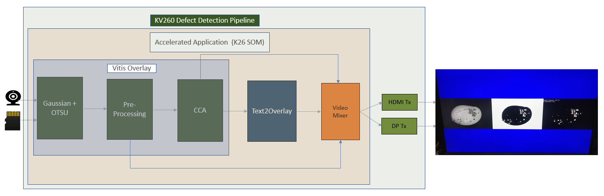

##################################################
Defect Detect
##################################################

The Defect Detection accelerated application is a machine vision application that automates detection of defects in mangoes and sorting in high-speed factory pipelines by using computer vision library functions.

.. note::
   The test mango image is taken from the `COFILAB site <http://www.cofilab.com/wp-content/downloads/DB_Mango.rar>`_.

*******************************
Overview
*******************************

.. toctree::
  :maxdepth: 1
  
  Introduction <docs/introduction_dd>

Features
===============================

* Monochrome images from a live camera source or a file source 
* Defect detection and sorting of mangoes
* HDMI or DisplayPort out from the various stages
* User programmable CV Models

*******************************
Quick Start
*******************************

.. toctree::
  :maxdepth: 1
  
  Setting up the Board and Application Deployment <docs/app_deployment_dd>

***************************
Tutorials
***************************

.. toctree::
   :maxdepth: 1
  
   Building the Design Components <../building_the_design>
   Building the Hardware Design Using Vivado <../build_vivado_design>
   Creating a Vitis Platform <../build_vitis_platform>
   Integrating an Overlay Into the Platform <../build_accel>
   Generating Custom Firmware <../generating_custom_firmware>
   Kria Starter Kit Linux Boot <../kria_starterkit_linux_boot>
   Rebuilding Application Docker Containers <../build_application_docker_container>

********************
Architecture
********************

.. toctree::
   :maxdepth: 1
  
   Software Architecture - Platform <docs/sw_arch_platform_dd>
   Software Architecture - Accelerator <docs/sw_arch_accel_dd>
   Hardware Architecture - Platform <docs/hw_arch_platform_dd>
   Hardware Architecture - Accelerator <docs/hw_arch_accel_dd>

*******************************
Repository
*******************************

.. toctree::
   :maxdepth: 1
  
   Software Repository <https://github.com/Xilinx/defect-detect>

******
Other
******

.. toctree::
   :maxdepth: 1
  
   Debugging <docs/debug_dd>
   Known Issues <docs/known_issues_dd>

Xilinx Support
====================================

GitHub issues will be used for tracking requests and bugs. For questions, go to `forums.xilinx.com <http://forums.xilinx.com/>`_.
