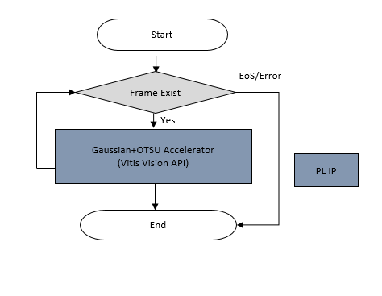
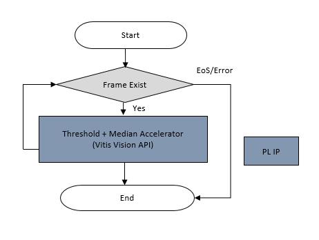
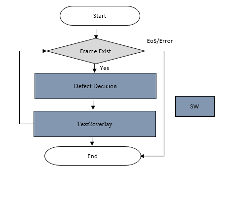

<table class="sphinxhide">
 <tr>
   <td align="center"><h1>Kria&trade; KV260 Vision AI Starter Kit Defect Detection Tutorial</h1>
   </td>
 </tr>
 <tr>
 <td align="center"><h1>Software Architecture of the Accelerator</h1>

 </td>
 </tr>
</table>

# Software Architecture of the Accelerator

## Introduction

This document describes the software architecture of the Defect Detection accelerator application.

### Software Architecture

In the Defect Detection application, the Computer Vision Starter Kit can take video inputs from a live or a file source. As shown in the following figure, the video inputs will be in the Luma(Y) format, processed and displayed. The AMD Vitis&trade; overlay includes Vitis Vision libraries that process the frames and detect defects in mangoes.

In this reference design, the resolution on the input frames is 1280 x 800, and the outputs are 3x1280x800 on a 4K display.


The parts before pre-process plugin and after the mixer for data source and sink respectively, use purely official GStreamer plugins, such as *filesrc* for file input, *v4l2src* for MIPI, and *Kmssink* for the display. Refer to the [GStreamer documentation](https://gstreamer.freedesktop.org/documentation/tutorials/index.html?gi-language=c) for detailed usage.

The core acceleration tasks are performed by the Pre-Process and CCA libraries, which are developed by AMD.

<details>
 <summary><b>The following table lists the GStreamer plugins used in the application.</b></summary>

| GStreamer Plugins| Definition|Note|
| ----------- | ----------- |------ |
| v4l2src     | Image capturing from the live camera source      |V4l2 source |
| Kmssink  | For the display        |Upstream GStreamer|
|Queue | Simple data queue | Upstream GStreamer|
|Tee|1-to-N pipe fitting|Upstream GStreamer|
|VVAS xfilter|Kernel Library: *gaussian_otsu*. Vitis Vision library for the Gaussian + OTSU detector. Preserves edges while smoothening and calculates the optimum threshold between foreground and background pixels.|AMD Opensource Plugin|
|VVAS xfilter|Kernel Library: *threshold_median*. Vitis Vision library to convert a grey-scale image to a binary image and filter out noise from the image.|AMD Opensource Plugin|
|VVAS xfilter|Kernel Library: *cca_accelerator*. Vitis Vision library to determine the defective pixels in the image.|AMD Opensource Plugin|
|VVAS xfilter|Kernel Library: *text2overlay*. *OpenCV* software library to calculate the defect density, determine the quality of the mango, and embed text as result into output images.|AMD Opensource Plugin|
____

</details>

<details>
 <summary><b>The following table lists the component types used in the application.</b></summary>

| Pipeline| Component|Component Type|
| ----------- | ----------- |------ |
| Pre-Process  | Gaussian + OTSU Accelerator |PL|
|  |Threshold + Median Filter |PL |
|Defect Decision | CCA | PL
| |Text2Overlay + Defect Decision|SW|

____

</details>

## v4l2src

<details>
 <summary><b>Click here to view details</b></summary>

v4l2src is an open source plugin. The underlying GStreamer plugin uses the AR0144 sensor and the AP1302 ISP. The data flow is as follows:


</details>

### In-House Plugins

The following are the in-house plugins:

#### Pre-process

<details>
 <summary><b>Click here to view details</b></summary>

The pre-process pipeline is as follows:


The following figure depicts the Pre-Process plugin data flow.


<h1>Gaussian_OTSU Accelerator</h1>

This accelerator has two kernels—Gaussian + OTSU, stitched in streaming fashion.
In general, any smoothing filter smooths the image and will affect the edges of the image. To
preserve the edges while smoothing, you can use a bilateral filter. In an analogous way as the
Gaussian filter, the bilateral filter also considers the neighboring pixels with weights assigned to each of them.

These weights have two components, the first of which is the same weighing used
by the Gaussian filter. The second component takes into account the difference in the intensity
between the neighboring pixels and the evaluated one.

The OTSU threshold is used to automatically perform clustering-based image thresholding or the
reduction of a gray-level image to a binary image. The algorithm assumes that the image contains
two classes of pixels following bi-modal histogram (foreground pixels and background pixels), it
then calculates the optimum threshold separating the two classes.

The following figure depicts the Gaussian + OSTSU plugin software stack.


The following figure depicts the Gaussian + OTSU plugin data flow.



<h1>Threshold_Median Accelerator</h1>

The greyscale image should be converted to a binary image with an appropriate threshold value. The threshold function in the Vitis Vision library can perform the thresholding operation on the input image. This should yield an image that has a black background with the mango area in white.

The median blur filter acts as a non-linear digital filter that reduces noise. A filter size of N outputs the median of the NxN neighborhood pixel values, for each pixel. In this design, N is 3.

This plugin accepts the 1280x800 Y8 image as the input. The plugin applies the threshold binary algorithm to convert the Y8 image to binary image by using the threshold value of the pixel. Later, it applies the Median filter to remove salt and pepper noise.

The following figure depicts the Threshold + Median plugin software stack.


The following figure depicts the Threshold + Median plugin data flow.



Threshold and Median Blur kernels are connected together using AXI Stream interface.

</details>

#### CCA

<details>
 <summary><b>Click here to view details</b></summary>

The implemented Connected Component Analysis (CCA), is a custom solution to find the defective pixels in the problem object. This algorithm considers few assumptions that the background must to be easily separable from the foreground object.

The custom CCA effectively analyzes the components that are connected to the background pixels and removes the background from the object and defective pixels. The aim is to send the following output information from the function:

* defect image: Image with only defect pixels marked as ‘255’ and both object pixels and background as ‘0’ 
* object_pixels: Total non-defective pixels of the object
* defect_pixels: Total defective pixels

The following figure depicts the CCA plugin software stack.


The following figure depicts the CCA plugin data flow.


</details>

#### Defect Decision

<details>
 <summary><b>Click here to view details</b></summary>

The output of the CCA plugin is fed into the Defect Decision block which determines the defect density and decides the quality of the mango. The block performs the following main operations:

* The ratio of blemished pixels to total mango pixels is calculated to determine how much of the mango's surface area is covered with blemishes.

* The Defect Decision determines whether the ratio exceeds a user-defined threshold, to decide whether the mango is defected or not.

* The results will be embedded in the image, and the output will be fed to the next plugin for the display.

The following figure depicts the Defect Decision plugin software stack.


The following figure depicts the Defect Decision plugin data flow.



</details>

## Configuration Files

<details>
 <summary><b>Click here to view details</b></summary>

The **defect-detect** application uses the following configuration files.

* Gaussian_OTSU Accelerator

  The `otsu-accelerator.json` file is as follows:

  ```
  {
    "xclbin-location": "/lib/firmware/xilinx/kv260-defect-detect/kv260-defect-detect.xclbin",
    "vvas-library-repo": "/opt/xilinx/kv260-defect-detect/lib",
    "element-mode": "transform",
    "kernels": [
      {
        "kernel-name": "gaussian_otsu_accel:gaussian_otsu_accel_1",
        "library-name": "libvvas_otsu.so",
        "config": {
          "debug_level" : 1
        }
      }
    ]
  }
  ```
  
  * debug_level: Enable or disable debug log for the Kernel library.

* Preprocess Accelerator

  The *preprocess-accelerator.json* file is as follows:

  ```
  {
    "xclbin-location": "/lib/firmware/xilinx/kv260-defect-detect/kv260-defect-detect.xclbin",
    "vvas-library-repo": "/opt/xilinx/kv260-defect-detect/lib",
    "element-mode": "transform",
    "kernels": [
      {
        "kernel-name": "preprocess_accel:preprocess_accel_1",
        "library-name": "libvvas_preprocess.so",
        "config": {
          "debug_level" : 1,
          "max_value": 255
        }
      }
    ]
  }
  ```

  * debug_level: Enable or disable debug log for the Kernel library.
  * max_value: Maximum value to use with the THRESH_BINARY thresholding types. For more information, see <https://docs.opencv.org/master/d7/d1b/group__imgproc__misc.html#gae8a4a146d1ca78c626a53577199e9c57>.

* CCA Accelerator

  The *cca-accelarator.json* file is as follows:

  ```
  {
    "xclbin-location": "/lib/firmware/xilinx/kv260-defect-detect/kv260-defect-detect.xclbin",
    "vvas-library-repo": "/opt/xilinx/kv260-defect-detect/lib",
    "element-mode": "transform",
    "kernels": [
      {
        "kernel-name": "cca_custom_accel:cca_custom_accel_1",
        "library-name": "libvvas_cca.so",
        "config": {
          "debug_level" : 1
        }
      }
    ]
  }
  ```

  * debug_level: Enable or disable debug log for the Kernel library.
  
* Text2Overlay

  The *text2overlay.json* file is as follows:

  ```
  { 
    "xclbin-location": "/lib/firmware/xilinx/kv260-defect-detect/kv260-defect-detect.xclbin",
    "vvas-library-repo": "/opt/xilinx/kv260-defect-detect/lib",
    "element-mode":"inplace",
    "kernels" :[
      {
        "library-name":"libvvas_text2overlay.so",
        "config": {
          "debug_level" : 1,
          "font_size" : 1.0,
          "font" : 3,
          "x_offset" : 0,
          "y_offset" : 50,
          "defect_threshold" : 0.14,
          "is_acc_result" : 0
        }
      }
   ]
  }
  ```

  * debug_level: Enable or disable debug log for the Kernel library.
  * font_size: User configuration to change the font size.
  * font: User configuration to change the supported font type.
  * x_offset: The X co-ordinate from where the text starts writing.
  * y_offset: The Y co-ordinate from where the text starts writing.
  * defect_threshold: The defect density threshold to calculate the defect. If the defect value is more than the threshold, it falls under defect category.
  * is_acc_result: Flag to display the accumulated result. If the value is 0, then the accumulated result will not be displayed.
  For more information see <https://docs.opencv.org/3.4/d0/de1/group__core.html#ga0f9314ea6e35f99bb23f29567fc16e11>.

</details>

## Next Steps

* [Hardware Architecture](hw_arch_platform_dd.md)
* [Hardware Accelerator](hw_arch_accel_dd.md)


<p class="sphinxhide" align="center"><sub>Copyright © 2021-2024 Advanced Micro Devices, Inc</sub></p>

<p class="sphinxhide" align="center"><sup><a href="https://www.amd.com/en/corporate/copyright">Terms and Conditions</a></sup></p>