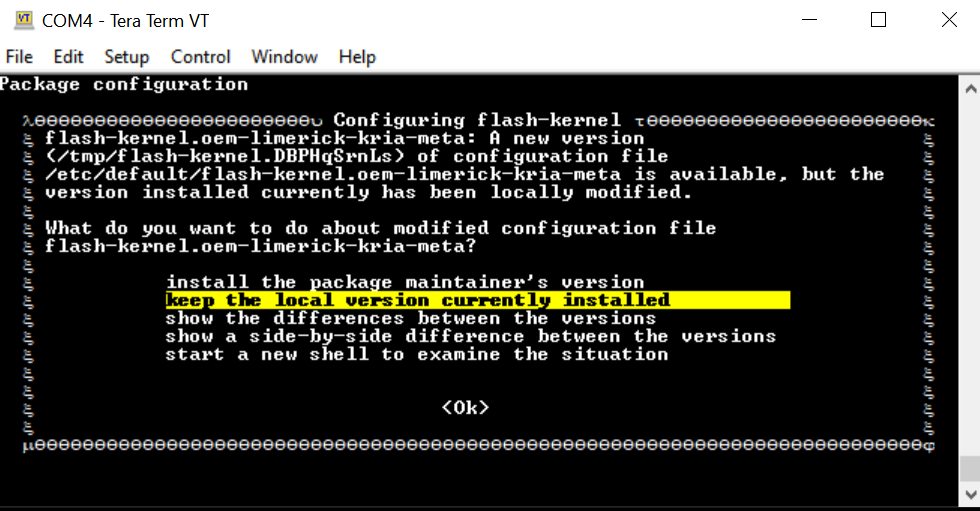

<table class="sphinxhide">
 <tr>
   <td align="center"><h1>Kria&trade; Booting the Kria Starter Kit Linux</h1>
   </td>
 </tr>
</table>

# Booting the Kria Starter Kit Linux

## Introduction

This document shows how to boot the Kria Starter Kit Linux and perform common one-time updates and installations required prior to running any AMD released KV260 application in Linux.

This guide is targeted for Ubuntu&reg; 22.04 and AMD 2022.1 toolchain.

## Boot Process

1. Flash the Kria Starter Kit Linux image into the SD card (minimum 16 GB).

      Refer to [KV260 Getting Started Page](https://www.xilinx.com/products/som/kria/kv260-vision-starter-kit/kv260-getting-started-ubuntu/setting-up-the-sd-card-image.html) to flash SD card with an Ubuntu 22.04 image.

      You can reuse the same SD card to evaluate all the applications released for Ubuntu 22.04.

2. Set up the hardware. Each application will require a different set of peripherals; the following lists the minimum required to boot Linux.

   

   * microSD: Insert the SD card into slot at J11.

   * Monitor: Connect the monitor to the board via either the DP or HDMI port. Refer to each application documentation for the monitor resolution requirement.

   * UART/JTAG interface: For interacting and seeing boot-time information, connect a USB debugger to J4. Some applications will only run through commands issued through the universal asynchronous receiver-transmitter (UART) interface.

   * Network connection: Connect the Ethernet cable to your local network with DHCP enabled to install the Linux packages, and run Jupyter Notebooks.

3. Ensure the Starter Kit Boot firmware is up-to-date.

    The SOM Starter Kits have factory preprogrammed boot firmware that is installed and maintained in the SOM quad SPI (QSPI) device. Update the boot firmware in the SOM QSPI device to the '2022.1 Boot FW' Image.

    See the [Kria Wiki](https://xilinx-wiki.atlassian.net/wiki/spaces/A/pages/1641152513/Kria+K26+SOM#Boot-Firmware-Updates) to obtain the boot firmware binary and instructions to update the QSPI image using xmutil, after the Linux boot.  

    The QSPI image update persists through power cycles or SD card changes.

4. Boot Linux on your Starter Kit (Ubuntu) following the instructions from [this page](https://www.xilinx.com/products/som/kria/kv260-vision-starter-kit/kv260-getting-started-ubuntu/booting-your-starter-kit.html).

   * For some applications, it is required to work with command line instead of GNOME Desktop.

5. If you have not done so yet, perform a system update to pull in the latest kernel and AMD packages. There can be some errors during install; refer to [Known Issues](#known-issues) if you encounter issues. In this step we manually add the AMD-specific Ubuntu PPAs, and then perform a system update and upgrade to pull in the latest AMD libraries. The apt upgrade step can take some time.

   ```bash
   sudo add-apt-repository ppa:xilinx-apps --yes &&
   sudo add-apt-repository ppa:ubuntu-xilinx/sdk --yes &&
   sudo add-apt-repository ppa:xilinx-apps/xilinx-drivers --yes &&
   sudo apt update --yes &&
   sudo apt upgrade --yes
   ```

   >**NOTE:** If the kernel was updated, make sure to follow the apt upgrade command prompt to reboot the platform to boot with the latest kernel.

6. The KV260 Ubuntu 22.04 applications are deployed as Docker containers. Follow the instructions from [docker.com](https://docs.docker.com/engine/install/ubuntu/) to install Docker.

   Enable your user to properly use the Docker commands without using sudo for every docker command.

    ```bash
    sudo groupadd docker
    sudo usermod -a -G docker  $USER
    ```

   This will only need to be done once if reusing the same SD card for running multiple applications.

7. Install the latest xrt zocl driver:

      ```bash
      sudo apt install xrt-dkms
      ```

This flow will only need to be done once if reusing the same SD card for multiple applications. However, you can choose to update and upgrade again to install the newly available updates that are made available later.

## Known Issues

1. Sometimes Ubuntu has background processes ongoing by the time it boots to the command prompt and does not yet ask you to change your password. In those , doing a snap install might result in a message simliar to the following:

   ```error: too early for operation, device not yet seeded or device model not acknowledged```

   Try again in a minute or two, and you should be prompted to update your password and the above error should go away.

2. If a prompt similar to the following appears:

   

   Choose "keep the local version currently installed". For more details, refer to [this wiki page](https://xilinx-wiki.atlassian.net/wiki/spaces/A/pages/2116354051/Tips+Tricks+for+Certified+Ubuntu+AMD-Xilinx+Devices#Understanding-the-Configuring-flash-kernel-Prompts-When-Updating-the-Linux-Kernel).

3. During ```sudo xlnx-config.sysinit``` or ```sudo apt upgrade``` commands, you might see the following errors and exit the installation. Rerun the commands, and the installation should continue and complete.

   ``` text
   flash-kernel: deferring update (trigger activated)
   /etc/kernel/postinst.d/zz-flash-kernel:
   flash-kernel: deferring update (trigger activated)
   Errors were encountered while processing:
   flash-kernel
   need restart is being skipped since dpkg has failed
   E: Sub-process /usr/bin/dpkg returned an error code (1)
   ```

## Miscellaneous Information

The *Ubuntu* user does not have root privileges. Most commands used in these tutorials must be run using *sudo*, and you might be prompted to enter your password.

For security, by default, the root user is disabled. If you want to log in as a root user, perform the following steps. Use the *ubuntu* user's password on the first password prompt, then set a new password for the root user. You can now login as a root user using the newly set root user password.

```bash
ubuntu@kria:\~\$ sudo -i
sudo\] password for ubuntu:
root@kria:\~#
```

If needed, these are the commands to set the system timezone and locale:

* Set the timezone.

```bash
sudo timedatectl set-ntp true
sudo timedatectl set-timezone America/Los_Angeles
timedatectl
```

* Set the locale.

```bash
sudo locale-gen en_US en_US.UTF-8
sudo update-locale LC_ALL=en_US.UTF-8 LANG=en_US.UTF-8
export LANG=en_US.UTF-8
locale
```

The following example command sets the date and time:

`sudo date --set "11 January 2023 16:47:00"`

The storage volume on the SD card can be limited with multiple dockers. If there are space issues, use the following command to remove the existing container:

```bash
sudo docker rmi --force $INSTALLED_DOCKER_IMAGE
```


<p class="sphinxhide" align="center"><sub>Copyright © 2021-2024 Advanced Micro Devices, Inc</sub></p>

<p class="sphinxhide" align="center"><sup><a href="https://www.amd.com/en/corporate/copyright">Terms and Conditions</a></sup></p>