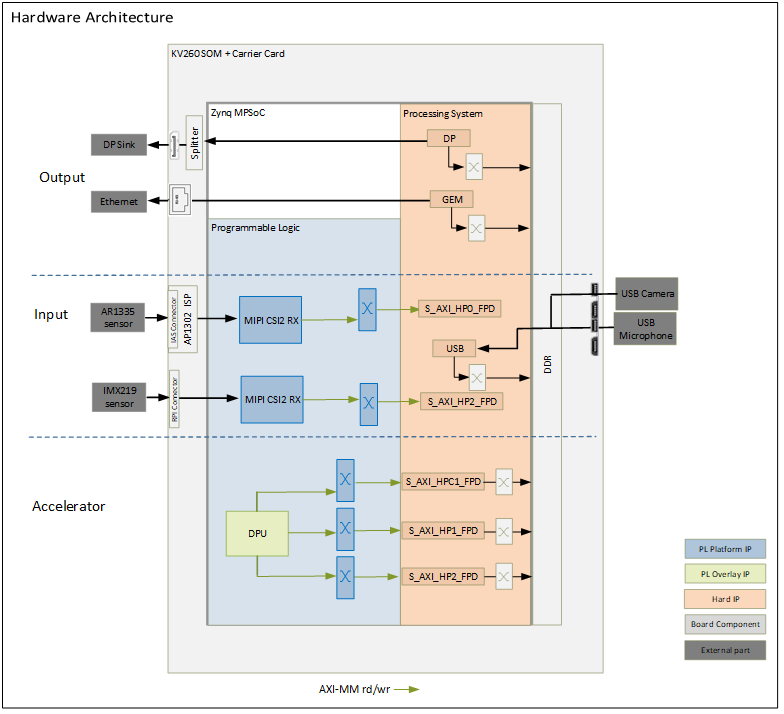
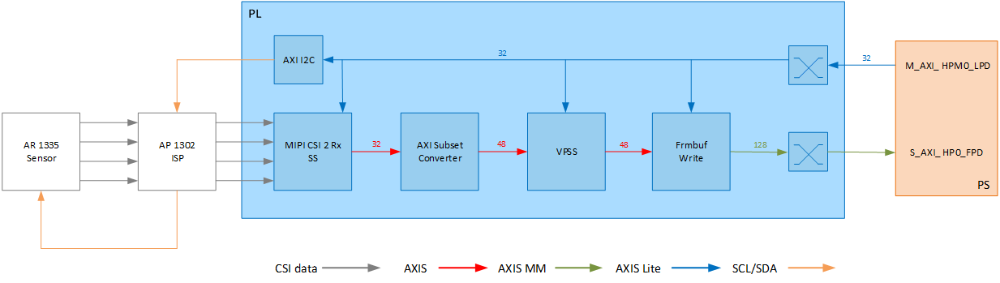
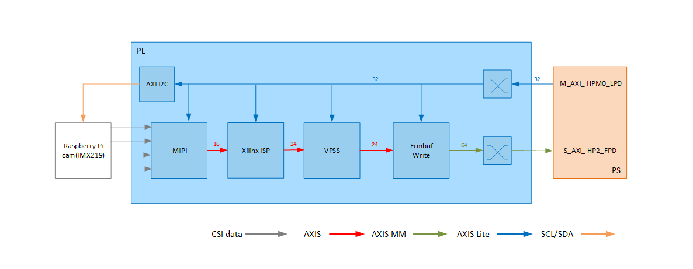

<table class="sphinxhide">
 <tr>
   <td align="center"><h1> Kria&trade; K260 SOM Starter Kit NLP SmartVision Tutorial</h1>
   </td>
 </tr>
 <tr>
 <td align="center"><h1> Hardware Architecture of the Platform </h1>

 </td>
 </tr>
</table>

# Hardware Architecture of the Platform

## Introduction

 This section describes the design implemented in the programmable logic (PL). The following figure shows the top-level hardware architecture of the reference design.

<b>Hardware Architecture: Top Level Diagram</b>

 At a high-level, the design comprises of four pipelines.

Capture/Input pipeline: This comprises of pipelines through which audio/video data are captured.

* USB Audio capture pipeline (PS)
* MIPI CSI-2 capture pipeline (PL)

Display/Output pipeline: This comprises of pipelines through which audio/video data are outputted.

* Display Port pipeline (PS)
* Ethernet pipeline (PS)

Accelerator pipeline: This comprises of overlay accelerator functions integrated into the platform using AMD Vitis&trade;.

* The Deep Learning Processing Unit (DPU) IP runs different Neural Network models (PL).

>**NOTE:** The PS interconnects in the figure are conceptual.

## Capture

### MIPI Capture Pipeline

A capture pipeline receives video frames from an external source, and writes it into memory. This platform has two MIPI pipelines which captures video from the AR1335 and IMX219 modules.

<b>AR1335 Pipeline</b>

This pipeline consists of five components, of which three are controlled by the application processing unit (APU) via an AXI4-Lite based register interface; one is controlled by the APU via an inter IC (I2C) register interface, and one is configured statically.

* The On Semi AR1335 is a CMOS active pixel image sensor with a pixel array of 4208H x 3120V.   It sends sensor data to the ISP through a four-lane MIPI interface. It is controlled and programmed by the ISP via a two-wire serial interface. The sensor is connected to the IAS 0 module connector on the ML carrier card. For more information, refer to the datasheet from <https://www.onsemi.com/products/sensors/image-sensors-processors/image-sensors/ar1335>.

* The On Semi AP1302 ISP is an image signal processor digital image sensor supporting image resolutions up to 4224x 3156V. AP1302 interfaces to CMOS imaging sensors and performs all the necessary operations required to capture video streams. It performs functions like Auto White Balancing (AWB), Auto Exposure (AE), Auto Focus (AF), etc. The ISP is controlled via an I2C interface using an AXI I2C controller in the PL. It is mounted on a ML carrier card and has a MIPI output interface that is connected to the MIPI CSI-2 RX subsystem inside the PL. A general purpose I/O (GPIO) is used to reset the IP. For more information, refer to the datasheet from <https://www.onsemi.com/products/sensors/image-sensors-processors/image-processors/ap1302>.

* The MIPI CSI-2 receiver subsystem (CSI RX) includes a MIPI D-PHY core that connects four data lanes and one clock lane to the ISP. It implements a CSI-2 receive interface according to the MIPI CSI-2 standard v2.0 with underlying MIPI D-PHY standard v1.2. The subsystem captures images from the ISP in YUV 4:2:2 format and outputs AXI4-Stream video data. At one pixels per clock (ppc) and 10 bits per pixel, the AXI4-Stream width is 24-bits. For more information, see the *MIPI CSI-2 Receiver Subsystem Product Guide* (PG232).

* The AXI subset converter, see the *AXI4-Stream Infrastructure IP Suite LogiCORE IP Product Guide* (PG085), is a statically-configured IP core that converts the 16-bit AXI4-Stream input data to 24-bit AXI4-Stream output data by adding zeros to the MSB of each data word. At pne ppc, the AXI4-Stream width is 24-bits.  

* The video processing subsystem is configured in scalar mode. It takes YUV 4:2:2 AXI4-Stream input data and converts it to RGB format.

* The video frame buffer takes RGB input data and converts it to AXI4-MM format which is written to memory in RGB format. The AXI-MM interface is connected to the `S_AXI` port of the PS.  

For each video frame transfer, an interrupt is generated. A GPIO is used to reset the IP between resolution changes.  For more information, see Video Frame Buffer Read and Video Frame Buffer Write LogiCORE IP Product Guide (PG278).

All the IPs in this pipeline are configured to transport 1ppc at 100 MHz, enabling up to 1920x1080 resolution at 30 frames per second (fps).

<b>IMX219 pipeline</b>

This pipeline consists of five components, of which four are controlled by the APU via an AXI-Lite based register interface; one is controlled by the APU via an I2C register interface, and one is configured statically.

* The Raspberry Pi Camera Module 2 replaced the original Camera Module in April 2016. The v2 Camera Module has a Sony IMX219 8-megapixel sensor (compared to the 5-megapixel OmniVision OV5647 sensor of the original camera). The sensor is connected to the Raspberry pi module connector on the ML carrier card. For more information refer to the [datasheet](https://www.raspberrypi.com/products/camera-module-v2/).

* The MIPI CSI-2 receiver subsystem (CSI Rx) includes a MIPI D-PHY core that connects four data lanes and one clock lane to the ISP.  It implements a CSI-2 receive interface according to the MIPI CSI-2 standard v2.0 with underlying MIPI D-PHY standard v1.2. The subsystem captures images from the RPI in RAW10 format and outputs AXI4-Stream video data.  At one pixels per clock (ppc) and 10 bits per pixel, the AXIS width is 16 bits. For more information see the MIPI CSI-2 Receiver Subsystem Product Guide (PG232).

* The Xilinx ISP is a Image Sensor Processing (ISP) of image processing functions processing the raw image from the sensor. It performs functions like Auto White Balancing (AWB),  Demosaicing, Gain Control and Bad pixel correction. A GPIO is used to reset the IP. For more information refer to the [ISP in Vitis Libraries](https://xilinx.github.io/Vitis_Libraries/vision/2021.2/overview.html#isp)

* The video processing subsystem is configured in scalar mode. It takes RGB AXI4-Stream input data and converts it to YUV/RGB formats with various resolutions.

* The video frame buffer takes RGB input data and converts it to AXI4-MM format which is written to memory in RGB format. The AXI-MM interface is connected to the S_AXI port of the PS.  

For each video frame transfer, an interrupt is generated. A GPIO is used to reset the IP between resolution changes.  For more information, see the Video Frame Buffer Read and Video Frame Buffer Write LogiCORE IP Product Guide (PG278).

All the IPs in this pipeline are configured to transport 1 ppc at 200 MHz, enabling up to 1920x1080 resolution at 30 frames per second (fps).

## Display

The Video output pipelines and Video Processing pipelines are not covered in this section as they are not PL components. For more information, refer to DisplayPort Controller and GEM Ethernet chapters in the *Zynq UltraScale+ Device Technical Reference Manual* (UG1085). For more information on Video Processing pipelines, refer to the *Video Codec Unit LogiCORE IP Product Guide* ([PG252](https://docs.xilinx.com/access/sources/dita/map?url=pg252-vcu&ft:locale=en-US)).

## Clocks, Resets and Interrupts

### Clocks

The following table identifies the main clocks of the PL design, their source, their clock frequency, and their function.

| Clock      | Clock Source  | Clock Frequency     | Function |
| :---       |    :----:     |         :---:       | :-----  |
| pl_clk0 | PS | 100 MHz | Clock source for clocking wizard (clk_wiz_0) generating clocks |
| clk_200M | Clocking wizard | 200 MHz | MIPI D-PHY core clock |
| clk_100M* | Clocking wizard | 100 MHz  | AXI4-Lite clock to configure the different audio and video IPs in the design. |
| clk_200M | Clocking wizard | 200 MHz | AXI MM clock and AXI4-Stream clock used in the capture pipeline, display pipeline, and processing pipeline |
| clk_300M* | Clocking wizard | 300 MHz | Generated to be used by the accelerator |
| clk_600M* | Clocking wizard | 600 MHz | Generated to be used by the accelerator |

* Clocks exposed as a Platform interface and can be used by an accelerator.

### Resets

The following table summarizes the resets used in this design.

| Reset Source | Function  |
| :---         |    :----  |
|pl_resetn0  |PL reset for proc_sys_reset modules and the clock_wizard generating clocks for the video domain |
|rst_processor_100MHz |Synchronous resets for clk_out100M clock domain       |
|rst_processor_200MHz |Synchronous resets for clk_out200M clock domain       |
|rst_processor_300MHz |Synchronous resets for clk_out300M clock domain       |
|rst_processor_600MHz |Synchronous resets for clk_out600M clock domain       |
|GPIOs   |             |
|emio_gpio_o[0]  |Frame Buffer Write IP reset          |
|emio_gpio_o[1]  |AP1302 ISP Reset           |
|emio_gpio_o[7]  |Video processing subsystem IP reset          |

### Interrupts

The following table lists the PL-to-PS interrupts used in this design.

| Interrupt ID | Instance  |
| :---        |    :----  |
|pl_ps_irq1[0] | MIPI RX Subsystem IP           |
|pl_ps_irq1[1] | Frame Buffer Write IP          |
|pl_ps_irq1[3] | AXI I2C IP            |
|pl_ps_irq0 | Exposed as a Platform interface and can be used by an accelerator |

## Next Steps

* [Hardware Architecture of the Accelerator](hw_arch_accel_nlp.md)
* Go back to the [KV260 SOM NLP SmartVision Design Start Page](../nlp_smartvision_landing)

## References

Copyright © 2021-2024 Advanced Micro Devices, Inc

<a href="https://www.amd.com/en/corporate/copyright">Terms and Conditions</a>
