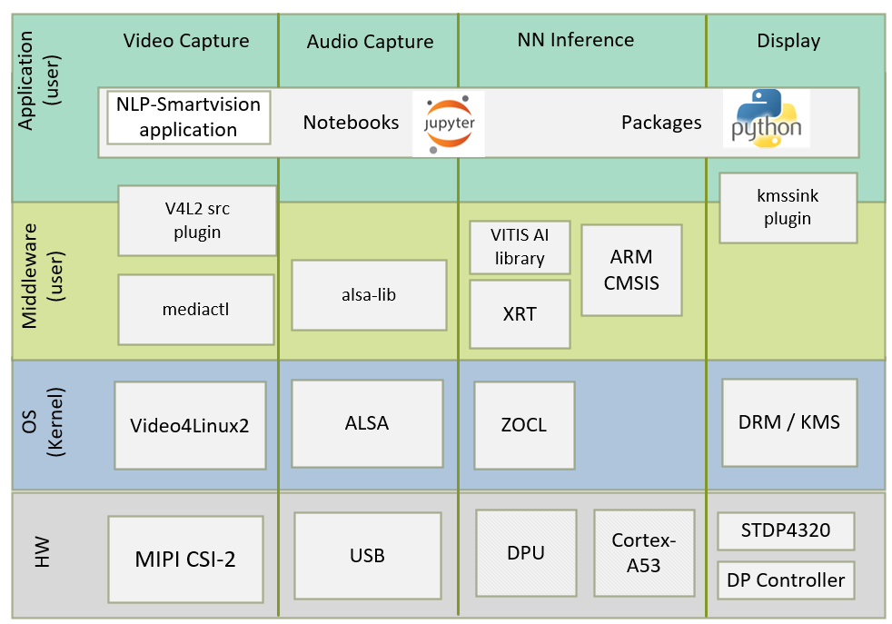
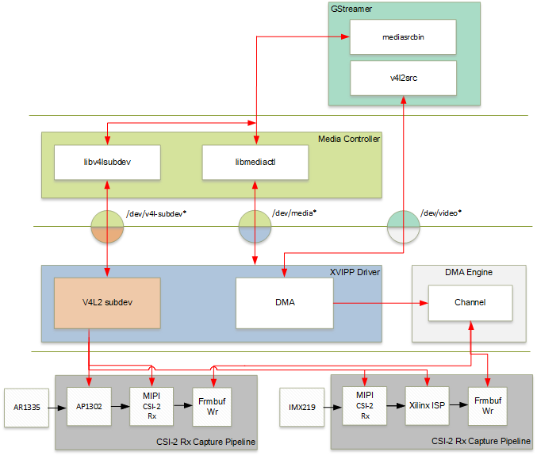
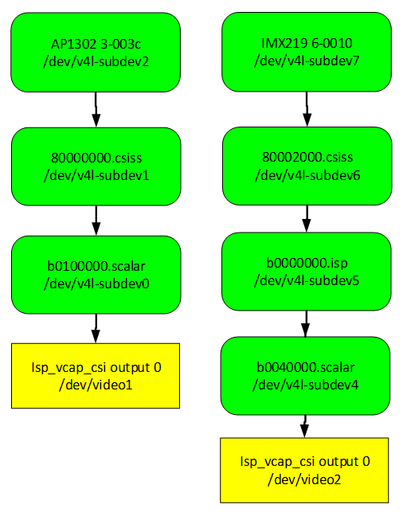
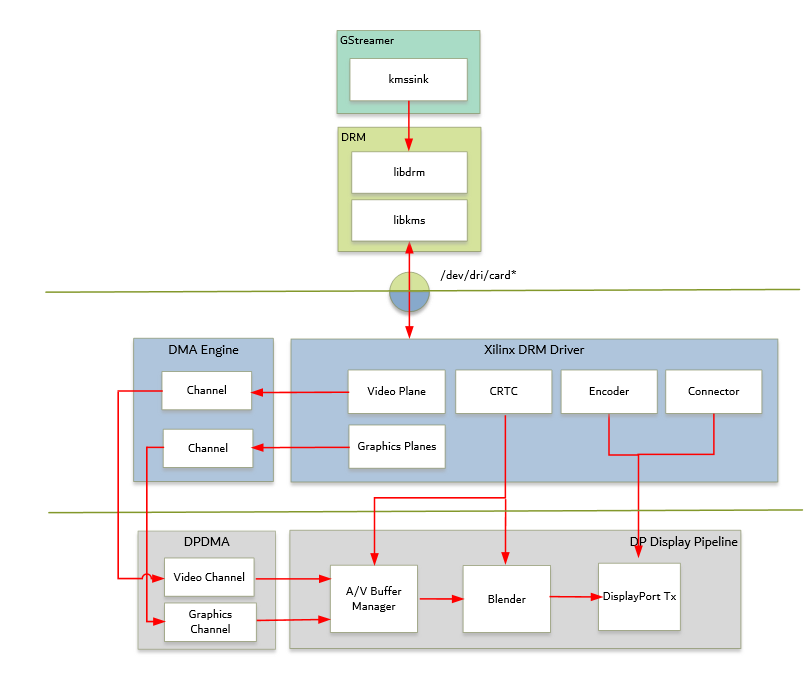
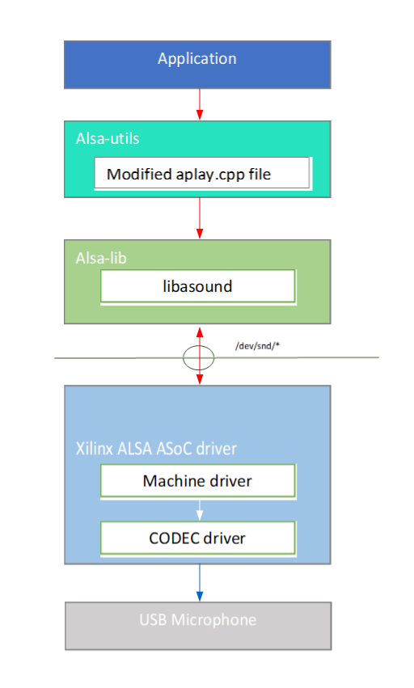

<table class="sphinxhide">
 <tr>
   <td align="center"><h1> Kria&trade; KV260 Vision AI Starter Kit NLP SmartVision Tutorial</h1>
   </td>
 </tr>
 <tr>
 <td align="center"><h1> Software Architecture of the Platform </h1>

 </td>
 </tr>
</table>

# Software Architecture of the Platform

## Introduction

 This chapter describes the application processing unit (APU) Linux software stack. The stack and vertical domains are shown in the following figure.



The stack is horizontally divided into the following layers:

* Application layer (user-space)

  * Jupyter notebooks with a simple control and visualization interface
  * NLP-SmartVision application to invoke the application via CLI
  * Python bindings for video pipeline control

* Middleware layer (user-space)

  * Implements and exposes domain-specific functionality by means of V4L2 src plugins, alsa-lib, Vitis-AI Library and ARM NN Library to interface with the application layer
  * Provides access to kernel frameworks

* Operating system (OS) layer (kernel-space)
  * Provides a stable, well-defined API to user-space
  * Includes device drivers and kernel frameworks (subsystems)
  * Access to hardware IPs

Vertically, the software components are divided by domain:

### Video Capture

The Video Capture software stack is depicted in the following figure using the single-sensor MIPI CSI capture pipeline



At a highlevel it consists of the following layers from top to bottom:

* User-space layers

  * GStreamer: Media source bin plugin (wrapper around generic v4l2src plugin)
  * Media controller: Library to configure v4l subdevices and media devices

* Kernel-space layers
  * V4L2/Media subsystems: Xilinx video IP pipeline (XVIPP) driver
  * DMA engine: Xilinx framebuffer driver

#### Media Source Bin GStreamer Plugin

 The mediasrcbin plugin is designed to simplify the usage of live video capture devices in this design, otherwise the user must take care of initialization and configuration. The plugin is a bin element that includes the standard v4l2src GStreamer element. It configures the media pipelines of the supported video sources in this design. The v4l2src element inside the mediasrcbin element interfaces with the V4L2 Linux framework and the Xilinx VIPP driver through the video device node. The mediasrcbin element interfaces with the Media Controller Linux framework through the v412-subdev and media device nodes which allows you to configure the media pipeline and its sub-devices. It uses the libmediactl and libv4l2subdev libraries which provide the following functionality:

* Enumerate entities, pads and links
* Configure sub-devices
  * Set media bus format
  * Set dimensions (width/height)
  * Set frame rate
  * Export sub-device controls

The mediasrcbin plugin sets the media bus format and resolution on each sub-device source and sink pad for the entire media pipeline. The formats between pads that are connected through links need to match. Refer to the Media Framework section for more information on entities, pads and links.

### Kernel Subsystems

In order to model and control video capture pipelines such as the ones used in this TRD on Linux systems, multiple kernel frameworks and APIs are required to work in concert. For simplicity, we refer to the overall solution as Video4Linux (V4L2) although the framework only provides part of the required functionality. The individual components are discussed in the following sections.

#### Driver Architecture

The Video Capture Software Stack figure in the Capture section shows how the generic V4L2 driver model of a video pipeline is mapped to the single-sensor MIPI CSI-2 Rx capture pipelines. The video pipeline driver loads the necessary sub-device drivers and registers the device nodes it needs, based on the video pipeline configuration specified in the device tree. The framework exposes the following device node types to user space to control certain aspects of the pipeline:

* Media device node: /dev/media*
* Video device node: /dev/video*
* V4L2 sub-device node: /dev/v4l-subdev*

#### Media Framework

The main goal of the media framework is to discover the device topology of a video pipeline and to configure it at run-time. To achieve this, pipelines are modeled as an oriented graph of building blocks called entities connected through pads. An entity is a basic media hardware building block. It can correspond to a large variety of blocks such as physical hardware devices (e.g. image sensors), logical hardware devices (e.g. soft IP cores inside the PL), DMA channels or physical connectors. Physical or logical devices are modeled as sub-device nodes and DMA channels as video nodes. A pad is a connection endpoint through which an entity can interact with other entities. Data produced by an entity flows from the entity's output to one or more entity inputs. A link is a point-to-point oriented connection between two pads, either on the same entity or on different entities. Data flows from a source pad to a sink pad. A media device node is created that allows the user space application to configure the video pipeline and its sub-devices through the libmediactl and libv4l2subdev libraries. The media controller API provides the following functionality:

* Enumerate entities, pads and links
* Configure pads
  * Set media bus format
  * Set dimensions (width/height)
* Configure links
* Enable/disable
* Validate formats

 The following figures show the media graphs for MIPI CSI-2 Rx video capture pipeline as generated by the media-ctl utility. The subdevices are shown in green with their corresponding control interface base address and subdevice node in the center. The numbers on the edges are pads and the solid arrows represent active links. The yellow boxes are video nodes that correspond to DMA channels, in this case write channels (outputs).



#### Video IP Drivers

Xilinx adopted the V4L2 framework for most of its video IP portfolio. The currently supported video IPs and corresponding drivers are listed under V4L2. Each V4L driver has a sub-page that lists driver-specific details and provides pointers to additional documentation. The following table provides a quick overview of the drivers used in this design. V4L2 Drivers Used in Capture Pipelines.

| Linux Driver             | Function |
| :-----------------------------:|:-------- |
| Xilinx Video Pipeline (XVIPP) <br> | - Configures video pipeline and register media, video and sub-device nodes.  <br> - Configures all entities in the pipeline and validate links.  <br> - Configures and controls DMA engines (Xilinx Video Framebuffer Write).  <br> - Starts/stops video stream. |
| MIPI CSI-2 Rx      | - Sets media bus format and resolution on input pad. <br> - Sets media bus format and resolution on output pad. |
| AP1302 Image Signal Processing (ISP) <br> | - Loads the firmware blob on to ap1302 ISP for enabling sensor and ISP functionality.  <br> - Sets the media bus format and resolution for the sensor output pad. <br> - Set the media bus format and resolution for ISP input and output pads. <br> - Provides ISP control parameters for setting: white balance, scene mode , zoom , test pattern.|
| IMX219 <br> | - Loads the driver for IMX219 for enabling sensor.  <br> |
| Xilinx ISP <br> | - Loads the driver for Xilinx ISP.   <br> - Sets the media bus format and resolution for the sensor output pad. <br> - Provides ISP control parameters for setting: white balance, Gain control etc...  |

### DP Tx Display

Linux kernel and user-space frameworks for display and graphics are intertwined and the software stack can be quite complex with many layers and different standards / APIs. On the kernel side, the display and graphics portions are split with each having their own APIs. However, both are commonly referred to as a single framework, namely DRM/KMS. This split is advantageous, especially for SoCs that often have dedicated hardware blocks for display and graphics. The display pipeline driver responsible for interfacing with the display uses the kernel mode setting (KMS) API and the GPU responsible for drawing objects into memory uses the direct rendering manager (DRM) API. Both APIs are accessed from user-space through a single device node.



#### Direct Rendering Manager

This section focuses on the common infrastructure portion around memory allocation and management that is shared with the KMS API.

#### Driver Features

The Xilinx DRM driver uses the GEM memory manager, and implements DRM PRIME buffer sharing. PRIME is the cross device buffer sharing framework in DRM. To user-space PRIME buffers are DMABUF-based file descriptors. The DRM GEM/CMA helpers use the CMA allocator as a means to provide buffer objects that are physically contiguous in memory. This is useful for display drivers that are unable to map scattered buffers via an IOMMU. Frame buffers are abstract memory objects that provide a source of pixels to scan out to a CRTC. Applications explicitly request the creation of frame buffers through the DRM_IOCTL_MODE_ADDFB(2) ioctls and receive an opaque handle that can be passed to the KMS CRTC control, plane configuration and page flip functions

#### Kernel Mode Setting

Mode setting is an operation that sets the display mode including video resolution and refresh rate. It was traditionally done in user-space by the X-server which caused a number of issues due to accessing low-level hardware from user-space which, if done wrong, can lead to system instabilities. The mode setting API was added to the kernel DRM framework, hence the name kernel mode setting. The KMS API is responsible for handling the frame buffer and planes, setting the mode, and performing page-flips (switching between buffers). The KMS device is modeled as a set of planes, CRTCs, encoders, and connectors as shown in the top half of Figure above. The bottom half of the figure shows how the driver model maps to the physical hardware components inside the PS DP Tx display pipeline.

#### CRTC

CRTC is an antiquated term that stands for cathode ray tube controller, which today would be simply named display controller as CRT monitors have disappeared and many other display types are available. The CRTC is an abstraction that is responsible for composing the frame to be scanned out to the display and setting the mode of the display. In the Xilinx DRM driver, the CRTC is represented by the buffer manager and blender hardware blocks. The frame buffer (primary plane) to be scanned out can be overlayed and/or alpha-blended with a second plane inside the blender. The DP Tx hardware supports up to two planes, one for video and one for graphics. The z-order (foreground or background position) of the planes and the alpha mode (global or pixel-alpha) can be configured through the driver via custom properties.

The pixel formats of the video and graphics planes can be configured individually at run-time and a variety of formats are supported. The default pixel formats for each plane are set statically in the device tree. Pixel unpacking and format conversions are handled by the buffer manager and blender. The DRM driver configures the hardware accordingly so this is transparent to the user.

A page-flip is the operation that configures a plane with the new buffer index to be selected for the next scan-out. The new buffer is prepared while the current buffer is being scanned
out and the flip typically happens during vertical blanking to avoid image tearing.

#### Plane

A plane represents an image source that can be blended with or overlayed on top of a CRTC frame buffer during the scan-out process. Planes are associated with a frame buffer to
optionally crop a portion of the image memory (source) and scale it to a destination size. The DP Tx display pipeline does not support cropping or scaling, therefore both video and graphics plane dimensions have to match the CRTC mode (i.e., the resolution set on the display). The Xilinx DRM driver supports the universal plane feature, therefore the primary plane and overlay planes can be configured through the same API. The primary plane on the video mixer is configurable and set to the top-most plane to match the DP Tx pipeline.
As planes are modeled inside KMS, the physical hardware device that reads the data from memory is typically a DMA whose driver is implemented using the dmaengine Linux
framework. The DPDMA is a 6-channel DMA engine that supports a (up to) 3-channel video stream, a 1-channel graphics stream and two channels for audio (not used in this design). The video mixer uses built-in AXI mater interfaces to fetch video frames from memory.

#### Encoder

An encoder takes pixel data from a CRTC and converts it to a format suitable for any attached connectors. There are many different display protocols defined, such as HDMI or DisplayPort. The PS display pipeline has a DisplayPort transmitter built in. The encoded video data is then sent to the serial I/O unit (SIOU) which serializes the data using the gigabit transceivers (PS GTRs) before it goes out via the physical DP connector to the display. The PL display pipeline uses a HDMI transmitter which sends the encoded video data to the Video PHY. The Video PHY serializes the data using the GTH transceivers in the PL before it goes out via the HDMI Tx connector.

#### Connector

The connector models the physical interface to the display. Both DisplayPort and HDMI protocols use a query mechanism to receive data about the monitor resolution, and refresh rate by reading the extended display identification data (EDID) (see VESA Standard ) stored inside the monitor. This data can then be used to correctly set the CRTC mode. The DisplayPort support hot-plug events to detect if a cable has been connected or disconnected as well as handling display power management signaling (DPMS) power modes.

#### Libdrm

The framework exposes two device nodes per display pipeline to user space: the /dev/dri/card*device node and an emulated /dev/fb* device node for backward compatibility with the legacy fbdev Linux framework. The latter is not used in this design. libdrm was created to facilitate the interface of user space programs with the DRM subsystem. This library is merely a wrapper that provides a function written in C for every ioctl of the DRM API, as well as constants, structures and other helper elements. The use of libdrm not only avoids exposing the kernel interface directly to user space, but presents the usual advantages of reusing and sharing code between programs.

### Audio Capture and Processing

The Advanced Linux Sound Architecture (ALSA) provides kernel driven sound card drivers. Besides the sound device drivers, ALSA also bundles a user space driven library for application developers. The ALSA library API is the interface to the ALSA drivers. Application developers can then use those ALSA drivers for high level API development. This enables direct (kernel) interaction with sound devices through ALSA libraries. The sound device is specified by means of the device property referring to the ALSA device as defined in an asound configuration file (/usr/share/alsa/alsa.conf).

If the USB audio device is connected before booting the board, by default it is detected as *card0* and no changes are required to be done. Otherwise, the ID of the connected sound device needs to be identified and updated in the configuration file. Connected devices can be found using

```
cat /proc/asound/cards
```

For example, we connected three different USB audio devices together and following is the output of the above command:

```
0 [MS             ]: USB-Audio - Jabra UC VOICE 550a MS
                      Jabra Jabra UC VOICE 550a MS at usb-xhci-hcd.0.auto-1.1, full speed
1 [monitor        ]: DisplayPort_mon - DisplayPort monitor
                      DisplayPort monitor
2 [Device         ]: USB-Audio - USB PnP Audio Device
                      USB PnP Audio Device at usb-xhci-hcd.0.auto-1.3, full speed
3 [Device_1       ]: USB-Audio - USB PnP Sound Device
                      C-Media Electronics Inc. USB PnP Sound Device at usb-xhci-hcd.0.auto-1.4, full
```

Similarly, depending on your setup choose the desired sound device. The card ID in the configuration file need to be updated in /usr/share/alsa/alsa.conf file (lines 62 and 63, use sudo to edit). 

By default *card0* is the selected sound device.

```
defaults.ctl.card 0
defaults.pcm.card 0
```

For example, if you wish to use USB audio device detected as *card3* then use sudo rights to change the above two parameters in /usr/share/alsa/alsa.conf file to the following:

```
defaults.ctl.card 3
defaults.pcm.card 3
```

For more information, refer to [https://www.alsa-project.org/alsa-doc/alsa-lib/](https://www.alsa-project.org/alsa-doc/alsa-lib/).



The audio software stack is depicted in the above figure.  At a high-level the audio software stack consists of the following layers from top to bottom:

* User-space layers
  * Alsa-utils: high-level APIs for recording the input audio
  * Alsa-lib: ALSA user-space library

* Kernel-space layers
  * ALSA: Xilinx ALSA ASoC driver

Application uses a modified version of aplay.cpp file from alsa-utils  to record continuous RAW audio samples from audio device (USB Microphone) and write into DDR buffers. This aplay.cpp file consists of required high-level APIs to record data from the audio device. Every time when a fixed size window of samples are transferred from device to DDR, a flag is set. Based on the status of the flag, the application processes this window of samples to detect whether it is a silence or voice. The average energy of past six audio windows is compared with a silence threshold constant. If silence is detected, the application ignores it. If a voice is detected continuously for a pre-fixed number of windows, then the audio samples of 1 sec length starting from the voice detected window will be sent for the detection of keyword by the keyword spotting (KWS) model. KWS is a neural network model trained on the Google command dataset for the detection of ten keywords up, down, go, stop, left, right, yes, no, on, off. The KWS model is accelerated on PS using ARM neural network libraries. The audio capturing, voice detection and keyword spotting runs on PS in parallel with the video capturing pipeline on PL.

The application supports USB based audio devices which can record the audio samples with following parameters:

* Sampling rate: 16 kHz
* Sample width: 16 bits per sample
* Sample encoding: Little endian
* Number of channels: 1 (mono)
* Supported format: S16_LE (PCM signed 16-bit little-endian)

## Next Steps

The user can choose any of the following next steps:

* Read [Software Architecture of the Accelerator](sw_arch_accel_nlp.md)
* Go back to the [KV260 SOM Smart camera design start page](../nlp_smartvision_landing)

## References

### License

Licensed under the Apache License, Version 2.0 (the "License"); you may not use this file except in compliance with the License.

You may obtain a copy of the License at
[http://www.apache.org/licenses/LICENSE-2.0](http://www.apache.org/licenses/LICENSE-2.0)

Unless required by applicable law or agreed to in writing, software distributed under the License is distributed on an "AS IS" BASIS, WITHOUT WARRANTIES OR CONDITIONS OF ANY KIND, either express or implied. See the License for the specific language governing permissions and limitations under the License.

<p align="center">Copyright&copy; 2021 Xilinx</p>
