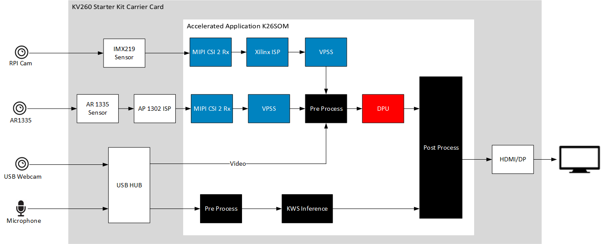

##################################################
NLP SmartVision
##################################################

The natural language processing (NLP) SmartVision implements keyword spotting (KWS) on the processing system (PS) and face detection, objectdetect, platedetect running on the programmable logic (PL). It showcases keywords based on dynamic switching between multiple tasks and modifying display properties.

*******************************
Overview
*******************************

.. toctree::
  :maxdepth: 1
  
  Introduction <docs/introduction_nlp>

Features
===============================

* Live video capture from Raspberry Pi Camera and USB webcam along with AR1335 
* Live audio capture from USB Microphone 
* 1024x768 resolution images 
* DisplayPort and HDMI out
* User programmable Deep Learning models

*******************************
Quick Start
*******************************

.. toctree::
  :maxdepth: 1
  
  Setting Up the Board and Application Deployment <docs/app_deployment_nlp>

***************************
Tutorials
***************************

.. toctree::
  :maxdepth: 1
  
  Customizing AI Models Used in the Application <docs/customize_ai_models_nlp>
  Building the Design Components <../building_the_design>
  Building the Hardware Design Using Vivado <../build_vivado_design>
  Creating a Vitis Platform <../build_vitis_platform>
  Generating Custom Firmware <../generating_custom_firmware>
  Kria Starter Kit Linux Boot <../kria_starterkit_linux_boot>
  Rebuilding Application Docker Containers <../build_application_docker_container>

********************
Architecture
********************

.. toctree::
  :maxdepth: 1
  
  Software Architecture - Platform <docs/sw_arch_platform_nlp>
  Software Architecture - Accelerator <docs/sw_arch_accel_nlp>
  Hardware Architecture - Platform <docs/hw_arch_platform_nlp>
  Hardware Architecture - Accelerator <docs/hw_arch_accel_nlp>

*******************************
Repository
*******************************

.. toctree::
   :maxdepth: 1
  
   Software Repository <https://github.com/Xilinx/nlp-smartvision>

******
Other
******

.. toctree::
  :maxdepth: 1
  
  Debugging <docs/debug-nlp>
  Known Issues <docs/issue-nlp>

AMD Support
====================================

This 22.1 guide and prebuilt is target for Ubuntu. The previous version of this application (21.1) is targeted to Petalinux and is still available at https://xilinx.github.io/kria-apps-docs/2020.2/build/html/index.html
GitHub issues will be used for tracking requests and bugs. For questions, go to `forums.xilinx.com <http://forums.xilinx.com/>`_.

License
------------------------------

Licensed under the Apache License, Version 2.0 (the "License"); you may not use this file except in compliance with the License.

You may obtain a copy of the License at `apache.org/licenses/LICENSE-2.0 <http://www.apache.org/licenses/LICENSE-2.0>`_.

Unless required by applicable law or agreed to in writing, software distributed under the License is distributed on an "AS IS" BASIS, WITHOUT WARRANTIES OR CONDITIONS OF ANY KIND, either express or implied. See the License for the specific language governing permissions and limitations under the License.
