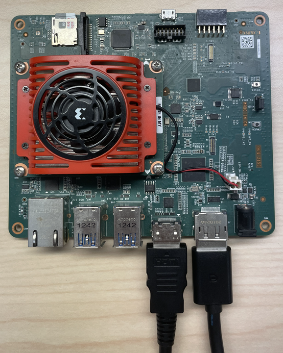
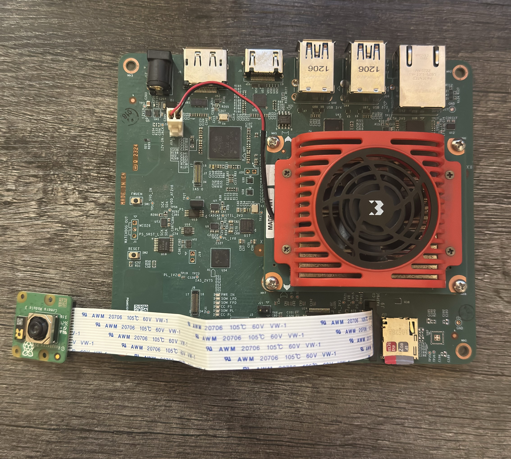

## Introduction

This document shows how to set up the board and exercise the Raspberry Pi Camera V3.

This guide and its prebuilts are targeted for Ubuntu 24.04 and AMD 2024.1
toolchain.

## Hardware Requirements

1. KV260 Vision AI Starter Kit
2. KV260 Power Supply & Adapter
3. MicroSD Card
4. One [Raspberry Pi V3 Sensor](https://www.raspberrypi.com/products/camera-module-3/)
5. 1080P/4K Monitor and Power Supply
6. DisplayPort/HDMI Cable

## Set up the Board

The test requires the following hardware setup to run Raspberry Pi Camera V3 test
successfully on target KV260.

* Monitor

  

  Before booting, connect a 1080P/4K monitor to the board via either Display Port and/or HDMI port.

* RaspberryPi Camera V3 Module

  

  Connect the Raspberry Pi Camera Module to J9 on the KV260


## Tested Artifacts

Testing was performed with the following artifacts:

### KV260 platform artifacts

|          Component              | Version              |
|---------------------------------|----------------------|
| Boot Fiwmare                    | K26-BootFW-v1.06.bin |
| Linux Kernel                    | 6.8.0-1020           |
| xlnx-firmware-kv260-bist-imx708 | 1.0-0xlnx1           |

Please refer to the [Kria Wiki](https://xilinx-wiki.atlassian.net/wiki/spaces/A/pages/3020685316/Kria+SOM+Boot+Firmware+Update#K26-Boot-Firmware-Updates) to obtain latest linux image and boot firmware.

## Boot Linux

Before continuing with the the test specific instructions, if not yet
done so, boot Linux with instructions from:

[Kria Starter Kit Linux Boot on KV260](https://xilinx.github.io/kria-apps-docs/kv260/2022.1/build/html/docs/linux_boot.html)

## Download and Load the BIST PL Firmware

* Install firmware binaries.

  ```bash
  sudo apt install xlnx-firmware-kv260-bist-imx708
  ```

* List the installed application firmware binaries.

  The firmware consists of bitstream, device tree overlay (dtbo) file. The
  firmware is loaded dynamically on user request once Linux is fully booted.
  The xmutil utility can be used for that purpose.

  After installing the FW, execute xmutil listapps to verify that it is
  captured under the listapps function, and to have dfx-mgrd, re-scan and
  register all accelerators in the firmware directory tree.

  ```bash
  sudo xmutil listapps
  ```

* Load a new application firmware binary.

  When there is already another accelerator/firmware being activated, unload it
  first, then load the desired BIST firmware.

  ```bash
  sudo xmutil unloadapp
  sudo xmutil loadapp kv260-bist-imx708
  ```

## Miscellaneous Preparation

* On target KV260 disable desktop environment before running the docker 
  for the display testing to function as intended.

  * Check if default target is set to `graphical.target`

    ```bash
    sudo systemctl get-default
    ```

  * If above command returns `graphical.target`, set default target to multi-user.
  This step is to ensure that by default we always start without Ubuntu display
  manager.

    ```bash
    sudo systemctl set-default multi-user.target
    ```

  * Reboot the system for the change to take effect.

    ```bash
    sudo reboot
    ```

## Download and Run the Docker Image

* Pull the docker image from dockerhub.

  ```bash
  docker pull xilinx/kria-bist:1.2-noble-24.04
  ```

* The storage volume on the SD card can be limited with multiple docker
  images installed. If there are space issues, use the following command
  to remove existing docker images.

  ```bash
  docker rmi --force <image>
  ```

* You can find the images installed with the following command:

  ```bash
  docker images
  ```

* Launch the docker container using the following command:

  ```bash
  docker run \
      --env=DISPLAY \
      --env=XDG_SESSION_TYPE \
      --net=host \
      --privileged \
      --volume=/home/ubuntu/.Xauthority:/root/.Xauthority:rw \
      -v /tmp:/tmp \
      -v /dev:/dev \
      -v /sys:/sys \
      -v /etc/vart.conf:/etc/vart.conf \
      -v /lib/firmware/xilinx:/lib/firmware/xilinx \
      -v /run:/run \
      -it xilinx/kria-bist:1.2-noble-24.04 bash
  ```

* It launches the image in a new container and drops the user into a bash
  shell.

  ```
  root@xlnx-docker/#
  ```

## Run the BIST Test

* Run a set of media-ctl commands to set the media path on IMX708

* These commands set the IMX708 sensor resolution to 1536×864 RAW10 and configure the pipeline blocks so the image is demosaiced, converted to RGB, then upscaled in the PL to
1920×1080 and output as a YUV (NV12-type) format.

  ```bash
  root@kria:/# media-ctl -d /dev/media0 -V "\"80050000.csiss\":0 [SRGGB10_1X10/1536x864 field:none colorspace:raw xfer:none ycbcr:601 quantization:full-range]"
  root@kria:/# media-ctl -d /dev/media0 -V "\"80050000.csiss\":1 [SRGGB10_1X10/1536x864 field:none colorspace:raw xfer:none ycbcr:601 quantization:full-range]"
  root@kria:/# media-ctl -d /dev/media0 -V "\"b0030000.v_demosaic\":0 [SRGGB10_1X10/1536x864 field:none colorspace:raw xfer:none ycbcr:601 quantization:full-range]"
  root@kria:/# media-ctl -d /dev/media0 -V "\"b0030000.v_demosaic\":1 [RBG888_1X24/1536x864 field:none colorspace:srgb]"
  root@kria:/# media-ctl -d /dev/media0 -V "\"b0080000.scaler\":0 [RBG888_1X24/1536x864 field:none colorspace:srgb]"
  root@kria:/# media-ctl -d /dev/media0 -V "\"b0080000.scaler\":1 [VYYUYY8_1X24/1920x1080 field:none colorspace:srgb]"
  root@kria:/# media-ctl -d /dev/media0 -V "\"imx708\":0 [fmt:SRGGB10_1X10/1536x864 field:none colorspace:raw xfer:none ycbcr:601 quantization:full-range ]"
  ```

* Run a Live Video Stream on connected Display using gstreamer. You can expect a framerate of ~58-60 fps.

  ```bash
  root@kria:/# gst-launch-1.0 v4l2src device=/dev/video1 io-mode=mmap ! "video/x-raw, width=1920, height=1080, framerate=60/1, format=NV12" ! perf ! kmssink fullscreen-overlay=true bus-id=fd4a0000.display -v
  Setting pipeline to PAUSED ...
  Pipeline is live and does not need PREROLL ...
  /GstPipeline:pipeline0/GstKMSSink:kmssink0: display-width = 3840
  /GstPipeline:pipeline0/GstKMSSink:kmssink0: display-height = 2160
  Pipeline is PREROLLED ...
  Setting pipeline to PLAYING ...
  New clock: GstSystemClock
  /GstPipeline:pipeline0/GstV4l2Src:v4l2src0.GstPad:src: caps = video/x-raw, width=(int)1920, height=(int)1080, framerate=(fraction)60/1, format=(string)NV12, interlace-mode=(string)progressive, colorimetry=(string)bt709
  /GstPipeline:pipeline0/GstCapsFilter:capsfilter0.GstPad:src: caps = video/x-raw, width=(int)1920, height=(int)1080, framerate=(fraction)60/1, format=(string)NV12, interlace-mode=(string)progressive, colorimetry=(string)bt709
  /GstPipeline:pipeline0/GstPerf:perf0.GstPad:src: caps = video/x-raw, width=(int)1920, height=(int)1080, framerate=(fraction)60/1, format=(string)NV12, interlace-mode=(string)progressive, colorimetry=(string)bt709
  /GstPipeline:pipeline0/GstKMSSink:kmssink0.GstPad:sink: caps = video/x-raw, width=(int)1920, height=(int)1080, framerate=(fraction)60/1, format=(string)NV12, interlace-mode=(string)progressive, colorimetry=(string)bt709
  /GstPipeline:pipeline0/GstPerf:perf0.GstPad:sink: caps = video/x-raw, width=(int)1920, height=(int)1080, framerate=(fraction)60/1, format=(string)NV12, interlace-mode=(string)progressive, colorimetry=(string)bt709
  /GstPipeline:pipeline0/GstCapsFilter:capsfilter0.GstPad:sink: caps = video/x-raw, width=(int)1920, height=(int)1080, framerate=(fraction)60/1, format=(string)NV12, interlace-mode=(string)progressive, colorimetry=(string)bt709
  INFO:
  perf: perf0; timestamp: 0:04:59.715199759; bps: 0.000; mean_bps: 0.000; fps: 0.000; mean_fps: 0.000
  Redistribute latency...
  INFO:01.3 / 99:99:99.
  perf: perf0; timestamp: 0:05:00.734893375; bps: 821145600.000; mean_bps: 0.000; fps: 57.861; mean_fps: 57.861
  INFO:02.4 / 99:99:99.
  perf: perf0; timestamp: 0:05:01.734973421; bps: 1517875200.000; mean_bps: 1517875200.000; fps: 60.995; mean_fps: 59.428
  INFO:03.3 / 99:99:99.
  perf: perf0; timestamp: 0:05:02.735017514; bps: 1492992000.000; mean_bps: 1505433600.000; fps: 59.997; mean_fps: 59.618
  INFO:04.3 / 99:99:99.
  perf: perf0; timestamp: 0:05:03.735048594; bps: 1492992000.000; mean_bps: 1501286400.000; fps: 59.998; mean_fps: 59.713
  INFO:05.4 / 99:99:99.
  perf: perf0; timestamp: 0:05:04.768339124; bps: 1517875200.000; mean_bps: 1505433600.000; fps: 59.035; mean_fps: 59.577
  INFO:06.4 / 99:99:99.
  perf: perf0; timestamp: 0:05:05.768360919; bps: 1492992000.000; mean_bps: 1502945280.000; fps: 59.999; mean_fps: 59.647
  INFO:07.4 / 99:99:99.
  perf: perf0; timestamp: 0:05:06.801726794; bps: 1492992000.000; mean_bps: 1501286400.000; fps: 59.998; mean_fps: 59.698
  INFO:08.4 / 99:99:99.
  perf: perf0; timestamp: 0:05:07.801783087; bps: 1492992000.000; mean_bps: 1500101485.714; fps: 60.997; mean_fps: 59.860
  INFO:09.4 / 99:99:99.
  perf: perf0; timestamp: 0:05:08.801839559; bps: 1492992000.000; mean_bps: 1499212800.000; fps: 59.997; mean_fps: 59.875
  ^Chandling interrupt.
  Interrupt: Stopping pipeline ...
  Execution ended after 0:00:09.792569764
  Setting pipeline to NULL ...
  Freeing pipeline ...
  ```

## Debug

* The media-ctl path for imx708 should look something like this:

  ```bash
  root@kria:/# media-ctl -d /dev/media0 -p
  Media controller API version 6.8.12

  Media device information
  ------------------------
  driver          xilinx-video
  model           Xilinx Video Composite Device
  serial
  bus info        platform:axi:imx_vcap_csi
  hw revision     0x0
  driver version  6.8.12

  Device topology
  - entity 1: imx_vcap_csi output 0 (1 pad, 1 link)
            type Node subtype V4L flags 0
            device node name /dev/video1
        pad0: Sink
                <- "b0080000.scaler":1 [ENABLED]

  - entity 5: b0080000.scaler (2 pads, 2 links, 0 routes)
            type V4L2 subdev subtype Unknown flags 0
            device node name /dev/v4l-subdev0
        pad0: Sink
                [stream:0 fmt:RBG888_1X24/1536x864 field:none colorspace:srgb]
                <- "b0030000.v_demosaic":1 [ENABLED]
        pad1: Source
                [stream:0 fmt:VYYUYY8_1X24/1920x1080 field:none colorspace:srgb]
                -> "imx_vcap_csi output 0":0 [ENABLED]

  - entity 8: b0030000.v_demosaic (2 pads, 2 links, 0 routes)
            type V4L2 subdev subtype Unknown flags 0
            device node name /dev/v4l-subdev1
        pad0: Sink
                [stream:0 fmt:SRGGB10_1X10/1536x864 field:none colorspace:raw xfer:none ycbcr:601 quantization:full-range]
                <- "80050000.csiss":1 [ENABLED]
        pad1: Source
                [stream:0 fmt:RBG888_1X24/1536x864 field:none colorspace:srgb]
                -> "b0080000.scaler":0 [ENABLED]

  - entity 11: 80050000.csiss (2 pads, 2 links, 0 routes)
             type V4L2 subdev subtype Unknown flags 0
             device node name /dev/v4l-subdev2
        pad0: Sink
                [stream:0 fmt:SRGGB10_1X10/1536x864 field:none colorspace:raw xfer:none ycbcr:601 quantization:full-range]
                <- "imx708":0 [ENABLED]
        pad1: Source
                [stream:0 fmt:SRGGB10_1X10/1536x864 field:none colorspace:raw xfer:none ycbcr:601 quantization:full-range]
                -> "b0030000.v_demosaic":0 [ENABLED]

  - entity 14: imx708 (2 pads, 1 link, 0 routes)
             type V4L2 subdev subtype Sensor flags 0
             device node name /dev/v4l-subdev3
        pad0: Source
                [stream:0 fmt:SRGGB10_1X10/1536x864 field:none colorspace:raw xfer:none ycbcr:601 quantization:full-range
                 crop.bounds:(16,24)/4608x2592
                 crop:(784,456)/3072x1728]
                -> "80050000.csiss":0 [ENABLED]
        pad1: Source
                [stream:0 fmt:unknown/28800x1 field:none
                 crop.bounds:(16,24)/4608x2592
                 crop:(784,456)/3072x1728]

  ```

## Known Issue

* The live stream video poor quality and greenish hue is simply an artifact of lacking an ISP.