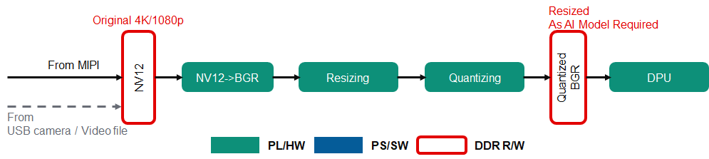
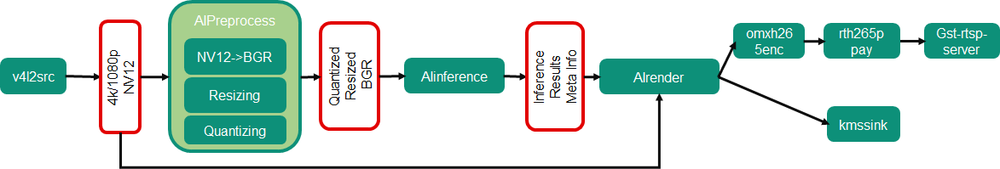

<table class="sphinxhide">
 <tr>
   <td align="center"><h1> Kria&trade; KV260 Vision AI Starter Kit Smart Camera Tutorial</h1>
   </td>
 </tr>
 <tr>
 <td align="center"><h1> Software Architecture of the Accelerator </h1>

 </td>
 </tr>
</table>

# Software Architecture of the Accelerator

## Introduction

 This document describes the software architecture of the SmartCam accelerator application.

## Software Platform and Dependencies

Leverage the GStreamer multi-media orchestration platform for application software development. As described in following sections about GStreamer pipeline, all the processing units in the stream pipeline are presented to you as easily pluggable and changeable plugins, enabling a “low touch” customer adaptation of the reference design pipeline within the context of an open-source and non-vendor specific implementation.

**AMD Vitis&trade; AI 2.5.0** is the core underlying component to access the AI inference capability provides by AMD DPU.

To access DPU and other programmable logic (PL) hardware accelerator functions from GStreamer, AMD developed the Vitis&trade; Video Analysis SDK (VVAS) to provide convenient and customizable GStreamer plugins for it.

## GStreamer Pipeline



The Smart Camera Accelerated Application supports three types of inputs including MIPI, video file, and USB camera.

For the MIPI source, the ISP will output frames with NV12 format directly, and for other sources, there are mature plugins in GStreamer serving to perform the conversion too.



Three AI tasks are supported: Facedetect, Refinedet, and SSD. ${AI_TASK} is used to refer to either of them in following part of this document.

* AI Preprocess

    NV12 to BGR conversion, image resizing, and input quantizing blocks are to meet the requirement of the DPU AI inference engine. These three steps are done in one dedicated preprocessing IP, which is detailed in the Accelerator IP Modules, to achieve the optimal framerate and latency.

    The vvas_xmultisrc GStreamer plugin with a customized kernel `/opt/xilinx/kv260-smartcam/lib/libvvas_xpp.so` are used to integrate the accelerator IP functionality into the pipeline.

    The configuration file, `/opt/xilinx/kv260-smartcam/share/vvas/${AI_TASK}/preprocess.json`, contains the information to do quantization on the resized BGR images; these values might vary between different AI tasks configs as the core AI algorithm demands.

  ```json
    "config": {
        "debug_level" : 0,
        "mean_r": 128,
        "mean_g": 128,
        "mean_b": 128,
        "scale_r": 1,
        "scale_g": 1,
        "scale_b": 1
    }
  ```

* AI Inference

    The vvas_xfilter GStreamer plugin with the kernel library, `/usr/lib/libvvas_dpuinfer.so`, works as middleware between the application which interfaces with the user and underlying Vitis AI library which interface with the DPU to do the actual AI inference tasks.

    For the three AI tasks already supported, no more customization is needed here. To change the underlying Vitis AI model or otherwise customize the plugin, refer to [VVAS documentation](https://xilinx.github.io/VVAS/).

* AI Rendering

    The results from the AI Inference step (such as coordinates of detected faces) are passed to the AI Rendering plugin which is responsible for drawing bounding boxes around the objects in the original frame.

    The vvas_xfilter GStreamer plugin and kernel library, `/usr/lib/libvvas_xboundingbox.so`, do the AI results rendering work, based on the meta info passed down from AI Inference plugin to here with video buffers.

  * Configuration file

    `/opt/xilinx/kv260-smartcam/share/vvas/${AI_TASK}/drawresult.json` provides the way to customize the rendering properties, such as font of the label and colors of the bounding box for different classes.

    `Facedetect/drawresult.json`

    ```json
        "config": {
            "font_size" : 0.5,
            "font" : 3,
            "thickness" : 2,
            "debug_level" : 0,
            "label_color" : { "blue" : 0, "green" : 0, "red" : 255 },
            "label_filter" : [ "class", "probability" ],
            "classes" : [
            ]
        }
    ```

   For detailed customization, refer to the [VVAS documentation](https://xilinx.github.io/VVAS/).

## Additional GStreamer Component Used

The Gst-Rtsp-Server lib is utilized to build up the RTSP server video stream with AI detection results.

## Next Steps

* Read [Hardware Architecture of the Platform](hw_arch_platform.md)
* Go back to the [KV260 SOM Smart Camera Design Start Page](../smartcamera_landing)


<p class="sphinxhide" align="center"><sub>Copyright © 2021-2024 Advanced Micro Devices, Inc</sub></p>

<p class="sphinxhide" align="center"><sup><a href="https://www.amd.com/en/corporate/copyright">Terms and Conditions</a></sup></p>