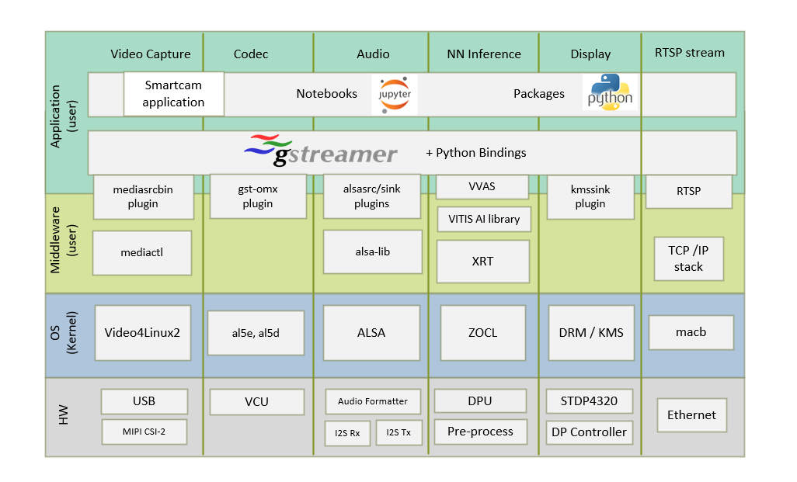
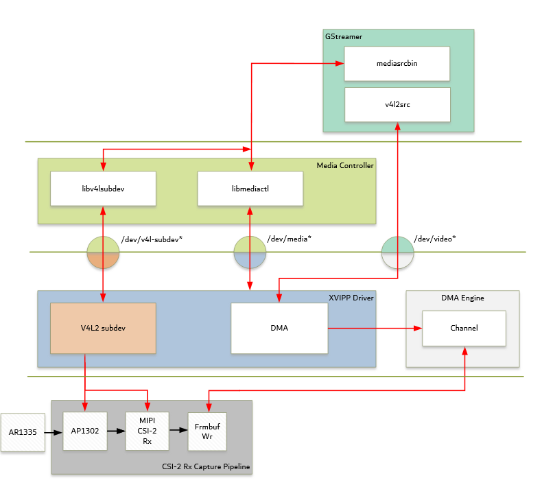
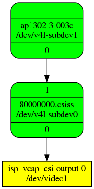
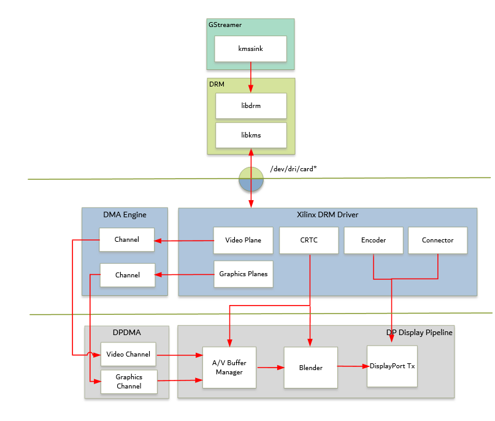

<table class="sphinxhide">
 <tr>
   <td align="center"><h1> Kria&trade; KV260 Vision AI Starter Kit Smart Camera Tutorial</h1>
   </td>
 </tr>
 <tr>
 <td align="center"><h1> Software Architecture of the Platform </h1>

 </td>
 </tr>
</table>

# Software Architecture of the Platform

## Introduction

 This chapter describes the application processing unit (APU) Linux software stack. The stack and vertical domains are shown in the following figure.

The stack is horizontally divided into the following layers:

* Application layer (user-space)

  * Jupyter notebooks with a simple control and visualization interface
  * smartcam application to invoke various Gstreamer pipelines
  * GStreamer multimedia framework with python bindings for video pipeline control

* Middleware layer (user-space)

  * Implements and exposes domain-specific functionality by means of GStreamer plugins to interface with the application layer
  * Provides access to kernel frameworks

* Operating system (OS) layer (kernel-space)
  * Provides a stable, well-defined API to user-space
  * Includes device drivers and kernel frameworks (subsystems)
  * Access to hardware IPs

Vertically, the software components are divided by domain:

### Video Capture

The Video Capture software stack is depicted in the following figure using the single-sensor MIPI CSI capture pipeline as an example.

At a high-level, it consists of the following layers from top to bottom:

* User-space layers

  * GStreamer: Media source bin plugin (wrapper around generic v4l2src plugin)
  * Media controller: Library to configure v4l subdevices and media devices

* Kernel-space layers
  * V4L2/Media subsystems: Video IP pipeline (XVIPP) driver
  * DMA engine: AMD framebuffer driver

#### Media Source Bin GStreamer Plugin

 The mediasrcbin plugin is designed to simplify the usage of live video capture devices in this design; otherwise, you must take care of initialization and configuration. The plugin is a bin element that includes the standard v4l2src GStreamer element. It configures the media pipelines of the supported video sources in this design. The v4l2src element inside the mediasrcbin element interfaces with the V4L2 Linux framework and the VIPP driver through the video device node. The mediasrcbin element interfaces with the Media Controller Linux framework through the v412-subdev and media device nodes which allows you to configure the media pipeline and its sub-devices. It uses the libmediactl and libv4l2subdev libraries which provide the following functionality:

* Enumerate entities, pads and links
  * Configure sub-devices
    * Set media bus format
    * Set dimensions (width/height)
    * Set frame rate
    * Export sub-device controls

The mediasrcbin plugin sets the media bus format and resolution on each sub-device source and sink pad for the entire media pipeline. The formats between the pads that are connected through links need to match. Refer to the following Media Framework section for more information on entities, pads, and links.

### Kernel Subsystems

To model and control video capture pipelines, such as the ones used in this targeted reference design (TRD) on Linux systems, multiple kernel frameworks and APIs are required to work in concert. For simplicity, the overall solution is referred to as Video4Linux (V4L2), although the framework only provides part of the required functionality. The individual components are discussed in the following sections.

#### Driver Architecture

The Video Capture Software Stack figure in the Capture section shows how the generic V4L2 driver model of a video pipeline is mapped to the single-sensor MIPI CSI-2 RX capture pipelines. The video pipeline driver loads the necessary sub-device drivers and registers the device nodes it needs, based on the video pipeline configuration specified in the device tree. The framework exposes the following device node types to the user space to control certain aspects of the pipeline:

* Media device node: `/dev/media*`
* Video device node: `/dev/video*`
* V4L2 sub-device node: `/dev/v4l-subdev*`

#### Media Framework

The main goal of the media framework is to discover the device topology of a video pipeline and to configure it at run-time. To achieve this, pipelines are modeled as an oriented graph of building blocks called entities connected through pads. An entity is a basic media hardware building block. It can correspond to a large variety of blocks such as physical hardware devices (e.g., image sensors), logical hardware devices (e.g., soft IP cores inside the PL), direct memory access (DMA) channels, or physical connectors. Physical or logical devices are modeled as sub-device nodes and DMA channels as video nodes. A pad is a connection endpoint through which an entity can interact with other entities. Data produced by an entity flows from the entity's output to one or more entity inputs. A link is a point-to-point oriented connection between two pads, either on the same entity or on different entities. Data flows from a source pad to a sink pad. A media device node is created that allows the user space application to configure the video pipeline and its sub-devices through the libmediactl and libv4l2subdev libraries. The media controller API provides the following functionality:

* Enumerate entities, pads and links
* Configure pads
  * Set media bus format
  * Set dimensions (width/height)
* Configure links
* Enable/disable
* Validate formats

 The following figures shows the media graphs for the MIPI CSI-2 RX video capture pipeline as generated by the media-ctl utility. The subdevices are shown in green with their corresponding control interface base address and subdevice node in the center. The numbers on the edges are pads, and the solid arrows represent active links. The yellow boxes are video nodes that correspond to DMA channels, in this case, write channels (outputs).

#### Video IP Drivers

AMD adopted the V4L2 framework for most of its video IP portfolio. The currently supported video IPs and corresponding drivers are listed under V4L2. Each V4L driver has a sub-page that lists driver-specific details and provides pointers to additional documentation. The following table provides a quick overview of the drivers used in this design. V4L2 Drivers Used in Capture Pipelines.

| Linux Driver          		 | Function |
| :-----------------------------:|:-------- |
| Video Pipeline (XVIPP)   | - Configures video pipeline and register media, video and sub-device nodes.    - Configures all entities in the pipeline and validate links.   	- Configures and controls DMA engines (Video Framebuffer Write).   	- Starts/stops video stream. |
| MIPI CSI-2 Rx 				 | - Sets media bus format and resolution on input pad.  	- Sets media bus format and resolution on output pad. |
| AP1302 Image Signal Processing (ISP)   | - Loads the firmware blob on to ap1302 ISP for enabling sensor and ISP functionality.    - Sets the media bus format and resolution for the sensor output pad.   - Set the media bus format and resolution for ISP input and output pads.   - Provides ISP control parameters for setting: white balance, scene mode, zoom, test pattern.|

### DP TX Display

The Linux kernel and user-space frameworks for display and graphics are intertwined, and the software stack can be quite complex with many layers and different standards/APIs. On the kernel side, the display and graphics portions are split with each having their own APIs. However, both are commonly referred to as a single framework, namely DRM/KMS. This split is advantageous, especially for SoCs that often have dedicated hardware blocks for display and graphics. The display pipeline driver responsible for interfacing with the display uses the kernel mode setting (KMS) API, and the GPU responsible for drawing objects into memory uses the direct rendering manager (DRM) API. Both APIs are accessed from user-space through a single device node.

#### Direct Rendering Manager

This section focuses on the common infrastructure portion around memory allocation and management that is shared with the KMS API.

#### Driver Features

The DRM driver uses the GEM memory manager, and implements DRM PRIME buffer sharing. PRIME is the cross device buffer sharing framework in DRM. To user-space PRIME buffers are DMABUF-based file descriptors. The DRM GEM/CMA helpers use the CMA allocator as a means to provide buffer objects that are physically contiguous in memory. This is useful for display drivers that are unable to map scattered buffers via an IOMMU. Frame buffers are abstract memory objects that provide a source of pixels to scan out to a CRTC. Applications explicitly request the creation of frame buffers through the DRM_IOCTL_MODE_ADDFB(2) ioctls and receive an opaque handle that can be passed to the KMS CRTC control, plane configuration, and page flip functions.

#### Kernel Mode Setting

Mode setting is an operation that sets the display mode including video resolution and refresh rate. It was traditionally done in the user-space by the X-server which caused a number of issues due to accessing low-level hardware from user-space which, if done wrong, can lead to system instabilities. The mode setting API was added to the kernel DRM framework, hence the name kernel mode setting. The KMS API is responsible for handling the frame buffer and planes, setting the mode, and performing page-flips (switching between buffers). The KMS device is modeled as a set of planes, CRTCs, encoders, and connectors as shown in the top half of the above figure. The bottom half of the figure shows how the driver model maps to the physical hardware components inside the PS DP TX display pipeline.

#### CRTC

CRTC is an antiquated term that stands for cathode ray tube controller, which today would be simply named display controller as CRT monitors have disappeared, and many other display types are available. The CRTC is an abstraction that is responsible for composing the frame to be scanned out to the display and setting the mode of the display. In the DRM driver, the CRTC is represented by the buffer manager and blender hardware blocks. The frame buffer (primary plane) to be scanned out can be overlayed and/or alpha-blended with a second plane inside the blender. The DP TX hardware supports up to two planes, one for video and one for graphics. The z-order (foreground or background position) of the planes, and the alpha mode (global or pixel-alpha) can be configured through the driver via custom properties.

The pixel formats of the video and graphics planes can be configured individually at run-time and a variety of formats are supported. The default pixel formats for each plane are set statically in the device tree. Pixel unpacking and format conversions are handled by the buffer manager and blender. The DRM driver configures the hardware accordingly so this is transparent to the user.

A page-flip is the operation that configures a plane with the new buffer index to be selected for the next scan-out. The new buffer is prepared while the current buffer is being scanned
out, and the flip typically happens during vertical blanking to avoid image tearing.

#### Plane

A plane represents an image source that can be blended with or overlayed on top of a CRTC frame buffer during the scan-out process. Planes are associated with a frame buffer to
optionally crop a portion of the image memory (source) and scale it to a destination size. The DP TX display pipeline does not support cropping or scaling, therefore both video and graphics plane dimensions have to match the CRTC mode (i.e., the resolution set on the display). The DRM driver supports the universal plane feature; therefore the primary plane and overlay planes can be configured through the same API. The primary plane on the video mixer is configurable and set to the top-most plane to match the DP Tx pipeline. As planes are modeled inside KMS, the physical hardware device that reads the data from memory is typically a DMA whose driver is implemented using the dmaengine Linux framework. The DPDMA is a six channel DMA engine that supports a (up to) three channel video stream, a one channel graphics stream and two channels for audio (not used in this design). The video mixer uses built-in AXI mater interfaces to fetch video frames from memory.

#### Encoder

An encoder takes pixel data from a CRTC and converts it to a format suitable for any attached connectors. There are many different display protocols defined, such as HDMI or DisplayPort. The PS display pipeline has a DisplayPort transmitter built in. The encoded video data is then sent to the serial I/O unit (SIOU) which serializes the data using the gigabit transceivers (PS GTRs) before it goes out via the physical DP connector to the display. The PL display pipeline uses a HDMI transmitter which sends the encoded video data to the Video PHY. The Video PHY serializes the data using the GTH transceivers in the PL before it goes out via the HDMI TX connector.

#### Connector

The connector models the physical interface to the display. Both DisplayPort and HDMI protocols use a query mechanism to receive data about the monitor resolution and refresh rate by reading the extended display identification data (EDID) (see VESA Standard ) stored inside the monitor. This data can then be used to correctly set the CRTC mode. The DisplayPort support hot-plug events to detect if a cable has been connected or disconnected as well as handling display power management signaling (DPMS) power modes.

#### Libdrm

The framework exposes two device nodes per display pipeline to user space: the /dev/dri/card* device node and an emulated /dev/fb* device node for backward compatibility with the legacy fbdev Linux framework. The latter is not used in this design. libdrm was created to facilitate the interface of user space programs with the DRM subsystem. This library is merely a wrapper that provides a function written in C for every ioctl of the DRM API, as well as constants, structures, and other helper elements. The use of libdrm not only avoids exposing the kernel interface directly to user space but presents the usual advantages of reusing and sharing code between programs.

### Audio Transmit and Receive

Audio Advanced Linux Sound Architecture (ALSA) arranges hardware audio devices and their components into a hierarchy of cards, devices, and subdevices. It reflects the capabilities of the hardware as seen by ALSA. ALSA cards correspond one-to-one to hardware sound cards. A card can be denoted by its ID or by a numerical index starting at zero. ALSA hardware access occurs at the device level. The devices of each card are enumerated starting from zero. The audio software stack is depicted in the following figure.

At a high-level the audio software stack consists of the following layers from top to bottom:

* User-space layers
  * GStreamer: alsasrc and alsasink plugins
  * Alsa-lib: ALSA user-space library

* Kernel-space layers
  * ALSA: Xilinx ALSA ASoC driver

#### ALSA Source and Sink GStreamer Plugins

The alsasrc plugin reads audio data from an audio card and the alsasink plugin renders audio samples using the ALSA API. The audio device is specified by means of the device property referring to the ALSA device as defined in an asound configuration file.Alsa-lib The ALSA library API is the interface to the ALSA drivers. Developers need to use the functions in this API to achieve native ALSA support for their applications. The currently designed interfaces are as follows:

* Information Interface (/proc/asound)
* Control Interface (/dev/snd/controlCX)
* PCM Interface (/dev/snd/pcmCXDX)
* Timer Interface (/dev/snd/timer)

For more information, refer to <https://www.alsa-project.org/alsa-doc/alsa-lib/>.

#### ALSA Kernel Subsystem

A sound card, encapsulating playback and capture devices will be visible as single entity to the end user. There can be many playback and capture devices within a sound card and there can be multiple sound cards in a system. The Machine driver creates a pipeline out of the ALSA drivers. This glue or DAI (Digital Audio Interface) link is made using registered device names or  device nodes (using OF kernel framework). Each proper DAI link results as a device in a sound card. A sound card is thus a logical grouping of several such devices. The Audio Formatter driver creates the platform device for the sound card. While creating the device, it passes the I2S device tree node of either I2S/HDMI/SDI/SPDIF depending on the kind of sound card being created. When the sound card driver detects the kind of audio node (I2S/HDMI/SDI/SPDIF), the proper DAI link is selected from the available links. I2S Rx receives the data from the PMOD (with 3.5mm jack) I2S source . The Xilinx Audio Formatter converts this AES data to PCM data and stores it in memory. I2S TX gets the AES data from the Audio Formatter and I2S Tx IP removes AES header and renders PCM data through external DAC to play audio on Speaker. The AES format contains PCM and channel status information. The Audio Formatter IP separates non-audio content such as channel status and stores it in registers. The Audio Formatter driver can parse the content of channel status to get audio parameters. A dummy CPU DAI driver is used as there needs to be a CPU DAI to be registered with ASoC framework. In this TRD design, a sound card is created with a record device for the I2S-RX capture pipeline and a playback device for the I2S-TX playback pipeline. The supported parameters are:

* Sampling rate: 48 kHz
* Sample width: 24 bits per sample
* Sample encoding: Little endian
* Number of channels: 2
* Supported format: S24_LE

### CODEC

The Video Codec Unit (VCU) core supports multi-standard video encoding and decoding of H.264 and H.265 standards. A software stack on the CPU controls various functions of Encoder and Decoder blocks. The VCU software stack consists of a custom kernel module and a custom user space library known as Control Software (CtrlSW). The OpenMAX&trade; (OMX) integration layer (IL) is integrated on top of CtrlSW, and the GStreamer framework is used to integrate the OMX IL component and other multimedia elements. OpenMAX (Open Media Acceleration) is a cross-platform API that provides a comprehensive streaming media codec and application portability by enabling accelerated multimedia  components. GStreamer is the cross-platform/open source multimedia framework. Its core function is to provide a framework for plug-ins, data flow, and media type handling and negotiation. It also provides an API to write applications using the various plug-ins.

In the capture-encode side, The V4L2 source (the client driver) allocates buffer. The v4l2src plug-in exports/imports the DMA buffer to the gst-omx plug-in. The gst-omx plug-in passes the file descriptor to the encoder driver. The encoder driver uses the DMA_BUF framework and reads the kernel buffer for encoding. rtph264pay plugin packets the Payload-H264 video into RTP packets, and RTSP server streams data for transfer through Ethernet . In the playback side, The decoder driver allocates DMA buffer.  The gst-omx plug-in exports the file descriptor (FD) to the kmssink plug-in. The kmssink plug-in passes the file descriptor to the DisplayPort controller driver. The DisplayPort driver uses the kernel DMA_BUF framework to know the decoder buffer location. The DisplayPort DMA reads the decoded buffer without copying the buffer in kernel memory.

For more information on VCU Encoder and Decoder features, refer to the *H.264/H.265 Video Codec Unit LogiCORE IP Product Guide* (PG252).

## Next Steps

You can choose any of the following next steps:

* Read [Software Architecture of the Accelerator](sw_arch_accel.md)
* Go back to the [KV260 SOM Smart Camera Design Start Page](../smartcamera_landing)

### License

Licensed under the Apache License, Version 2.0 (the "License"); you may not use this file except in compliance with the License.

You may obtain a copy of the License at
[http://www.apache.org/licenses/LICENSE-2.0](http://www.apache.org/licenses/LICENSE-2.0).

Unless required by applicable law or agreed to in writing, software distributed under the License is distributed on an "AS IS" BASIS, WITHOUT WARRANTIES OR CONDITIONS OF ANY KIND, either express or implied. See the License for the specific language governing permissions and limitations under the License.

Copyright&copy; 2022-2023 Advanced Micro Devices, Inc

