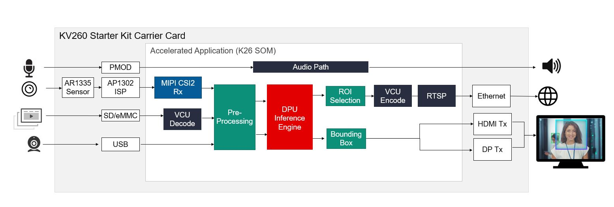

##################################################
Smart Camera
##################################################

The Smart camera implements face detection with network and display functionality. It comes with built-in machine learning for applications such as pedestrian detection, face detection, and people counting with local display and RTSP streaming.

*******************************
Overview
*******************************

.. toctree::
   :maxdepth: 1
  
   Introduction <docs/introduction>

Features
================================

- 4K at 30 fps images from a sensor
- H.264/H.265 encode/decode
- HDMI or DisplayPort or RTSP out
- User programmable Deep Learning models

*******************************
Quick Start
*******************************

.. toctree::
   :maxdepth: 1
  
   Setting Up the Board and Application Deployment <docs/app_deployment>

***************************
Tutorials
***************************

.. toctree::
   :maxdepth: 1
  
   Customizing AI Models Used in the Application <docs/customize_ai_models>
   Building the Design Components <../building_the_design>
   Building the Hardware Design Using Vivado <../build_vivado_design>
   Creating a Vitis Platform <../build_vitis_platform>
   Integrating an Overlay into the Platform <../build_accel>
   Generating Custom Firmware <../generating_custom_firmware>
   Kria Starter Kit Linux Boot <../kria_starterkit_linux_boot>
   Rebuilding Application Docker Containers <../build_application_docker_container>
   Integrating New Sensors <../integrating_new_sensors>

******************
Architecture
******************

.. toctree::
   :maxdepth: 1
  
   Software Architecture - Platform <docs/sw_arch_platform>
   Software Architecture - Accelerator <docs/sw_arch_accel>
   Hardware Architecture - Platform <docs/hw_arch_platform>
   Hardware Architecture - Accelerator <docs/hw_arch_accel>

*******************************
Repository
*******************************

.. toctree::
   :maxdepth: 1
  
   Software Repository <https://github.com/Xilinx/smartcam>

******
Other
******

.. toctree::
   :maxdepth: 1
  
   Debugging <docs/debug-sc>
   Known Issues & Limitations <docs/issue-sc>

******************************
Related Tutorials
******************************

These are some examples developing on Kria SOM based on Smartcam application.

.. toctree::
   :maxdepth: 1
  
   Vitis Accelerator Flow Example - Replacing DPU with Filter2d accelerator in Smartcam application <https://xilinx.github.io/kria-apps-docs/creating_applications/2022.1/build/html/docs/vitis_accel_flow_smartcam_filter2d_example.html>
   Vitis Platform Flow Example - Adding Raspberry Pi Camera to SmartCam's Platform <https://xilinx.github.io/kria-apps-docs/creating_applications/2022.1/build/html/docs/vitis_platform_flow_smartcam_raspi_example.html>
   Generating DTSI and DTBO Overlay Files for Smartcam <https://xilinx.github.io/kria-apps-docs/creating_applications/2022.1/build/html/docs/dtsi_dtbo_generation_smartcam_example.html>
   Vitis Accelerator Flow Example - Rebuilding Smartcam application on top of released platform, including software development <https://xilinx.github.io/kria-apps-docs/creating_applications/2022.1/build/html/docs/kria_vitis_acceleration_flow/kria-vitis-acceleration.html>

AMD Support
====================================

GitHub issues will be used for tracking requests and bugs. For questions, go to `forums.xilinx.com <http://forums.xilinx.com/>`_.

