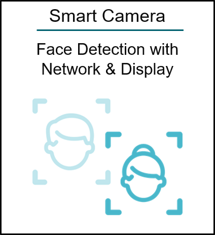
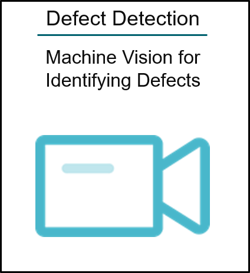
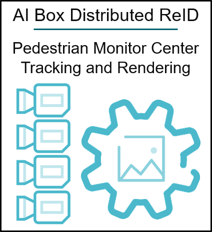
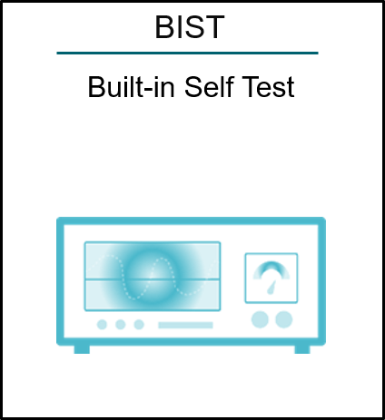
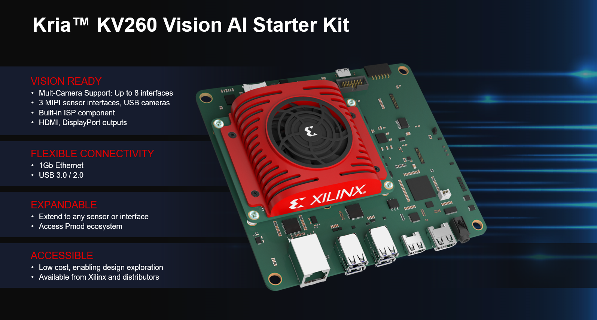

###################################################
Kria KV260 Vision AI Starter Kit Applications
###################################################

.. include:: ../../../shared/somtoctree.txt

.. sidebar:: Getting Started
   
   For more information, see :doc:`Getting Started with Kria KV260 Vision AI Starter Kit <./docs/linux_boot>`.

The AMD Kria™ KV260 Vision AI Starter Kit is the first out-of-the box ready evaluation/development platform in the Kria portfolio of products. The Starter Kit is the platform of choice for development of vision specific target applications. It consists of a non-production K26 SOM plugged into a vision carrier card and equipped with a thermal solution of fan and heatsink. The SOM on the Starter Kit is based on AMD Zynq™ UltraScale+™ MPSoC architecture paired with 4 GB of DDR4 memory. The Starter Kit is vision ready as it features multi-camera support through 2x OnSemi Image Access System (IAS) connectors and 1x Raspberry Pi connector. One of the IAS connectors links to a dedicated OnSemi 13 MP AP1302 Image Sensor Processor (ISP), which can handle all image processing functions including interlaced High Dynamic Range (iHDR) operations. Beyond the vision-specific interfaces, there are a host of other interfaces for general purpose development as well. These include flexible I/O connectivity through Ethernet and USB, expandability via Pmod connectors.

Enabled by a growing ecosystem of accelerated applications from the Xilinx App Store, developers of all types can get applications up and running in under 1 hour, with no FPGA experience needed. From there, customization and differentiation can be added via preferred design environments, at any level of abstraction—from application software to AI model to FPGA design.

With both hardware and software development requirements simplified, the KV260 Vision AI Starter Kit is the fastest and easiest platform for application development with the goal of heading towards production volume deployment with the Kria K26 SOMs. The KV260 Vision AI Starter Kit is very accessible and competitively priced, it is a perfect vehicle to leverage during the development phase of your vision applications and further accelerates your time to market.

.. sidebar:: Kria KV260 Vision AI Starter Kit eCommerce
   
   For the latest pricing and availability of the KV260 Vision AI Starter Kit, check the `eCommerce site <https://www.amd.com/kv260>`_.

   KV260 Starter Kit

.. toctree::
   :maxdepth: 3
   :caption: KV260 Applications
   :hidden:

   Smart Camera <docs/smartcamera/smartcamera_landing>
   AI Box ReID <docs/aibox-reid/aibox_landing>
   Defect Detect <docs/defect-detect/defectdetect_landing>
   NLP SmartVision <docs/nlp-smartvision/nlp_smartvision_landing>
   AI Box Distributed ReID <docs/aibox/aibox-dist_landing>
   Built-In Self Test (BIST) <https://pages.gitenterprise.xilinx.com/techdocs/SOM/kv260/bist.html>
   Raspberry Pi Camera V3 Example <https://pages.gitenterprise.xilinx.com/techdocs/SOM/kv260/rpi.html>

.. toctree::
   :caption: KV260 Tutorials
   :maxdepth: 1
   :hidden:

   ./docs/linux_boot
   Build the Design Components <./docs/building_the_design>
   Building the Hardware Design Using Vivado <./docs/build_vivado_design>
   Create a Vitis Platform <./docs/build_vitis_platform>
   ./docs/build_accel
   ./docs/integrating_new_sensors
   Generate Custom Firmware <./docs/generating_custom_firmware>
   ./docs/build_application_docker_container

.. toctree::
   :maxdepth: 3
   :caption: Other Releases
   :hidden:

   2021.1 <https://pages.gitenterprise.xilinx.com/techdocs/SOM/kv260/2021.1/build/html/index.html>

,,,,,,,,,,,,,,,,,,,,,,,,,,,

************************
Xilinx Support
************************

GitHub issues will be used for tracking requests and bugs. For questions, go to `forums.xilinx.com <http://forums.xilinx.com/>`_.

